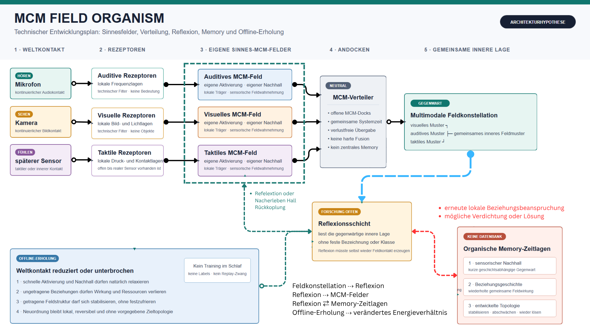

# MCM_FIELD_ORGANISM

`MCM_FIELD_ORGANISM` entwickelt die Grundmechanik eines digitalen,
MCM-basierten Wahrnehmungs- und Nervensystems. Im Mittelpunkt steht kein
vorprogrammiertes Erkennen, sondern ein Feldorganismus, der über eigene
Sinnesfelder kontinuierlich an einer Welt teilnimmt.

Leben, Empfinden, Bedeutung, Lernen, Organismus und Feldintelligenz sind dabei
keine vorausgesetzten Eigenschaften. Sie dürfen nur als spätere Befunde gelten,
wenn sie aus der Feldmechanik hervorgehen und experimentell abgegrenzt werden
können.

## Grundarchitektur



```text
Weltkontakt -> Rezeptoren -> eigenes MCM-Feld --\
Weltkontakt -> Rezeptoren -> eigenes MCM-Feld ----> MCM-Verteiler
Weltkontakt -> Rezeptoren -> eigenes MCM-Feld --/   -> multimodale Feldkonstellation
```

Jede Sinnesmodalität erhält einen eigenen Rezeptorpfad und ein eigenes
MCM-Feld. Dadurch kann eine Modalität eine innere Feldlage tragen, auch wenn
andere Sinneskanäle fehlen oder gerade keinen Kontakt haben.

Der MCM-Verteiler erhält keine Rohsensordaten. Er nimmt ausschließlich die
bereits entstandenen Zustände der sensorspezifischen MCM-Felder entgegen und
führt sie zeitlich zusammen, ohne ihre Herkunft zu verlieren und ohne eine
harte Bedeutung vorzugeben.

Die multimodale Feldkonstellation ist das gemeinsame gegenwärtige Muster des
Systems. Eine innere Bezeichnung, Semantik oder Klasse wird nicht zusätzlich
programmiert.

## Forschungsgrenze

Fest vorgegeben werden dürfen nur transparente digitale Naturbedingungen:

- Kausalität und gemeinsame Systemzeit
- atomare Berechnung aus demselben vorherigen Zustand
- lokale Wechselwirkung
- endliche lokale Ressourcen
- numerische Schutzgrenzen
- stabile technische Identitäten
- ein vollständig passiver Observer

Nicht als Runtime-Ziel vorgegeben werden Muster, Syntax, Kontext, Semantik,
Rollen, Emotion, Bedeutung, Reward, Zieltopologie oder gewünschte Intelligenz.
Eine langsamere Organisations- oder Memory-Schicht wird erst Teil der Mechanik,
wenn ihre Notwendigkeit, Zustandsrolle, Wirkung, Begrenzung und Lösbarkeit
getrennt nachgewiesen sind.

## Projektphase

Das Projekt befindet sich im Aufbau seiner Grundmechanik. Einzelne Sensorläufe,
technische Zwischenprüfungen und vorläufige Feldkandidaten werden deshalb nicht
als Projektstand oder Forschungsfortschritt in dieser README geführt.

Erst wenn die sensorischen MCM-Felder, ihre neutrale Verteilung und die
multimodale Feldbildung als zusammenhängende Mechanik geprüft werden können,
werden daraus belastbare Forschungsbefunde abgeleitet.

Vorarbeiten aus
[MINI_DIO](https://github.com/H5Pro2/MINI_DIO) und der
[Mental-Core-Matrix](https://github.com/H5Pro2/Mental-Core-Matrix-MCM) dienen
als Forschungsgrundlage. Sie gelten nicht automatisch als Evidenz des neuen
Systems.

## Grunddokumente

- [Gründungs- und Architekturvertrag](docs/GRUENDUNGSVERTRAG.md)
- [Sensorspezifischer MCM-Schnittstellenvertrag](docs/architektur/001_SENSORSPEZIFISCHER_MCM_SCHNITTSTELLENVERTRAG.md)
- [Vertrag des gemeinsamen MCM-Strangs](docs/architektur/002_GEMEINSAMER_MCM_STRANG_VERTRAG.md)
- [Offene Forschungsfragen](docs/FORSCHUNGSFRAGEN.md)
