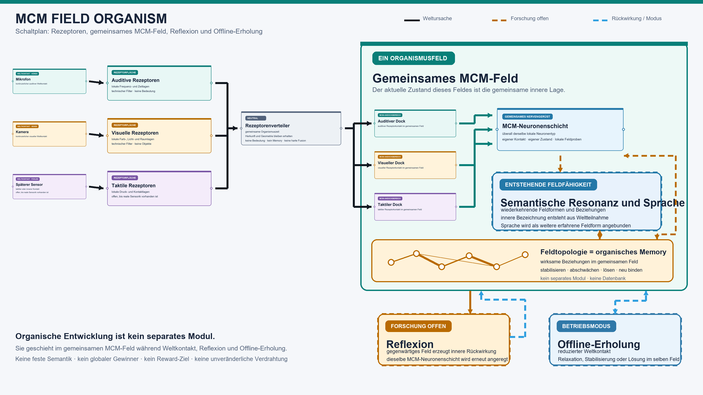
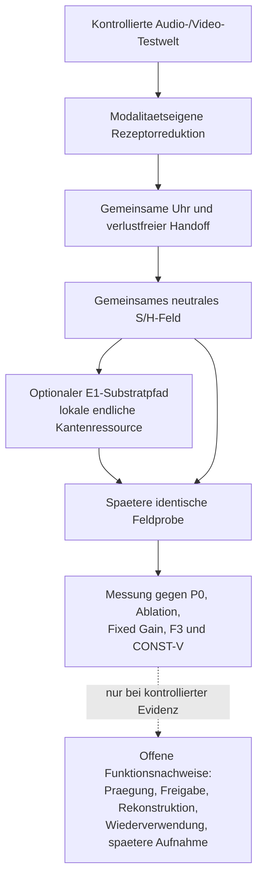

# MCM-Wahrnehmungsfeld

`MCM_FIELD_ORGANISM` ist der bestehende Repository- und Paketname. Der aktuelle
Projektgegenstand ist ein technikbasiertes MCM-Wahrnehmungsfeld mit
kontrollierten Audio-/Video-Testwelten, zeitlich geordneten Rezeptorfolgen,
einem gemeinsamen lokalen S/H-Feld und transparenten Gegenbaselines.

Der verbindliche Begriffs- und Evidenzrahmen steht in der
[aktuellen technischen Projektgrenze](docs/AKTUELLE_TECHNISCHE_PROJEKTGRENZE.md).
Der operative Stand steht im
[aktuellen Forschungsweg](AKTUELLER_FORSCHUNGSWEG.md).
Ein fachliches Transferkonzept zu Biocomputing und neuronaler
Selbstorganisation steht in
[Biocomputing und neuronale Selbstorganisation: Transferkonzept fuer MCM](docs/BIOCOMPUTING_NEURONALE_SELBSTORGANISATION_MCM_TRANSFERKONZEPT.md).
Die daraus abgeleitete technische Leitidee steht in
[MCM-Kohaerenzerhalt unter geschlossener Feldkopplung](docs/MCM_KOHAERENZERHALT_GESCHLOSSENE_FELDKOPPLUNG_KONZEPT.md).

## Verbindlicher Forschungsstand nach S1-QL

S1-QL begrenzt die ausfuehrbare M5-Readoutfamilie auf genau einen minimalen
Vertreter: `M5_DIRECT_LOCAL_STATE`. Er verwendet den vorhandenen
W7-N-`LEAK`-Frischzustand, dessen unveraenderte lokale Fortschreibung und den
direkten signed Output. Finales S soll vollstaendig aus diesem Output
stammen; H bleibt am einmal fortgeschriebenen A1-Fast-Vorschlag.

Der Vertreter besitzt eigene Gegenprognosen gegen passive und M/F3-gebundene
B3-Rollen, gestopptes SAT, globales NORM, M1-Mehrspur und M4-Ressourcenledger.
Die Aussage bleibt eng: Geprueft wird spaeter nur direkte lokale
Einzustandsretention, nicht jede denkbare feste Readoutfunktion.

Es wurde nichts implementiert oder ausgefuehrt. Als einziger Anschluss ist
S1-QM fuer den statischen M5_DIRECT-Zustands-, Kompositor-, Fehlercode- und
Testbudgetvertrag vorgesehen. Details:
[S1-QL M5-Readout- und Falsifikationsvertrag](docs/S1QL_STATISCHER_M5_READOUTFAMILIEN_NICHTDUPLIZIERUNGS_UND_FALSIFIKATIONSVERTRAG.md).

Die nachfolgenden aelteren Forschungsstaende bleiben chronologischer
Nachweisbestand. Ihre Weiterfreigaben sind operativ ueberholt.

## Verbindlicher Forschungsstand nach S1-QK

S1-QK hat die vorhandenen Einzustands- und Retentionskerne gegen die
allgemeine M5-Rolle geprueft. W7-N `LEAK` ist ein passender direkter
M5-Unterfall. Seine Zustandstreiber- und S/H-Feldrollen sind aber noch nicht
gegen die vorhandenen passiven und M/F3-gebundenen B3-Leaky-Rollen
abgegrenzt. W7-N `SAT` bleibt eine bereits gestoppte konkrete M5-Unterklasse
und darf nicht als allgemeines M5 oder eigener Feldarm zurueckkehren.

Carrier-, F3- und G2/D3-Retentionspfade sind wegen fehlender Feldoberflaeche,
zusaetzlicher Substratrollen oder Ereignisbindung nicht unveraendert als M5
anschliessbar. Damit fehlen weiterhin eine endliche M5-Readoutfamilie und
ihre nichtduplizierte falsifizierbare Abgrenzung.

Es wurde nichts implementiert oder ausgefuehrt. Als einziger Anschluss ist
S1-QL fuer den statischen M5-Readoutfamilien-, Nichtduplizierungs- und
Falsifikationsvertrag vorgesehen. Details:
[S1-QK M5-Bestandsaudit](docs/S1QK_STATISCHER_M5_BESTANDS_NICHTDUPLIZIERUNGS_UND_FELDROLLENKOMPATIBILITAETSAUDIT.md).

Die nachfolgenden aelteren Forschungsstaende bleiben chronologischer
Nachweisbestand. Ihre Weiterfreigaben sind operativ ueberholt.

## Verbindlicher Forschungsstand nach S1-QJ

S1-QJ implementiert den privaten A3-NORM-`REPLACE_S`-Kompositor in der
gebundenen Drei-Dateien-Grenze. Synchrone und transiente Intervalle verwenden
die vorhandenen A1-Fast-Kerne; der vorhandene W7-N-NORM-Kern liefert
Folgezustand und signed Output. Nur S wird ersetzt, waehrend H, Perzeption,
Dockrollen und Feldzeitprovenienz erhalten bleiben.

Der einmalig freigegebene kombinierte Abnahmelauf schloss 61 Tests in
20,080 Sekunden erfolgreich ab. Darin sind exakt 18 neue S1-QJ-Tests sowie
die direkt beruehrten A1-, W7-N-, transienten Eingabe- und
Shared-Field-Regressionen enthalten. Alle 14 Fehlermutationsklassen endeten
atomar ohne Teiloutput.

Die Komponente ist nicht in aktive API, Runtime oder Runner integriert. Das
Pflichtbaselinepaket bleibt nicht ausfuehrbar. Als einziger Anschluss ist
S1-QK fuer einen statischen M5-Bestands-, Nichtduplizierungs- und
Feldrollenkompatibilitaetsaudit vorgesehen.

Die nachfolgenden aelteren Forschungsstaende bleiben chronologischer
Nachweisbestand. Ihre Weiterfreigaben sind operativ ueberholt.

## Verbindlicher Forschungsstand nach S1-QI

S1-QI bindet die private Implementierungsoberflaeche fuer den ausgewaehlten
A3-NORM-`REPLACE_S`-Kompositor. Synchrone und transiente A1-Intervalle werden
ueber genau eine typdiskriminierte Eingabe unterschieden. In beiden Faellen
bleiben Reihenfolge, vollstaendige S-Ersetzung, H-Identitaet und genau eine
Feldzeitfortschreibung gleich.

Der Vertrag legt vierzehn deterministische Fehlercodes, vierzehn isolierte
Fehlermutationsklassen und achtzehn fokussierte Testmethoden fest. Noch wurde
nichts implementiert oder ausgefuehrt; aktive API, Runtime, Orchestrator und
primaerer Feldkern bleiben unveraendert.

Als einziger Anschluss ist S1-QJ fuer die begrenzte Implementierung in drei
neuen privaten Dateien und genau eine technische Abnahme vorgesehen. Details:
[S1-QI Kompositor- und Testbudgetvertrag](docs/S1QI_STATISCHER_A3_NORM_REPLACE_S_KOMPOSITOR_FEHLERCODE_UND_TESTBUDGETVERTRAG.md).

Die nachfolgenden aelteren Forschungsstaende bleiben chronologischer
Nachweisbestand. Ihre Weiterfreigaben sind operativ ueberholt.

## Verbindlicher Forschungsstand nach S1-QH

S1-QH hat die drei NORM-Feldkompositionsfamilien statisch verglichen.
`REPLACE_S` bleibt als einzige direkte und parameterfreie Variante bestehen:
Ein interner kandidatenfreier A1-Fast-Vorschlag liefert die Evidence und H,
danach wird der bestehende signed NORM-Output als finales S desselben
Intervalls eingesetzt. Das finale S wirkt erst im naechsten Intervall zurueck;
die aktuelle Abhaengigkeitsordnung bleibt azyklisch.

`SCALE_S` wird gestoppt, weil es die vorhandene NORM-Outputsemantik durch eine
neue Feldtransformation ersetzen wuerde. `SOURCE_S` wird gestoppt, weil es
eine neue Kopplungs- und Zeitregel oder eine zweite Integration erfordert.

Es wurden keine Gleichung, Parameter, Implementierung oder Tests eingefuehrt.
Das Pflichtbaselinepaket bleibt nicht ausfuehrbar. Als einziger Anschluss ist
S1-QI fuer den statischen REPLACE_S-Kompositor-, Fehlercode- und
Testbudgetvertrag vorgesehen. Details:
[S1-QH NORM-Feldkompositionsaudit](docs/S1QH_STATISCHER_NORM_FELDKOMPOSITIONSFAMILIEN_UND_NICHTZIRKULARITAETSAUDIT.md).

Die nachfolgenden aelteren Forschungsstaende bleiben chronologischer
Nachweisbestand. Ihre Weiterfreigaben sind operativ ueberholt.

## Verbindlicher Forschungsstand nach S1-QG

S1-QG bindet fuer die verbleibende A3-NORM-Rolle genau eine lokale private
Koordinate pro Feldknoten. Die globale Skalierungsgrundlage wird an jedem
Intervallende aus dem vollstaendigen aktuellen Zustandsvektor abgeleitet und
darf weder als globaler Zustand getragen noch zwischen Armen geteilt werden.

Der vollstaendige signed NORM-Outputvektor darf spaeter nur S beeinflussen.
H bleibt ausschliesslich die gemeinsame schnelle A1-Feldrolle. Offen ist noch
die nichtzirkulaere Feldkomposition: Der NORM-Vektor koennte S ersetzen, S
skalieren oder als Quelle einwirken; genau eine dieser Familien muss vor
jeder Implementierung begruendet ausgewaehlt werden.

Der vorhandene W7-N-Kern bleibt fuer Zustand und lokalen Output verwendbar.
Ein atomarer Feldkompositor fehlt weiterhin. Es wurden keine Gleichung,
Parameter, Implementierung oder Tests eingefuehrt. Als einziger Anschluss ist
S1-QH fuer den statischen NORM-Feldkompositionsfamilien- und
Nichtzirkularitaetsaudit vorgesehen. Details:
[S1-QG NORM-Zustands- und Feldoutputrollenvertrag](docs/S1QG_STATISCHER_A3_NORM_ZUSTANDSINVENTAR_NENNERPROVENIENZ_UND_FELDOUTPUTROLLENVERTRAG.md).

Die nachfolgenden aelteren Forschungsstaende bleiben chronologischer
Nachweisbestand. Ihre Weiterfreigaben sind operativ ueberholt.

## Verbindlicher Forschungsstand nach S1-QF

S1-QF hat die beiden bisherigen A3-Unterrollen auf funktionale
Eigenstaendigkeit geprueft. Der lokale Saettigungsintegrator ist eine konkrete
Unterklasse der bereits gebundenen allgemeinen Einzustandsretention M5: ein
lokaler Zustand pro Ort mit festem begrenzendem Readout. Ein eigener
SAT-Feldarm wird deshalb gestoppt; der vorhandene W7-N-Kern bleibt reine
Observerdiagnostik.

Die globale Normalisierung bleibt als eigene Gegenbaseline bestehen. Sie
prognostiziert ortsuebergreifende Skalierung aus dem vollstaendigen aktuellen
baselineeigenen Zustandsvektor, aber keinen lokalen Ressourcentransfer. M5
bleibt dazu ortsseparabel. NORM darf nur S beeinflussen und erhaelt keine
eigene H-Dynamik.

Es wurden keine Gleichung, Parameter, Implementierung oder Tests eingefuehrt.
Das Pflichtbaselinepaket bleibt nicht ausfuehrbar. Als einziger Anschluss ist
S1-QG fuer den statischen A3-NORM-Zustandsinventar-, Nennerprovenienz- und
Feldoutputrollenvertrag vorgesehen. Details:
[S1-QF A3-Feldfunktions- und Falsifikationsvertrag](docs/S1QF_STATISCHER_A3_FELDFUNKTIONS_NICHTSUBSTITUTIONS_UND_FALSIFIKATIONSVERTRAG.md).

Die nachfolgenden aelteren Forschungsstaende bleiben chronologischer
Nachweisbestand. Ihre Weiterfreigaben sind operativ ueberholt.

## Verbindlicher Forschungsstand nach S1-QE

S1-QE hat die offenen Feldhandoffs von A0 und A3 statisch gegen den
vorhandenen Quellbestand geprueft. Fuer A0 existiert bereits ein
vollstaendiger zustandsloser Feldpfad: `receptor_projection_baseline` setzt
pro Dock nur den aktuellen Kontakt und H auf null; `SharedMCMField.advance`
erzeugt daraus atomar das komplette Feld. Spaeter fehlt nur die neue
modellneutrale Lebenszyklus-Huelle.

Die W7-N-Kerne fuer Saettigung und Normalisierung liefern dagegen weiterhin
nur lokalen Zustand und Observeroutput. Eine Zuordnung zu S, H und der
gemeinsamen Feldfortsetzung waere eine neue Feldfunktion und darf nicht als
Formadapter verborgen werden. A3 und damit das gesamte Pflichtbaselinepaket
bleiben vor einer Ausfuehrung gesperrt.

Es wurden keine Gleichung, Parameter, Implementierung oder Tests eingefuehrt.
Als einziger Anschluss ist S1-QF fuer den statischen A3-Feldfunktions-,
Nichtsubstitutions- und Falsifikationsvertrag vorgesehen. Details:
[S1-QE Feldhandoff-Kompatibilitaetsaudit](docs/S1QE_STATISCHER_FELDHANDOFF_KOMPATIBILITAETSAUDIT_A0_A3.md).

Die nachfolgenden aelteren Forschungsstaende bleiben chronologischer
Nachweisbestand. Ihre Weiterfreigaben sind operativ ueberholt.

## Verbindlicher Forschungsstand nach S1-QD

S1-QD trennt fuer das Pflichtbaselinepaket Orchestrierung, modellneutrale
Eingabe, privaten Modellzustand und passive Ausgabe. Jeder Feldarm muss aus
einem unabhaengigen Frischzustand starten und Feld sowie privaten Folgezustand
atomar und ohne Arm-, Ziel- oder Kandidatenwissen tragen.

Die Zustandsrollen sind jetzt fuer A0-A3 und M1-M5 statisch begrenzt. A0 ist
zustandslos, M3 bleibt ein zustandsloser passiver Reduktionsaudit und alle
anderen Rollen tragen nur ihren jeweils eigenen vollstaendigen Zustand. A0
und A3 bleiben jedoch gesperrt, bis nachgewiesen ist, dass ihre vorhandenen
lokalen Outputs ohne neue Dynamik auf ein vollstaendiges Feldresultat
abgebildet werden koennen.

Es wurden keine Gleichung, Parameter, Implementierung oder Tests eingefuehrt.
Als einziger Anschluss ist S1-QE fuer den statischen
Feldhandoff-Kompatibilitaetsaudit von A0 und A3 vorgesehen. Details:
[S1-QD Zustands-, Handoff- und Ausgabevertrag](docs/S1QD_STATISCHER_ZUSTANDS_HANDOFF_UND_AUSGABEVERTRAG_PFLICHTBASELINEPAKET.md).

Die nachfolgenden aelteren Forschungsstaende bleiben chronologischer
Nachweisbestand. Ihre Weiterfreigaben sind operativ ueberholt.

## Verbindlicher Forschungsstand nach S1-QC

S1-QC bindet das kleinste nichtduplizierte Pflichtbaselinepaket. Vorhandene
Kerne werden als Adaptergruppen A0 bis A3 gefuehrt. Die noch eigenstaendigen
Abschlussrollen sind: feste Mehrzeitskalenbank, begrenzter Verlaufspuffer fuer
Delay/Replay, Capacity-Clamp-Reduktionsgate, eingefrorene DTS-1/T1-Baseline
und allgemeine Einzustandsretention.

Fixed Adapter deckt Frozen-E1, permanentes Gewicht und rein statische
Kopplung ab. Delay ist ein Spezialfall des begrenzten Puffers. G2/D3 erhaelt
keinen neuen Laufzeitarm, weil seine ausgearbeiteten Anteile bereits auf
Retention beziehungsweise DTS/Clamp reduziert sind.

Es wurden keine Gleichung, Baseline oder Tests umgesetzt. Als einziger
Anschluss ist S1-QD fuer den statischen Zustands-, Handoff- und
Ausgabevertrag aller Paketrollen vorgesehen. Details:
[S1-QC Pflichtbaselinepaket](docs/S1QC_STATISCHER_FUNKTIONS_NICHTDUPLIZIERUNGS_UND_FALSIFIKATIONSVERTRAG_PFLICHTBASELINEPAKET.md).

Die nachfolgenden aelteren Forschungsstaende bleiben chronologischer
Nachweisbestand. Ihre Weiterfreigaben sind operativ ueberholt.

## Verbindlicher Forschungsstand nach S1-QB

S1-QB hat alle S1-PX-Pflichtbaselines statisch gegen die neuen
Lebenszyklus- und Beobachtungsoberflaechen auditiert. Die vorhandenen
vollstaendigen Feldintervallkerne fuer schnellen H-Nachhall sowie B1 bis B6
sind nach einer neuen S1-PZ-Huellenbindung wiederverwendbar. Stateless,
Saettigung und Normalisierung besitzen Kerne, aber noch keinen gueltigen
S1-QA-Feldhandoff.

Eigenstaendige Lebenszykluskerne fehlen fuer mehrere feste Zeitskalen, feste
Verzoegerung, statische Rekurrenz, Replay und minimalen Capacity-Clamp.
DTS-1/T1, Retention und G2/D3 sind vorhanden, aber an geschlossene
Spezialoberflaechen gebunden und nicht direkt zulaessig.

Es wurde keine Baseline implementiert oder ausgefuehrt. Als einziger
Anschluss ist S1-QC fuer den statischen Funktions-, Nichtduplizierungs- und
Falsifikationsvertrag des kleinsten fehlenden Pflichtbaselinepakets
vorgesehen. Details:
[S1-QB Pflichtbaselineaudit](docs/S1QB_STATISCHER_PFLICHTBASELINE_OBERFLAECHEN_UND_INFORMATIONSAUDIT.md).

Die nachfolgenden aelteren Forschungsstaende bleiben chronologischer
Nachweisbestand. Ihre Weiterfreigaben sind operativ ueberholt.

## Verbindlicher Forschungsstand nach S1-QA

S1-QA bindet die passiven Beobachtungs-, Bilanz-, Kontrast- und
Comparatorrollen fuer den gesamten S1-PZ-Lebenszyklus. Vollstaendige signed
S-Fortsetzungen, S/H-Angleichung, private Zustandsprovenienz und eine spaeter
vom Kandidaten vollstaendig zu deklarierende lokale und globale Bilanz werden
getrennt gefuehrt.

Die Familien F, T, I, C, R und U duerfen nur gemeinsam und in fester
Gateordnung bewertet werden. Teilkontraste erzeugen keinen Gesamtbefund. Ein
Baselinevergleich muss das vollstaendige Feldprofil mit genau einer
Konfiguration pro Modell reproduzieren oder ein gemeinsames Residuum lassen;
Kandidatenbilanz ersetzt keine nichtreduzierbare Feldwirkung.

Es gibt noch keinen Comparator, Kandidaten, Werte, Gleichung, Runtime oder
Lauf. Als einziger Anschluss ist S1-QB fuer einen statischen
Pflichtbaseline-Oberflaechen- und Informationsaudit vorgesehen. Details:
[S1-QA Beobachtungs- und Comparatorrollenvertrag](docs/S1QA_STATISCHER_BEOBACHTUNGS_BILANZ_UND_LEBENSZYKLUS_COMPARATORROLLENVERTRAG.md).

Die nachfolgenden aelteren Forschungsstaende bleiben chronologischer
Nachweisbestand. Ihre Weiterfreigaben sind operativ ueberholt.

## Verbindlicher Forschungsstand nach S1-PZ

S1-PZ bindet die modellneutrale Expositionslogik fuer den vollstaendigen
S1-PX-Lebenszyklus. A bezeichnet die fokale Geschichte, B eine lokale
Konkurrenzgeschichte und C eine gleich belastete nichtlokale Kontrolle.
Kontaktfreie Gap-Rollen kontrollieren Zeitverlauf sowie moeglichen spaeteren
Funktionsverlust und Wiederverwendung.

Der Feldzustand wird waehrend jeder normalen Geschichte kausal getragen.
Aktueller Eingang, S und H werden nur unmittelbar vor einem vergleichenden
Readout angeglichen; private Modellzustaende bleiben dabei unveraendert.
Gebunden sind getrennte Familien fuer Bildung, Wiederholung, Interferenz,
Kapazitaet, Funktionsverlust und andere B-Nutzung.

Es gibt weiterhin keinen Kandidaten, keine Werte, Gleichung, Runtime oder
Ausfuehrung. Als einziger Anschluss ist S1-QA fuer einen statischen
Beobachtungs-, Bilanz- und Lebenszyklus-Comparatorrollenvertrag vorgesehen.
Details:
[S1-PZ Expositionsrollenvertrag](docs/S1PZ_STATISCHER_MODELLNEUTRALER_EXPOSITIONSROLLENVERTRAG_S1PX_LEBENSZYKLUS.md).

Die nachfolgenden aelteren Forschungsstaende bleiben chronologischer
Nachweisbestand. Ihre Weiterfreigaben sind operativ ueberholt.

## Verbindlicher Forschungsstand nach S1-PY

S1-PY bestaetigt, dass gemeinsame S/H-Grenzen, Intervallmaterialisierung,
getrennte Expositions- und Zustandsdigests, sechs private Baselineadapter,
Frischstarts und atomare Outputs technisch wiederverwendbare Primitive sind.
Das vorhandene Geruest deckt den S1-PX-Lebenszyklus jedoch nicht vollstaendig
ab.

Es fehlen insbesondere eine belastungsangepasste lokale/nichtlokale
Interferenzkontrolle, eine endogene Freigabe- und Wiederverwendungsfolge,
mehrere Pflichtbaseline-Bruecken sowie ein gemeinsamer passiver
Lebenszyklus-Comparator. Der alte unvollstaendige 24-Fall-Zweig wird nicht
fortgesetzt und liefert keinen S1-PX-Befund.

Als einziger Anschluss ist S1-PZ fuer einen statischen modellneutralen
Expositionsrollenvertrag vorgesehen. Noch keine Kandidatenwahl, Werte,
Runtime oder Ausfuehrung. Details:
[S1-PY Wiederverwendbarkeits- und Lueckenaudit](docs/S1PY_STATISCHER_WIEDERVERWENDBARKEITS_UND_LUECKENAUDIT_EXPOSITION_BASELINES_COMPARATOREN.md).

Die nachfolgenden aelteren Forschungsstaende bleiben chronologischer
Nachweisbestand. Ihre Weiterfreigaben sind operativ ueberholt.

## Verbindlicher Forschungsstand nach S1-PX

S1-PX oeffnet die hypothetische MCM-Memory-Entwicklungsrichtung mit einem
rein statischen Funktions- und Falsifikationsvertrag wieder. Gesucht ist eine
endogen durch lokale Feldgeschichte gebildete Disposition, die nach
Angleichung von aktuellem Eingang sowie schnellem S/H-Zustand die spaetere
S-Fortsetzung veraendert. Abschwaechung, spezifische Interferenz, endliche
lokale Kapazitaet, funktionale Freigabe und andere Wiederverwendung muessen
als eine gemeinsame, nicht baseline-reduzierbare Prognose vorliegen.

Es wurde noch kein Kandidat ausgewaehlt und keine Gleichung, Runtime oder
Ausfuehrung freigegeben. Frozen-E1, DTS-1/T1 und G2/D3 bleiben geschlossen.
Als einziger Anschluss ist S1-PY fuer einen statischen Wiederverwendbarkeits-
und Lueckenaudit des vorhandenen Expositions-, Baseline- und
Comparatorgeruests vorgesehen. Details:
[S1-PX Funktions- und Falsifikationsvertrag](docs/S1PX_STATISCHER_FUNKTIONS_UND_FALSIFIKATIONSVERTRAG_HYPOTHETISCHE_MCM_MEMORY.md).

Die nachfolgenden aelteren Abschlussstaende bleiben als chronologischer
Nachweisbestand erhalten. Ihre damaligen Pausen- und Weiterfreigaben sind
durch S1-PX operativ ueberholt.

## Verbindlicher Abschlussstand nach S1-PW

Der statische S1-PW-Audit erfasst alle 305 Root-Verbraucherdateien. Es gibt
keine weitere, bisher ungepruefte Lazy-Verhaltensklasse und deshalb keinen
zusaetzlichen Regressionstest. Die Aktivkern-, Root- und
Archivgrenzenkonsolidierung ist technisch abgeschlossen.

Die Forschung an einer neuen Substrat- oder technischen
Memory-Funktionsrichtung bleibt pausiert, solange keine eigenstaendige und
vorab falsifizierbare Gegenprognose vorliegt. Es gibt keinen automatisch
freigegebenen Folgeschritt. Details:
[S1-PW Root-Verbraucheraudit](docs/S1PW_STATISCHER_ABDECKUNGSAUDIT_ROOT_IMPORTVERBRAUCHER.md).

## Verbindlicher Stand nach S1-PV

Die Paket-Root-API wird jetzt lazy initialisiert. Ihre 1.267 bestehenden
Namen und Objektidentitaeten bleiben kompatibel, waehrend ein reiner Import
des aktiven Feldkerns historische und inaktive Module nicht mehr allein
wegen der Root-Oberflaeche laden muss.

Der einmalige Abnahmeverbund bestand mit exakt 41 Testmethoden (`OK`). Als
einziger naechster Schritt ist `S1-PW` fuer einen statischen Abdeckungsaudit
der weiteren Root-Importverbraucher vorgesehen. Details:
[S1-PV Lazy-Root-Abnahme](docs/S1PV_IMPLEMENTIERUNG_UND_41_METHODEN_ABNAHME_LAZY_ROOT.md).

Die Forschung an einer neuen Substrat- oder technischen
Memory-Funktionsrichtung bleibt pausiert.

## Verbindlicher Stand nach S1-PU

S1-PU begrenzt die spaetere Lazy-Root-Umstellung auf einen kleinen,
vorregistrierten Dateiumfang. Die bestehende Root-Oberflaeche mit 1.267 Namen
muss vollstaendig kompatibel bleiben; der aktive Feldkern soll danach ohne
vorsorgliches Laden historischer oder inaktiver Module importierbar sein.

Das spaetere Abnahmegate umfasst genau 41 Testmethoden in einem einzigen
Lauf. Noch wurde kein Importcode veraendert und kein Test ausgefuehrt. Als
einziger naechster Schritt ist `S1-PV` fuer diese einmalige Implementierung
und Abnahme vorgesehen. Details:
[S1-PU Implementierungs- und Abnahmevertrag](docs/S1PU_STATISCHER_IMPLEMENTIERUNGS_UND_ABNAHMEVERTRAG_LAZY_ROOT.md).

Die Forschung an einer neuen Substrat- oder technischen
Memory-Funktionsrichtung bleibt pausiert.

## Verbindlicher Stand nach S1-PT

Der statische S1-PT-Audit ordnet alle 1.267 Namen der breiten Paket-Root-API
eindeutig ihrem Ursprungsmodul und ihrer operativen Klasse zu. Es gibt keine
fehlenden Urspruenge, Dubletten oder Mehrdeutigkeiten. Das vollstaendige
Inventar und drei getrennte Digests sind im Repository gebunden.

`__init__.py` ist weiterhin unveraendert. Als einziger naechster Schritt ist
`S1-PU` fuer den statischen Implementierungs- und Abnahmevertrag der
Lazy-Root-Migration vorgesehen. Details:
[S1-PT Root-Exportaudit](docs/S1PT_STATISCHER_ROOT_EXPORTINVENTAR_UND_EINDEUTIGKEITSAUDIT.md).

Die Forschung an einer neuen Substrat- oder technischen
Memory-Funktionsrichtung bleibt pausiert.

## Verbindlicher Stand nach S1-PS

S1-PS legt fest, wie die breite Paket-Root-API spaeter kompatibel auf eine
Lazy-Aufloesung umgestellt werden darf. Bestehende Namen,
Objektidentitaeten, `__all__` und direkte Fachmodulimporte muessen erhalten
bleiben; historische oder inaktive Module sollen beim Import des aktiven
Feldkerns nicht mehr vorsorglich geladen werden.

Noch wurde kein Importcode veraendert. Als einziger naechster Schritt ist
`S1-PT` fuer den statischen Root-Exportinventar- und Eindeutigkeitsaudit
vorgesehen. Details:
[S1-PS Vertrag schlanke Paketinitialisierung](docs/S1PS_STATISCHER_VERTRAG_KOMPATIBLE_SCHLANKE_PAKETINITIALISIERUNG.md).

Die Forschung an einer neuen Substrat- oder technischen
Memory-Funktionsrichtung bleibt pausiert.

## Verbindlicher Stand nach S1-PR

Die kuratierte Oberfläche `mcm_field_organism.current_api` trennt den aktiven
MCM-Wahrnehmungsfeldkern von Referenzbaselines, geschlossenen Kandidaten,
historischen Runnern und inaktiver Sensorik. Die Archivartefakte bleiben zur
Nachvollziehbarkeit erhalten und werden dadurch nicht zu aktiven Funktionen.

Offen ist eine rein technische Importgrenze: Python initialisiert vor
`current_api` weiterhin die breite Paket-Root-API. Als einziger naechster
Schritt ist deshalb `S1-PS` vorgesehen, ein statischer Vertrag fuer eine
spaetere kompatible und schlanke Paketinitialisierung. Details:
[S1-PR Aktivkern- und Archivgrenzenkonsolidierung](docs/S1PR_STATISCHE_AKTIVKERN_ISOLATION_UND_ARCHIVGRENZENKONSOLIDIERUNG.md).

Die Forschung an einer neuen Substrat- oder technischen
Memory-Funktionsrichtung bleibt pausiert.

## Verbindlicher Stand nach S1-PQ

Der primaere MCM-Wahrnehmungsfeldkern ist die aktive technische Architektur.
Der statische Bestands- und Lueckenaudit S1-PQ findet derzeit keine
eigenstaendige, vorab definierte und falsifizierbare Gegenprognose fuer einen
neuen Substratkandidaten. Die entsprechende Forschung ist deshalb pausiert;
geschlossene Zweige und Baselines werden nicht als Kandidaten fortgesetzt.

Als einziger naechster Anschluss ist `S1-PR` zur statischen Trennung von
aktivem Feldkern, Referenzbaselines, geschlossenen Kandidaten, historischen
Runnern und inaktiver Sensorik vorgeschlagen. Das ist technische
Konsolidierung und keine neue Mechanik. Details:
[S1-PQ Bestands- und Lueckenaudit](docs/S1PQ_STATISCHER_BESTANDS_UND_LUECKENAUDIT_PRIMAERES_MCM_WAHRNEHMUNGSFELD.md).

## Aktueller technischer Stand

Die folgende Chronologie dokumentiert auch historische und inzwischen
gesperrte Arbeitsschritte. Fruehere Weiterfreigaben werden durch den
vorrangigen S1-PQ-Stand nicht reaktiviert.

Der aktuelle Forschungsstand ist eine technische Vertrags- und
Vergleichsphase. Die 24-Fall-Matrix ist unvollstaendig, und daraus folgt noch
kein Kandidaten-, Baseline- oder Faehigkeitsurteil. Die folgenden Punkte
beschreiben nur gebundene technische Arbeitsschritte und gesperrte Grenzen.

- Lauf 198 ist eine reale Fixed-Adapter-Gegenbaseline und kein Nachweis einer
  Speicher- oder Lernfunktion.
- S1-LN bindet die lokale C10-Anatomie fuer `B3/P_IH_ATTENUATION` inkl.
  Rollenledger, lokaler und globaler Erhaltung sowie Baseline-/Struktursperren.
- S1-LO führt die registrierte C10-Fallauswahl mit drei Refinements (`r2/r4/r8`)
  als isolierte Ausfuehrung mit 9 Intervallen aus.
- S1-LP bindet den vollständigen statischen C10-Caseoutput für diese drei
  Refinements; es gibt noch kein Baseline- oder Kandidatenurteil.
- S1-LQ bindet darauf aufbauend C01 bis C10 als abgeschlossen und lässt als
  naechsten Fall exakt `C11 / B3 / B3_F3_LOCAL_LEAKY / P_IK_INTERFERENCE`.
  Matrixkomposition und -publikation bleiben weiterhin gesperrt.
- S1-LR bindet diesen C11-Fall statisch als B3/P_IK-Auswahl mit getrennten
  `A-B-A`- und `A-Gap-A`-Sequenzen.
- S1-LS fuehrt exakt die drei C11-Refinements `r2/r4/r8` isoliert aus:
  24 Intervallaufrufe, zwei terminale Checkpoints pro Replikat und sechs
  technische signed Komponenten pro Refinement. C11-Falloutput,
  Matrixpublikation, Baselineurteil und Kandidatenvergleich bleiben gesperrt.
- S1-LT bindet daraus den vollstaendigen technischen C11-Falloutput mit
  Provenienz-, Vergleichs- und Checkpoint-Digests, `r4` als Primaerrefinement
  und zwei gerichteten Residualbloecken. Matrixpublikation, Baselineurteil und
  Kandidatenvergleich bleiben gesperrt.
- S1-LU bindet C01 bis C11 als abgeschlossen. Die Matrix bleibt mit 11 von 24
  Faellen unvollstaendig; C12 bis C24 fehlen. Als naechster einzelner Fall ist
  `C12 / B3 / B3_F3_LOCAL_LEAKY / P_IN_RELEASE_REUSE` freigegeben.
- S1-LV bindet C12 statisch als B3/P_IN-Auswahl mit `P_IN_RECOVERY_ON` und
  `P_IN_RECOVERY_OFF`, drei Refinements und maximal 24 Intervallaufrufen.
  Implementierung, Ausfuehrung, Falloutput, Matrix und Urteil bleiben
  gesperrt.
- S1-LW fuehrt exakt die drei C12-Refinements `r2/r4/r8` isoliert aus:
  24 Intervallaufrufe, zwei terminale Checkpoints pro Replikat und sechs
  technische signed Komponenten pro Refinement. Alle Komponenten sind null;
  das ist kein Release-/Reuse- oder Baselineurteil. C12-Falloutput und Matrix
  bleiben gesperrt.
- S1-LX bindet daraus den vollstaendigen technischen C12-Falloutput mit
  Provenienz-, Vergleichs- und Checkpoint-Digests, `r4` als Primaerrefinement
  und zwei gerichteten Null-Residualbloecken. Matrixpublikation,
  Baselineurteil und Kandidatenvergleich bleiben gesperrt.
- S1-LY bindet C01 bis C12 als abgeschlossen. Die Matrix bleibt mit 12 von
  24 Faellen unvollstaendig; C13 bis C24 fehlen. Als naechster einzelner Fall
  ist `C13 / B4 / B4_F3_LINEAR_COUPLED / P_IE_CAUSAL_TWO_SUBSTEP`
  freigegeben.
- S1-LZ bindet diesen C13-Fall statisch als B4/P_IE-Auswahl mit getrennten
  `P_IE_F_HIGH`- und `P_IE_R_HIGH`-Sequenzen, drei Refinements und maximal
  12 Intervallaufrufen. Implementierung, Ausfuehrung, Falloutput, Matrix und
  Urteil bleiben gesperrt.
- S1-MA fuehrt exakt die drei C13-Refinements `r2/r4/r8` isoliert aus:
  12 Intervallaufrufe, vier Checkpoints pro Replikat und acht technische
  signed Komponenten pro Refinement. Alle Komponenten sind null; das ist kein
  Baseline- oder Kandidatenurteil. C13-Falloutput und Matrix bleiben
  gesperrt.
- S1-MB bindet daraus den vollstaendigen technischen C13-Falloutput mit
  Provenienz-, Vergleichs- und Checkpoint-Digests, `r4` als Primaerrefinement
  und zwei gerichteten Null-Residualbloecken. Matrixpublikation,
  Baselineurteil und Kandidatenvergleich bleiben gesperrt.
- S1-MC bindet C01 bis C13 als abgeschlossen. Die Matrix bleibt mit 13 von
  24 Faellen unvollstaendig; C14 bis C24 fehlen. Als naechster einzelner Fall
  ist `C14 / B4 / B4_F3_LINEAR_COUPLED / P_IH_ATTENUATION` freigegeben.
- Hypothetische MCM-Memory bleibt eine offene Entwicklungsrichtung. Es gibt
  keinen Memory-Nachweis, keine vorhandene Memory-Faehigkeit und keinen
  Systemfaehigkeits-Claim.
- S1-MD bindet diesen C14-Fall statisch als B4/P_IH-Auswahl mit einer
  `P_IH_A_A_A`-Sequenz, drei Refinements und maximal 9 Intervallaufrufen.
  Implementierung, Ausfuehrung, Falloutput, Matrix und Urteil bleiben
  gesperrt.
- S1-ME fuehrt exakt die drei C14-Refinements `r2/r4/r8` isoliert aus:
  9 Intervallaufrufe, drei Checkpoints pro Replikat und acht technische
  signed Komponenten pro Refinement. Das ist kein Memory-Nachweis, kein
  Baseline- oder Kandidatenurteil. C14-Falloutput und Matrix bleiben
  gesperrt.
- S1-MF bindet daraus den vollstaendigen technischen C14-Falloutput mit
  Provenienz-, Vergleichs- und Checkpoint-Digests, `r4` als Primaerrefinement
  und zwei gerichteten nichtnulligen Residualbloecken. Matrixpublikation,
  Baselineurteil und Kandidatenvergleich bleiben gesperrt.
- S1-MG bindet C01 bis C14 als abgeschlossen. Die Matrix bleibt mit 14 von
  24 Faellen unvollstaendig; C15 bis C24 fehlen. Als naechster einzelner Fall
  ist `C15 / B4 / B4_F3_LINEAR_COUPLED / P_IK_INTERFERENCE` freigegeben.
  Keine Matrixkomposition, keine Matrixpublikation und kein Urteil.
- S1-MH bindet diesen C15-Fall statisch als B4/P_IK-Auswahl mit getrennten
  `P_IK_A_B_A`- und `P_IK_A_GAP_A`-Sequenzen, drei Refinements und maximal
  24 Intervallaufrufen. Implementierung, Ausfuehrung, Falloutput, Matrix und
  Urteil bleiben gesperrt.
- S1-MI fuehrt exakt die drei C15-Refinements `r2/r4/r8` isoliert aus:
  24 Intervallaufrufe, zwei terminale Checkpoints pro Replikat und sechs
  technische signed Komponenten pro Refinement. Das ist kein Interferenz-,
  Baseline- oder Kandidatenurteil. C15-Falloutput und Matrix bleiben
  gesperrt.
- S1-MJ bindet daraus den vollstaendigen technischen C15-Falloutput mit
  Provenienz-, Vergleichs- und Checkpoint-Digests, `r4` als Primaerrefinement
  und zwei gerichteten nichtnulligen Residualbloecken. Matrixpublikation,
  Baselineurteil und Kandidatenvergleich bleiben gesperrt.
- S1-MK bindet C01 bis C15 als abgeschlossen. Die Matrix bleibt mit 15 von
  24 Faellen unvollstaendig; C16 bis C24 fehlen. Als naechster einzelner Fall
  ist `C16 / B4 / B4_F3_LINEAR_COUPLED / P_IN_RELEASE_REUSE` freigegeben.
  Keine Matrixkomposition, keine Matrixpublikation und kein Urteil.
- S1-ML bindet diesen C16-Fall statisch als B4/P_IN-Auswahl mit getrennten
  `P_IN_RECOVERY_ON`- und `P_IN_RECOVERY_OFF`-Sequenzen, drei Refinements und
  maximal 24 Intervallaufrufen. Implementierung, Ausfuehrung, Falloutput,
  Matrix und Urteil bleiben gesperrt.
- S1-MM implementiert und fuehrt ausschliesslich die drei C16-Replikate
  `B4:P_IN_RELEASE_REUSE:r2/r4/r8` isoliert aus. Es wurden 24 Intervalle
  materialisiert; die drei Output- und Vergleichsdigests sind gebunden. Kein
  C16-Falloutput, keine Matrixpublikation und kein Urteil.
- S1-MN setzt den technischen C16-Falloutput ausschliesslich aus den S1-MM-
  Ausgaben zusammen. Primaerkomponenten und Residuen sind exakt null, aber ohne
  Release-/Reuse-Urteil, Baselineabschluss oder Kandidatenvergleich.
- S1-MO bindet danach C01 bis C16 als vollstaendige technische Falloutputs.
  Die 24-Fall-Matrix bleibt unvollstaendig; C17 bis C24 fehlen. Als naechster
  einzelner Fall ist `C17 / B5 / B5_F3_FULL / P_IE_CAUSAL_TWO_SUBSTEP`
  freigegeben. Keine Matrixkomposition, keine Matrixpublikation und kein Urteil.
- S1-MP bindet diesen C17-Fall statisch als B5/P_IE-Auswahl mit den Sequenzen
  `P_IE_F_HIGH` und `P_IE_R_HIGH`, drei Refinements und maximal 12
  Intervallaufrufen. Implementierung, Ausfuehrung, Falloutput, Matrix und
  Urteil bleiben gesperrt.
- S1-MQ implementiert und fuehrt ausschliesslich die drei C17-Replikate
  `B5:P_IE_CAUSAL_TWO_SUBSTEP:r2/r4/r8` isoliert aus. Es wurden 12 Intervalle
  materialisiert; die drei Output- und Vergleichsdigests sind gebunden. Kein
  C17-Falloutput, keine Matrixpublikation und kein Urteil.
- S1-MR setzt den technischen C17-Falloutput ausschliesslich aus den S1-MQ-
  Ausgaben zusammen. Primaerkomponenten und Residuen sind exakt null, aber ohne
  Baselineabschluss oder Kandidatenvergleich.
- S1-MS bindet danach C01 bis C17 als vollstaendige technische Falloutputs.
  Die 24-Fall-Matrix bleibt unvollstaendig; C18 bis C24 fehlen. Als naechster
  einzelner Fall ist `C18 / B5 / B5_F3_FULL / P_IH_ATTENUATION` freigegeben.
  Keine Matrixkomposition, keine Matrixpublikation und kein Urteil.
- S1-MT bindet diesen C18-Fall statisch als B5/P_IH-Auswahl mit der Sequenz
  `P_IH_A_A_A`, drei Refinements und maximal 9 Intervallaufrufen.
  Implementierung, Ausfuehrung, Falloutput, Matrix und Urteil bleiben gesperrt.
- S1-MU bindet den Kohaerenzvertrag fuer geschlossene Feldkopplung als
  technischen Messrahmen. Stoerung, lokale Ressource, Spaetaufnahme,
  Abschwaechung, Interferenz, Freigabe, Gegenbaselines und
  Verwerfungsbedingungen muessen vor jeder Kandidatengleichung gebunden sein.
  Keine Gleichung, keine Parameter, keine Runtime, kein Feldlauf und kein
  Memory- oder Systemfaehigkeitsclaim.
- S1-MV waehlt statisch `KFS-1` als einzigen weiterverfolgbaren
  Kandidatenraum: ein lokales ressourcenbegrenztes Feld-Substrat mit
  Kohaerenzbelastung und spaeterer Aufnahmeaenderung. Reward, Replay, feste
  Kanten, globale Normalisierung, reiner Leaky, reiner Integrator, Fixed
  Adapter und Readout-Klassifikatoren bleiben als primaere Kandidaten
  gesperrt. Keine Gleichung, keine Parameter, keine Runtime, kein Feldlauf und
  kein Memory- oder Systemfaehigkeitsclaim.
- S1-MW bindet fuer KFS-1 die minimale Funktionsprognose und
  Falsifikationsgrenze: Stoerungsaufnahme, Ressourcenbelastung,
  Spaetaufnahme, Abschwaechung, Interferenz, Freigabe und Wiederbindung
  muessen vor jeder Gleichung getrennt messbar sein. Gegenbaselines bleiben
  Fixed Adapter, Leaky, Integrator, Replay, globale Normalisierung, feste
  Kanten, Readout-Klassifikator und F3/CONST-V. Keine Gleichung, keine
  Parameter, keine Runtime, kein Feldlauf und kein Memory- oder
  Systemfaehigkeitsclaim.
- S1-MX bindet fuer KFS-1 ausschliesslich die statische Anatomie und
  Messrollen: lokale Traeger- und Kantenidentitaet, read-only Feldbezug,
  endliches `free/bound/blocked`-Ressourcenledger pro Kante, lokale
  Erhaltungsidentitaet, passive Messrollen, verbotene Zustaende und
  Fail-Closed-Anatomietests. Keine Gleichung, keine Parameter, keine Runtime,
  kein Feldlauf, kein Funktionsnachweis und kein Memory- oder
  Systemfaehigkeitsclaim.
- S1-MY bindet fuer KFS-1 das statische Schema- und Digestmodell fuer
  Anatomie- und Messrollenrecords. Geometrie, Feldreferenz, Ressourcenledger,
  Expositionshistorie und Messrolle bleiben getrennt reproduzierbar;
  ungueltige Records scheitern mit eindeutigen Fail-Closed-Gruenden. Digests
  belegen nur Identitaet, keine Wirkung. Keine Gleichung, keine Parameter,
  keine Runtime, kein Feldlauf und keine Funktionsentscheidung.
- S1-MZ bindet dazu den statischen Validator- und Fixturevertrag. Die
  unveraenderten Eingabebytes, das abgeleitete Validierungsergebnis und die
  normalen Record-Digests bleiben getrennt. Positive Referenzen,
  Einzeldefekte, Mehrfachdefekte und Digeststabilitaet sind fail-closed
  vorregistriert; fehlerhafte Records werden nicht repariert. Keine
  Kandidatengleichung, keine Dynamikparameter, keine Runtimeintegration, kein
  Feldlauf und keine Funktionsentscheidung.
- S1-NA bindet die isolierte Implementierungsgrenze des Validators: genau ein
  Produktionsmodul, ein testseitiger Fixturekatalog, eine fokussierte
  Testdatei, reine APIs, feste Schemaversionen und ein endliches Budget von
  hoechstens 64 Validatoraufrufen. MCM-Feldschritte, Runner, Medienzugriffe,
  Netzwerk, Reports, Kandidatendynamik und Funktionsentscheidung bleiben
  gesperrt.
- S1-NB implementiert und prueft diesen isolierten statischen Validator. Die
  einmalige fokussierte Abnahme besteht mit 12 Testgruppen, 23 Fixtures und
  27 Validatoraufrufen. Es wurden keine Feldschritte, Runner, Medienzugriffe,
  Netzwerkaufrufe oder Reports ausgefuehrt. Der Befund betrifft nur
  Schema-, Bilanz-, Kausal- und Fail-Closed-Pruefung; er ist kein
  Funktionsbefund fuer KFS-1.
- S1-NC bindet fuer KFS-1 vier zulaessige lokale Ressourcenwechsel und drei
  getrennte Stillstandsrollen. Jeder spaetere Wechsel muss derselben Kante,
  einer vorangehenden lokalen Ausloeserbeobachtung und einer lueckenlosen
  Vor-/Nachzustandsbilanz zugeordnet sein. Uebersprungene Rollen,
  Kantenuebertragung, globale Korrektur und Readout-Steuerung bleiben
  gesperrt. Noch keine Gleichung, Parameter, Runtime oder Funktionsaussage.
- S1-ND bindet das maschinenlesbare Uebergangsrecord-Schema mit vollstaendigem
  Vor-/Nachledger, Bilanzwert, Rollenpaar, lokaler Ausloeserreferenz,
  Feldordnung und lueckenloser Vorgaengerverkettung. Sieben Alphabetfaelle
  und achtzehn Fail-Closed-Codes sind festgelegt. Die direkte isolierte
  Validatorerweiterung ist als naechster Schritt freigegeben; Gleichung,
  Dynamik, Runtime und Funktionsaussage bleiben gesperrt.
- S1-NE implementiert und prueft die isolierte Uebergangsvalidatorerweiterung.
  Alle 12 Testgruppen mit sieben positiven Alphabetrecords, achtzehn
  Fehlerrecords, gueltiger und gebrochener Zweierkette bestehen. Es wurden 29
  Uebergangs- und zwei bestehende Recordpruefungen, aber keine Feldschritte
  ausgefuehrt. Das ist ein Schema-, Bilanz- und Kettenbefund, keine
  KFS-1-Wirkung.
- S1-NF waehlt erstmals eine konkrete minimale Regel:
  `KFS1-T1_LOCAL_TARGET_REFRACTORY`. Die lokale Zielbelegung ist `C*p` mit
  der bestehenden symmetrischen Kantenbeteiligung. Positiver Kontakt bindet
  oder blockiert lokale Ressource; nur exakter Nullkontakt gibt bereits zuvor
  blockierte Ressource frei. Freie Raten, Schwellen, Parametersuche, Runtime
  und Feldrueckwirkung bleiben gesperrt. DTS-1 ist verpflichtende
  Gegenbaseline.
- S1-NG implementiert diese Regel als reine parameterfreie Einkantenfunktion.
  Die einmalige Abnahme besteht mit 12 Tests und elf lokalen Uebergaengen bei
  null Feldschritten. Geprueft sind nur die acht gebundenen Ledgerprognosen,
  Erhaltung, Unveraenderlichkeit und technische Isolation. Eine Feldwirkung
  oder ein Befund zur hypothetischen MCM-Memory folgt daraus nicht. S1-NH
  darf als Naechstes nur den endlichen Sequenz- und DTS-1-
  Gegenbaselinevertrag binden.
- S1-NH bindet diesen Gegenbaselinevertrag ohne Ausfuehrung. T1 und DTS-1
  erhalten dieselbe sieben Ereignisse lange lokale Beteiligungsfolge und
  dieselbe Gesamtressource. Zugelassen sind nur das registrierte DTS-1-Profil
  `0.4/0.3/0.2` in vier festen Refinements und eine Nullratenkontrolle.
  Parameterfit, weitere Profile und Feldrueckwirkung bleiben gesperrt. S1-NI
  darf als Naechstes genau diesen isolierten Vergleich einmal ausfuehren.
- S1-NI fuehrt den Vergleich einmalig mit sieben T1-Uebergaengen, 112 reinen
  DTS-1-Subschritten und null Feldschritten aus. Kein festes DTS-1-Profil
  reproduziert T1 vollstaendig; die T1-Folge ist jedoch exakt als
  ereignisgeschaltete DTS-1-Dreirollenabbildung darstellbar. T1 wird deshalb
  als diskrete DTS-1-Variante reklassifiziert und nicht direkt an das Feld
  gekoppelt. S1-NJ bindet als Naechstes nur den statischen Abschluss und die
  Mindestanforderung an einen spaeteren, nicht so reduzierbaren Kandidaten.
- S1-NJ schliesst T1 als unabhaengigen Kandidatenzweig; erhalten bleiben nur
  die Rollen als diskrete DTS-1-Gegenbaseline und Ereignisgrenzenfixture. Ein
  spaeterer KFS-1-Kandidat muss nun vor jeder Gleichung entweder ein anderes
  atomares Transfernetz, eine zusaetzliche nicht rekonstruierbare endliche
  lokale Zustandskoordinate oder eine nicht auf DTS-1 faktorisierbare lokale
  Ressourcenverteilung samt kontrollierter Interventionsprognose binden.
  S1-NK auditiert als Naechstes ausschliesslich diese drei Klassen.
- S1-NK stoppt G1 als alleinige Klasse, weil ein anderes Transfergesetz keine
  eigene Zustandsintervention traegt. G3 ist entweder bereits DTS-1 oder
  benoetigt eine zusaetzliche relationale Rolle und wird G2 zugeordnet. Nur
  die darstellungsoffene Klasse `G2_BOUNDED_LOCAL_CONFIGURATION_STATE` geht
  weiter. Sie ist noch keine konkrete Variable oder Gleichung. S1-NL bindet
  als Naechstes ausschliesslich ihren Funktions- und Falsifikationsvertrag.
- S1-NL bindet diesen Vertrag zweistufig: Zuerst muss eine direkte C0/C1-
  Intervention bei sonst bitgleichem Vorzustand eine gerichtete lokale
  Differenz erzeugen. Danach muss eine lokale Bildungsgeschichte denselben
  Effekt ohne manuelles Setzen tragen und gegen DTS-1, T1, Fixed Adapter,
  Leaky und Integrator bestehen. Reine G2-Ablation, Abschwaechung,
  Interferenz, Loesung und erneute Bildung sind Pflicht. S1-NM bindet als
  Naechstes nur den endlichen darstellungsneutralen F1-Messvertrag.
- S1-NM bindet genau diese zwei F1-Arme mit bitgleichem halbbelegtem Ledger,
  maximaler lokaler Probe und nur C0/C1 als Unterschied. Die einzige primaere
  Komponente ist die obere lokale Zulassungsgrenze fuer `free -> bound`.
  Vorregistriert ist eine geringere Zulassung unter C1; DTS-1, T1, Fixed,
  Leaky, Integrator und Ablation haben Nullprognosen. Es gibt noch keine
  Darstellung oder Ausfuehrung. S1-NN auditiert als Naechstes minimale
  G2-Zustandsdarstellungsklassen.
- S1-NN auditiert vier Darstellungen und fuehrt nur eine konservative
  Unterteilung der vorhandenen `bound`-Rolle weiter:
  `bound_unconfigured + bound_configured = bound`. Binaerflag,
  unabhaengiger Skalar und Mehrkantenrelation werden fuer F1 gestoppt. Die
  Unterteilung erzeugt keine neue Gesamtressource und ist noch keine Dynamik
  oder Funktion. S1-NO bindet als Naechstes nur Anatomie und Erhaltung.
- S1-NO bindet diese Unterteilung als statische Einkantenanatomie. C0 und C1
  besitzen dasselbe aggregierte Ledger `(0.5,0.5,0.0)`, unterscheiden aber
  die vollstaendige gebundene Haelfte als unkonfiguriert beziehungsweise
  konfiguriert. Aggregation und reine G2-Ablation erhalten die Ressource
  exakt. Es gibt keine Dynamik oder Wirkung. S1-NP bindet als Naechstes nur
  Schema, Digests und Validatorgrenzen.
- S1-NP bindet dafuer additiv das Schema `g2_d3_anatomy_record/s1np.v1` mit
  getrennten Ressourcen-, Aggregations- und Recorddigests. Ein spaeterer
  Einzelrecordvalidator prueft Anatomie und Erhaltung; ein Paarvalidator
  prueft C0/C1, bitgleiche Dreirollenprojektion und reine Ablation. Das alte
  KFS-1-Schema bleibt unveraendert. S1-NQ bindet als Naechstes nur die
  isolierte Validatorimplementierung und ihr Testbudget.
- S1-NQ materialisiert drei positive kanonische Fixturebytes samt festen
  Ressourcen-, Projektions-, Record- und Eingabedigests. Es bindet 18
  Einzelmutationen, sechs Paarmutationen, drei neue Dateien, zwoelf
  Testgruppen und ein einmaliges Budget von maximal 64 Einzel- und 16
  Paarpruefungen. Bestehender KFS-1-Code bleibt unveraendert. S1-NR darf als
  Naechstes genau diesen isolierten Validator implementieren und einmal
  abnehmen.
- S1-NR implementiert den isolierten D3-Validator. Die einmalige Abnahme
  meldete bei zehn Testgruppen genau einen unzulaessigen abgeleiteten
  Fehlercode fuer ein fehlendes Klassenfeld. Die lokale Abhaengigkeitspruefung
  ist korrigiert, aber gemaess Einmalbudget nicht erneut ausgefuehrt. Der
  Validator gilt noch nicht als abgenommen; S1-NS darf nur die endliche
  Wiederabnahme binden.
- S1-NS bindet diese Wiederabnahme fuer die unveraenderte korrigierte
  Drei-Dateien-Fassung. S1-NT darf nur nach bitgleichem Digestpreflight genau
  einmal den fokussierten Zehn-Test-Lauf starten. S1-NS selbst fuehrt keinen
  Test aus; alle G2-Funktionspfade bleiben geschlossen.
- S1-NT bestaetigt den bitgleichen Preflight und die einmalige fokussierte
  Wiederabnahme mit `10 tests, OK`. Damit ist nur der statische D3-Record- und
  Paarvalidator akzeptiert. S1-NU darf als Naechstes einen minimalen reinen
  Admissibilitaetsoperator statisch binden; Implementierung und Feldwirkung
  bleiben gesperrt.
- S1-NU waehlt fuer die direkte F1-Pruefung ausschliesslich den
  parameterfreien read-only Operator
  `A_D3=max(0.0,free-bound_configured)`. C0, C1 und MIXED besitzen damit die
  statischen Erwartungen `0.5`, `0.0` und `0.25`; reine Ablation entfernt die
  C0/C1-Differenz. Noch wurde nichts implementiert oder ausgefuehrt. S1-NV
  bindet als Naechstes nur Implementierung, Fixtures und Testbudget.
- S1-NV bindet fuer O3 genau zwei neue Dateien, eine validierungsgebundene
  read-only API, fuenf bestehende Positivfixtures, drei repraesentative
  Invalidklassen, zehn Testgruppen und maximal 24 Operatoraufrufe.
  Aggregierte Records erhalten keinen Sachwert. Noch wurde nichts
  implementiert oder ausgefuehrt; S1-NW darf genau diesen Umfang einmal
  abnehmen.
- S1-NW implementiert und prueft den isolierten O3-Operator einmal mit
  `10 tests, OK`. Die gebundenen C0/C1/MIXED-Werte, Aggregationsablehnung,
  Ablationsnull, Immutabilitaet und Digesttrennung bestehen. Dies ist nur eine
  konstruktive statische F1-Funktion. S1-NX bindet als Naechstes vor jeder
  Gleichung den endlichen F2-Bildungs- und Falsifikationsvertrag.
- S1-NX bindet fuer F2 drei Vierkontaktgeschichten mit identischer
  Kontaktmenge und Dosis: alternierend, gruppiert und gespiegelt gruppiert.
  Nach kontrollierter Angleichung von schnellem S/H und aggregiertem Ledger
  muss nur die endogen gebildete D3-Unterteilung die spaetere O3-Zulassung
  unterscheiden. Baselines sehen dieselbe jeweilige Vorgeschichte. Noch gibt
  es keine Bildungsgleichung oder Ausfuehrung; S1-NY auditiert als Naechstes
  nur minimale Bildungsmechanismusklassen.
- S1-NY auditiert sechs minimale Bildungsmechanismusklassen. Weitergefuehrt
  wird nur eine transiente lokale Fortsetzungspruefung: Sie unterscheidet am
  atomaren Zweiintervallrand Fortsetzung von Wechsel, speichert keine Folge
  und darf spaeter nur innerhalb des vorhandenen `bound` umordnen. Betrag,
  Rate und Gleichung bleiben offen. S1-NZ bindet als Naechstes nur Anatomie,
  Ereignisalphabet und Commitgrenze.
- S1-NZ bindet eine transiente Zweiintervallgrenze mit den Ereignissen erster
  Kontakt, lokale Fortsetzung und lokaler Wechsel. Nur direkt benachbarte
  abgeschlossene Kontakte derselben Kante sind gueltig. Nach Commit darf nur
  der konservative D3-Zustand verbleiben; Kontakt-, Intervall- und
  Ereignisrollen muessen verschwinden. Betrag und Bildungsgleichung bleiben
  offen. S1-OA bindet als Naechstes nur Schema und Validatorvertrag.
- S1-OA bindet ein additives transientes Grenzschema mit getrennten
  Kontaktdigests, D3-Quellbindung, 16 sicheren Fehlercodes und passivem
  Einzelgrenzenbeleg. Das Ereignis darf nicht in der Eingabe stehen, sondern
  wird erst nach vollstaendiger Validierung klassifiziert. Noch wurde nichts
  implementiert oder ausgefuehrt; S1-OB bindet als Naechstes nur
  Implementierung, Fixtures und Testbudget.
- S1-OB bindet fuer den Grenzvalidator genau drei neue Dateien, eine
  kanonische Fixture-Fabrik, sechs positive Tabellenfaelle, drei vollstaendige
  Verlaufsmatrizen, 17 Fehlermutationen, zwoelf Testgruppen und maximal 48
  Validierungen. Alle Digests stehen vor der Implementierung fest. S1-OC darf
  als Naechstes nur diesen Umfang implementieren und einmal abnehmen.
- S1-OC implementiert genau diesen Grenzvalidatorumfang. Der einzige
  Abnahmelauf besteht mit `12 tests, OK`; sechs Tabellenfaelle, drei
  Vierkontaktverlaeufe und 17 sichere Fehlermutationen bleiben byte- und
  digestgebunden. Die Klassifikation ist passiv und erzeugt weder Umordnung
  noch Feldwirkung. Als naechster Schritt darf S1-OD nur die technischen
  Anforderungen an einen spaeteren lokalen Umordnungsbetrag binden, noch
  keine Gleichung oder Implementierung.
- S1-OD bindet diese Betragsanforderungen statisch. Erstkontakt, Wechsel,
  Ablation und leere Restressource bleiben null; F2-Fortsetzungen muessen
  positiv, endlich, spiegelgleich und lokal ressourcenbegrenzt sein.
  Betragsermittlung und Commit bleiben getrennt. S1-OE darf als Naechstes nur
  minimale Betragsfamilien auditieren, noch keinen Zahlenparameter,
  Umordnungsoperator oder Lauf festlegen.
- S1-OE verwirft Nullfamilie, festes Quantum und sofortige Vollumordnung.
  Weitergefuehrt wird nur eine strikt innere, restressourcenbezogene Familie,
  noch ohne Formel oder Zahlenwert. Ihre moegliche Reduzierbarkeit auf einen
  Leaky-Skalar oder zustandsbehafteten Adapter bleibt eine zwingende
  Gegenbaseline. S1-OF darf als Naechstes nur Mathematik, Zahlendomaene und
  Rundung statisch binden.
- S1-OF bindet dafuer die technische Halbierung `m=U/2` mit Faktor `1/2`.
  Positive Betraege sind nur bei exaktem dyadischem Roundtrip und rational
  erhaltener D3-Bilanz zulaessig. Die statischen F2-Zielwerte sind H0 `0.0`
  und H1/H1M `0.375`; sie sind keine Messergebnisse. Eine angepasste
  Leaky-/Adapterbaseline behaelt denselben Faktor. S1-OG darf als Naechstes
  nur Schema, Digests und Fail-Closed-Beleg binden.
- S1-OG bindet dafuer die reine API, neun Auswertungsphasen, fuenf sichere
  Fehlercodes und einen passiven Betragsbeleg. Die API validiert originale
  Grenz- und D3-Bytes intern und gibt keinen Zielzustand oder Commitstatus
  aus. Noch gibt es keine Implementierung. S1-OH darf als Naechstes nur
  Fixtures, Fehlermutationen und ein endliches Einmaltestbudget festlegen.
- S1-OH bindet genau drei spaetere Dateien, neun gueltige Kontrollen, fuenf
  gezielte Fehlerfixtures, alle Eingabedigests, zwoelf Testgruppen und maximal
  36 Operatoraufrufe. Der S1-OI-Test darf genau einmal laufen. Zielzustand,
  Commit, O3 und Feldwirkung bleiben auch bei erfolgreicher Abnahme gesperrt.
- S1-OI implementiert die reine Halbierungsbetragsermittlung und besteht den
  einzigen Abnahmelauf mit `12 tests, OK`. Gueltige X/X- und Y/Y-Fortsetzungen
  aus `U=0.5` liefern `0.25`; Nullpfade und alle fuenf Fehlercodes bleiben
  exakt. Es entsteht nur ein passiver Beleg, kein D3-Zielzustand. S1-OJ darf
  als Naechstes nur Zielprojektion und atomare Commitgrenze statisch binden.
- S1-OJ bindet diese Zielprojektion statisch: Nur die beiden D3-Unterrollen
  duerfen sich gegensinnig aendern; Nullpfade bleiben byteidentisch und eine
  erste Fortsetzung soll `0.5/0.0` auf `0.25/0.25` projizieren. Ein Ziel muss
  vor jeder atomaren Uebergabe kanonisch digestiert, D3-validiert und gegen
  einen unveraenderten Quelldigest geprueft werden. Noch gibt es keinen
  Zieloperator oder Commit.
- S1-OK bindet die spaeteren Projektions- und Commit-Schnittstellen samt
  passiven Belegen, Vertragsdigests und Fail-Closed-Codes. Die Commitseite
  akzeptiert keinen Beleg als Autorisierung, sondern validiert Original,
  Vorschlag und aktuellen D3-Zustand erneut. `STALE_SOURCE` liefert keine
  Zustandsbytes. Implementierung, Runtimecommit, O3 und Feld bleiben
  gesperrt.
- S1-OL bindet die isolierte Projektionsabnahme: genau drei neue Dateien,
  zehn gueltige Kontrollen einschliesslich einer zweiten frischen
  Fortsetzung, fuenf gebundene Eingabefehler und hoechstens 40
  Projektionsaufrufe in einem einzigen spaeteren Testlauf. Ein Zieloperator
  oder Commit wurde noch nicht implementiert.
- S1-OM implementiert die reine D3-Zielprojektion und besteht den einzigen
  Abnahmelauf mit `12 tests, OK`. Sieben Nullpfade bleiben objektidentisch;
  erste und zweite Fortsetzung erzeugen exakt U/C `0.25/0.25` und
  `0.125/0.375`. Die fuenf Eingabefehler bleiben fail-closed. Eine
  Commitfunktion, Runtimepublikation, O3- oder Feldwirkung existiert nicht.
- S1-ON bindet die getrennte Abnahme der atomaren Commitauswahl mit fuenf
  gueltigen Kontrollen und neun Fehlerfaellen. Erwartete Zielbytes muessen
  intern neu projiziert werden. Ungueltiger Vorschlag, gueltiger falscher
  Vorschlag, ungueltiger aktueller Zustand und stale Quelle bleiben getrennt
  fail-closed. Implementiert wurde die Commitfunktion noch nicht.
- S1-OO implementiert die reine atomare Commitauswahl und besteht den
  einzigen Abnahmelauf mit `14 tests, OK`. Nullfaelle liefern das aktuelle,
  positive Projektionen das vorgeschlagene Byteobjekt. Alle neun gebundenen
  Fehlerfaelle bleiben einzeln fail-closed. Es gibt weiterhin keine
  Runtimepublikation, O3- oder Feldwirkung.
- S1-OP bindet eine spaetere reine Zweischrittkomposition. C0 wird nur nach
  vollstaendig erfolgreicher Projektion und Commitauswahl zu Mixed; exakt
  diese Bytes bilden danach die Quelle des zweiten Schritts auf U/C
  `0.125/0.375`. Die zweite Grenze verwendet fortlaufende Kontaktordinale
  `1/2`. Schema, Implementierung, O3 und Feld bleiben gesperrt.
- S1-OQ bindet dafuer API, Sequenzregistry, Vertragsdigest, elf
  Fail-Closed-Codes und einen passiven Beleg ohne Rohbytes. Die zweite Grenze
  muss Mixed als D3-Quelle und den vorherigen Kontakt als Prior-Kontakt
  binden. Implementierung, Runtimepublikation, O3 und Feld bleiben gesperrt.
- S1-OR bindet die isolierte Sequenzabnahme mit zwei gueltigen Chains,
  sieben realen Fehlermutationen und vierzehn Testgruppen. Unerreichbare
  defensive Codes werden nicht durch Monkeypatching oder gefaelschte
  Abhaengigkeiten kuenstlich erzeugt. Implementierung, Runtimepublikation,
  O3 und Feld bleiben gesperrt.
- S1-OS implementiert die reine Zweischrittkomposition und besteht den
  einzigen Abnahmelauf mit `14 tests, OK`. XXX und YYY liefern dieselben
  Mixed-Zwischen- und Second-Endbytes; alle sieben externen Fehler bleiben
  einzeln fail-closed. O3, Feld und Runtimepublikation wurden nicht
  ausgefuehrt.
- S1-OT bindet drei spaetere read-only O3-Checkpoints an C0, Mixed und Second
  mit den konstruktiven Werten `0.5`, `0.25` und `0.125`. Ein gemeinsamer
  privater Sequenzexecutor muss Komposition und Messpfad ohne Fixturelookup
  oder Belegfolgeeingang bedienen. Eine angepasste zustandsbehaftete
  Gegenbaseline bleibt erforderlich; implementiert wurde nichts.
- S1-OU bindet diesen privaten Executor, ohne die bestehende oeffentliche
  Komposition zu aendern. Die neue Checkpoint-API darf ihn einmal verwenden
  und O3 danach exakt dreimal auswerten. Vektor, Komponenten, Digests und
  sieben Fail-Closed-Codes sind statisch gebunden; implementiert wurde noch
  nichts.
- S1-OV begrenzt die spaetere Umsetzung auf einen mechanischen
  Executorrefaktor, ein neues Checkpointmodul und zwei neue Testdateien. Der
  bestehende 14-Test-S1-OS-Stand bleibt byteidentisch; der kombinierte
  S1-OW-Einmallauf ist auf insgesamt 30 technische Tests begrenzt.
- S1-OW hat diesen Refaktor und den reinen Drei-O3-Checkpointpfad
  implementiert. Der einzige kombinierte Lauf bestand exakt 30 Tests. Die
  Folge `(0.5, 0.25, 0.125)` ist damit technisch reproduziert, aber noch
  nicht gegen eine fair exponierte zustandsbehaftete Gegenbaseline
  funktional abgegrenzt.
- S1-OX bindet dafuer genau eine skalare zustandsbehaftete
  Retentionsbaseline. Sie muss dieselben zwei Fortsetzungsereignisse ab dem
  gemeinsamen Start ohne Reset tragen und mit einer einzigen Konfiguration
  XXX und YYY gemeinsam erklaeren. Gleichung, Parameter, Implementierung und
  Vergleichslauf sind noch nicht freigegeben.
- S1-OY bindet ihre Anatomie auf einen skalaren Eigenzustand und einen fuer
  beide Updates byteidentischen modellneutralen Fortsetzungstoken. Quell- und
  Kettenprovenienz bleiben ausserhalb des Baselinekerns; Kandidat und
  Baseline werden erst nach zwei vollstaendigen gueltigen Ergebnissen passiv
  verglichen. Zahlenwerte und Gleichung bleiben offen.
- S1-OZ bindet die enge Gegenbaseline exakt mit Startwert `0.5`, stationaerer
  Retentionsfraktion `0.5` und zwei Updates. Damit ist ohne Toleranz dieselbe
  Folge `(0.5, 0.25, 0.125)` vorab prognostiziert. Die erwartete atomare
  Entscheidung ist Baselineschliessung mit Nullresiduen; implementiert oder
  ausgefuehrt wurde sie noch nicht.
- S1-PA begrenzt die spaetere Umsetzung auf getrennte Baseline- und
  Comparatormodule sowie zwei neue Testdateien. Fuenf reale
  Baselinefehlermutationen und die atomare Schliessung werden zusammen mit
  den 30 unveraenderten Regressionstests in genau einem 48-Test-Lauf
  abgenommen.
- S1-PB implementiert Baseline und Comparator. Der einzige kombinierte Lauf
  bestand exakt 48 Tests. Fuer XXX und YYY stimmen Kandidat und enge
  Retentionsbaseline an allen drei Checkpoints exakt ueberein; alle Residuen
  sind `0.0`. Der Halbierungsvektor ist damit als eigene Funktionsevidenz
  geschlossen, ohne D3-Anatomie oder MCM-Feldkern zu verwerfen.
- S1-PC beendet diesen Halbierungszweig als eigene Funktionsrichtung. Als
  naechste technische Frage ist genau eine Zweiarm-Intervention gebunden:
  gleiche Gesamtressource und gleiche leitende Bindung, aber verschiedene
  Aufteilung auf `free` und `blocked`. Entscheidend waere erst die
  tatsaechliche naechste Bindung nach einem identischen frischen Ereignis;
  eine unmittelbare O3-Differenz ist nur Manipulationskontrolle. Werte,
  Gleichung, Implementierung und Lauf bleiben gesperrt.
- S1-PD bindet diese Intervention anatomisch als vorregistrierte externe
  Testmanipulation aus einem gemeinsamen validierten D3-Vorzustand. Die zwei
  Arme buchen denselben noch unbestimmten Betrag entgegengesetzt zwischen
  `free` und `blocked`; alle anderen Ressourcen- und Strukturrollen bleiben
  identisch. Beide Arme werden nur gemeinsam atomar angenommen. Konkrete
  Werte, Wirkung, Implementierung und Lauf bleiben gesperrt.
- S1-PE bindet die endliche Fixture mit `capacity=1.0` und dem exakt
  dyadischen Umbuchungsbetrag `0.125`. Drei kanonische D3-Records, eine noch
  inhaltsfreie gemeinsame Ereignisidentitaet, ein externer Manifest und alle
  erwarteten SHA-256-Digests sind festgelegt. Der bestehende F1-Paarvalidator
  ist fuer diese verschieden projizierenden Arme nicht zulaessig. Dynamik,
  Implementierung und Lauf bleiben gesperrt.
- S1-PF bindet fuer die statische Fixture genau ein neues passives
  Validatormodul und zwei Testdateien. Der bestehende D3-Einzelvalidator wird
  wiederverwendet, vier Grundlagen bleiben digestfixiert. 17 kontrollierte
  Fehlermutationen und ein einmaliges Budget von 25 Testmethoden sind
  vorregistriert. Implementierung und Ausfuehrung erfolgen noch nicht.
- S1-PG implementiert diesen passiven Interventionspaarvalidator. Der einzige
  kombinierte Lauf bestand mit zehn unveraenderten S1-NR- und 15 neuen
  S1-PG-Testmethoden (`Ran 25 tests in 0.050s`, `OK`). Alle 17 semantischen
  Fehlermutationen schliessen mit ihrem vorregistrierten Einzelcode. Geprueft
  sind damit Fixture, Paarbilanz und Fail-Closed-Verhalten, nicht eine
  Bindungs- oder Kandidatenwirkung.
- S1-PH bindet den naechsten Vergleich als byteidentisches frisches lokales
  Bindungsangebot fuer beide Kandidatenarme und zwei gleich exponierte
  Baselinereplikate. Gemessen wird ausschliesslich die gueltige direkte
  Ledgerumbuchung von `free` nach `bound_unconfigured`, nicht der
  unmittelbare O3-Readout. Angebotswert, Wirkungsgleichung, Implementierung
  und Lauf bleiben gesperrt.
- S1-PI legt den dyadischen Angebotswert `0.375` und vier kanonische
  Expositions-/Provenienzrecords samt SHA-256-Digests fest. Beide externen
  Baselinereplikate besitzen denselben Ursprung und erhalten weder
  Kandidatenzustand noch O3. Ihr Ereignisadapter bleibt `UNBOUND`; daher gibt
  es weiterhin keine Baseline- oder Kandidatenausfuehrung.
- S1-PJ bindet die konservative lokale Regel
  `commit_amount=min(offer_amount, pre.free)`. Vorab ergeben sich die
  Kandidatencommits `0.375` und `0.25` sowie Kontrast `0.125`. Der statische
  Baselineadapter prognostiziert zwei gleiche erste Retentionsantworten und
  Kontrast `0.0`; der zweite Baselinecheckpoint ist ausgeschlossen. Dies ist
  weiterhin eine Prognose, keine Ausfuehrung.
- S1-PK begrenzt die Umsetzung auf getrennte Kandidaten-, Adapter- und
  Comparatormodule sowie zwei Testdateien. 13 Grundlagen bleiben
  digestfixiert; 18 Fehlermutationen und ein einmaliger Lauf mit 63
  Testmethoden sind vorregistriert. Implementierung und Ausfuehrung erfolgen
  noch nicht.
- S1-PL implementierte exakt diese fuenf Dateien. Die statische Vorpruefung
  bestand; im einmaligen 63-Methoden-Lauf waren 62 Methoden erfolgreich.
  Test 19 endete wegen eines falsch referenzierten Receiptfelds
  (`contract_digest` statt `comparison_contract_digest`) mit Fehler. S1-PL
  ist deshalb nicht als Gesamtabnahme bestanden. Es gab keinen zweiten Lauf
  und aus diesem Teilergebnis wird keine Kandidatenwirkung abgeleitet.
- Als naechster Schritt darf S1-PM nur den lokalisierten Testfehler, die
  erlaubte Reparaturgrenze und ein neues einmaliges Testbudget statisch
  binden. Eine Wiederholung oder Feldintegration ist noch nicht freigegeben.
- S1-PM bindet die Ursache auf das einzige falsche Schluesselfeld in Test 19.
  Vier S1-PL-Dateien und alle S1-PK-Grundlagen bleiben digestfixiert. S1-PN
  darf exakt `contract_digest` durch `comparison_contract_digest` ersetzen
  und danach, bei bestandener statischer Vorpruefung, genau einen neuen
  63-Methoden-Lauf ausfuehren. S1-PM selbst aendert keinen Code und fuehrt
  keinen Test aus.
- S1-PN fuehrte exakt diese Korrektur aus. Alle 18 Vorpruefungsdigests
  stimmten; der einmalige Verbundlauf bestand mit 63 Methoden
  (`Ran 63 tests in 0.138s`, `OK`). Technisch abgenommen sind damit die
  konstruktiv vorgegebene lokale Ledgerumbuchung, der statische Adapter und
  der passive Vergleich. Der Kandidatenkontrast `0.125` gegen
  Baselinekontrast `0.0` ist noch keine Feldwirkung oder selbst gebildete
  Substratgeschichte.
- S1-PO muss als naechstes statisch pruefen, ob eine einfache lokale
  Kapazitaets-Clamp-Baseline die Regel `min(offer, pre.free)` und ihren
  Kontrast vollstaendig erklaert. Vor dieser Gegenbaselinepruefung gibt es
  keine weitergehende Funktionsinterpretation oder Feldintegration.
- S1-PO stellt fest, dass `clamp_commit=min(offer, free)` die beiden Commits
  und den Kontrast `0.125` exakt reproduziert. Der statische Einzelcommit ist
  damit keine eigene Funktionsevidenz. Seine technische Implementierung,
  D3-Anatomie und der MCM-Feldkern bleiben gueltig; die offene
  Substratentwicklung muss ihre Gegenprognose in einer kausal erzeugten
  Belastungs-, Freigabe- und Wiederbeanspruchungstrajektorie suchen.
- S1-PP darf als naechstes nur den Funktions- und Falsifikationsvertrag fuer
  diese Ereignisfolge binden. Gleichung, Implementierung und Lauf bleiben
  bis dahin gesperrt.
- S1-PP hebt diese Weiterfreigabe nach Konsistenzabgleich auf:
  Free/Blocked und der Dreirollenzyklus sind bereits DTS-1/T1-Baseline. Die
  G2-Unterteilung bleibt zwar strukturell vom aggregierten Ledger
  verschieden, doch ihre einzige vorregistrierte endogene Bildungsklasse
  wird durch die fair exponierte Retentionsbaseline mit Nullrest erklaert.
  Die Free/Blocked-Ausweichrichtung ist ausserdem Capacity-Clamp-reduzierbar.
  Damit verbleibt keine registrierte nicht-DTS- und nicht-Clamp-reduzierbare
  endogene G2-Gegenprognose; der G2-Zweig ist als eigenstaendige
  Kandidatenentwicklung gestoppt.
- D3-Schema, Validatoren, Operatoren, Fixtures und Baselines bleiben als
  technische Infrastruktur erhalten. Eine neue Kandidatenrichtung erfordert
  eine ausdrueckliche fachliche Entscheidung. Der MCM-Wahrnehmungsfeldkern
  bleibt der aktive technische Projektkern.
- Der S1-PP-Abschluss ist fachlich angenommen. G2/D3 bleibt mit Schema,
  Validatoren, Operatoren, Ressourcenledger, Comparatoren und
  Baselineadaptern ausschliesslich technische Infrastruktur und kein
  Kandidatenbefund. Weitere G2-Gleichungen, G2-Runtime, G2-Feldlaeufe und
  G2-Funktionsentscheidungen sind gesperrt. Ein neuer Forschungsabschnitt
  beginnt erst nach einer neuen ausdruecklichen Richtungsentscheidung.
- `docs/S1LQ_24_FALL_MATRIX_VOLLSTAENDIGKEITSGATE.md` und
  `tests/test_dynamic_substrate_s1lq_matrix_completeness_gate.py` dokumentieren
  den verbindlichen Stand.
- `docs/S1LS_B3_PIK_DREI_REFINEMENT_IMPLEMENTIERUNG_UND_AUSFUEHRUNG.md` und
  `tests/test_dynamic_substrate_s1ls_b3_pik_three_refinement.py` dokumentieren
  die isolierte C11-Ausfuehrung.
- `docs/S1LT_B3_PIK_C11_FALLOUTPUT.md` und
  `tests/test_dynamic_substrate_s1lt_b3_pik_case_output_contract.py`
  dokumentieren den C11-Falloutput.
- `docs/S1LU_24_FALL_MATRIX_VOLLSTAENDIGKEITSGATE.md` und
  `tests/test_dynamic_substrate_s1lu_matrix_completeness_gate.py`
  dokumentieren das aktuelle Matrixvollstaendigkeitsgate.
- `docs/S1LV_B3_PIN_C12_AUSWAHL_UND_AUSFUEHRUNGSVERTRAG.md` und
  `tests/test_dynamic_substrate_s1lv_b3_pin_case_selection_contract.py`
  dokumentieren die statische C12-Auswahl.
- `docs/S1LW_B3_PIN_DREI_REFINEMENT_IMPLEMENTIERUNG_UND_AUSFUEHRUNG.md` und
  `tests/test_dynamic_substrate_s1lw_b3_pin_three_refinement.py`
  dokumentieren die isolierte C12-Ausfuehrung.
- `docs/S1LX_B3_PIN_C12_FALLOUTPUT.md` und
  `tests/test_dynamic_substrate_s1lx_b3_pin_case_output_contract.py`
  dokumentieren den C12-Falloutput.
- `docs/S1LY_24_FALL_MATRIX_VOLLSTAENDIGKEITSGATE.md` und
  `tests/test_dynamic_substrate_s1ly_matrix_completeness_gate.py`
  dokumentieren das aktuelle Matrixvollstaendigkeitsgate.
- `docs/S1LZ_B4_PIE_C13_AUSWAHL_UND_AUSFUEHRUNGSVERTRAG.md` und
  `tests/test_dynamic_substrate_s1lz_b4_pie_case_selection_contract.py`
  dokumentieren die statische C13-Auswahl.
- `docs/S1MA_B4_PIE_DREI_REFINEMENT_IMPLEMENTIERUNG_UND_AUSFUEHRUNG.md` und
  `tests/test_dynamic_substrate_s1ma_b4_pie_three_refinement.py`
  dokumentieren die isolierte C13-Ausfuehrung.
- `docs/S1MB_B4_PIE_C13_FALLOUTPUT.md` und
  `tests/test_dynamic_substrate_s1mb_b4_pie_case_output_contract.py`
  dokumentieren den C13-Falloutput.
- `docs/S1MC_24_FALL_MATRIX_VOLLSTAENDIGKEITSGATE.md` und
  `tests/test_dynamic_substrate_s1mc_matrix_completeness_gate.py`
  dokumentieren das aktuelle Matrixvollstaendigkeitsgate.
- `docs/S1MD_B4_PIH_C14_AUSWAHL_UND_AUSFUEHRUNGSVERTRAG.md` und
  `tests/test_dynamic_substrate_s1md_b4_pih_case_selection_contract.py`
  dokumentieren die statische C14-Auswahl.
- `docs/S1ME_B4_PIH_DREI_REFINEMENT_IMPLEMENTIERUNG_UND_AUSFUEHRUNG.md` und
  `tests/test_dynamic_substrate_s1me_b4_pih_three_refinement.py`
  dokumentieren die isolierte C14-Ausfuehrung.
- `docs/S1MF_B4_PIH_C14_FALLOUTPUT.md` und
  `tests/test_dynamic_substrate_s1mf_b4_pih_case_output_contract.py`
  dokumentieren den C14-Falloutput.
- `docs/S1MG_24_FALL_MATRIX_VOLLSTAENDIGKEITSGATE.md` und
  `tests/test_dynamic_substrate_s1mg_matrix_completeness_gate.py`
  dokumentieren das aktuelle Matrixvollstaendigkeitsgate.
- `docs/S1MH_B4_PIK_C15_AUSWAHL_UND_AUSFUEHRUNGSVERTRAG.md` und
  `tests/test_dynamic_substrate_s1mh_b4_pik_case_selection_contract.py`
  dokumentieren die statische C15-Auswahl.
- `docs/S1MI_B4_PIK_DREI_REFINEMENT_IMPLEMENTIERUNG_UND_AUSFUEHRUNG.md` und
  `tests/test_dynamic_substrate_s1mi_b4_pik_three_refinement.py`
  dokumentieren die isolierte C15-Ausfuehrung.
- `docs/S1MJ_B4_PIK_C15_FALLOUTPUT.md` und
  `tests/test_dynamic_substrate_s1mj_b4_pik_case_output_contract.py`
  dokumentieren den C15-Falloutput.
- `docs/S1MK_24_FALL_MATRIX_VOLLSTAENDIGKEITSGATE.md` und
  `tests/test_dynamic_substrate_s1mk_matrix_completeness_gate.py`
  dokumentieren das aktuelle Matrixvollstaendigkeitsgate.
- `docs/S1ML_B4_PIN_C16_AUSWAHL_UND_AUSFUEHRUNGSVERTRAG.md` und
  `tests/test_dynamic_substrate_s1ml_b4_pin_case_selection_contract.py`
  dokumentieren die statische C16-Auswahl.
- `docs/S1MM_B4_PIN_DREI_REFINEMENT_IMPLEMENTIERUNG_UND_AUSFUEHRUNG.md` und
  `tests/test_dynamic_substrate_s1mm_b4_pin_three_refinement.py`
  dokumentieren die isolierte C16-Ausfuehrung.
- `docs/S1MN_B4_PIN_C16_FALLOUTPUT.md` und
  `tests/test_dynamic_substrate_s1mn_b4_pin_case_output_contract.py`
  dokumentieren den technischen C16-Falloutput.
- `docs/S1MO_24_FALL_MATRIX_VOLLSTAENDIGKEITSGATE.md` und
  `tests/test_dynamic_substrate_s1mo_matrix_completeness_gate.py`
  dokumentieren das aktuelle Matrixvollstaendigkeitsgate.
- `docs/S1MP_B5_PIE_C17_AUSWAHL_UND_AUSFUEHRUNGSVERTRAG.md` und
  `tests/test_dynamic_substrate_s1mp_b5_pie_case_selection_contract.py`
  dokumentieren die statische C17-Auswahl.
- `docs/S1MQ_B5_PIE_DREI_REFINEMENT_IMPLEMENTIERUNG_UND_AUSFUEHRUNG.md` und
  `tests/test_dynamic_substrate_s1mq_b5_pie_three_refinement.py`
  dokumentieren die isolierte C17-Ausfuehrung.
- `docs/S1MR_B5_PIE_C17_FALLOUTPUT.md` und
  `tests/test_dynamic_substrate_s1mr_b5_pie_case_output_contract.py`
  dokumentieren den technischen C17-Falloutput.
- `docs/S1MS_24_FALL_MATRIX_VOLLSTAENDIGKEITSGATE.md` und
  `tests/test_dynamic_substrate_s1ms_matrix_completeness_gate.py`
  dokumentieren das aktuelle Matrixvollstaendigkeitsgate.
- `docs/S1MT_B5_PIH_C18_AUSWAHL_UND_AUSFUEHRUNGSVERTRAG.md` und
  `tests/test_dynamic_substrate_s1mt_b5_pih_case_selection_contract.py`
  dokumentieren die statische C18-Auswahl.
- S1-HG beendet Frozen-E1, weil es gegen denselben zustandsabgeleiteten festen
  Adapter keine eigene Vorhersage besitzt.
- S1-HH bindet genau einen moeglichen lokalen, ressourcenbegrenzten und nicht
  auf einen vor der Probe fixierten Adapter reduzierbaren Substratkandidaten.
- Vor jeder Gleichung bleiben Funktionsprognose, Falsifikationskriterien,
  Gegenbaselines, Abschwaechung, Interferenz und Kapazitaetsfreigabe bindend.
- DTS-1 besitzt bisher weder Gleichung noch Parameter, Runtime oder Laufrecht.

S1-HI bindet inzwischen ausschliesslich die diskrete DTS-1-Anatomie: feste
Knotenkapazitaet, leitend gebundene und refraktaere Kantenanteile sowie daraus
abgeleitete freie Ressource. Lokale und globale Erhaltung sowie Fail-Closed-
Zustaende sind technisch geprueft. Eine Dynamik oder Feldwirkung ist damit
nicht gezeigt. Details:
[S1-HI DTS-1 Ressourcenanatomie](docs/S1HI_DTS1_DISKRETE_RESSOURCENANATOMIE_UND_ERHALTUNGSIDENTITAET.md).

S1-HJ bindet danach nur den zulaessigen lokalen Rollenzyklus
`frei -> leitend gebunden -> refraktaer -> frei`, notwendige lokale
Kausalquellen und Fail-Closed-Regeln fuer gleichzeitig konkurrierende Kanten.
Observable, Transferbetrag, Rate, Zeitgesetz, Feldrueckwirkung und Runtime
bleiben offen. Details:
[S1-HJ lokale Rollenwechsel](docs/S1HJ_DTS1_LOKALE_ROLLENWECHSEL_UND_KAUSALQUELLENVERTRAG.md).

S1-HK waehlt als einzige Bindungsobservable die symmetrische normierte
S-Kantenspannung `((S_i-S_j)/2)^2`. Sie besitzt feste Nullfaelle und ist
bewusst identisch zur E1-Ursache; eine DTS-1-Eigenprognose darf nicht aus einer
angepassten Observable stammen. Transferbetrag und Dynamik bleiben offen.
Details:
[S1-HK lokale Feldbeteiligungsobservable](docs/S1HK_DTS1_SYMMETRISCHE_LOKALE_FELDBETEILIGUNGSOBSERVABLE.md).

S1-HL bindet nur Dimensionen, notwendige Nullgrenzen und aus der lokalen
Halbbilanz folgende Ressourcenobergrenzen. Diese Obergrenzen sind keine
Transferbetraege; Formel, Rate, Zeitgesetz, Konfliktloesung und Runtime bleiben
offen. Details:
[S1-HL Transferdimensionen und Ressourcenobergrenzen](docs/S1HL_DTS1_TRANSFERDIMENSIONEN_UND_RESSOURCENOBERGRENZEN.md).

S1-HM laesst genau eine bekannte lokale Drei-Kompartiment-Transferfamilie fuer
isolierte Engineeringtests zu. Die Zulassung beruht auf dem expliziten
endlichen Ledger und einer direkten frei/refraktaer-Intervention; sie ist kein
Neuheits- oder Funktionsbefund. Leaky/Integrator und die weiteren Baselines
bleiben Verwerfungsinstanzen. Details:
[S1-HM statischer Transferfamilien-Audit](docs/S1HM_DTS1_STATISCHER_TRANSFERGESETZFAMILIEN_AUDIT.md).

S1-HN bindet fuer diese Familie eine diskrete Abbildung aus genau einem
abgeschlossenen Vorzustand. Eine simultane lokale Vorabzulassung verhindert
Ressourcenueberzug und Reihenfolgeabhaengigkeit; die atomare Buchung erhaelt
Positivitaet und Bilanz ohne Clipping oder Nachnormierung. Parameterwerte,
ausfuehrbarer Schritt, Feldrueckwirkung und Runtime bleiben offen. Details:
[S1-HN diskreter Integrationsvertrag](docs/S1HN_DTS1_POSITIVITAETS_UND_BILANZWAHRENDER_DISKRETER_INTEGRATIONSVERTRAG.md).

S1-HO bindet vor jeder Umsetzung die private reine Einzelschritt-API, ihre
vollstaendigen Ein- und Ausgaben, neun Rechenphasen, harte Fehlergrenzen und
eine 17-Fall-Testmatrix. Ein Feldzustand ist kein Argument; Implementierung,
Materialparameterwerte, Rueckwirkung und Runtime bleiben geschlossen.
Details: [S1-HO Implementierungsvertrag und Testmatrix](docs/S1HO_DTS1_REINER_EINZELSCHRITT_IMPLEMENTIERUNGSVERTRAG_UND_TESTMATRIX.md).

S1-HP implementiert den privaten reinen DTS-1-Einzelschritt und nimmt alle 17
technischen Matrixklassen ab. Die Implementierung bleibt ohne Feldimport,
Rueckwirkung, Persistenz, Runtime und oeffentlichen Export; ihre synthetischen
Testwerte sind keine Materialparameterauswahl. Details:
[S1-HP reine Einzelschritt-Implementierung](docs/S1HP_DTS1_REINER_EINZELSCHRITT_IMPLEMENTIERUNG_UND_TECHNISCHE_ABNAHME.md).

S1-HQ bindet Dimensionen und einen gemeinsamen Rate-Schritt-Korridor. Der
technische Aufloesungsdeckel erlaubt hoechstens 50 Prozent Quellumsatz je
Subschritt; er ist kein Materialparameter. Absolute Ratenwerte, Ratenordnung,
Parameterschaetzung und Feldwirkung bleiben offen. Details:
[S1-HQ Rate-Schritt-Korridor](docs/S1HQ_DTS1_DIMENSIONS_UND_GEMEINSAMER_RATEN_SCHRITTKORRIDOR.md).

S1-HR laesst genau eine parameterlose symmetrische Leitungsrueckwirkung fuer
weitere technische Spezifikation zu. Sie liest nur normierte leitend
gebundene Ressource und bleibt momentan Fixed-Adapter-aequivalent; eine eigene
Prognose kann erst aus spaeterer DTS-1-Dynamik entstehen. Details:
[S1-HR statischer Rueckwirkungsaudit](docs/S1HR_DTS1_STATISCHER_AUDIT_MINIMALER_ABLATIERBARER_RUECKWIRKUNG.md).

S1-HS bindet vor der Umsetzung die private reine Adapter- und Generator-API,
die exakte Layer-/Anatomiegeometrie, harte Fehlergrenzen und eine
16-Fall-Testmatrix. Implementierung, Materialratenwerte, gekoppelte Runtime
und Feldlauf bleiben geschlossen. Details:
[S1-HS Adapter-/Generatorvertrag](docs/S1HS_DTS1_REINER_RUECKWIRKUNGSADAPTER_GENERATORVERTRAG_UND_TESTMATRIX.md).

S1-HT implementiert und prueft den privaten reinen DTS-1-Kantenratenadapter
und symmetrischen Generator. Geometrie, Ablation, Ratenbereich und
Generatorinvarianten sind fail-closed; Ressourcenschritt, Runtime und
oeffentliche APIs bleiben getrennt. Details:
[S1-HT Adapter-/Generatorimplementierung](docs/S1HT_DTS1_REINER_RUECKWIRKUNGSADAPTER_GENERATOR_IMPLEMENTIERUNG_UND_ABNAHME.md).

S1-HU laesst genau eine explizite kausale Kopplungsordnung zu: Feld- und
Ressourcenvorschlag lesen denselben abgeschlossenen Vorzustand und werden erst
gemeinsam uebernommen. Die dadurch sichtbare Ein-Subschritt-Latenz muss unter
Verfeinerung schrumpfen; P0 und A0 bleiben bitgenau neutral. Details:
[S1-HU Kopplungs- und Zeitordnung](docs/S1HU_DTS1_STATISCHER_AUDIT_ATOMARER_KOPPLUNGS_UND_ZEITORDNUNG.md).

S1-HV bindet den privaten atomaren DTS-1/S/H-Einzelschritt und 20 technische
Testklassen. P0 bleibt der bestehende neutrale Feldpfad; A0 und aktives A1 bei
Nullbindung muessen fuer den Feldteil direkt dorthin delegieren. Es wird kein
neuer Integrator implementiert oder gewaehlt und noch kein Feldschritt
ausgefuehrt. Details:
[S1-HV gekoppelter Einzelschrittvertrag](docs/S1HV_DTS1_PRIVATER_GEKOPPELTER_EINZELSCHRITTVERTRAG_UND_TESTMATRIX.md).

S1-HW implementiert diesen privaten atomaren Einzelschritt. Der neutrale
P0/A0-Pfad bleibt bitgenau, aktive Nichtnullbindung ersetzt nur die interne
Kantenleitung und erhaelt den bestehenden Rezeptorrand sowie den S/H-
Integrator. Alle 20 technischen Matrixklassen bestehen; eine Runtime oder
Forschungsprobe ist weiterhin nicht angebunden. Details:
[S1-HW gekoppelte Einzelschrittimplementierung](docs/S1HW_DTS1_PRIVATER_GEKOPPELTER_EINZELSCHRITT_IMPLEMENTIERUNG_UND_ABNAHME.md).

S1-HX registriert vor jeder weiteren Ausfuehrung drei feste synthetische
Kopplungsszenarien fuer `2/4/8` Subschritte, einen vollstaendigen normierten
Feld-/Anatomierest, exakte P0/A0- und Kausallatenzregeln sowie atomare
PASS-/STOPP-Kriterien. Es wurde noch kein Audit ausgefuehrt. Details:
[S1-HX Verfeinerungs- und Kausalitaetsauditvertrag](docs/S1HX_DTS1_ENDLICHER_SYNTHETISCHER_VERFEINERUNGS_UND_KAUSALITAETSAUDITVERTRAG.md).

S1-HY implementiert und vollzieht diesen geschlossenen synthetischen
Doppelaudit genau einmal. Alle Exaktheits- und Kausalitaetsregeln bestehen,
der aktive Paarrest sinkt von `0.013196592285541528` auf
`0.0050593334342071`, und beide Receipts sind identisch. Das Ergebnis umfasst
`140` technische und `0` Forschungsfeldschritte; es ist kein Funktions- oder
Materialbefund. Details:
[S1-HY Verfeinerungs- und Kausalitaetsaudit](docs/S1HY_DTS1_ENDLICHER_SYNTHETISCHER_VERFEINERUNGS_UND_KAUSALITAETSAUDIT.md).

S1-HZ bindet danach statisch die kleinste eigene DTS-1-Zustandsintervention.
Zwei in `S`, `H`, leitender Bindung, Gesamtressource, Beteiligung, Zeit und
Raten identische Einzelkantenarme unterscheiden sich nur in frei gegen
refraktaer. Primaere spaetere Messgroesse ist die direkt akzeptierte
Bindungsmenge im bestehenden S1-HP-Transferledger; fuenf Gegenbaselinegruppen
und drei Nullkontrollen sind vorregistriert. Noch keine Werte oder
Ausfuehrung. Details:
[S1-HZ Frei/Refraktaer-Interventionsvertrag](docs/S1HZ_DTS1_STATISCHER_FREI_REFRAKTAER_INTERVENTIONSVERTRAG.md).

S1-IA bindet dafuer ein festes nichtsaturiertes synthetisches Einzelkanten-
Fixture, die analytischen Float64-Erwartungen, vier Faelle mit acht reinen
Ressourcenschritten und eine identische Wiederholung. Der spaetere Doppelaudit
ist auf 16 reine S1-HP-Aufrufe begrenzt; Feldschritte bleiben null. Es wurde
noch nichts ausgefuehrt. Details:
[S1-IA endlicher Frei/Refraktaer-Auditvertrag](docs/S1IA_DTS1_ENDLICHER_FREI_REFRAKTAER_AUDITVERTRAG.md).

S1-IB implementiert und vollzieht diesen Doppelaudit genau einmal. Die direkte
akzeptierte Bindung betraegt bei mehr freier Ressource
`0.2537769456908254`, bei mehr refraktaerer Ressource
`0.14501539753761447`; alle Nullkontrollen und Bilanzen bestehen und beide
Receipts sind identisch. Der Befund umfasst 16 reine Ressourcenaufrufe und
null Feldschritte. Er belegt noch keine Feldfunktion. Details:
[S1-IB direkter Frei/Refraktaer-Befund](docs/S1IB_DTS1_DIREKTER_FREI_REFRAKTAER_INTERVENTIONSBEFUND.md).

S1-IC bindet darauf statisch den kleinsten kausalen Zwei-Subschritt-
Feldreadout. Im ersten Subschritt muessen Adapter und vollstaendiges S/H-Feld
bitgenau armgleich bleiben; die unterschiedliche neue Bindung darf erst im
zweiten Subschritt ueber den vorbestehenden Adapter eine vorab gerichtete
Feldtrennung erzeugen. Vier Kontrollen und alle fuenf Gegenbaselinegruppen
sind gebunden. Noch keine Werte oder Ausfuehrung. Details:
[S1-IC kausaler Zweischritt-Feldreadoutvertrag](docs/S1IC_DTS1_STATISCHER_KAUSALER_ZWEISCHRITT_FELDREADOUTVERTRAG.md).

S1-ID bindet dafuer ein symmetrisches Zweiknotenfixture, zwei Halbschritte,
Nullkontakt, analytische Ressourcen-, Adapter-, Feld- und Nachhallwerte sowie
fuenf feste Faelle. Pro Audit sind 20 technische Feldaufrufe vorgesehen; die
identische Wiederholung begrenzt den spaeteren Doppelaudit auf 40. Es wurde
noch kein Feldschritt ausgefuehrt. Details:
[S1-ID endlicher kausaler Feldreadout-Auditvertrag](docs/S1ID_DTS1_ENDLICHER_KAUSALER_FELDREADOUT_AUDITVERTRAG.md).

S1-IE implementiert und vollzieht den vorregistrierten Doppelaudit genau
einmal. Der erste Feldvorschlag bleibt bitgenau armgleich; die unterschiedliche
neue Bindung erzeugt erst im zweiten Subschritt ueber den vorbestehenden
Adapter die gerichtete Feldtrennung. Alle Kontrollen und Bilanzen bestehen,
beide Receipts sind identisch. Der Befund umfasst `40` technische Feldaufrufe
und `0` Forschungsfeldschritte; Abschwaechung, Interferenz und Freigabe sind
damit noch nicht gezeigt. Details:
[S1-IE kausaler Zweischritt-Feldreadoutbefund](docs/S1IE_DTS1_KAUSALER_ZWEISCHRITT_FELDREADOUTBEFUND.md).

S1-IF bindet darauf nur den statischen Abschwaechungsvertrag fuer wiederholten
identischen lokalen Kontakt. Direkte Bindungsledger und Feldreadout muessen
gemeinsam eine vorregistrierte Richtung tragen; gemeinsame S/H-Pruefzustaende,
H-Angleichung, A0 und ein vor der Folge fixierter Adapter sperren passive oder
statische Erklaerungen. Abschwaechung allein grenzt dynamisches zweistufiges
E1 nicht ab. Noch keine Werte oder Ausfuehrung. Details:
[S1-IF statischer Abschwaechungsvertrag](docs/S1IF_DTS1_STATISCHER_ABSCHWAECHUNGSVERTRAG_WIEDERHOLTER_GLEICHER_KONTAKT.md).

S1-IG bindet dafuer ein festes Dreikontaktfixture. Die analytische direkte
Bindung sinkt von `0.2537769456908254` ueber `0.21122499977283485` auf
`0.17701921891971492`; der gemeinsame Feldreadoutkontrast sinkt zugleich von
`0.3653670481054693` ueber `0.33091858932072243` auf
`0.3104157086599864`. Sechs Faelle begrenzen den spaeteren Doppelaudit auf 16
direkte Ressourcen- und 28 technische Feldaufrufe. Noch keine Ausfuehrung.
Details:
[S1-IG endlicher Abschwaechungs-Auditvertrag](docs/S1IG_DTS1_ENDLICHER_ABSCHWAECHUNGS_AUDITVERTRAG.md).

S1-IH implementiert und vollzieht diesen Doppelaudit genau einmal. Die direkte
Bindung sinkt ueber drei gleiche Kontakte von `0.2537769456908254` auf
`0.17701921891971492`; der gemeinsame Feldkontrast zugleich von
`0.36536704810546916` auf `0.3104157086599863`. Alle fuenf Kontrollen,
Bilanzen und die identische Wiederholung bestehen. Der Befund umfasst `16`
direkte Ressourcen-, `28` technische Feldaufrufe und `0`
Forschungsfeldschritte. Abschwaechung allein grenzt dynamisches E1 weiterhin
nicht ab. Details:
[S1-IH Abschwaechungsbefund](docs/S1IH_DTS1_WIEDERHOLTER_KONTAKT_ABSCHWAECHUNGSBEFUND.md).

S1-II bindet danach nur den statischen lokalen Interferenzvertrag. Auf einer
Dreiknotenlinie wird `A-B-A` gegen die zeit- und A-kontaktgleiche Folge
`A-Pause-A` gestellt. Ein spaeterer PASS verlangt gemeinsam positive
B-Bindung, weniger freie Ressource am geteilten Endpunkt, kleinere finale
A-Bindung und einen H-kontrollierten gemeinsamen Feldreadout. Konkurrenz
allein grenzt dynamisches zweistufiges E1 nicht ab. Noch keine Werte oder
Ausfuehrung. Details:
[S1-II statischer A-B-A-Interferenzvertrag](docs/S1II_DTS1_STATISCHER_LOKALER_ABA_INTERFERENZVERTRAG.md).

S1-IJ bindet dafuer ein festes Dreiknotenfixture. Der B-Kontakt erzeugt vor
der finalen A-Probe ein gemeinsames Freidefizit von
`0.10561249988641752`; die finale A-Bindung liegt um
`0.03828859663992526` unter dem Pausenarm. Der gemeinsame Feldreadout besitzt
die vorregistrierte A-Kontrastmarge `0.010241825918621383`. Sieben Faelle
begrenzen den spaeteren Doppelaudit auf 48 direkte Ressourcen- und 20
technische Feldaufrufe. Noch keine Ausfuehrung. Details:
[S1-IJ endlicher Interferenz-Auditvertrag](docs/S1IJ_DTS1_ENDLICHER_LOKALER_ABA_INTERFERENZ_AUDITVERTRAG.md).

S1-IK implementiert und vollzieht diesen Doppelaudit genau einmal. Positive
B-Bindung erzeugt am gemeinsamen Endpunkt ein Freidefizit von
`0.10561249988641741`; die folgende A-Bindung sinkt gegen die Pausenkontrolle
um `0.038288596639925204`. Der gemeinsame Feldreadout ist mit einer
Kontrastmarge von `0.010241825918621383` gerichtet. Alle Kontrollen und
Bilanzen bestehen, beide Receipts sind identisch. Der Befund umfasst `48`
direkte Ressourcen-, `20` technische Feldaufrufe und `0`
Forschungsfeldschritte. Interferenz allein grenzt dynamisches E1 nicht ab und
belegt noch keine Freigabe oder Wiederverwendung. Details:
[S1-IK lokaler A-B-A-Interferenzbefund](docs/S1IK_DTS1_LOKALER_ABA_INTERFERENZBEFUND.md).

S1-IL bindet danach nur den statischen Kapazitaetsfreigabe- und
Wiederverwendungsvertrag. Recovery-on und Recovery-off unterscheiden sich in
einem zeitgleichen kontaktfreien Fenster ausschliesslich im
`refraktaer -> frei`-Kanal; danach prueft dieselbe benachbarte B-Probe die
direkte zusaetzliche Bindung. Freigabe und Wiederbindung muessen getrennt im
lokalen Ledger bestehen und duerfen nicht aus Feldamplitude abgeleitet werden.
Noch keine Werte oder Ausfuehrung. Details:
[S1-IL statischer Freigabe- und Wiederverwendungsvertrag](docs/S1IL_DTS1_STATISCHER_KAPAZITAETSFREIGABE_UND_WIEDERVERWENDUNGSVERTRAG.md).

S1-IM bindet dafuer ein festes nichtsaturierendes Dreiknotenfixture. Das
Recovery-on-Fenster sagt gegen Recovery-off eine direkte gemeinsame
Freigabemarge von `0.01126174421787518` und danach eine zusaetzliche
B-Bindung von `0.0040828157868052495` voraus. Acht Faelle begrenzen den
spaeteren Doppelaudit auf 36 direkte Ressourcen- und 20 technische
Feldaufrufe. Noch keine Ausfuehrung. Details:
[S1-IM endlicher Freigabe-/Wiederverwendungs-Auditvertrag](docs/S1IM_DTS1_ENDLICHER_KAPAZITAETSFREIGABE_UND_WIEDERVERWENDUNGS_AUDITVERTRAG.md).

S1-IN implementiert und vollzieht diesen Doppelaudit genau einmal. Direkte
Recovery erzeugt die gemeinsame Freigabemarge `0.01126174421787518`; die
folgende benachbarte B-Probe bindet zusaetzlich
`0.0040828157868052495`. Alle Kontrollen und Bilanzen bestehen, beide
Receipts sind identisch. Der Befund umfasst `36` direkte Ressourcen-, `20`
technische Feldaufrufe und `0` Forschungsfeldschritte. Freigabe und
Wiederverwendung allein grenzen dynamisches E1 nicht ab. Details:
[S1-IN Freigabe- und Wiederverwendungsbefund](docs/S1IN_DTS1_KAPAZITAETSFREIGABE_UND_WIEDERVERWENDUNGSBEFUND.md).

S1-IO ordnet danach alle unveraenderlichen Receipts S1-IB/IE/IH/IK/IN gegen
S1-HH ein. Alle sieben direkten Messrollen besitzen endliche synthetische
Unterstuetzung. Die gemeinsame Baselineschliessung fuer Fixed Adapter,
Leaky/Integrator und F3/CONST-V bleibt jedoch offen; weitere Varianten
derselben kleinen Fixtures sind bis zu einem gemeinsamen Baselinevertrag
gesperrt. Es wurde nichts ausgefuehrt. Details:
[S1-IO Evidenz- und Falsifikationsaudit](docs/S1IO_DTS1_STATISCHER_EVIDENZ_UND_FALSIFIKATIONSAUDIT.md).

S1-IP bindet daraufhin eine gemeinsame Vergleichsflaeche aus 36 festen
vorzeichenbehafteten S/H-Komponenten. Sechs vorhandene ausfuehrbare
Baseline-Rollen und zwei strukturelle Gegenrollen muessen die direkten
Ressourcen- und Kontrollledger bestehen; je dynamischer Baseline ist nur eine
unveraenderliche Konfigurationsquelle zulaessig. Technische Kompatibilitaet,
Parameterwerte, Implementierung und Ausfuehrung bleiben offen. Details:
[S1-IP gemeinsamer Baselineschliessungsvertrag](docs/S1IP_DTS1_STATISCHER_GEMEINSAMER_BASELINESCHLIESSUNGSVERTRAG.md).

S1-IQ stoppt die vorgesehene Kompatibilitaetspruefung bereits an ihrer ersten
atomaren Stufe: Die Zweiknotenbloecke S1-IE und S1-IH besitzen je acht statt
der in S1-IP registrierten zwoelf Komponenten. Das gemeinsame Profil umfasst
daher 28 statt 36 Komponenten. Keine Baseline wurde klassifiziert oder
ausgefuehrt; S1-IP muss vor der weiteren Baselinearbeit statisch korrigiert
werden. Details:
[S1-IQ Kompatibilitaetsvorpruefungs-STOPP](docs/S1IQ_DTS1_STATISCHER_KOMPATIBILITAETSVORPRUEFUNGS_STOPP.md).

S1-IR ersetzt S1-IP fuer die weitere Baselinearbeit durch den korrigierten
28-Komponenten-Vertrag. Nur die beiden Zweiknoten-Blockzaehlungen, die
Gesamtzaehlung und die davon abhaengigen globalen Metriklabels wurden
korrigiert. Profilinhalte, Rollen, Ledger-Gates, Informationsgrenzen und
STOPP-Regeln bleiben unveraendert; eine Kompatibilitaetsklassifikation oder
Ausfuehrung fand nicht statt. Details:
[S1-IR korrigierter 28-Komponenten-Profilvertrag](docs/S1IR_DTS1_KORRIGIERTER_28_KOMPONENTEN_PROFILVERTRAG.md).

S1-IS klassifiziert alle sechs Kernoberflaechen statisch als fuer die
gebundenen Zwei- und Dreiknotengeometrien anschliessbar. Jede Rolle benoetigt
jedoch noch einen privaten Form-, Zustands- und Zeitplanadapter; B1 zusaetzlich
eine harte Informationsbarriere und B6 einen Zwei-Knoten-Handoff. Es wurde
keine ausfuehrbare Komposition hergestellt und kein Modell ausgefuehrt.
Details:
[S1-IS Baseline-Oberflaechenkompatibilitaet](docs/S1IS_DTS1_STATISCHE_BASELINE_OBERFLAECHENKOMPATIBILITAET.md).

S1-IT bindet gemeinsame und rollenspezifische Ein-/Ausgaben fuer sechs
private Adapter. Kontakt- und Zeitordnung bleiben unveraendert; B1 darf das
originale DTS-1-Anatomieobjekt nicht erhalten, B2 initialisiert L neutral und
B3 bis B6 initialisieren M baselineeigen. Konkrete Konfigurationswerte,
Digests, Implementierung und Ausfuehrung bleiben offen. Details:
[S1-IT privater Baseline-Adaptervertrag](docs/S1IT_DTS1_STATISCHER_PRIVATER_BASELINE_ADAPTERVERTRAG.md).

S1-IU stoppt die endliche Wert- und Matrixbindung vor ihrem Beginn. P_IK und
P_IN besitzen eine direkte DTS-1-Beteiligungsvorgeschichte, aber keine
modellneutrale Feld- oder Rezeptorsequenz fuer zustandsbehaftete Baselines.
Von 24 geplanten Rollen-Block-Faellen sind deshalb 12 blockiert. Die direkten
Ledgerbefunde bleiben gueltig; Werte, Digests und Modelle wurden nicht
gebunden oder ausgefuehrt. Details:
[S1-IU Adapterbindungs-Vorpruefungs-STOPP](docs/S1IU_DTS1_ENDLICHE_ADAPTERBINDUNGS_VORPRUEFUNG_STOPP.md).

S1-IV bindet fuer P_IK und P_IN gemeinsame exogene A/B/Gap-Ereignisse fuer
DTS-1 und alle Baselines. Vor dem Endreadout wird nur S/H gemeinsam
zurueckgesetzt; modelleigene DTS-1-, L- und M-Zustaende bleiben erhalten. Die
alten P_IK/P_IN-Feldvektoren sind fuer den gemeinsamen Vergleich gesperrt und
muessen kontrolliert neu registriert werden; ihre direkten Ledgerbefunde
bleiben erhalten. Details:
[S1-IV modellneutraler Kausalexpositionsvertrag](docs/S1IV_DTS1_MODELLNEUTRALER_KAUSALEXPOSITIONSVERTRAG.md).

S1-IW stoppt die endliche Wertbindung wegen der vorhandenen atomaren
Schrittordnung: DTS-1 leitet Beteiligung aus dem S-Vorzustand ab, bevor der
aktuelle Rezeptorpayload S/H veraendert. Dadurch waeren B und Gap in S1-IV
fuer DTS-1 zeitlich falsch zugeordnet. Vor jedem A/B/Gap-Aktivintervall wird
deshalb ein gemeinsamer S/H-Grenzzustand benoetigt. Es wurden keine Werte oder
Modelle gebunden oder ausgefuehrt. Details:
[S1-IW Kausalexpositions-Zeitordnungs-STOPP](docs/S1IW_DTS1_KAUSALEXPOSITIONS_ZEITORDNUNG_STOPP.md).

S1-IX bindet die Korrektur statisch. Ein zeitloser gemeinsamer Grenzoperator
setzt vor jedem A/B/Gap-Aktivintervall nur S/H; alle modelleigenen Zustaende
bleiben erhalten. DTS-1 leitet seine Beteiligung erst danach ab. P_IK und
P_IN besitzen damit eine eindeutig ausgerichtete Ereignisgeschichte, aber
noch keine Werte, Implementierung oder Ausfuehrung. Details:
[S1-IX korrigierter Ereignisgrenzenvertrag](docs/S1IX_DTS1_KORRIGIERTER_EREIGNISGRENZENVERTRAG.md).

S1-IY registriert dafuer vier neue, dyadische Dreiknoten-S/H-Grenzvektoren,
einheitliche Intervallzeiten, strukturelle Toleranzen und ein endliches
Doppelpruefungsbudget. Die A/B/Gap-Beteiligungen folgen S1-HK exakt; die neue
Probe verwendet keine quarantinisierten alten P_IK-/P_IN-Vektoren. Operator,
Adapter und Modelle bleiben unausgefuehrt. Details:
[S1-IY endlicher Ereignisgrenzen-Fixturevertrag](docs/S1IY_DTS1_ENDLICHER_EREIGNISGRENZEN_FIXTUREVERTRAG.md).

S1-IZ implementiert daraus vier unveraenderliche Fixtureobjekte und einen
privaten reinen Grenzoperator. Er akzeptiert nur die offene Dreiknotenlinie,
ersetzt ausschliesslich S/H und erhaelt vorhandene L-/M-Zustaende sowie die
Feldzeit. Modell-, Ressourcen- und Runtimekerne bleiben unerreichbar; es
wurde kein Feldschritt ausgefuehrt. Details:
[S1-IZ privater reiner Ereignisgrenzenoperator](docs/S1IZ_DTS1_PRIVATER_REINER_EREIGNISGRENZENOPERATOR.md).

S1-JA bindet sieben unveraenderte technische Konfigurationen samt Digests,
gemeinsame Refinementstufen `2/4/8` und genau 24 Baseline-Rollen-Block-Faelle
fuer das korrigierte 28-Komponentenprofil. Alle Faelle bleiben
`BOUND_NOT_IMPLEMENTED_NOT_EXECUTED`; numerische Zulaessigkeit und Vergleich
sind noch offen. Details:
[S1-JA endlicher Konfigurations- und Fallmatrixvertrag](docs/S1JA_DTS1_ENDLICHER_KONFIGURATIONS_UND_FALLMATRIXVERTRAG.md).

S1-JB stoppt die Adapterimplementierung vor dem ersten Adaptercode. Die
einzelnen Zeit-, Distributions- und Grenztypen sind vorhanden, aber noch nicht
in einer einzigen modellneutralen Intervallhuelle gebunden. Sechs getrennte
Zeitplanrekonstruktionen wuerden die gemeinsame Exposition wieder oeffnen.
Alle S1-JA-Bindungen bleiben erhalten; alle 24 Faelle bleiben blockiert.
Details:
[S1-JB STOPP gemeinsame Intervallhuelle fehlt](docs/S1JB_STOPP_GEMEINSAME_INTERVALLHUELLE_FEHLT.md).

S1-JC stellt bei der dafuer notwendigen Quellpruefung fest, dass P_IH seine
dreifache Geschichte nur in der DTS-1-Anatomie traegt und jeden Feldcheckpoint
aus einem frischen S/H-Feld erzeugt. Zustandsbehaftete Baselines besitzen
damit keine gleiche A-Vorgeschichte. Die alten P_IH-Feldvektoren sind fuer den
gemeinsamen Vergleich quarantinisiert; direkte Abschwaechungsledger bleiben
gueltig. Details:
[S1-JC STOPP P_IH-Kausalexposition](docs/S1JC_STOPP_PIH_GEMEINSAME_KAUSALEXPOSITION_UNGUELTIG.md).

S1-JD bindet die Korrektur: drei identische Zweiknoten-A-Grenzen,
Aktivintervalle und vollstaendige Checkpoints fuer DTS-1 und B1 bis B6. Vor
jedem Intervall wird nur S/H ersetzt; jeder modelleigene Zustand bleibt
getragen. Werte und Implementierung bleiben offen. Details:
[S1-JD korrigierter P_IH-Kausalexpositionsvertrag](docs/S1JD_DTS1_KORRIGIERTER_PIH_KAUSALEXPOSITIONSVERTRAG.md).

S1-JE registriert fuer P_IH die neue Zweiknotengrenze `S=(-0.5,0.5)`,
`H=(0,0)` mit exakter S1-HK-Beteiligung `0.25`, die Intervallzeit `0.5`, rein
strukturelle Toleranzen und ein endliches Refinement-Doppelpruefungsbudget.
Alte P_IH-Feldwerte werden nicht uebernommen. Details:
[S1-JE endlicher P_IH-Zweiknotengrenzen-Fixturevertrag](docs/S1JE_DTS1_ENDLICHER_PIH_ZWEIKNOTENGRENZEN_FIXTUREVERTRAG.md).

S1-JF implementiert diese Fixture in einem separaten privaten reinen
Zweiknotenoperator. Er ersetzt ausschliesslich S/H, erhaelt vorhandene L-/M-
Zustaende und Feldzeit und veraendert den bestehenden Dreiknotenoperator
nicht. Kein Modell- oder Feldintervall wurde ausgefuehrt. Details:
[S1-JF privater reiner Zweiknotengrenzenoperator](docs/S1JF_DTS1_PRIVATER_REINER_ZWEIKNOTENGRENZENOPERATOR.md).

S1-JG bindet danach die gemeinsame modellneutrale Intervallhuelle fuer P_IE,
P_IH, P_IK und P_IN. Die Orchestrierung materialisiert die gemeinsame
Exposition vor der Modellwahl; Adapter sehen nur Feld, Distribution, Zeit und
Eingabedaten, aber keine Profil-, Arm-, Grenz-, Ziel- oder Kandidatenlabels.
Konkrete Werte, Implementierung und Ausfuehrung bleiben offen. Details:
[S1-JG gemeinsame modellneutrale Intervallhuelle](docs/S1JG_DTS1_GEMEINSAME_MODELLNEUTRALE_INTERVALLHUELLE.md).

S1-JH bindet die endlichen Werte, sieben Sequenzen und 23 kanonischen
Intervallhuellen pro Modell und Refinement. Alle Intervalle verwenden denselben
neutralen Tickbereich und geometriegleiche Nullkontakte; Sidecars bleiben
ausserhalb der Modellsicht. Die deterministische Doppelpruefung ist endlich
begrenzt. Noch wurde kein Huelle-, Adapter- oder Modellobjekt ausgefuehrt.
Details: [S1-JH endlicher gemeinsamer Intervallhuellen-Fixturevertrag](docs/S1JH_DTS1_ENDLICHER_GEMEINSAMER_INTERVALLHUELLEN_FIXTUREVERTRAG.md).

S1-JI stoppt die vorgesehene Implementierung vor dem ersten Huellecode. Fuer
eine vollstaendige Materialisierung fehlen noch Rezeptor-/Dockidentitaeten,
die Feldeingabe- und Carry-API, das kanonische modellseitige Digestschema und
die atomare Ausgabe-/Fehlergrenze. S1-JH bleibt unveraendert gebunden; alle 24
Baselinefaelle bleiben blockiert. Details:
[S1-JI STOPP Materialisierungsschema](docs/S1JI_STOPP_MATERIALISIERUNGSSCHEMA_UNVOLLSTAENDIG.md).

S1-JJ findet vor der Schemabindung einen vorrangigen Zeitwiderspruch. Der in
S1-JH fuer jedes Intervall wiederholte Tickbereich `0..1` kann mit einem
getragenen Feldzustand nicht fortschreiten; alle sieben Sequenzen sind
betroffen. Nur Zeitwerte und davon abhaengige Digests werden ersetzt, die
uebrigen S1-JH-Bindungen bleiben erhalten. Details:
[S1-JJ STOPP Intervalltakt](docs/S1JJ_STOPP_S1JH_INTERVALLTAKT_NICHT_MONOTON.md).

S1-JK korrigiert den Takt mit sequenzrelativ zusammenhaengenden Halbzeiteinheiten
`0..1`, `1..2`, `2..3`, `3..4`. Alle sieben Sequenz- und 23
Intervalldigests sind neu registriert; nicht zeitbezogene S1-JH-Fixtures
bleiben bitgleich. Noch wurde keine Huelle materialisiert oder ausgefuehrt.
Details: [S1-JK korrigierter monotoner Intervalltakt](docs/S1JK_KORRIGIERTER_MONOTONER_INTERVALLTAKT_UND_DIGESTS.md).

S1-JL stoppt vor dem Materialisierungsschema einen Widerspruch zwischen
wertidentischer vollstaendiger Modellsicht und zwingend getrennt getragenen
Modellzustaenden. Fair bleibt die aeussere Exposition; S/H-Carry, L, M,
fester Adapter und DTS-1-Anatomie bleiben je Modell privat. Dafuer werden ein
gemeinsamer Expositionsdigest und ein orchestratorinterner Vorzustandsdigest
getrennt benoetigt. Details:
[S1-JL STOPP Modellsicht-Aequivalenz](docs/S1JL_STOPP_VOLLSTAENDIGE_MODELLSICHT_NICHT_WERTIDENTISCH.md).

S1-JM trennt nun gemeinsamen Expositionsdigest, privaten Vorzustandsdigest,
materialisierten Eingabedigest und Orchestrierungscontrol. Ein Modell erhaelt
nur Feld, Distribution, Zeit und Geometrie; alle Digests, Checkpoints und
Versuchslabels bleiben im Wrapper beziehungsweise Orchestrator. Die
vollstaendigen Materialisierungsidentitaeten und die API bleiben noch offen.
Details: [S1-JM getrennte Expositions- und Vorzustandsintegritaet](docs/S1JM_GETRENNTE_EXPOSITIONS_UND_VORZUSTANDSINTEGRITAET.md).

S1-JN bindet die vollstaendigen Zwei-/Dreiknoten-Feld-, Rezeptor-, Dock- und
Mappingidentitaeten sowie die reine sechsstellige Materialisierungs-API. Eine
atomare Ausgabe trennt vier Modellaufrufwerte von vier Wrapperdigests; eine
20-Fall-Matrix bindet die spaetere technische Abnahme. Implementiert oder
ausgefuehrt ist noch nichts. Details:
[S1-JN Materialisierungs-Identitaets- und API-Vertrag](docs/S1JN_ENDLICHER_MATERIALISIERUNGS_IDENTITAETS_UND_API_VERTRAG.md).

S1-JO implementiert und prueft den privaten reinen Materializer fuer die 23
registrierten Intervallhuellen. Er validiert Identitaet und Provenienz,
bereitet nur Feld, Distribution, Zeit und Geometrie vor und trennt vier
Integritaetsdigests. Kein Adapter, Modellkern, Felduebergang oder
Forschungsprofil wurde ausgefuehrt. Details:
[S1-JO privater reiner Intervallmaterializer](docs/S1JO_PRIVATER_REINER_GEMEINSAMER_INTERVALLMATERIALIZER.md).

S1-JP bindet statisch sechs private Adapterbruecken zwischen der vierwertigen
S1-JO-Aufrufhuelle und den bestehenden Baselinekernen. Rolleneigener Zustand,
Konfiguration und Refinement bleiben in einem getrennten privaten Kontext und
werden nach jedem Intervall vollstaendig zurueckgegeben. Implementiert oder
ausgefuehrt ist noch kein Adapter. Details:
[S1-JP privater Baselineadapter-Brueckenvertrag](docs/S1JP_STATISCHER_PRIVATER_BASELINEADAPTER_BRUECKENVERTRAG.md).

S1-JQ stoppt die Adapterimplementierung vor dem ersten Kernaufruf. Die
universelle Zerlegung des einen ganzzahligen S1-JK-Ticks in Refinementstufen
2/4/8 ist fuer B1 und B2 nicht darstellbar: Beide exakten Kerne besitzen
keinen Refinementparameter, waehrend B1 genau einen atomaren Feldabschluss
ausfuehrt. Acht Rollen-Block-Faelle sind direkt und deshalb alle 24 Faelle
atomar blockiert. Details:
[S1-JQ STOPP universelles Refinement](docs/S1JQ_STOPP_UNIVERSELLES_REFINEMENT_NICHT_MIT_B1_B2_VEREINBAR.md).

S1-JR korrigiert nur die widerspruechliche Refinementsemantik. B1 und B2
werten als exakte Kerne das unveraenderte Vollintervall fuer r2/r4/r8
unabhaengig aus und muessen bitgleiche Ausgaben liefern. B3 bis B6 behalten
die nativen Refinementwerte 2/4/8 der bestehenden F3-Runtime. Keine Uhr,
Gleichung oder Kernimplementierung wurde veraendert. Details:
[S1-JR rollenspezifischer Refinementvertrag](docs/S1JR_KORRIGIERTER_ROLLENSPEZIFISCHER_REFINEMENTVERTRAG.md).

S1-JS stoppt die Adapterimplementierung vor dem ersten Kernaufruf, weil die
privaten Zustandsschluessel noch keine endlichen rekonstruierbaren
Payloadschemas bilden. Betroffen sind insbesondere B1-Kantenraten, B2-L und
Feldcommit, B6-CONST-V-Spezifikation sowie Diagnostik- und Outputdigestrecord.
Alle sechs Rollen und damit alle 24 Faelle bleiben blockiert. Details:
[S1-JS STOPP Adapterschemata fehlen](docs/S1JS_STOPP_ENDLICHE_ADAPTERPAYLOAD_UND_AUSGABESCHEMATA_FEHLEN.md).

S1-JT bindet sechs versionierte private Payloadschemas, exakte
Wert-/Runtimeobjekt-Rundlaeufe, den B2-Feldabschluss, drei
Diagnostikvarianten, einen kanonischen Gesamtausgabepayload und eine atomare
Fehlergrenze. Alle Zahlen und Konfigurationsdigests stammen aus S1-JA;
implementiert oder ausgefuehrt wurde weiterhin nichts. Details:
[S1-JT endlicher Adapterpayload- und Ausgabevertrag](docs/S1JT_ENDLICHER_ADAPTERPAYLOAD_ROUNDTRIP_UND_AUSGABEVERTRAG.md).

S1-JU stoppt die Adapterimplementierung vor dem ersten Kern. Der aeussere
S1-JO-Geometriedigest und der interne, von den Kernen verlangte
Kanteninventardigest sind fuer beide Geometrien verschieden. S1-JT trennt
diese Rollen im B1-Payload noch nicht eindeutig; eine Gleichsetzung blockiert
alle sechs Rollen. Details:
[S1-JU STOPP Digestrollen nicht getrennt](docs/S1JU_STOPP_AEUSSERER_GEOMETRIE_UND_INTERNER_KANTENDIGEST_NICHT_GETRENNT.md).

`Memory` bezeichnet im aktuellen Projekt nur eine offene, hypothetische
Entwicklungsrichtung. Eine entsprechende Projektfaehigkeit wird nicht
behauptet. Begriffe wie Gefuehl, Bewusstsein, Erleben, Verstehen,
Feldintelligenz, KI oder organische Entwicklung sind keine aktuellen
Projektmerkmale.

## Historisches Forschungsprotokoll

Der folgende chronologische Bestand sichert fruehere Entscheidungen,
Versuchsgrenzen und Reproduzierbarkeit. Er ist keine aktuelle
Faehigkeitsbeschreibung und erteilt keine Ausfuehrungsfreigabe.

> **Historischer Fortschrittsverlauf ab S1-AY:** Die kontrollierte Audio-, Video-
> und Browser-Testwelt-Engineeringlinie ist aktiv. Die Suche nach einer neuen
> Substratgleichung ist gestoppt, bis eine neue Naturannahme das Tor S1-AW
> besteht. `Snapshot` bezeichnet nur Runtime-Serialisierung, `afterimage` nur
> schnellen passiven Nachhall und `NeutralLocalFieldSubstrateConfig` nur die
> technische S/H-Feldantwort. Keiner dieser Begriffe bezeichnet
> MCM-Memory. C_i, F3 und S1B sind getrennte Referenzpfade. Die nachfolgende
> chronologische Beschreibung dokumentiert auch alte Arbeitsstaende und
> erteilt keine neue Ausfuehrungsfreigabe.
> Die kompakte technische Zustandsgrenze steht in der
> [geraeteneutralen Zustandsbeschreibung des aktiven AV-Feldpfads](docs/S1BG_GERAETENEUTRALE_ZUSTANDSBESCHREIBUNG_AKTIVER_AV_FELDPFAD.md).
> Der technische Abschluss der aktuellen Strecke steht in
> [S1-BJ](docs/S1BJ_ABSCHLUSSAUDIT_AKTIVE_AV_ENGINEERINGSTRECKE.md): Innerhalb
> der erklaerten Testweltgrenze ist keine konkrete AV-Engineeringluecke mehr
> offen. Die getrennte Substratlinie bleibt bis zu einem S1-AW-konformen
> Naturprinzip gestoppt. Nach der spaeteren Benutzerentscheidung S1-BK ist
> daneben eine bewusst technisch-pragmatische Plastizitaetslinie zulaessig;
> sie darf keine neue Natur und kein MCM-Memory behaupten. S1-BM bindet die
> endliche E1-Ressourcenanatomie, S1-BN ihre lokale Feldspannungsursache,
> kontinuierliche Freigabe und Rueckwirkung auf dieselbe Kante. S1-BO bindet
> Minimalgleichung und bereichserhaltende Integration. S1-BP spezifiziert
> den isolierten E1-Zustandscontainer; S1-BQ implementiert und testet seine
> reine Bilanzentwicklung. S1-BR bindet den ablatierbaren Adapter statisch;
> S1-BS implementiert und testet Adapter und gewichteten Generator. S1-BT
> bindet die atomare gekoppelte Zeitordnung; S1-BU implementiert und testet
> die synchrone geschlossene E1/S/H-Rueckwirkung. S1-BV bindet die
> eingefrorene identische E2-Probe; S1-BW implementiert und testet den
> eingefrorenen Probeoperator. S1-BX erzeugt und prueft zwei gespiegelte
> Achtkontakt-E1-Endzustaende. S1-BY bindet die vollstaendige E2-
> Laufkomposition vorab. S1-BZ implementiert und vollzieht den einmaligen
> Lauf gueltig: Die geschichtserzeugte E1-Konfiguration veraendert eine
> spaetere identische Feldprobe technisch kausal. Ablation und Fixed Gain
> grenzen den Effekt ein; Memory ist damit nicht nachgewiesen. S1-CA bindet
> nun Nullkontaktfreigabe und konkurrierende Ressourcenwiederverwendung als
> naechsten E3-Korridor. S1-CB implementiert dessen vier getrennte
> Zustandsarme und bestaetigt analytische Freigabe, Ressourcenbilanz und
> erneute Bindung technisch. S1-CC bindet nun die identische E3-Probe mit
> P0-, Ablations-, Fixed-Gain- und Numerikkontrollen vor ihrer einmaligen
> Ausfuehrung. S1-CD fuehrt diesen Lauf gueltig aus. Die begrenzte technische
> Entscheidung lautet `E3_RELEASE_AND_RESOURCE_REUSE`: programmierte
> Freigabe, erneute Bindung und ihre getrennten spaeteren Feldwirkungen sind
> nachgewiesen. Jeder eingefrorene Zustand bleibt exakt durch Fixed Gain
> erklaert; ein Memorybefund liegt nicht vor.
> S1-CE bindet daraufhin E4 als 72-komponentigen beobachtbaren
> Lebenszyklusvergleich gegen statischen Gain, S2-B2, local-leaky,
> linear-coupled F3, F3 und CONST-V. Bestehende alte Baselineergebnisse
> werden nicht mit E1 gekreuzt. S1-CF implementiert und testet die privaten
> Profil-, S2-B2- und CONST-V-Handoffs ohne E4-Gesamtlauf. Der gemeinsame
> technische Verbund besteht mit 98 Tests. S1-CG bindet nun den
> vollstaendigen E4-Ausfuehrungs- und Ergebnisvertrag statisch. Der naechste
> Schritt S1-CH implementiert Executor, F3-Wrapper und Ergebnisrollen und
> nimmt sie mit 13 synthetischen sowie 48 relevanten Verbundtests ab. Der
> E4-Einmallauf bleibt gesperrt. S1-CI bindet B3 bis B6 isoliert an
> Weltfolge und Probe; 9 fokussierte und 57 relevante Verbundtests bestehen.
> Es erfolgte kein Vergleich gegen E1. S1-CJ bindet E1, B0 und B1 an
> denselben Profilvertrag; 9 fokussierte und 75 relevante Verbundtests sowie
> alle 15 S1-CD-Kontinuitaetsanker bestehen. S1-CK bindet S2-B2 und das E1-
> exakte ORACLE-G; 6 fokussierte und 88 relevante Verbundtests bestehen.
> Alle neun Rollen sind einzeln anschliessbar. S1-CL bindet sie als lazy,
> schreibgeschuetztes Inventar mit Digest `e76d4154...c25c1`; 8 fokussierte
> und 96 relevante Verbundtests bestehen. Kein Runner wurde dabei
> ausgefuehrt. S1-CM registriert jetzt den atomaren E4-Einmallauf samt
> Digestbindung, Ergebnisablage, Fehlernachweis und Wiederholungsverbot.
> Dabei wurde kein Runner ausgefuehrt. S1-CN hat die neun Rollen danach
> genau einmal gemeinsam ausgefuehrt. Alle Kontrollen bestanden; keine
> Baseline B1 bis B6 erreichte die Grenze `0.05`. Die begrenzte Entscheidung
> lautet `E4_RESIDUAL_AFTER_REGISTERED_BASELINES`, nicht Memory. S1-CO
> registriert nun einen gespiegelten Teilhinweis-Rekonstruktionsvertrag mit
> P0, statischem B1-Gain und gekreuzter Geschichte. Der Vertrag ist nicht
> ausgefuehrt und erlaubt noch keinen Rekonstruktions- oder Memorybefund.
> S1-CP implementiert die drei langsamen Zustandsarme und einen reinen
> 36-Beobachtungs-Kompositor. 14 fokussierte und 44 relevante Verbundtests
> bestehen; kein realer Teil- oder Vollhinweis wurde ausgefuehrt.
> S1-CQ implementiert danach E1-, P0- und statische B1-Einzelrunner. P0 ist
> exakt null, B1 history-unabhaengig und die gespiegelten E1-Arme sind
> kontrolliert. 8 fokussierte und 52 relevante Verbundtests bestehen; die
> Gesamtmatrix bleibt ungebildet.
> S1-CR bindet alle 36 Rollen als lazy, schreibgeschuetztes Inventar mit
> Digest `e91148ff...d34925`. 7 fokussierte und 59 relevante Verbundtests
> bestehen. Inventaraufbau, Komposition und Entscheidung bleiben getrennt.
> S1-CS registriert den spaeteren Teilhinweislauf atomar mit Vertragsdigest
> `7dbba163...d040a`, Fehlernachweis und Wiederholungsverbot. 7 fokussierte
> und 66 relevante Verbundtests bestehen; kein Zielpfad wurde angelegt.
> S1-CT fuehrt die 36er-Matrix danach genau einmal aus. Die technische
> Entscheidung lautet `HISTORY_SPECIFIC_PARTIAL_CUE_EFFECT`: P0 und B1 sind
> null, alle Kontrollen bestehen. Die Viertelinteraktion ist jedoch exakt
> `0.25` der Vollinteraktion und damit noch keine Rekonstruktion oder Memory.
> S1-CU registriert deshalb vier Cue-Amplituden gegen die komponentenweise
> lineare Nullprognose `I(q)=q*I(1)`. Vertragsdigest
> `88e56327...5cbe0`; 7 fokussierte und 77 relevante Verbundtests bestehen.
> Noch keine neue Cue-Matrix oder Entscheidung.
> S1-CV implementiert den amplitudenparametrischen Einzelrunner und den
> interpretationsfreien 72er-Kurvenkern. 14 fokussierte und 84 relevante
> Verbundtests bestehen; nur Einzelarme und synthetische Kurven wurden
> geprueft.
> S1-CW bindet alle 72 Rollen lazy und schreibgeschuetzt. Inventardigest
> `d3a40cbf...276cd9`; 7 fokussierte und 91 relevante Verbundtests bestehen.
> Keine reale Kurvenmatrix oder Entscheidung wurde erzeugt.
> S1-CX registriert den atomaren 72er-Einmallauf mit Vertragsdigest
> `ac9ff739...1b177f`, Fehlernachweis und Wiederholungsverbot. 7 fokussierte
> und 98 relevante Verbundtests bestehen; kein Zielpfad wurde angelegt.
> S1-CY fuehrt die 72er-Kurve genau einmal aus. Die Entscheidung lautet
> `AMPLITUDE_CURVE_EXPLAINED_BY_LINEAR_SCALING`; alle komponentenweisen
> Residuen sind exakt null. Der Rekonstruktionszweig ist damit gestoppt,
> nicht das Gesamtprojekt. Vor weiteren Laeufen ist ein Evidenzaudit noetig.
> S1-CZ schliesst diesen statischen Evidenzaudit ab. E1 bleibt eine
> technisch history-tragende, endliche und rueckwirkende Feldplastizitaet,
> aber weder Rekonstruktion noch MCM-Memory sind belegt. Weitere isolierte
> Drei-Knoten-Varianten bleiben gestoppt. Der naechste normale Schritt S1-DA
> bindet statisch die private, ablatierbare E1-Integration in den bestehenden
> kontrollierten Audio-/Video-Feldpfad; noch ohne Implementierung oder Lauf.
> S1-DA ist nun gebunden. E1 setzt erst hinter dem gemeinsamen transienten
> AV-Handoff an und folgt denselben Kontaktabschlusszeiten. Gleichung und
> Parameter bleiben unveraendert; P0, A0 und A1 sowie neutrale, Audio-,
> Video- und kombinierte AV-Arme sind getrennt. S1-DB implementiert als
> naechstes nur diesen privaten transienten Anschluss und prueft ihn
> synthetisch, ohne Forschungs- oder Browserlauf.
> S1-DB ist nun implementiert und mit 76 relevanten `unittest`-Tests
> abgenommen. A0 bleibt bitgenau P0, A1 zeigt die vorgesehene ablatierbare
> technische Rueckwirkung, und E1 folgt denselben geordneten AV-
> Abschlusszeiten. Der Befund lautet `E1_TRANSIENT_AV_INTEGRATION_READY`,
> nicht Memory. S1-DC bindet als naechstes statisch eine zweiphasige
> AV-Probe mit angeglichener S/H-Grenze und eingefrorenem F0-Adapter.
> S1-DC ist nun gebunden. Die Historien verwenden exakt dasselbe reduzierte
> AV-Frame-Multiset und unterscheiden sich nur als A->B gegen B->A. Vor der
> Probe werden historisches S/H vollstaendig verworfen; eingefrorene
> E1-Zustaende treffen auf ein frisches Feld und dieselbe Probe. Ablation und
> feste Adapter bleiben harte Gegenbaselines. S1-DD implementiert als
> naechstes nur den privaten transienten Probeoperator, noch keinen Lauf.
> S1-DD ist nun implementiert und mit 92 relevanten `unittest`-Tests
> abgenommen. E1 bleibt waehrend der transienten Probe exakt eingefroren;
> Ablation ist bitgenau P0 und der aktive Ausgang bitgenau sein fester
> Adapter. S1-DE implementiert als naechstes nur den reduzierten
> AB/BA-Sequenz-Permutator, noch keine E1-Historie oder Probe.
> S1-DE ist nun implementiert und mit 7 fokussierten sowie 107 relevanten
> `unittest`-Tests abgenommen. AB und BA verwenden exakt dieselben bereits
> reduzierten AV-Frames und Organismus-Zeitslots; nur die beiden vollstaendigen
> Zeitbloecke werden vertauscht. Es wurde keine E1-Historie und keine Probe
> ausgefuehrt. S1-DF bindet als naechstes den privaten A0-History-Produzenten
> statisch, bevor irgendeine Geschichte erzeugt wird.
> S1-DF ist nun statisch gebunden. Vier frische P0-/A0-Arme kontrollieren AB
> und BA getrennt; historische S/H-Felder bleiben strikt ausserhalb der
> Ausgabe. Es wurde keine E1-Historie ausgefuehrt. S1-DG implementiert als
> naechstes den privaten Produzenten und prueft ihn zunaechst nur mit kleinen
> synthetischen In-Memory-Sequenzen.
> S1-DG ist nun privat implementiert und mit 7 fokussierten sowie 114
> relevanten `unittest`-Tests abgenommen. P0/A0, Frische, Ressourcen und
> Ausgabegrenze bestehen synthetisch. Die kanonischen S1-DE-Historien wurden
> noch nicht durch E1 ausgefuehrt. S1-DH registriert als naechstes genau eine
> kanonische History-Produktion statisch, weiterhin ohne Probe.
> S1-DH ist nun mit Quell-, Produzenten-, Konfigurations- und Pfadbindung
> statisch registriert. Nur `D_state` und `D_total_binding` sind als
> schwellenfreie Rohmetriken erlaubt; alle Zielpfade fehlen und der Produzent
> wurde nicht aufgerufen. 8 fokussierte und 122 relevante `unittest`-Tests
> bestehen. S1-DI implementiert als naechstes den Einmalexecutor und nimmt
> ihn vor einer kanonischen Ausfuehrung synthetisch ab.
> S1-DI ist nun abgeschlossen. Nach 127 relevanten Tests wurde die
> kanonische History genau einmal erzeugt. AB und BA bestehen alle
> P0/A0-, Support- und Ressourcenkontrollen; ihre E1-Endzustaende
> unterscheiden sich mit `D_state = 0.000830161044915372`. Das ist eine
> technische order-spezifische Zustandsdifferenz, kein Memorybefund. Weil
> der S1-DC-Verfeinerungsrest nicht erhoben wurde, prueft S1-DJ als naechstes
> statisch den zulaessigen Anschluss; die Probe bleibt gesperrt.
> S1-DJ reproduziert die S1-DI-Metriken statisch, findet aber keine
> analytische Fehlerobergrenze als Ersatz fuer den fehlenden
> Verfeinerungsrest. **STOPP fuer den vollen S1-DC-Befund.** Zulaessig bleibt
> nur eine enger benannte technische Transferpruefung der gegebenen
> eingefrorenen Zustaende. 5 fokussierte und 132 relevante `unittest`-Tests
> bestehen. S1-DK bindet diesen engen Vertrag als naechstes statisch.
> S1-DK bindet nun die beiden veroeffentlichten E1-Zustaende, die identische
> reduzierte AV-Probe, sieben Kontrollarme und einen eigenen
> Probe-Partitionsvergleich. Der private Builder fuehrt keine Probe aus;
> 6 fokussierte Tests bestehen. **Der volle S1-DC-Befund bleibt gestoppt.**
> S1-DL implementiert als naechstes nur den engen Transferpfad und nimmt ihn
> synthetisch ab. Siehe
> [S1-DK-Transfervertrag](docs/S1DK_E1_EINGEFRORENER_ZUSTANDSTRANSFERVERTRAG.md).
> S1-DL implementiert nun den privaten Zustandsloader und den siebenarmigen
> Kompositor. Der Kompositor akzeptiert ausschliesslich synthetische
> Zustandsquellen; kanonisch geladene Zustaende bleiben nicht ausfuehrbar.
> 8 fokussierte und 146 relevante Tests bestehen. Es fand keine reale Probe
> statt. **Der volle S1-DC-Befund bleibt gestoppt.** S1-DM bindet als
> naechstes statisch genau einen kanonischen Transferlauf. Siehe
> [S1-DL-Implementierung](docs/S1DL_E1_ZUSTANDSLOADER_UND_SYNTHETISCHER_SIEBENARMKOMPOSITOR.md).
> S1-DM registriert nun genau einen spaeteren kanonischen Transferlauf mit
> beiden Proposal-Partitionen, drei unbenutzten Einmalpfaden und striktem
> Wiederholungsverbot. Die Vorbereitung erzeugt keine Datei und startet
> keine Probe. 9 fokussierte und 155 relevante Tests bestehen. **Der volle
> S1-DC-Befund bleibt gestoppt.** S1-DN implementiert als naechstes den
> privaten Einmalexecutor und prueft ihn zuerst synthetisch. Siehe
> [S1-DM-Einmallaufvertrag](docs/S1DM_E1_EINGEFRORENER_ZUSTANDSTRANSFER_STATISCHER_EINMALLAUFVERTRAG.md).
> S1-DN implementiert nun den privaten Einmalexecutor und nimmt Persistenz,
> Fehlerfaelle, Kontrollen, Statusbildung und Wiederholungsschutz nur
> synthetisch ab. Die drei kanonischen Projektpfade bleiben unbenutzt. 7
> fokussierte und 162 relevante Tests bestehen. **Der volle S1-DC-Befund
> bleibt gestoppt.** S1-DO implementiert als naechstes die kanonische
> Zwei-Partitions-Produzentenbruecke, noch ohne Projektlauf. Siehe
> [S1-DN-Einmalexecutor](docs/S1DN_E1_ZUSTANDSTRANSFER_EINMALEXECUTOR_UND_SYNTHETISCHE_ABNAHME.md).
> S1-DO implementiert nun die kanonische Zwei-Partitions-Produzentenbruecke.
> Nur ihr Preflight wurde aufgerufen; der Produzent selbst blieb
> unaufgerufen und alle Projektpfade bleiben unbenutzt. 7 fokussierte und
> 169 relevante Tests bestehen. **Der volle S1-DC-Befund bleibt gestoppt.**
> S1-DP bindet als naechstes Produzent und Executor in einem letzten
> statischen Freigabetor. Siehe
> [S1-DO-Produzentenbruecke](docs/S1DO_E1_KANONISCHE_ZWEIPARTITIONS_PRODUZENTENBRUECKE.md).
> S1-DP bindet nun S1-DM-Vertrag, S1-DO-Produzent, S1-DN-Executor, Evidenz
> und freie Projektpfade in einem vollstaendig neu aufbaubaren statischen
> Freigabetor. 8 fokussierte und 177 relevante Tests bestehen; Produzent und
> Executor blieben unaufgerufen. **Der volle S1-DC-Befund bleibt gestoppt.**
> S1-DQ validiert als naechstes erneut und fuehrt den engen kanonischen
> Transfer genau einmal aus. Siehe
> [S1-DP-Freigabetor](docs/S1DP_E1_FINALES_STATISCHES_ZUSTANDSTRANSFER_FREIGABETOR.md).
> S1-DQ ist nun genau einmal abgeschlossen. Unter derselben 110-Support-
> AV-Probe erzeugen die gegebenen eingefrorenen E1-Zustaende aktive
> S/H-Differenzen von `6.0604584716517085e-06` und
> `6.506083701604548e-06`; der Probe-Partitionsrest betraegt nur
> `9.71445146547012e-17`. Ablation ist exakt P0 und jeder aktive Ausgang
> ist bitgenau durch seinen festen zustandsabgeleiteten Adapter erklaert.
> Dies ist ein technischer zustandsbedingter Transfer, kein Memorybefund.
> Der Einmallaufpfad ist verbraucht und 309 E1-Verbundtests bestehen.
> **Der STOPP fuer den vollen S1-DC-Befund bleibt bestehen.** Als naechstes
> klassifiziert S1-DR statisch die erreichte Substratfunktion und die noch
> fehlende Bildungskausalitaet. Siehe
> [S1-DQ-Ergebnis](docs/S1DQ_E1_KANONISCHER_ZUSTANDSTRANSFER_EINMALLAUF_UND_TECHNISCHER_BEFUND.md).
> S1-DR klassifiziert den Befund nun statisch als
> `GIVEN_STATE_TRANSFER_MILESTONE_ONLY`: Gegebene E1-Zustaende wirken
> ablatierbar auf eine spaetere Feldaufnahme, sind dabei aber exakt durch
> feste zustandsabgeleitete Adapter erklaert. Kontrollierte Bildung aus
> Weltkontakt, Rekonstruktion und Memory-Lebenszyklus bleiben offen. Der
> alte S1-DC-Zweig bleibt gestoppt; das Gesamtprojekt kann mit einem neuen,
> vorab verfeinerten Weltkontakt-Bildungsvertrag S1-DS normal weitergehen.
> Der vollstaendige E1-Verbund besteht nun mit 315 Tests.
> Siehe [S1-DR-Klassifikation](docs/S1DR_E1_STATISCHE_SUBSTRATMEILENSTEIN_KLASSIFIKATION.md).
> S1-DS bindet nun diesen neuen Weltkontakt-Bildungskorridor statisch.
> `r1/r2/r4` unterteilen dieselben completion-aligned Zeitintervalle bei
> identischem Horizont, Supportinventar und integriertem lokalen Eingang.
> AB, BA, Identitaetswiederholung, Bildungsablation, identische Probe,
> Probeablation und feste Adapter sind vorregistriert. Der Faktor acht
> trennt Signal und passenden feinen Numerikrest vor jeder Ausfuehrung.
> Nur die naechste Implementierung ist erlaubt; es fand kein Lauf statt.
> Der vollstaendige E1-Verbund besteht mit 321 Tests.
> S1-DT implementiert als naechstes nur den synthetischen
> Verfeinerungsplaner. Siehe
> [S1-DS-Vertrag](docs/S1DS_E1_VERFEINERTER_WELTKONTAKT_BILDUNGSVERTRAG.md).
> S1-DT implementiert nun den privaten completion-aligned Planer. Kontakte
> bleiben punktfoermig am gemessenen Abschluss; nur die kontaktfreie
> Entwicklung davor wird exakt in `r1/r2/r4` unterteilt. Synthetisch bleiben
> Horizont, beide Supports und drei Kontaktintegrale exakt identisch. 7
> fokussierte Tests bestehen. Es wurde kein E1- oder Feldlauf gestartet.
> Der vollstaendige E1-Verbund besteht mit 328 Tests.
> S1-DU bindet als naechstes einen nichtausfuehrenden kanonischen AB-/BA-
> Preflight. Siehe
> [S1-DT-Planer](docs/S1DT_E1_COMPLETION_ALIGNED_VERFEINERUNGSPLANER.md).
> S1-DU wendet den Planer nun nichtausfuehrend auf die kanonischen AB-/BA-
> Quellen an. Beide besitzen 220 Supports, 200 identische Abschlussgrenzen,
> Schrittzahlen `200/400/800` und exakt gleiche Kontaktintegrale. Geordnete
> Kontakt- und Plandigests bleiben verschieden. Damit ist gleiche Weltmenge
> bei anderer Zeitordnung vor einem neuen Runner technisch gebunden. 7
> fokussierte und 335 vollstaendige E1-Verbundtests bestehen; kein Feldlauf
> wurde gestartet. S1-DV implementiert als naechstes nur einen synthetisch
> abgenommenen
> E1-Bildungsrunner. Siehe
> [S1-DU-Preflight](docs/S1DU_E1_KANONISCHER_AB_BA_VERFEINERUNGSPREFLIGHT.md).
> S1-DV implementiert nun den privaten verfeinerten Bildungsrunner und nimmt
> ihn nur synthetisch ab. Pro `r1/r2/r4` bleiben AB, BA, eine zweite
> AB-Identitaet und zwei Bildungsablationsarme vollstaendig getrennt. Die
> Identitaetswiederholung ist exakt, Ablationszustaende bleiben neutral,
> Supports und Ressourcen stimmen und historische Felder verlassen den Kern
> nicht. Kanonische Quellen werden vor Ausfuehrung abgewiesen. 8 fokussierte
> und 343 vollstaendige E1-Verbundtests bestehen; keine Probe oder Auswertung
> fand statt. S1-DW bindet als
> naechstes statisch den neuen Einmallaufvertrag fuer die verfeinerte
> Bildungs- und Transferkette. Siehe
> [S1-DV-Runner](docs/S1DV_E1_VERFEINERTER_SYNTHETISCHER_BILDUNGSRUNNER.md).
> S1-DW registriert nun statisch genau einen spaeteren kanonischen Lauf der
> vollstaendigen verfeinerten Bildungs- und Transferkette. Quellen,
> `r1/r2/r4`, Bildungs- und Probearme, Metriken, Kontrollen,
> Entscheidungsreihenfolge, atomare Ergebnisfelder und drei freie
> Einmalpfade sind gebunden. Da kanonischer Produzent und Executor noch
> fehlen, bleibt `execution_permitted = False`. 8 fokussierte Tests
> und 351 vollstaendige E1-Verbundtests bestehen; kein Lauf wurde gestartet.
> S1-DX implementiert als naechstes nur
> den synthetisch abgenommenen Einmalexecutor. Siehe
> [S1-DW-Einmallaufvertrag](docs/S1DW_E1_VERFEINERTE_BILDUNGS_TRANSFERKETTE_STATISCHER_EINMALLAUFVERTRAG.md).
> S1-DX implementiert nun den Ergebniscontainer und die atomare
> Einmal-Persistenz. `r1/r2/r4`, alle Zustands- und Feldarmdigests,
> 13 Metriken, elf Kontrollen und die vier vorregistrierten Entscheidungen
> werden streng validiert. Die Abnahme schreibt nur in getrennte
> synthetische Verzeichnisse und verweigert den kanonischen Projektordner.
> 8 fokussierte und 359 vollstaendige E1-Verbundtests bestehen; die
> S1-EA-Pfade bleiben frei. S1-DY
> implementiert als naechstes nur die kanonische Produzentenbruecke und
> ihren nichtausfuehrenden Preflight. Siehe
> [S1-DX-Executor](docs/S1DX_E1_VERFEINERTER_KETTENERGEBNISKERN_UND_SYNTHETISCHER_EINMALEXECUTOR.md).
> S1-DY bindet jetzt Quellen, `r1/r2/r4`-Plaene, Probe, frische Geometrie,
> neutralen E1-Anfang und den privaten kanonischen Produzenteneinstieg. Der
> Preflight ist wiederholbar und nichtausfuehrend; der Einstieg bleibt bis
> S1-DZ geschlossen. 6 fokussierte und 365 vollstaendige E1-Verbundtests
> bestehen. Siehe
> [S1-DY-Produzentenbindung](docs/S1DY_E1_KANONISCHE_PRODUZENTENBINDUNG_UND_PREFLIGHT.md).
> S1-DZ komponiert jetzt synthetische `r1/r2/r4`-Bildungsresultate mit je
> einem siebenarmigen Probe-Ergebnis zum streng validierten S1-DX-Container.
> Zustandsfreeze, Ablationen, Verfeinerungsreste und Entscheidungen werden
> deterministisch abgeleitet. 5 fokussierte und 370 vollstaendige
> E1-Verbundtests bestehen; kanonischer Einstieg und S1-EA-Pfade bleiben
> gesperrt. Siehe
> [S1-DZ-Produzentenkomposition](docs/S1DZ_E1_VERFEINERTE_PRODUZENTENKOMPOSITION.md).
> S1-EA0 implementiert den siebenarmigen eingefrorenen Probe-Runner. In der
> synthetischen Abnahme bleiben E1-Zustaende objektidentisch, Probeablation
> und feste Adapter sind exakt, und alle drei Verfeinerungen komponieren zum
> S1-DX-Container. 5 fokussierte und 375 vollstaendige E1-Verbundtests
> bestehen. Der kanonische 84-Knoten-Lauf bleibt gesperrt. Siehe
> [S1-EA0-Proberunner](docs/S1EA0_E1_SIEBENARMIGER_EINGEFRORENER_PROBERUNNER.md).
> S1-EA1 implementiert den kanonisch gebundenen Fuenfarm-Bildungsadapter.
> Sein eigentlicher Kern ist mit ersetzten synthetischen Eingaben fuer
> `r1/r2/r4`, AB-Identitaet und neutrale Bildungsablation abgenommen. Der
> kanonische Eingabebauer wurde nicht ausgefuehrt. 6 fokussierte und 381
> vollstaendige E1-Verbundtests bestehen. Siehe
> [S1-EA1-Bildungsadapter](docs/S1EA1_E1_KANONISCHER_VERFEINERTER_BILDUNGSADAPTER.md).
> S1-EA2 verdrahtet Bildungsadapter, geometrieneutralen siebenarmigen
> Probekern und S1-DZ-Komposition zum privaten Gesamtproduzenten. Der
> Preflight bindet 110 Supports, 100 Abschluesse und `100/200/400`
> Probeschritte. Die Gesamtfolge wurde nur mit ersetzten synthetischen
> Eingaben abgenommen. 5 fokussierte und 386 vollstaendige E1-Verbundtests
> bestehen. Siehe
> [S1-EA2-Gesamtverdrahtung](docs/S1EA2_E1_KANONISCHE_GESAMTPRODUZENTENVERDRAHTUNG.md).
> S1-EA3 bindet statisch Gesamtproduzent, S1-DX-Executor-Kern,
> Berichtsfelder und die drei freien S1-EA-Pfade. Der kanonische Executor
> bleibt absichtlich ungebunden, deshalb sind Ausfuehrung und Persistenz
> weiter gesperrt. 5 fokussierte und 391 vollstaendige E1-Verbundtests
> bestehen. Siehe
> [S1-EA3-Release-Preflight](docs/S1EA3_E1_KANONISCHER_RELEASE_PREFLIGHT.md).
> S1-EA4 implementiert den kanonischen Exactly-once-Executoradapter. Erfolg,
> gestarteter Fehler, Markerbeibehaltung, Wiederholungsschutz und atomare
> Veroeffentlichung sind nur an temporaeren Spiegelpfaden abgenommen. Der
> produktive Einstieg bleibt gesperrt. 5 fokussierte und 396 vollstaendige
> E1-Verbundtests bestehen. Siehe
> [S1-EA4-Executoradapter](docs/S1EA4_E1_KANONISCHER_EXACTLY_ONCE_EXECUTORADAPTER.md).
> S1-EA5 schliesst das letzte statische Gate. Alle Vertraege,
> Implementierungen, Einstiege, Berichtsfelder und freien Exactly-once-Pfade
> sind aktuell gebunden; der Status lautet
> `READY_FOR_EXPLICIT_ONE_SHOT_RELEASE`. Ausfuehrung bleibt falsch. 5
> fokussierte und 401 vollstaendige E1-Verbundtests bestehen. Siehe
> [S1-EA5-Einmallaufgate](docs/S1EA5_E1_FINALES_STATISCHES_EINMALLAUFGATE.md).
> S1-EA6 wurde kanonisch genau einmal ausgefuehrt. Alle elf Kontrollen und
> exakten Ablationen bestehen, doch beide feinen Probensignale bleiben mit
> etwa `7.68x/7.76x` knapp unter dem vorregistrierten Achtfachboden. Die
> bindende Entscheidung lautet `NUMERICALLY_UNDECIDABLE`, nicht Memory.
> Bericht-SHA-256 `adf8b2b6...aa47`; 411 post-run E1-Tests bestehen. Der
> Lauf darf nicht wiederholt oder nachparametriert werden. Siehe
> [S1-EA6-Einmallauf](docs/S1EA6_E1_KANONISCHER_VERFEINERTER_EINMALLAUF.md).
> S1-EB registriert jetzt einen neuen Bestaetigungskorridor mit
> `r2/r4/r8`, unveraenderter Mechanik und demselben strikten
> Achtfachkriterium. S1-EA6 bleibt terminal und darf nicht wiederholt werden.
> Nur die Plannerimplementierung ist freigegeben; kein Feldlauf wurde
> gestartet. 6 fokussierte und 417 vollstaendige E1-Verbundtests bestehen.
> Siehe
> [S1-EB-Vertrag](docs/S1EB_E1_UNABHAENGIGER_VERFEINERUNGSBESTAETIGUNGSVERTRAG.md).
> S1-EB1 implementiert den getrennten completion-aligned
> `r2/r4/r8`-Planer. Synthetisch bleiben Abschlusskontakte, Supports,
> Horizont und alle drei Kontaktintegrale exakt erhalten; nicht durch acht
> teilbare Intervalle werden abgewiesen. 7 fokussierte und 424 vollstaendige
> E1-Verbundtests bestehen. Kein kanonischer Plan oder Feldlauf entstand.
> Siehe [S1-EB1-Planer](docs/S1EB1_E1_COMPLETION_ALIGNED_R8_PLANER.md).
> S1-EB2 bindet jetzt die kanonischen AB-, BA- und Probeplaene
> nichtausfuehrend an `r2/r4/r8`. Supportinventare, Abschlusszeiten und
> Kontaktintegrale sind kontrolliert gleich; nur die AB-/BA-Reihenfolge ist
> verschieden. Kein Feld, kein E1 und kein Einmallaufpfad wurde erzeugt.
> Als Naechstes ist nur ein privater synthetischer S1-EB3-Bildungsrunner
> freigegeben. Siehe
> [S1-EB2-Preflight](docs/S1EB2_E1_KANONISCHER_R2_R4_R8_PREFLIGHT.md).
> S1-EB3 implementiert den getrennten privaten `r2/r4/r8`-Bildungsrunner.
> Neun synthetische Kontrollen und 439 vollstaendige E1-Verbundtests
> bestehen. Identitaet, Bildungsablation, Ressourcenbilanz,
> Supportzuordnung und Wiederholbarkeit sind kontrolliert. Kanonische
> Quellen, Probe und Einmallaufpfade blieben gesperrt. Als Naechstes folgt
> nur die statische Bindung des vollstaendigen Bestaetigungslaufs. Siehe
> [S1-EB3-Bildungsrunner](docs/S1EB3_E1_SYNTHETISCHER_R2_R4_R8_BILDUNGSRUNNER.md).
> S1-EB4 bindet jetzt die vollstaendige spaetere Bestaetigungskette
> statisch: Vertrag, Preflight, Planner, Bildung, Transfer, Probe, Quellen,
> Planmengen, Kontrollen, Metriken und Entscheidungsregel. Acht fokussierte
> und 447 vollstaendige E1-Verbundtests bestehen. Produzent, Executor und
> Ausfuehrung bleiben gesperrt; alle Exactly-once-Pfade sind frei. Als
> Naechstes folgt nur der synthetische `r2/r4/r8`-Ergebnis- und
> Entscheidungskern. Siehe
> [S1-EB4-Kettenvertrag](docs/S1EB4_E1_STATISCHER_BESTAETIGUNGSKETTENVERTRAG.md).
> S1-EB5 implementiert den privaten `r2/r4/r8`-Ergebnis- und
> Entscheidungskern. Alle vier Entscheidungen, Inventarfehler,
> Residualwidersprueche und insbesondere die strikte Gleichheitsgrenze sind
> synthetisch kontrolliert. Neun fokussierte und 456 vollstaendige E1-
> Verbundtests bestehen. Es wurde nichts kanonisch ausgefuehrt oder
> persistiert. Als Naechstes folgt ein synthetischer siebenarmiger
> Probeadapter fuer die neuen Bildungsergebnisse. Siehe
> [S1-EB5-Entscheidungskern](docs/S1EB5_E1_R2_R4_R8_ERGEBNIS_UND_ENTSCHEIDUNGSKERN.md).
> S1-EB6 implementiert den privaten siebenarmigen Probeadapter fuer
> `r2/r4/r8`. Mit einer kleinen synthetischen AV-Quelle bleiben E1-Zustaende
> eingefroren, Probeablation und Fixed-Adapter-Rest exakt null und Supports
> genau einmal zugeordnet. Acht fokussierte und 464 vollstaendige E1-
> Verbundtests bestehen. Kanonische Probe, Entscheidung und Persistenz
> blieben gesperrt. Als Naechstes folgt nur die synthetische End-to-End-
> Komposition. Siehe
> [S1-EB6-Probeadapter](docs/S1EB6_E1_SYNTHETISCHER_SIEBENARMIGER_R2_R4_R8_PROBEADAPTER.md).
> S1-EB7 komponiert Bildung, siebenarmige Probe, Metriken, Kontrollen und
> Entscheidung fuer `r2/r4/r8` durchgaengig im Speicher. Sieben fokussierte
> und 471 vollstaendige E1-Verbundtests bestehen. Die kleine synthetische
> Fixture endet wegen exakt null Probensignal korrekt
> `NUMERICALLY_UNDECIDABLE`; das ist kein kanonischer Befund. Alle S1-EB-
> Pfade bleiben frei. Als Naechstes folgt nur ein synthetischer
> Exactly-once-Executor in einem temporaeren Testverzeichnis. Siehe
> [S1-EB7-Komposition](docs/S1EB7_E1_SYNTHETISCHE_R2_R4_R8_END_TO_END_KOMPOSITION.md).
> S1-EB8 implementiert den synthetischen Exactly-once-Executor fuer die
> registrierte Berichtsoberflaeche. Atomare Publikation, Wiederholungssperre,
> Attempt-Erhalt bei gestartetem Fehler und Ablehnung des Projekt-
> Zielverzeichnisses bestehen. Sechs fokussierte und 477 vollstaendige E1-
> Verbundtests sind gruen. Alle registrierten S1-EB-Pfade bleiben frei. Als
> Naechstes wird der kanonische Produzent nur statisch gebunden und
> vorgeprueft. Siehe
> [S1-EB8-Executor](docs/S1EB8_E1_SYNTHETISCHER_EXACTLY_ONCE_EXECUTOR.md).
> S1-EB9 bindet den kanonischen Produzenten nichtausfuehrend an Quelle,
> `r2/r4/r8`-Plaene, 84-Knoten-Geometrie, frisches Feld, neutralen E1-
> Startzustand und alle neuen Kettenrollen. Sieben fokussierte und 484
> vollstaendige E1-Verbundtests bestehen. Der reservierte Produzent bleibt
> gesperrt; alle S1-EB-Pfade sind frei. Als Naechstes folgt nur ein
> kanonisch gebundener Bildungsadapter mit synthetisch ersetztem Rechenkern.
> Siehe
> [S1-EB9-Produzentenbindung](docs/S1EB9_E1_KANONISCHE_PRODUZENTENBINDUNG_UND_PREFLIGHT.md).
> S1-EB10 bindet den privaten `r2/r4/r8`-Bildungsadapter an S1-EB9. Der
> kanonische Resolver prueft nur Quelle, Plaene, Geometrie, frisches Feld und
> neutralen E1-Zustand; der fuenfarmige Rechenkern wurde ausschliesslich mit
> synthetischen Ersatzinputs abgenommen. Sechs fokussierte und 490
> vollstaendige E1-Verbundtests bestehen. Keine kanonische Bildung, Probe,
> Entscheidung oder Persistenz wurde freigegeben. Als Naechstes wird nur die
> Bildung-zu-Probe-Uebergabe statisch gebunden und synthetisch komponiert.
> Siehe
> [S1-EB10-Bildungsadapter](docs/S1EB10_E1_KANONISCH_GEBUNDENER_R2_R4_R8_BILDUNGSADAPTER.md).
> S1-EB11 bindet die geordneten Bildungsergebnisse statisch an die
> kanonische Probequelle und die `r2/r4/r8`-Probeplaene. Es werden nur
> Resultat-, Zustands-, Quellen- und Plandigests verbunden; kein Probefeld
> wird entwickelt. Sechs fokussierte und 496 vollstaendige E1-Verbundtests
> bestehen. Probe, Entscheidung, Persistenz und Claims bleiben geschlossen.
> Als Naechstes folgt ein eigener kanonisch gebundener siebenarmiger
> Probeadapter mit ausschliesslich synthetisch ersetzter Rechenabnahme. Siehe
> [S1-EB11-Uebergabe](docs/S1EB11_E1_STATISCHE_BILDUNG_ZU_PROBE_UEBERGABE.md).
> S1-EB12 implementiert den kanonisch gebundenen siebenarmigen
> Probeadapter. Nur sein Rechenkern wurde mit synthetischer Audio-/Video-
> Probe und synthetischen E1-Zustaenden ausgefuehrt. Acht fokussierte und
> 504 vollstaendige E1-Verbundtests bestehen. Der kanonische Einstieg stoppt
> vor der Inputaufloesung; Entscheidung und Persistenz bleiben gesperrt. Als
> Naechstes wird nur die Probe-zu-Ergebniskern-Uebergabe statisch gebunden.
> Siehe
> [S1-EB12-Probeadapter](docs/S1EB12_E1_GESPERRTER_KANONISCHER_SIEBENARMIGER_PROBEADAPTER.md).
> S1-EB13 bindet drei geordnete `r2/r4/r8`-Proberesultate statisch an das
> vorregistrierte Metrik-, Kontroll-, Entscheidungs- und Regelinventar. Der
> Ergebniskern wird nicht aufgerufen. Sieben fokussierte und 511
> vollstaendige E1-Verbundtests bestehen. Entscheidung, Persistenz und
> Claims bleiben geschlossen. Als Naechstes folgt ein gesperrter kanonischer
> Ergebnis-Kompositor mit synthetisch unterlegter Rechenabnahme. Siehe
> [S1-EB13-Ergebnishandoff](docs/S1EB13_E1_STATISCHE_PROBE_ZU_ERGEBNISKERN_UEBERGABE.md).
> S1-EB14 implementiert den gesperrten kanonischen Ergebnis-Kompositor. Nur
> synthetisch unterlegte Ersatzresultate wurden verarbeitet; sie
> reproduzieren den bekannten Fixture-Digest und
> `NUMERICALLY_UNDECIDABLE`. Sieben fokussierte und 518 vollstaendige E1-
> Verbundtests bestehen. Der kanonische Einstieg stoppt vor der Komposition.
> Als Naechstes wird ein spaeteres kanonisches Ergebnis statisch an die
> Exactly-once-Berichtsoberflaeche gebunden. Siehe
> [S1-EB14-Kompositor](docs/S1EB14_E1_GESPERRTER_KANONISCHER_ERGEBNIS_KOMPOSITOR.md).
> S1-EB15 bindet ein spaeteres Ergebnis statisch an die vollstaendige
> Exactly-once-Berichtsoberflaeche und die drei freien Zielpfade. Kein
> Executor oder Dateischreibpfad wurde aufgerufen. Sieben fokussierte und 525
> vollstaendige E1-Verbundtests bestehen. Als Naechstes folgt ein weiterhin
> gesperrter kanonischer Exactly-once-Executor mit nur temporaerer
> synthetischer Schreibabnahme. Siehe
> [S1-EB15-Berichtshandoff](docs/S1EB15_E1_STATISCHE_ERGEBNIS_ZU_BERICHTSOBERFLAECHE_UEBERGABE.md).
> S1-EB16 implementiert den gesperrten kanonischen Exactly-once-Einstieg.
> Seine Schreibmechanik wurde ausschliesslich temporaer mit dem synthetisch
> unterlegten Ergebnis abgenommen. Sieben fokussierte und 532 vollstaendige
> E1-Verbundtests bestehen. Der kanonische Einstieg stoppt vor jeder
> Dateioperation; alle registrierten Pfade bleiben frei. Als Naechstes folgt
> ein statisches Gesamtfreigabe-Audit der Kette S1-EB9 bis S1-EB16. Siehe
> [S1-EB16-Executor](docs/S1EB16_E1_GESPERRTER_KANONISCHER_EXACTLY_ONCE_EXECUTOR.md).
> S1-EB17 auditiert die vollstaendige gesperrte Kette S1-EB9 bis S1-EB16.
> Sieben fokussierte und 539 vollstaendige E1-Verbundtests bestehen. Der
> Status lautet `TECHNICALLY_BOUND_AWAITING_EXPLICIT_RESEARCH_RELEASE`:
> technisch vollstaendig vorbereitet, fachlich und operativ weiterhin
> gesperrt. Weitere Adapterstufen sind jetzt nicht sinnvoll. Als Naechstes
> muessen Forschungsfrage, Kontrollen, Aussagegrenze, Einmallauf,
> Ressourcenrahmen und Fehlerpolitik fachlich geprueft werden. Siehe
> [S1-EB17-Gesamtaudit](docs/S1EB17_E1_STATISCHES_GESAMTFREIGABE_AUDIT.md).
> S1-EB18 bewertet Forschungsfrage, Kontrollen, Entscheidungsregel und
> Aussagegrenze mit `KORREKTUR`, nicht `STOPP`. Fachlich ist der enge
> Bestaetigungslauf sinnvoll; vor einer Freigabe fehlen jedoch eine
> statische Vertragspruefung, feste Laufzeit- und
> Speicherobergrenzen sowie die ausdrueckliche Einmallauf-Autorisierung. Als
> Naechstes wird nur ein unveraenderlicher Releasevertrag vorbereitet. Siehe
> [S1-EB18-Freigabepruefung](docs/S1EB18_FACHLICHE_FREIGABEPRUEFUNG.md).
> S1-EB19 bindet den unveraenderlichen Releasevertragsentwurf mit 23800
> Feldschritten, 30 Minuten und 4 GiB als harte Obergrenzen. Sieben
> fokussierte und 546 vollstaendige E1-Verbundtests bestehen. Der Vertrag
> bleibt ein Entwurf; Vertragspruefung, Projekteigner-Autorisierung,
> Same-session-Preflight und Ressourcendurchsetzung sind offen. Als Naechstes
> muss der Benutzer mit `FREIGABE`, `KORREKTUR` oder
> `STOPP` entscheiden. Siehe
> [S1-EB19-Releasevertrag](docs/S1EB19_UNVERAENDERLICHER_RELEASEVERTRAG_ENTWURF.md).
> S1-EB20 dokumentiert die bestandene statische Vertragspruefung fuer den
> Releasevertragsentwurf. Sie gilt nicht als Laufstart. Offen bleiben die
> ausdrueckliche Projekteigner-Autorisierung, technisch gebundene Zeit- und
> Speicher-Abbruchgates und der Same-session-Preflight. Siehe
> [S1-EB20-Vertragspruefung](docs/S1EB20_STATISCHE_RELEASEVERTRAGSPRUEFUNG.md).
> S1-EB21 bindet die Projekteigner-Autorisierung genau eines S1-EB-Laufs an
> den freigegebenen Releasevertrag. Sieben fokussierte und 553 vollstaendige
> E1-Verbundtests bestehen. Der Lauf startet noch nicht: Zeit-/Speicher-
> Abbruchgates und Same-session-Preflight bleiben offen. Als Naechstes wird
> nur die Ressourcendurchsetzung synthetisch abgenommen. Siehe
> [S1-EB21-Autorisierung](docs/S1EB21_PROJEKTEIGNER_EINMALLAUF_AUTORISIERUNG.md).
> S1-EB22 implementiert native Windows-Job-Object-Gates fuer Wandzeit,
> Speicher und Prozessbaumabbruch. Sieben fokussierte und 560 vollstaendige
> E1-Verbundtests bestehen. Nur synthetische Unterprozesse wurden gestartet;
> der kanonische Lauf bleibt bis zum Same-session-Preflight gesperrt. Siehe
> [S1-EB22-Ressourcengates](docs/S1EB22_NATIVE_RESSOURCEN_ABBRUCHGATES.md).
> S1-EB23 implementiert den fluechtigen Same-session-Preflight. Das Receipt
> ist prozessgebunden, hoechstens fuenf Sekunden gueltig und bindet erneut
> Freigabe, Autorisierung, Ressourcengates, Implementierungsdigests, S1-EA6
> und die freien Zielpfade. Sechs fokussierte und 566 vollstaendige E1-
> Verbundtests bestehen; der kanonische Lauf wurde nicht gestartet. Als
> Naechstes folgt ein Einmal-Worker mit rein synthetischer
> Ablaufkoordinationsabnahme. Siehe
> [S1-EB23-Same-session-Preflight](docs/S1EB23_FLUECHTIGER_SAME_SESSION_PREFLIGHT.md).
> S1-EB24 implementiert diesen Worker als geschuetzten Child-Prozess unter
> dem S1-EB22-Job-Object. S1-EB23 wird im Child unmittelbar vor genau einem
> synthetischen Marker erzeugt und konsumiert; Parent und Child binden Marker,
> PID und Preflight-Digest. Sieben fokussierte und 573 vollstaendige E1-
> Verbundtests bestehen. Kanonische Runtime und Zielpfade blieben unangetastet.
> Als Naechstes folgt das statische S1-EB25-Releasekettenaudit. Siehe
> [S1-EB24-Einmal-Worker](docs/S1EB24_GESCHUETZTER_SYNTHETISCHER_EINMAL_WORKER.md).
> S1-EB25 bindet die freigegebene Releaseevidenz S1-EB19 bis S1-EB24 an die
> acht kanonischen Rollen S1-EB9 bis S1-EB16 und registriert die exakte
> Preflight-/Marker-/Bildungs-/Probe-/Kompositions-/Publikationsreihenfolge.
> Sieben fokussierte und 580 vollstaendige E1-Verbundtests bestehen. Der
> kanonische Worker ist weiterhin nicht implementiert; Ausfuehrung und
> Persistenz bleiben geschlossen. Als Naechstes folgt S1-EB26 mit synthetisch
> ersetzten Rechenkernen. Siehe
> [S1-EB25-Releasekettenaudit](docs/S1EB25_STATISCHES_RELEASEKETTEN_UND_WORKERVERTRAG_AUDIT.md).
> S1-EB26 implementiert die gebundene Workerform mit sechs synthetischen
> Digestkernen. Erfolg und Fehler pruefen atomare Publikation,
> Attemptlebenszyklus und No-Retry; der kanonische Einstieg stoppt weiterhin
> vor Markern und Rechenkernen. Acht fokussierte und 588 vollstaendige E1-
> Verbundtests bestehen. Als Naechstes bindet S1-EB27 die vorhandenen
> kanonischen Funktionen statisch an die Workerrollen. Siehe
> [S1-EB26-Workerform](docs/S1EB26_KANONISCHE_WORKERFORM_MIT_SYNTHETISCHEN_RECHENKERNEN.md).
> S1-EB27 bindet alle sechs realen kanonischen Funktionen ueber Identitaet,
> Signatur, Rueckgabetyp und Quellhash. `r2/r4/r8` und die Datenflussreihenfolge
> bleiben fest. Acht fokussierte und 596 vollstaendige E1-Verbundtests
> bestehen; keine Funktion, kein Marker und kein Writer wurde aufgerufen. Als
> Naechstes folgt der statische S1-EB28-Datenflussvertrag. Siehe
> [S1-EB27-Funktionsbindung](docs/S1EB27_STATISCHE_BINDUNG_DER_KANONISCHEN_WORKERFUNKTIONEN.md).
> S1-EB28 bindet sechs Artefakttypen, zwoelf Parameterkanten, acht
> Digestkontinuitaeten, `r2/r4/r8` und zwoelf geschlossene Handoff-Gates. Neun
> fokussierte und 605 vollstaendige E1-Verbundtests bestehen; weder Objekte
> noch Runtime oder Writer wurden aufgerufen. Als Naechstes folgt der statische S1-EB29-
> Freischaltungsvertrag. Siehe
> [S1-EB28-Datenflussvertrag](docs/S1EB28_STATISCHER_KANONISCHER_DATENFLUSSVERTRAG.md).
> S1-EB29 bindet vier minimale spaetere Gateuebergaenge und haelt zehn Rollen,
> darunter Retry, Claims, S1-EA6-Rerun und Posthoc-Tuning, dauerhaft
> geschlossen. Neun fokussierte und 614 vollstaendige E1-Verbundtests
> bestehen; aktuell wurde kein Gate geoeffnet. Als Naechstes folgt ein finales
> S1-EB30-Go/No-Go-Audit, nicht eine weitere Adapterkette. Siehe
> [S1-EB29-Gatevertrag](docs/S1EB29_STATISCHER_MINIMALER_GATE_TRANSITIONSVERTRAG.md).
> S1-EB30 entscheidet
> `GO_FOR_FINAL_CANONICAL_WORKER_IMPLEMENTATION`. Alle 14 Voraussetzungen sind
> erfuellt; weitere Adapterstufen sind verboten. Neun fokussierte und 623
> vollstaendige E1-Verbundtests bestehen. Lauf und Persistenz wurden nicht
> gestartet. Als einziger naechster Schritt folgt S1-EB31 als kombinierte
> finale Implementierungs- und Einmallaufeinheit. Siehe
> [S1-EB30-Go/No-Go](docs/S1EB30_FINALES_GO_NO_GO_AUDIT.md).
> **STOPP:** S1-EB31 wurde genau einmal gestartet und brach nach Lock und
> Attempt, aber vor dem ersten Feldschritt ab. Die Bildungsfunktion
> rekonstruiert einen alten Vertrag, der freie Zielpfade verlangt und damit
> dem Pflicht-Attempt widerspricht. Kein Bericht und keine Forschungsdaten
> entstanden. Der Attempt bleibt erhalten; No-Retry gilt. Siehe
> [S1-EB31-Abbruch](docs/S1EB31_TERMINALER_EINMALLAUF_ABBRUCH.md).
> S1-EB32 bestaetigt statisch drei nach dem Attempt erneut ausgefuehrte
> pfadpruefende Vertragskonstruktionen. Die Korrektur muss fuer eine neue
> Identitaet alle kanonischen Eingaben vor Lock/Attempt in einem
> unveraenderlichen Bundle binden; S1-EB31 bleibt terminal und ein neuer Lauf
> ist nicht autorisiert. Siehe
> [S1-EB32-Ursachenpruefung](docs/S1EB32_STATISCHE_URSACHENPRUEFUNG_UND_NEUER_LAUFLEBENSZYKLUS.md).
> S1-EC1 implementiert daraufhin ein vorbereitetes In-Memory-Bundle unter
> neuer Entwicklungsidentitaet. Sechs fokussierte Tests bestaetigen die
> einmalige Aufloesung vor den Markern, unveraenderte Objektweitergabe,
> Mutationsschutz und den synthetischen Exactly-once-Fehlerpfad. Es wurde kein
> kanonischer Lauf gestartet. Siehe
> [S1-EC1-Bundlelebenszyklus](docs/S1EC1_VORBEREITETES_AUSFUEHRUNGSBUNDLE_SYNTHETISCHER_LEBENSZYKLUS.md).
> S1-EC2 bindet darauf acht konkrete Eingaberollen typisiert: Korridor,
> AV-Permutation, AB-/BA-/Probeplaene, Probesequenzen, Anfangsfeld und
> E1-Anfangszustand. Elf gemeinsame S1-EC1/S1-EC2-Tests bestehen; nach dem
> Attempt ist keine Eingaberekonstruktion erforderlich. Ein Feldlauf fand
> nicht statt. Siehe
> [S1-EC2-Eingaben](docs/S1EC2_TYPISIERTE_VORBEREITETE_E1_EINGABEN.md).
> S1-EC3 trennt nun Forschungsstruktur und Lauflebenszyklus. Der neue
> Korridordeskriptor besitzt keine Pfad- oder Ausfuehrungsfelder und kann bei
> real vorhandenem S1-EB31-Attempt normal gebaut werden; neue temporaere
> Exactly-once-Pfade liegen in einem separaten synthetischen Laufvertrag. 17
> gemeinsame Tests bestehen. Siehe
> [S1-EC3-Korridortrennung](docs/S1EC3_PFADUNABHAENGIGER_FORSCHUNGSKORRIDOR_UND_LAUFVERTRAG.md).
> S1-EC4 stellt den Refinementplaner direkt auf den neuen Deskriptor um. Die
> AB-, BA- und Probeplaene stimmen in allen Zeit-, Handoff- und
> Integralfeldern exakt mit den bisherigen Plaenen ueberein; nur die aeussere
> Vertragsbindung wechselt auf den Deskriptordigest. 21 gemeinsame Tests
> bestehen, ohne Feldlauf. Siehe
> [S1-EC4-Planer](docs/S1EC4_DESKRIPTORGEBUNDENER_REFINEMENTPLANER.md).
> S1-EC5 erzeugt jetzt den gesamten typisierten Eingangssatz direkt aus
> S1-EC3-Deskriptor, AV-Permutation, S1-EC4-Plaenen, frischem Anfangsfeld und
> neutralem E1-Zustand. Der alte S1-EB-Korridorkonstruktor kommt in diesem
> Pfad nicht mehr vor. 26 gemeinsame Tests bestehen; kein Feldlauf. Siehe
> [S1-EC5-Eingaberesolver](docs/S1EC5_VOLLSTAENDIGER_DESKRIPTORGEBUNDENER_EINGABERESOLVER.md).
> S1-EC6 macht den separaten S1-EC3-Laufvertrag zur einzigen Quelle fuer
> Ausfuehrungs-ID und temporaere Report-/Attempt-/Lockpfade. Bundle,
> typisierter Adapter, Executor und Receipt uebernehmen und binden denselben
> Laufvertragsdigest. 30 gemeinsame Tests bestehen; kein Feldlauf. Siehe
> [S1-EC6-Laufvertragsbundle](docs/S1EC6_LAUFVERTRAGSGEBUNDENES_BUNDLE_UND_EXECUTOR.md).
> S1-EC7 bindet den ersten Formation-Consumer hinter dem Attempt. Er ruft fuer
> `r2/r4/r8` die fuenf vorbereiteten Formationsrollen als 15 synthetische
> Digest-Kerne auf und verwendet dabei exakt die gebundenen Objektinstanzen.
> 35 gemeinsame Tests bestehen; kein Feldlauf. Siehe
> [S1-EC7-Formation-Consumer](docs/S1EC7_VORBEREITETER_SYNTHETISCHER_FORMATION_CONSUMER.md).
> S1-EC8 fuehrt erstmals den realen `_run_arm`-Feldkern in der korrigierten
> Linie aus, begrenzt auf eine minimale Zwei-Dock-In-Memory-Fixture mit zwei
> Zeitschritten. Aktiver Zustand, Ablation, Kopienisolierung und
> Wiederholbarkeit sind abgenommen. 39 gemeinsame Tests bestehen; kein
> kanonischer Lauf. Siehe
> [S1-EC8-Real-Kern](docs/S1EC8_KLEINER_REALER_FORMATIONSKERN_IN_MEMORY.md).
> S1-EC9 komponiert auf derselben kleinen Fixture alle fuenf realen
> Formationsarme. Identitaetswiederholung, neutrale Ablationen,
> Objekttrennung, Feldkontrollen, Ressourcenbudget und Determinismus bestehen.
> 43 gemeinsame Tests sind gruen; kein kanonischer Lauf. Siehe
> [S1-EC9-Fuenf-Arm](docs/S1EC9_KLEINE_REALE_FUENF_ARM_FORMATION.md).
> S1-EC10 fuehrt diese reale Fuenf-Arm-Komposition mit echten kleinen
> `r2/r4/r8`-Schrittfolgen aus. Der maximale stufengleiche Rest sinkt von
> `0.039194601584206512` auf `0.019481843726620207`; alle Kontrollen bestehen.
> 48 gemeinsame Tests sind gruen. Dies ist eine technische Kleinabnahme,
> kein kanonischer Lauf und kein Memory-Nachweis. Siehe
> [S1-EC10-Refinementmatrix](docs/S1EC10_KLEINE_REALE_R2_R4_R8_REFINEMENTMATRIX.md).
> S1-EC11 bindet die kleine reale Matrix an den korrigierten temporaeren
> Exactly-once-Lebenszyklus. Alle 15 realen Feldarme laufen erst nach dem
> Attempt; Berichtspruefung, Attempt-Entfernung und Lock-Freigabe bestehen.
> 52 gemeinsame Tests sind gruen. S1-EB31 bleibt unberuehrt; Probe,
> kanonischer Lauf und Memory-Claim bleiben gesperrt. Siehe
> [S1-EC11-Real-Lebenszyklus](docs/S1EC11_TEMPORAERER_REALER_KLEINFORMATION_LEBENSZYKLUS.md).
> S1-EC12 bindet vor jeder Skalierung das vollstaendige AV-Formationsinventar:
> 15 Armlaeufe, 14.000 Armschritte, 84 Feldknoten und 145 E1-Kanten. Alle
> festen Ressourcenlimits bestehen; der pfadunabhaengige Digest ist
> `236f7d6a...fb75`. 56 gemeinsame Tests sind gruen. Es wurden weder
> Feldschritt noch Attempt oder Bericht erzeugt. Siehe
> [S1-EC12-Ressourcenpreflight](docs/S1EC12_STATISCHER_RESSOURCENPREFLIGHT_VOLLSTAENDIGE_AV_FORMATION.md).
> S1-EC13 fuehrte die vollstaendige vorbereitete Formation genau einmal im
> persistenten temporaeren Lebenszyklus aus. Alle 15 Arme und Kontrollen
> bestanden; der r2/r4-Rest `3.4885390053043374e-05` sank bei r4/r8 auf
> `1.736313599644745e-05`. Bericht-SHA-256 `15932c1f...e48a`; 59
> Post-Run-Tests sind gruen. **STOPP fuer Wiederholung und direkten
> Probe-Handoff:** Der Bericht bindet den Ergebnisdigest, persistiert aber
> nicht die gebildeten E1-Zustaende. Siehe
> [S1-EC13-Vollformation](docs/S1EC13_TEMPORAERER_VOLLFORMATIONS_EINMALLAUF.md).
> S1-EC14 bindet fuer eine spaetere neue Identitaet einen vollstaendigen
> Ergebnis- und Zustandshandoff: 15 E1-Zustaende, 2.175 Bindungswerte, alle
> Arm-Audits, Kontrollen und Rohmetriken. JSON-Roundtrip und
> Manipulationsabwehr bestehen; Vertragsdigest `db97af62...2b90`, 64 Tests
> gruen. Es wurde nichts publiziert oder ausgefuehrt. Der STOPP fuer
> S1-EC13 bleibt bestehen. Siehe
> [S1-EC14-Zustandshandoff](docs/S1EC14_VOLLSTAENDIGER_ERGEBNIS_UND_ZUSTANDSHANDOFF_VERTRAG.md).
> S1-EC15 nimmt den atomaren Publisher mit einem vollstaendigen
> 15-Zustands-Fixture-Payload ab. Finales Reread, Payloaddigest, typisierter
> Reload, Exactly-once-Sperre und erhaltener Fehler-Attempt bestehen.
> Publisher-Policy-Digest `96617801...314f`; 70 Tests gruen. Keine neue
> Vollformation oder Probe; der S1-EC13-STOPP bleibt bestehen. Siehe
> [S1-EC15-Fixture-Publisher](docs/S1EC15_ATOMARER_FIXTURE_PUBLISHER_VOLLSTAENDIGER_ZUSTANDSHANDOFF.md).
> S1-EC16 bindet fuer eine neue Identitaet den vollstaendigen spaeteren
> Lebenszyklus aus Preflight, Vollformation, 15-Zustands-Payload, atomarer
> Publikation und typisiertem Reload. 13 Uebergaenge und 15 Pflichtgates sind
> vollstaendig; Policy-Digest `54b1b5c5...b026`, 75 Tests gruen. Ausfuehrung,
> Marker, Bericht und Probe bleiben gesperrt. Siehe
> [S1-EC16-Gesamtlebenszyklus](docs/S1EC16_STATISCHER_GESAMTLEBENSZYKLUS_VERTRAG_NEUE_IDENTITAET.md).
> S1-EC17 nimmt den neuen Gesamtlebenszyklus mit einer realen kleinen
> Vollgeometrie-Fixture Ende-zu-Ende ab. Alle 13 Uebergaenge, atomare
> Publikation und Reload aller 15 Zustaende bestehen; 82 Tests sind gruen.
> Die Fixture-Konvergenz ist mit `false` nicht als Forschungsevidenz
> zugelassen. Policy-Digest `e145102b...cae3`. Keine Vollformation oder Probe.
> Siehe
> [S1-EC17-End-to-End-Fixture](docs/S1EC17_SYNTHETISCHE_END_TO_END_ABNAHME_GESAMTLEBENSZYKLUS.md).
> S1-EC18 prueft den neuen Vollformationspfad statisch. Alle 15 Schranken
> bestehen; etwa 7,28 GiB RAM und 220,55 GiB Plattenplatz waren frei, die
> S1-EC19-Zielpfade unbenutzt und der S1-EC13-Schutzhash unveraendert. Die
> Entscheidung lautet `FREIGABE` fuer die Vorbereitung, nicht fuer eine
> Ausfuehrung innerhalb S1-EC18. Fuenf fokussierte Tests bestehen. Keine
> Marker, Formation, Publikation oder Probe. Siehe
> [S1-EC18-Freigabepruefung](docs/S1EC18_STATISCHE_FREIGABEPRUEFUNG_NEUER_TEMPORAERER_VOLLFORMATIONSLAUF.md).
> S1-EC19 fuehrte danach genau eine neue Vollformation aus und publizierte
> erstmals alle 15 gebildeten Zustaende mit 2.175 Bindungswerten. Der
> 301.732-Byte-Bericht wurde atomar gelesen und vollstaendig typisiert
> rekonstruiert; SHA-256 `93cc94dd...1fcc`. Die numerischen Rohwerte
> reproduzieren S1-EC13 exakt. Attempt und Lock wurden nach Verifikation
> entfernt. Keine Probe und kein Memory-Claim. Siehe
> [S1-EC19-publizierter Vollformationslauf](docs/S1EC19_VOLLSTAENDIGER_PUBLIZIERTER_VOLLFORMATIONS_EINMALLAUF.md).
> S1-EC20 bindet den persistenten Zustandssatz statisch an den spaeteren
> Probe-Handoff. 15 Rollen bilden sieben erwartete Digestklassen; sechs
> aktive AB/BA-Zustaende, drei Probeplaene und sieben Pflichtarme sind
> vorregistriert. Audit-Digest `3524e973...6c2a`; 6 Tests gruen. Keine Probe,
> Ergebnisentscheidung oder Claim. Siehe
> [S1-EC20-Probe-Handoff](docs/S1EC20_STATISCHER_PROBE_HANDOFF_AUDIT.md).
> S1-EC21 nimmt den neuen Consumer mit synthetischen Vollgeometrie-Zustaenden
> und einer verkuerzten `2/4/8`-Probe ab. Alle 21 Arme sowie Ablations-,
> Adapter-, Freeze- und Supportkontrollen bestehen. Die Fixture-Konvergenz
> ist `false` und nicht als Forschungsevidenz zugelassen. Ergebnisdigest
> `1b328220...e11f`; 5 Tests gruen. Persistierte Zustaende und registrierte
> Vollprobe wurden nicht verbraucht. Siehe
> [S1-EC21-Consumer-Fixture](docs/S1EC21_SYNTHETISCHE_SIEBENARM_PROBE_CONSUMER_ABNAHME.md).
> S1-EC22 korrigiert die Vollprobenlast anhand der typisierten Plaene auf
> `200/400/800`, insgesamt 1.400 Planschritte und 9.800 Feldarm-Schritte.
> Alle 17 Ressourcen-, Pfad-, Support-, Exactly-once- und Evidenzgates
> bestehen; Entscheidung `FREIGABE`, Policy-Digest `493df3be...f487`.
> S1-EC22 erzeugt keine Probe, Marker oder Ergebnisentscheidung. Siehe
> [S1-EC22-Vollprobenfreigabe](docs/S1EC22_STATISCHE_RESSOURCEN_UND_EXACTLY_ONCE_FREIGABE_VOLLPROBE.md).
> S1-EC23 fuehrte danach genau eine persistente `200/400/800`-Vollprobe mit
> 9.800 Feldarm-Schritten aus. Alle Kontrollen sind exakt, die Quellzustaende
> blieben unveraendert und der Rest sank von `8.140854720894986e-07` auf
> `4.0517124277883454e-07`. Der Rohbericht wurde atomar publiziert und
> typisiert reloaded; SHA-256 `85a114b9...b50e`. Keine Ergebnisentscheidung
> und kein Memory-Claim. Siehe
> [S1-EC23-Vollproben-Rohmetriken](docs/S1EC23_PERSISTENTER_VOLLPROBEN_EINMALLAUF_ROHMETRIKEN.md).
> S1-EC24 hat diesen geschuetzten Rohbericht statisch entschieden. Die beiden
> r8-Aktivsignale liegen mit `15.5038x/15.5054x` klar ueber dem unveraenderten
> Achtfachboden; alle Kontrollgates bestehen. Bestaetigt ist damit eine
> numerisch klare persistente Zustands-Probedifferenz, nicht Memory oder KI.
> Siehe
> [S1-EC24-Entscheidungsaudit](docs/S1EC24_STATISCHER_ENTSCHEIDUNGSAUDIT_PERSISTENTE_VOLLPROBE.md).
> S1-EC25 ordnet diesen Befund in sechs getrennte Memory-Funktionen ein.
> Als kleinste offene Kausalfrage folgt wiederholungsabhaengige Bildung:
> getrennte `1/2/4/8`-Kontakte gegen einen dauer-, energie- und
> zeitangepassten kontinuierlichen Kontakt. Abschwaechung bleibt bis zu
> diesem Bildungsbefund gesperrt. Siehe
> [S1-EC25-Funktionslueckenaudit](docs/S1EC25_STATISCHER_MEMORY_FUNKTIONSLUECKEN_AUDIT.md).
> S1-EC26 bindet dafuer die kanonische 110-Support-AV-Episode in
> `1/2/4/8` getrennten und jeweils expositionsgleichen kontinuierlichen
> Kontaktarmen. Gemeinsamer Horizont, Pflichtbaselines, r2/r4/r8 und strikte
> Achtfachregel sind vorregistriert; nur der Planner darf als naechstes
> implementiert werden. Siehe
> [S1-EC26-Wiederholungsvertrag](docs/S1EC26_STATISCHER_VERTRAG_WIEDERHOLUNGSABHAENGIGE_E1_BILDUNG.md).
> S1-EC27 implementiert den Quellen- und Schedule-Planner. Eine zuerst
> erkannte ungleiche Nachzeit wurde vor jeder Feldbildung gestoppt und
> korrigiert. Jetzt stimmen je Paar auch letzter Kontaktabschluss und
> r2/r4/r8-Schrittzahlen exakt. EC28 deckte danach noch doppelte technische
> Quellsupports auf; auch Quellintervalle werden nun passend verschoben.
> Korrigierter Plan-Digest `b53d1e1c...65ea`. Kein kanonischer E1-Lauf.
> Siehe
> [S1-EC27-Schedule-Planner](docs/S1EC27_QUELLEN_UND_SCHEDULE_PLANNER_WIEDERHOLUNGSBILDUNG.md).
> S1-EC28 nimmt den realen Consumer mit einer kleinen n2/r2-Fixture ab.
> Drei Kopie-Arme, neutrale Ablation, Snapshot/Restore und atomarer
> Fehlerpfad bestehen; Fixture-Digest `1b36c259...dff6`. Der gemessene kleine
> Zustandsabstand ist ohne Baselines kein Forschungsbefund. Siehe
> [S1-EC28-Consumer-Fixture](docs/S1EC28_SYNTHETISCHE_REALE_FORMATION_CONSUMER_ABNAHME.md).
> S1-EC29 bindet eine nichtkanonische n1/n2-Pilotmatrix mit sechs getrennten
> P0-, Bildungsablations- und Aktivarmen pro r2/r4/r8-Batch. Die Last umfasst
> exakt 25.368 Feldarm-Schritte. Nur Runnerimplementierung ist erlaubt; Lauf,
> Persistenz und Entscheidung bleiben gesperrt. Siehe
> [S1-EC29-Pilotvertrag](docs/S1EC29_STATISCHER_N1_N2_PILOTVERTRAG.md).
> S1-EC30 nimmt die Pilotablaufkoordination mit 36 synthetischen Receipts ab.
> Reihenfolge, P0-/Ablations-/Aktivtrennung und Fail-fast bestehen; null der
> 25.368 geplanten Feldschritte wurden ausgefuehrt. Rohdigest
> `700b0296...97c0`. Siehe
> [S1-EC30-Runner-Fixture](docs/S1EC30_SYNTHETISCHE_SECHSARM_PILOTRUNNER_ABNAHME.md).
>
> Er legt die gegenwaertige Testwelt-Grenze, die aktive Forschungsfrage, die
> manuelle Forschungsfuehrung und die neue Richtung aus relativer Feldzeit,
> innerem Kontext und MCM-Memory-Substrat fest. Die fachliche Ausarbeitung
> steht in
> [Feldzeit, innerer Kontext und MCM-Memory-Substrat](docs/FORSCHUNGSRICHTUNG_FELDZEIT_INNERER_KONTEXT.md).
> Der aktuelle Vorrang `Substrat vor Memorybefund` steht im
> [Richtungsentscheid zur Substratentwicklung](docs/RICHTUNGSENTSCHEID_SUBSTRAT_VOR_MEMORYBEFUND.md).
> Der erste Schritt ist im
> [S0-Funktions- und Ressourcenvertrag](docs/S0_FUNKTIONS_UND_RESSOURCENVERTRAG_LANGSAME_SUBSTRATROLLE_L.md)
> gebunden. Die Referenzgleichung steht im
> [S1-A-Vertrag](docs/S1A_NATURGLEICHUNG_KAPAZITAETSGEWICHTETE_REZIPROKE_AKKOMMODATION.md);
> die [S1-B-Implementierung](docs/S1B_TECHNISCHE_IMPLEMENTIERUNG_REZIPROKE_AKKOMMODATION.md)
> ist technisch gebunden. Die
> [S2-A-Vorregistrierung](docs/S2A_VORREGISTRIERUNG_WIEDERHOLUNG_DAUERKONTAKT_REFERENZCHARAKTERISIERUNG.md)
> bindet jetzt die erste Referenzcharakterisierung ohne Ausfuehrungsfreigabe.
> Der [S2-B-Runnervertrag](docs/S2B_TECHNISCHER_RUNNERVERTRAG_REFERENZCHARAKTERISIERUNG.md)
> bindet Aufgabeninventar, Baselines, Interventionen und Paketgrenzen.
> Die [S2-C-Kernimplementierung](docs/S2C_TECHNISCHE_KERNIMPLEMENTIERUNG_REFERENZRUNNER.md)
> bindet Weltplaene, Modellreferenzen, Zustandsangleichung und Skalarpaket.
> Der [S2-C2-Einzelbatchpfad](docs/S2C2_TRANSIENTER_B0_B2_EINZELBATCHPFAD.md)
> bindet asynchrone B0/B2-Rezeptorbatches. Der
> [S2-C3-r1.a-Weltadapter](docs/S2C3_KANONISCHER_R1_AV_WELTADAPTER.md) bindet
> den ersten kanonischen AV-Weltplan. Der
> [S2-C4-Probe-P-Pfad](docs/S2C4_R1_FASTSTATE_ANGLEICHUNG_UND_PROBE_P.md)
> bindet die externe S/H-Angleichung und die identische Probe P fuer B0/B2.
> Die [S2-C5-N8-Neutralbaseline](docs/S2C5_N8_NEUTRALBASELINE_UND_PROBE_P.md)
> bindet N8 an denselben Angleichungs- und Probepfad. Der
> [S2-C6-Probe-Verlaufsobserver](docs/S2C6_PASSIVER_PROBE_VERLAUFSOBSERVER.md)
> bindet den passiven Beobachtungssupport.
> Die [S2-C7-Einpaardistanzen](docs/S2C7_SKALARE_R1_N8_EINPAAR_DISTANZEN.md)
> binden D_S, D_H und fuer B2 D_L. Die
> [S2-C8-c1.a-Identitaetskontrolle](docs/S2C8_C1_IDENTITAETSKONTROLLE_D_PAIR_1.md)
> bindet `D_pair(1)=0` exakt. Der erste
> [r2.a-/c2.a-Zeitkontrast](docs/S2C9_R2_C2_ERSTER_ZEITSTRUKTURKONTRAST.md)
> ist in S2-C9 gebunden.
> Der [r4.a-/c4.a-Zeitkontrast](docs/S2C10_R4_C4_ZWEITER_ZEITSTRUKTURKONTRAST.md)
> ist in S2-C10 gebunden. Der
> [r8.a-/c8.a-Zeitkontrast](docs/S2C11_R8_C8_DRITTER_ZEITSTRUKTURKONTRAST.md)
> ist in S2-C11 gebunden. Das
> [skalare A-Paarprofil](docs/S2C12_UNVERAENDERLICHES_SKALARES_A_PAARPROFIL.md)
> ist in S2-C12 gebunden. Das
> [kontrollierte r8.b-/c8.b-Weltpaar](docs/S2C13_R8B_C8B_KONTROLLIERTES_ZWEITES_WELTPAAR.md)
> ist in S2-C13 gebunden. Der
> [n=8-A/B-Skalarcontainer](docs/S2C14_UNVERAENDERLICHER_N8_AB_SKALARCONTAINER.md)
> ist in S2-C14 gebunden. Die
> [D_world_pair(8)-Observermetrik](docs/S2C15_SKALARE_D_WORLD_PAIR_8_OBSERVERMETRIK.md)
> ist in S2-C15 gebunden. Die
> [kanonische n=8-A/B-End-to-End-Komposition](docs/S2C16_KANONISCHE_N8_AB_END_TO_END_KOMPOSITION.md)
> ist in S2-C16 technisch geschlossen. Der
> [S2-Zwischenentscheid](docs/S2_ZWISCHENENTSCHEID_NACH_C16.md) beendet die
> Referenzerweiterung vorerst. Der
> [S1-C-Zulassungsvertrag](docs/S1C_ZULASSUNGSVERTRAG_MINIMALER_NICHTLINEARER_LOKALER_SUBSTRATKANDIDAT.md)
> grenzt einen minimalen nichtlinearen lokalen Substratkandidaten ein, waehlt
> aber noch keine Gleichung. Der
> [S1-D-Mobilitaetsaudit](docs/S1D_AUDIT_FELDSPANNUNGSABHAENGIGE_REZIPROKE_MOBILITAET.md)
> reduziert diese Annahme auf eine zustandsabhaengige Relaxationsbaseline und
> stoppt ihre Implementierung. Der
> [S1-E-Dimensionsaudit](docs/S1E_AUDIT_LOKALE_SKALARDIMENSION_UND_VERTEILTE_NICHTSEPARIERBARKEIT.md)
> zeigt, dass keine zweite lokale Variable begruendet ist und stattdessen die
> verteilte kausale Nichtseparierbarkeit fehlt. Der
> [S1-F-Zulassungsvertrag](docs/S1F_ZULASSUNGSVERTRAG_VERTEILTE_KAUSALE_NICHTSEPARIERBARKEIT.md)
> bindet dafuer Evidenzstufen, Interventionen und Pflichtbaselines, oeffnet
> aber keinen alten Traegerzweig. Der
> [S1-G-Richtungsentscheid](docs/S1G_RICHTUNGSENTSCHEID_FELDWAHRNEHMUNG_AKTIV_SUBSTRATIMPLEMENTIERUNG_PAUSIERT.md)
> fuehrt die technische MCM-Feldwahrnehmung aktiv weiter und pausiert die
> Substratimplementierung. Der
> [W1-A-Bestandsaudit](docs/W1A_TECHNISCHER_BESTANDSAUDIT_DURCHGAENGIGE_FELDWAHRNEHMUNG.md)
> bestaetigt den allgemeinen Audio-/Videopfad bis zum S/H-Feld und bestimmt
> die fehlende generische Browserausgabe-zu-Rezeptorsequenz-Bruecke als genau
> eine aktive Integrationsluecke. Der
> [W1-B-Schnittstellenvertrag](docs/W1B_SCHNITTSTELLENVERTRAG_GENERISCHE_BROWSER_REZEPTORBRUECKE.md)
> bindet nun Eingaben, Zeitabbildung, atomare Finalisierung und die harte
> Z4-Abgrenzung. Die
> [W1-C-Implementierung](docs/W1C_IMPLEMENTIERUNG_GENERISCHE_BROWSER_REZEPTORBRUECKE.md)
> schliesst diese Bruecke technisch bis zum gemeinsamen S/H-Feld. Als
> naechstes prueft W1-D statisch den noch offenen allgemeinen kamerafreien
> Browser-Payloadquellenrand. Der
> [W1-D-Quellenvertrag](docs/W1D_BESTANDSAUDIT_UND_VERTRAG_KAMERAFREIE_BROWSER_PAYLOADQUELLE.md)
> trennt den ungeeigneten physischen Altpfad und den geparkten Z4-Pfad von
> einer frischen parametrierten lokalen Canvas-/Offline-Audio-Quelle. Als
> naechstes folgt ihre W1-E-Implementierung ohne Browserstart. Die
> [W1-E-Implementierung](docs/W1E_IMPLEMENTIERUNG_KAMERAFREIE_BROWSER_PAYLOADQUELLE.md)
> schliesst Assets, Quellenvertraege und Fake-Seiten-End-to-End-Handoff
> technisch. Als naechstes bindet W1-F den minimalen realen Browser-Smoke vor
> jeder Ausfuehrung. Der
> [W1-F-Smokevertrag](docs/W1F_VERTRAG_MINIMALER_REALER_BROWSER_PAYLOAD_SMOKE.md)
> legt nun eine 0,3-Sekunden-Welt, die frische allgemeine Runtimebindung,
> lokale Isolation, Pflichtabbrueche und vollstaendigen Prozessschluss fest.
> Die
> [W1-G-Implementierung](docs/W1G_IMPLEMENTIERUNG_RUNTIMEBINDUNG_UND_BROWSER_SMOKE_LIFECYCLE.md)
> schliesst Runtimebinder, injizierbaren Smoke, Konsolenwerkzeug und
> Fake-Lifecycle technisch. Der
> [einmalige reale W1-H-Smoke](docs/W1H_EINMALIGER_REALER_BROWSER_PAYLOAD_SMOKE.md)
> hat den allgemeinen PNG-/PCM-Pfad bis in das S/H-Feld und den
> vollstaendigen Prozessschluss technisch bestanden. Der
> [W1-I-Gegenbaseline-Vertrag](docs/W1I_VERTRAG_ZEITVERSCHOBENE_AV_GEGENBASELINE.md)
> bindet nun eine marginal angeglichene AV-Zeitverschiebung und neutrale
> skalare Vergleichsrollen. Die
> [W1-J-Implementierung](docs/W1J_IMPLEMENTIERUNG_AV_ZEITVERSCHIEBUNGS_PAAR.md)
> schliesst Paarvertrag, Energieinvariante, skalaren Feldvergleich und zwei
> Fake-Lifecycles technisch. Das
> [einmalige reale W1-K-Paar](docs/W1K_EINMALIGES_REALES_AV_ZEITVERSCHIEBUNGS_PAAR.md)
> wurde am Paar-Comparator wegen einer nicht einzeln protokollierten
> Eingangsinvariante verworfen; es gibt keine Wiederholung und keinen
> positiven Feldbefund. Die
> [W1-L-Diagnose](docs/W1L_STATISCHE_UND_SYNTHETISCHE_INVARIANTENDIAGNOSE.md)
> grenzt die historische Ursache auf reale visuelle Sequenzgleichheit oder
> Audioenergie ein und haertet den skalaren Fehlerbeleg. Die
> [einmalige W1-M-Quellendiagnose](docs/W1M_EINMALIGE_REALE_AV_QUELLENPAAR_DIAGNOSE.md)
> weist nun real `audio_total_energy` als Ursache nach; die visuellen
> Rezeptorfolgen sind exakt gleich. Die
> [W1-N-Implementierung](docs/W1N_KANONISCHES_AV_TONSEGMENT_UNTER_FAKES.md)
> verwendet nun unter Fakes ein einziges kanonisches Tonsegment und variiert
> nur dessen Sampleposition. Die
> [einmalige reale W1-O-Quellendiagnose](docs/W1O_EINMALIGE_REALE_KANONISCHE_QUELLENPAAR_DIAGNOSE.md)
> besteht mit exakt gleicher visueller Sequenz, exakt gleicher Audioenergie
> und vollstaendig geschlossenen Lifecycles. Der
> [W1-P-Feldpaarweg](docs/W1P_KANONISCHER_AV_FELDPAARWEG_UNTER_FAKES.md)
> bindet diese Quelle nun getrennt unter Fakes an den vorhandenen skalaren
> Feldvergleich und besteht mit `32 passed`. Das
> [einmalige reale W1-Q-Feldpaar](docs/W1Q_EINMALIGES_REALES_KANONISCHES_AV_FELDPAAR.md)
> zeigt bei angeglichenen Quellen eine skalare Feldendzustandsdifferenz und
> geschlossene Lifecycles. Die
> [W1-R-Charakterisierung](docs/W1R_SYNTHETISCHE_FELDBELASTUNGS_UND_ERHOLUNGSCHARAKTERISIERUNG.md)
> zeigt in 144 Fake-Beobachtungen monotone Belastung und Erholung, aber keine
> erreichte normierte Feldgrenze. Die
> [W1-S-Raumcharakterisierung](docs/W1S_RAEUMLICHE_AV_FELDBELASTUNGSCHARAKTERISIERUNG.md)
> zeigt lokale Dominanz mit Feldausbreitung und die staerkste Grenzannaeherung
> bei 26 verteilten Kontakten. Die
> [W1-T-Gegenbaseline](docs/W1T_MASSENANGEGLICHENE_RAEUMLICHE_FELDGEGENBASELINE.md)
> zeigt bei gleicher Gesamtmasse praktisch gleiche Feld-L1-Wirkung und
> kleinere Linf-Spitzen durch Verteilung. Die
> [W1-U-Kontrastcharakterisierung](docs/W1U_LOKALER_KONTRAST_UNTER_AV_HINTERGRUNDBELASTUNG.md)
> zeigt in 72 gepaarten Fake-Beobachtungen, dass das unveraenderte Feld einen
> lokalen Kontrast ueber gebundene Hintergrundlasten erhaelt, waehrend eine
> statische Clipping-Gegenbaseline ihn vollstaendig loescht. Adaptive
> Saettigungsregulation bleibt damit unbegruendet. Die
> [W1-V-Ressourcencharakterisierung](docs/W1V_EREIGNISDICHTE_UND_TECHNISCHE_RESSOURCENLAST.md)
> trennt nun Feldamplitude von technischer Ereignisarbeit. Bei 100-facher
> Ereignis- und Kontaktmenge bleiben Null- und aktive Feldendpunkte invariant;
> bis 1000 Ereignisse je Modalitaet und Sekunde tritt im gebundenen Lauf kein
> Ressourcenabbruch auf. Der
> [W1-W-Abschluss](docs/W1W_ABSCHLUSS_REGULATIONSVORPRUEFUNG_E0.md)
> haelt deshalb MCM-Rueckfuehrungs- und Rezeptorregulation formal auf E0,
> `CONTRACT_ONLY` und ohne Rueckschreibung. Als Naechstes prueft S1-H mit
> zulaessigem Nullausgang eine neue unabhaengige Naturursache fuer die offene
> Substratfrage. Der
> [S1-H-Ursachenentscheid](docs/S1H_URSACHENENTSCHEID_NEUE_SUBSTRATNATUR.md)
> findet keine solche neue Ursache und stoppt weitere blinde Gleichungssuche.
> Der
> [S1-I-Entwicklungsentscheid](docs/S1I_ENTWICKLUNGSRICHTUNG_TRANSPARENTE_FELDSUBSTRAT_ENGINEERINGLINIE.md)
> haelt die Neuphysiklinie pausiert und oeffnet eine getrennte transparente
> Engineeringlinie. F3 ist darin nur technische Feldverlaufs-Referenz; B2,
> P0 und Rueckwirkungsablation bleiben Pflichtvergleiche. Als Naechstes
> Die
> [S1-J-Kompatibilitaetsscheibe](docs/S1J_TECHNISCHE_F3_AV_KOMPATIBILITAETSSCHEIBE.md)
> bindet F3, lineare gekoppelte Baseline, `eta=0` und P0 erfolgreich an die
> aktuelle 26-Neuronen-AV-Geometrie; der relevante Verbund besteht mit
> `60 passed` und 19 Subtests. Dies ist kein Lern- oder Memorybefund. Als
> Der
> [S1-K-Pruefvertrag](docs/S1K_VORREGISTRIERUNG_MINIMALE_F3_FELDVERLAUFSFUNKTION.md)
> bindet diesen Vergleich inzwischen statisch auf der aktuellen
> 8+18-Geometrie. Er trennt F3, lineare Baseline, `eta=0`, P0 und externe
> M-Neutralisierung, ohne Lauf 194 zu wiederholen. Als Naechstes implementiert
> Der
> [S1-L-In-Memory-Adapter](docs/S1L_IMPLEMENTIERUNG_IN_MEMORY_F3_FELDVERLAUFSPRUEFADAPTER.md)
> ist inzwischen umgesetzt. Quellenmarginalien, F3-/Baselinepfade,
> Nullkontrollen, Verfeinerungen, Wiederholung und externe Wiederbindung
> bestehen mit `65 passed` und 24 Subtests. Eine S1-K-Hauptentscheidung wurde
> Der
> [S1-M-Evaluator](docs/S1M_PASSIVE_AUSWERTUNG_MINIMALE_F3_FELDVERLAUFSFUNKTION.md)
> ist inzwischen umgesetzt. Alle Kontrollen bestehen; die technische
> Klassifikation lautet `TRANSPARENT_HISTORY_EFFECT_LINEARLY_EXPLAINED` bei
> 1.842 Prozent relativem Rest gegen die lineare Baseline. Dies ist kein
> Memory- oder Neuphysikbefund. Die
> [S1-N-Vorregistrierung](docs/S1N_VORREGISTRIERUNG_EXPOSITIONS_UND_ERHALTUNGSKURVE.md)
> bindet inzwischen eine Expositions- und Erhaltungskurve. Sie trennt vier
> Dosen, wiederholte gegen dauerangeglichene kontinuierliche Supports, vier
> Nullkontaktdauern und die lineare Baseline. Als Naechstes implementiert
> Der
> [S1-O-Matrixadapter](docs/S1O_IMPLEMENTIERUNG_IN_MEMORY_EXPOSITIONSMATRIXADAPTER.md)
> ist inzwischen zellweise umgesetzt. Das 32-Zellen-Inventar, exakte
> Quellenmarginalien und alle Sentinelnullen bestehen mit `74 passed` und 36
> Subtests. Die
> [S1-P-Vollmatrixauswertung](docs/S1P_PASSIVE_VOLLMATRIXAUSWERTUNG_EXPOSITION_UND_ERHALTUNG.md)
> ist inzwischen abgeschlossen. Sie zeigt monotone Dosisgradation,
> nichtmonotone Nullkontaktantwort, Ereignissegmentierungssensitivitaet und
> eine lineare Erklaerung aller nachweisbaren Zellen mit maximal 4.073 Prozent
> Rest. Die
> [S1-Q-Vorregistrierung](docs/S1Q_VORREGISTRIERUNG_PHASENTRENNUNG_FELDVERLAUF.md)
> bindet die Ursachenpruefung inzwischen auf Dosis 1/8, beide Quellenformen,
> acht feste Nullkontaktgrenzen und eine unverrueckbare Phasengrenze bei
> 0.200 Sekunden. Vorproben-M-Lage und spaetere Probeantwort werden getrennt
> ausgewertet; es wurde nichts implementiert oder ausgefuehrt. Als Naechstes
> folgt S1-R, der begrenzte zellweise In-Memory-Adapter. Der
> [S1-R-Adapter](docs/S1R_IMPLEMENTIERUNG_IN_MEMORY_PHASENTRENNUNGSMATRIX.md)
> ist inzwischen umgesetzt. 32 feste Zellen, exakte Zeitgrenzen,
> Quellenmarginalien, Vorproben-M-Ausgabe, S/H-Angleichung, Sentinelnullen,
> S1-O-Kompatibilitaet und Wiederholung bestehen im direkten Verbund mit
> `12 passed` und 40 Subtests. Die Vollmatrix wurde nicht klassifiziert. Als
> Naechstes folgt S1-S, der begrenzte passive Vollmatrixkompositor. Die
> [S1-S-Vollmatrixauswertung](docs/S1S_PASSIVE_VOLLMATRIXAUSWERTUNG_PHASENTRENNUNG.md)
> ist inzwischen reproduziert. Alle vier M-Kurven steigen frueh an; drei
> bleiben nach der festen 0.200-Sekunden-Grenze gemischt. Die Entscheidung
> lautet `FORMATION_EXTENDS_BEYOND_FIXED_BOUNDARY`. M- und Probeverlaeufe
> bleiben mit maximal 3.742 beziehungsweise 4.359 Prozent Rest linear
> erklaert. Als Naechstes zerlegt S1-T statisch die transparenten
> Gleichungsbeitraege, statt die Zeitachse nachtraeglich zu verlaengern. Der
> [S1-T-Observervertrag](docs/S1T_STATISCHE_F3_BEITRAGSZERLEGUNG_UND_OBSERVERVERTRAG.md)
> ist inzwischen vorregistriert. Er trennt massenausgleichenden M-Transport,
> aktivierungsgetriebene M-Verschiebung und reziproke S-Rueckwirkung mit
> stufengenauer SSPRK-Bilanz. H ist im vorhandenen F3-Pfad nur Folgezustand
> und wirkt nicht auf S oder M zurueck. Naechster Schritt ist S1-U: nur die
> passive Observerimplementierung und technische Bilanzpruefung. Der
> [S1-U-Komponentenobserver](docs/S1U_IMPLEMENTIERUNG_PASSIVER_F3_KOMPONENTENOBSERVER.md)
> ist inzwischen umgesetzt. Eine aktive Einzelzelle schliesst ihren
> stufengenauen Ledger mit `9.75578667329613e-17` Rest; Observer ein/aus ist
> bitgleich, P0 und uniforme aktive Null sind exakt null. Der relevante
> Verbund besteht mit `25 passed` und 39 Subtests. Naechster Schritt ist S1-V:
> der zellweise Vierkurvenadapter mit linearem, `kappa=0`- und `eta=0`-Arm.
> Der
> [S1-V-Matrixadapter](docs/S1V_IMPLEMENTIERUNG_VIERKURVEN_KOMPONENTENMATRIXADAPTER.md)
> ist inzwischen umgesetzt. Er trennt 16 fruehe kumulative von 12
> geschachtelten spaeten Ledgerzellen und weist nicht geschachtelte
> Fruehintervalle ab. Vierarmbilanz, Transparenz und 2/4-Boeden bestehen; der
> relevante Verbund erreicht `23 passed` und 27 Subtests. Naechster Schritt
> ist S1-W: der begrenzte passive Vollkompositor. Die
> [S1-W-Vollmatrixauswertung](docs/S1W_PASSIVE_VOLLMATRIXAUSWERTUNG_F3_KOMPONENTENLEDGER.md)
> ist inzwischen reproduziert. Drei spaete Anstiege verschwinden bei
> `kappa=0`; `eta=0` veraendert alle 12 spaeten Ledger. Der direkte
> Komponentenrest ueberschreitet mit maximal 5.7524 Prozent knapp die lineare
> 5-Prozent-Grenze, obwohl die zusammengesetzte Wirkung zuvor linear erklaert
> blieb. Naechster Schritt ist S1-X: gezielte 4/8-Replikation und
> Lokalisierung dieses engen Restes. Die
> [S1-X-Replikation](docs/S1X_GEZIELTE_KOMPONENTENREST_REPLIKATION.md)
> lokalisiert exakt drei Aktivierungsantriebstreffer, alle bei Dosis 8 mit
> wiederholten Supports. Alle bleiben bei R8 ueber 5 Prozent und konvergieren
> geordnet; der Maximalrest ist 5.7524 Prozent. Es gibt keinen neuen
> Gleichungsbeitrag und weiterhin keinen funktionalen Memorybefund. Der
> [S1-Y-Architekturentscheid](docs/S1Y_ARCHITEKTURENTSCHEID_F3_ABSCHLUSS_UND_SUBSTRATLUECKE.md)
> schliesst diese F3-Mikrolinie nun ab: F3 traegt die technischen Rollen R1
> bis R3, aber keinen kontrollierten R4-Austausch alter gegen neue Wirkung in
> derselben begrenzten Kapazitaet. Die offene Funktionsluecke ist eine lokal
> mitentwickelte Umformbarkeit des Substrats, noch ohne neue Variable oder
> Gleichung. Die
> [S1-Z-Bestandssichtung](docs/S1Z_BESTANDSSICHTUNG_LOKAL_MITENTWICKELTE_UMFORMBARKEIT.md)
> findet im vorhandenen Projektbestand keinen Kandidaten, der Ursache,
> endliche Ressource, mitentwickelte Umformbarkeit, Rueckwirkung und R4
> gemeinsam oberhalb der Pflichtbaselines traegt. Es wird keine alte Familie
> wieder geoeffnet. Der
> [S1-AA-Richtungsentscheid](docs/S1AA_OPERATIVER_ENTWICKLUNGSANSCHLUSS_NACH_SUBSTRATSTOPP.md)
> bindet diese Trennung inzwischen. Als konkrete aktive Engineeringaufgabe
> folgt W2-A: statischer Audit der oeffentlichen Paketoberflaeche, damit
> aktuelle kontrollierte Feld-API, Referenzen, historische Kandidaten,
> inaktive Live-Sensorik und private Werkzeuge sauber getrennt werden. Der
> [W2-A-Bestandsaudit](docs/W2A_BESTANDSAUDIT_OEFFENTLICHE_PAKETOBERFLAECHE.md)
> klassifiziert inzwischen alle 1.267 Root-Reexporte. Nur 182 gehoeren zum
> aktuellen kontrollierten Bestandskorridor; eine aktive Audioabhaengigkeit
> fuehrt noch ueber das inaktive Live-Modul. Naechster Schritt ist W2-B: die
> geraeteneutrale Audioquellenrolle kompatibel aus dem Live-Adapter loesen.
> Die
> [W2-B-Implementierung](docs/W2B_IMPLEMENTIERUNG_GERAETENEUTRALE_AUDIOQUELLENGRENZE.md)
> schliesst diese Trennung inzwischen mit erhaltener Klassenidentitaet und
> `79 passed` sowie 18 Subtests. Die
> [W2-C-current_api](docs/W2C_ADDITIVE_KURATIERTE_CURRENT_API.md) ist
> inzwischen additiv umgesetzt: 114 neutrale Kern- und 16 getrennte
> F3-Referenzexporte, abgesichert mit `65 passed` und 282 Subtests. Naechster
> Schritt ist W2-D: statischer Audit ihrer transitiven lokalen
> Modulabhaengigkeiten. Der
> [W2-D-Importgraphaudit](docs/W2D_TRANSITIVER_IMPORTGRAPHAUDIT_CURRENT_API.md)
> findet keinen historischen oder pausierten Pfad, aber vier gemischte
> Modulgrenzen. Die
> [W2-E-Implementierung](docs/W2E_IMPLEMENTIERUNG_GERAETENEUTRALES_REZEPTORZEITMODELL.md)
> trennt das geraeteneutrale Zeitmodell inzwischen kompatibel vom
> Capturemodul. `current_api` umfasst jetzt 117 neutrale Kern- und 16 getrennte
> F3-Referenzexporte; der fokussierte Verbund besteht mit `80 passed` und 301
> Subtests. Die
> [W2-F-Implementierung](docs/W2F_IMPLEMENTIERUNG_KONTROLLIERTE_REZEPTORAUFNAHMEGRENZE.md)
> trennt inzwischen auch die kontrollierte Sequenzaufnahme kompatibel ab. Der
> neutrale Kern erreicht das Alignment-Auditmodul nicht mehr; `82 passed` und
> 301 Subtests bestehen. Die
> [W2-G-Implementierung](docs/W2G_IMPLEMENTIERUNG_OPERATIVE_HANDOFFGRENZE.md)
> trennt inzwischen operative Handoff-Rollen von der passiven Auswertung. Das
> Handoff-Audit liegt nicht mehr im neutralen Kerngraphen; `84 passed` und 316
> Subtests bestehen. Die
> [W2-H-Implementierung](docs/W2H_IMPLEMENTIERUNG_NEUTRALE_AV_DOCKGEOMETRIE.md)
> trennt inzwischen auch die neutrale AV-Dockgeometrie vom Capturelauf. Der
> Capturelauf liegt nicht mehr im Kerngraphen; `92 passed` und 322 Subtests
> bestehen. Die
> [W2-I-Implementierung](docs/W2I_IMPLEMENTIERUNG_NEUTRALE_ARCHITEKTURVERTRAEGE.md)
> trennt inzwischen auch die neutralen Vertragsenums vom passiven
> Architekturplan. Alle vier W2-D-Mischgrenzen sind damit getrennt;
> `117 passed` und 350 Subtests bestehen. Der
> [W2-J-Abschlussaudit](docs/W2J_STATISCHER_ABSCHLUSSAUDIT_CURRENT_API_IMPORTGRAPH.md)
> bestaetigt 36 neutrale beziehungsweise explizite Referenzmodule ueber 95
> Kanten, ohne historische, private oder Live-/physische Pfade. Naechster
> Schritt ist W3-A: ein technischer End-to-End-Consumer-Test ausschliesslich
> ueber `current_api`. Der
> [W3-A-Consumertest](docs/W3A_CURRENT_API_END_TO_END_CONSUMERTEST.md) ist
> inzwischen umgesetzt: acht kontrollierte reduzierte AV-Supports erreichen
> das neutrale Feld, Snapshot/Restore behaelt denselben Digest und der Verbund
> besteht mit `118 passed` und 350 Subtests. Naechster Schritt ist W3-B: eine
> Fassade-only Fortsetzungspruefung nach Restore. Die
> [W3-B-Fortsetzungspruefung](docs/W3B_CURRENT_API_RESTORE_FORTSETZUNGSPRUEFUNG.md)
> ist inzwischen umgesetzt: Identische spaetere reduzierte Sequenzen erzeugen
> auf ununterbrochenem und restauriertem Feld denselben Enddigest. Der Verbund
> besteht mit `119 passed` und 350 Subtests. Naechster Schritt ist W3-C:
> dieselbe Fortsetzung ueber die serialisierte JSON-Snapshotgrenze. Die
> [W3-C-Pruefung](docs/W3C_CURRENT_API_JSON_RESTORE_FORTSETZUNG.md) ist
> inzwischen umgesetzt: JSON-Text, dekodierter Snapshot und identisch
> fortgesetztes Endfeld bleiben digesttreu. Der Verbund besteht mit
> `120 passed` und 350 Subtests. Naechster Schritt ist W3-D: derselbe
> Fassade-only Integrationsnachweis fuer kontrollierte Browserpayloads ohne
> Browserstart. Der
> [W3-D-Browserpayloadtest](docs/W3D_CURRENT_API_BROWSERPAYLOAD_CONSUMERTEST.md)
> ist inzwischen umgesetzt: 14 reduzierte Supports erreichen ohne
> Rohpayloadhaltung das neutrale Feld und Restore bleibt digestgleich. Der
> Verbund besteht mit `121 passed` und 350 Subtests. Naechster Schritt ist
> W3-E: Reproduzierbarkeit und kontrollierte Payload-Gegenbaseline. Die
> [W3-E-Pruefung](docs/W3E_BROWSERPAYLOAD_REPRODUKTION_VISUELLE_GEGENBASELINE.md)
> ist inzwischen umgesetzt: identische Wiederholung bleibt exakt
> digestgleich; eine einzelne visuelle Payloadaenderung veraendert nur die
> visuelle Reduktion und propagiert bis zum Felddigest. Der Verbund besteht mit
> `122 passed` und 350 Subtests. Naechster Schritt ist W3-F: die gespiegelte
> isolierte Audio-Gegenbaseline. Die
> [W3-F-Pruefung](docs/W3F_BROWSERPAYLOAD_AUDITIVE_GEGENBASELINE.md) ist
> inzwischen umgesetzt: Eine einzelne PCM-Amplitudenaenderung laesst die
> visuelle Reduktion identisch und veraendert auditive Sequenz, Batch und
> Feld. Der Verbund besteht mit `123 passed` und 350 Subtests. Naechster
> Schritt ist W3-G: visuelle Reihenfolge-Gegenbaseline bei identischem
> Payloadinventar. Die
> [W3-G-Pruefung](docs/W3G_BROWSERPAYLOAD_VISUELLE_REIHENFOLGE_GEGENBASELINE.md)
> ist inzwischen umgesetzt: Bei identischem visuellen Werteinventar bleiben
> Audio und visuelles Inventar gleich, waehrend geordnete visuelle Sequenz,
> Batch und Endfeld die vertauschte Zeitposition unterscheiden. Der aktive
> Architekturverbund besteht mit `215 passed` und 389 Subtests. Naechster
> Schritt ist W3-H: auditiv gespiegelte Reihenfolge-Gegenbaseline. Die
> [W3-H-Pruefung](docs/W3H_BROWSERPAYLOAD_AUDITIVE_REIHENFOLGE_GEGENBASELINE.md)
> ist inzwischen umgesetzt: PCM-Inventar, letzter PCM-Kontakt und visuelle
> Sequenz bleiben gleich; auditive Sequenz, Batch und Endfeld unterscheiden
> die vertauschte fruehere Hop-Reihenfolge. Der aktive Architekturverbund
> besteht mit `216 passed` und 389 Subtests. Naechster Schritt ist W3-I:
> komponentenweise Lokalisierung der Endfelddifferenzen. Die
> [W3-I-Pruefung](docs/W3I_REIHENFOLGEDIFFERENZ_KOMPONENTENLOKALISIERUNG.md)
> ist inzwischen umgesetzt: Bei beiden Reihenfolgepaaren unterscheidet sich
> nur die schnelle Aktivierung. Der nicht konfigurierte Nachhall bleibt
> gleich; Substrat und Entwicklung sind abwesend. Der aktive
> Architekturverbund besteht mit `217 passed` und 389 Subtests. Naechster
> Schritt ist W3-J: vorhandenen neutralen schnellen Nachhall kontrolliert
> zuschalten und erneut komponentenweise vergleichen. Die
> [W3-J-Pruefung](docs/W3J_KONTROLLIERTE_NACHHALL_REIHENFOLGELOKALISIERUNG.md)
> ist inzwischen umgesetzt: Bei fester Nachhallzeit von 0.5 s unterscheiden
> sich Aktivierung und Nachhall in beiden Reihenfolgepaaren; Substrat und
> Entwicklung bleiben abwesend. Der aktive Architekturverbund besteht mit
> `218 passed` und 389 Subtests. Naechster Schritt ist W3-K: pruefen, ob der
> Nachhall die Aktivierung kausal unveraendert laesst. Die
> [W3-K-Pruefung](docs/W3K_NACHHALL_KAUSALRICHTUNG_NULLABLATION.md) ist
> inzwischen umgesetzt: In allen vier Armen bleibt die Aktivierung mit und
> ohne Nachhall bitgenau gleich. Die vorhandene schnelle Nachhallspur ist
> damit im kontrollierten Pfad einseitig und nicht reziprok. Der aktive
> Architekturverbund besteht mit `219 passed` und 389 Subtests. Naechster
> Schritt ist W3-L: direkte Nachhall-Zustandsintervention vor identischer
> Fortsetzung. Die
> [W3-L-Pruefung](docs/W3L_NACHHALL_INTERVENTION_IDENTISCHE_FORTSETZUNG.md)
> ist inzwischen umgesetzt: Eine reine Nachhallneutralisierung veraendert
> nach identischer Fortsetzung die Aktivierung nicht; nur der Nachhall bleibt
> verschieden. Der aktive Architekturverbund besteht mit `220 passed` und
> 389 Subtests. Naechster Schritt ist W3-M: statischer Abschluss des
> Browserpayload-Reihenfolge-/Nachhallkorridors. Der
> [W3-M-Abschluss](docs/W3M_ABSCHLUSS_BROWSER_REIHENFOLGE_NACHHALLKORRIDOR.md)
> ist inzwischen gebunden: Der kontrollierte Payloadpfad ist technisch
> vollstaendig, Reihenfolge liegt in der schnellen Dynamik und der Nachhall
> ist einseitig sowie fuer Aktivierung kausal stumm. Weitere Varianten dieser
> passiven Spur werden nicht vorbereitet. Naechster Schritt ist W4-A:
> statischer Bestandsaudit kontrollierter Eingangsregulation bei hoher
> Feldlast. Der
> [W4-A-Bestandsaudit](docs/W4A_BESTANDSAUDIT_KONTROLLIERTE_EINGANGSREGULATION_FELDLAST.md)
> ist inzwischen gebunden: Die bisherigen Lastmatrizen liefern keinen
> Regulationsausloeser, und alte adaptive Rezeptivitaet bleibt eine
> ausgeschlossene Gain-Baseline. Offen ist nur eine passive
> Browserpayload-Integrationsfrage unter hoher gueltiger gemeinsamer Last.
> Naechster Schritt ist W4-B ohne Rueckschreibung oder Forschungslauf.
> Die
> [W4-B-Nullpruefung](docs/W4B_BROWSERPAYLOAD_LAST_KONTRAST_NULLPRUEFUNG.md)
> ist inzwischen umgesetzt: Hohe gueltige gemeinsame Audio-/Videolast bleibt
> weit unter der Feldgrenze, und kleine isolierte Unterschiede beider
> Modalitaeten bleiben bis ins Endfeld messbar. Der aktive Architekturverbund
> besteht mit `221 passed` und 389 Subtests. Regulation bleibt unbegruendet.
> Naechster Schritt ist W4-C: statischer Abschluss der Regulations- und
> Lastlinie. Der
> [W4-C-Abschluss](docs/W4C_ABSCHLUSS_REGULATIONS_UND_LASTLINIE.md) ist
> inzwischen gebunden: Im kontrollierten Bereich liegt kein technischer
> Regulationsausloeser vor. Adaptive Rezeptivitaet und weitere ungezielte
> Laststeigerung bleiben geschlossen. Naechster Schritt ist W5-A: ein enger
> Primaerquellen-Suchvertrag fuer ein unabhaengiges lokales Substratprinzip
> ausserhalb der gescheiterten Familien. Der
> [W5-A-Suchvertrag](docs/W5A_PRIMAERQUELLEN_SUCHVERTRAG_UNABHAENGIGES_SUBSTRATPRINZIP.md)
> ist inzwischen gebunden: Quellenstandard, gesuchte Naturrollen,
> Ausschlussfamilien und Quellenurteile sind festgelegt. Noch wurde keine
> Quelle, Gleichung oder Implementierung ausgewaehlt. W5-B hat inzwischen vier
> Mechanismusfamilien kartiert: Drei reduzieren auf geschlossene Baselines;
> ungerade Elastizitaet bleibt fuer Historie, Loesung und wiederverwendbare
> Kapazitaet unterbestimmt. Es gibt keinen zulaessigen Substratkandidaten.
> [W5-B-Quellenkartierung](docs/W5B_ERSTE_PRIMAERQUELLENKARTIERUNG_SUBSTRATPRINZIPIEN.md)
> W5-C isoliert daraus genau eine offene Rolle: geschichtsabhaengige Aenderung
> spaeterer lokaler Transformierbarkeit bei konjugierter Rueckwirkung und
> begrenzter, anders wiederverwendbarer Kapazitaet. Eine zweite enge
> Primaerquellensuche ist damit begruendet, aber weiterhin keine Gleichung
> oder Implementierung.
> [W5-C-Suchlueckenentscheid](docs/W5C_SUCHLUECKENENTSCHEID_GESCHICHTSABHAENGIGE_UMFORMBARKEIT.md)
> W5-D hat diese zweite Suche mit zwei Familien und vier Originalarbeiten
> abgeschlossen. Gerichtetes Altern und reversible Mechanochemie reduzieren
> auf geschlossene Baselines. Konstruktiver Polymerumbau besitzt eine reale
> Bilanz, laesst aber lokale Kraftuebertragung, konjugierte Rueckwirkung und
> verteilte Wiederverwendung offen. Kein Kandidat wurde zugelassen.
> [W5-D-Quellenkartierung](docs/W5D_ZWEITE_PRIMAERQUELLENKARTIERUNG_UMFORMBARKEIT.md)
> W5-E korrigiert daraus die Entwicklungsgrenze: Eine neue Naturklasse ist
> keine Voraussetzung fuer einen digitalen Prototyp. Freigegeben ist eine
> ueberall gleiche lokale Zweizeiten-MCM-Grundmechanik; ergebnisoffen bleiben
> die entstehenden Feldformen. Baselinegleichheit begrenzt Claims, verbietet
> aber nicht mehr die technische Untersuchung.
> [W5-E-Richtungsentscheid](docs/W5E_RICHTUNGSENTSCHEID_HOMOGENE_ZWEIZEITEN_MCM_FELDKOMPONENTE.md)
> W6-A bindet inzwischen den minimalen Funktionsvertrag fuer L. Die benoetigte
> ko-lokale Zustands-, Schema-3-Snapshot- und Restore-Infrastruktur ist bereits
> vorhanden, aber nicht Teil der kuratierten aktuellen API. Der vorhandene
> S1-B-Pfad war bis zu einem statischen W6-B-Kompatibilitaetsaudit geparkt.
> [W6-A-Funktionsvertrag](docs/W6A_MINIMALER_FUNKTIONSVERTRAG_LANGSAME_MCM_FELDKOMPONENTE_L.md)
> W6-B hat diesen Audit abgeschlossen. Die reziproke S1-B-Gleichung ist als
> technischer Zweizeiten-Referenzpfad kompatibel; sie belegt weder Memory noch
> Feldzeit. W6-C hat den engen opt-in Adapter fuer bereits reduzierte
> asynchrone Rezeptorsequenzen implementiert und technisch abgenommen. Der
> neutrale Standardpfad bleibt unveraendert.
> [W6-B-Kompatibilitaetsaudit](docs/W6B_STATISCHER_KOMPATIBILITAETSAUDIT_S1B_REFERENZPFAD.md)
> [W6-C-Adapterabnahme](docs/W6C_OPT_IN_ADAPTER_ASYNCHRONER_S1B_REFERENZPFAD.md)
> W6-D registriert inzwischen die erste kausale Zweistufenpruefung. Sie
> vergleicht bei identischem S/H-Ausgangszustand beibehaltenes,
> neutralisiertes und vollstaendig getauschtes L sowie einen getrennten
> Nullarm. Es wurde noch nichts ausgefuehrt.
> [W6-D-Vorregistrierung](docs/W6D_VORREGISTRIERUNG_KAUSALE_ZWEISTUFENPRUEFUNG_L_RUECKWIRKUNG.md)
> W6-E hat diesen Vertrag als technischen Vierarm-Pruefadapter umgesetzt und
> die neue dreiteilige Browserwelt statisch digestgebunden. 60 technische
> Tests bestehen; die Browserwelt wurde noch nicht gestartet.
> [W6-E-Pruefadapter](docs/W6E_IMPLEMENTIERUNG_KAUSALER_ZWEISTUFEN_PRUEFADAPTER.md)
> W6-F verbindet die drei Weltteile inzwischen unter deterministischen
> Browser-Fakes mit echten visuellen und auditiven Rezeptoren, fortlaufender
> Organismuszeit und dem Vierarmadapter. 65 technische Tests bestehen; ein
> Browserprozess wurde weiterhin nicht gestartet.
> [W6-F-Fake-Capture-Handoff](docs/W6F_FAKE_CAPTURE_UND_ORGANISMUSZEIT_HANDOFF.md)
> W6-G bindet inzwischen den einmaligen Browser-Ausfuehrungs- und
> Reportvertrag. Binary, Manifest, Assets und Reportpfade sind passend; die
> Ausfuehrung bleibt gesperrt, weil im Python-Korridor `playwright==1.62.0`
> fehlt. Kein Browser wurde gestartet.
> [W6-G-Ausfuehrungsvertrag](docs/W6G_STATISCHER_EINMALIGER_BROWSER_AUSFUEHRUNGSVERTRAG.md)
> W1-O und W1-Q werden nicht wiederholt.
> Bei Widerspruechen mit historischen Plaenen oder Abnahmeketten gilt dieser
> Einstieg fuer alle neuen Arbeiten.

`MCM_FIELD_ORGANISM` entwickelt und untersucht die Grundmechanik eines
digitalen, MCM-basierten Feldwahrnehmungs- und Nervensystems. Im Mittelpunkt
steht kein vorprogrammiertes Erkennen, sondern ein gemeinsames Feld, das ueber
sensorspezifische Rezeptorflaechen kontinuierlich an einer Welt teilnimmt.
Untersucht werden technische Feldkopplung, lokale Zustandsfuehrung,
Gegenbaselines, Ausfuehrungsvertraege und begrenzte Falloutputs.

In der aktuellen Entwicklungsphase werden ausschliesslich kontrollierte
Browser-, Video- und Audio-Testwelten verwendet. Kamera, reale physische
Sensorik und physische Feld-Welt-Feld-Aufbauten sind bis zu einer neuen
Benutzerentscheidung gesperrt.

## Grundarchitektur



Diese Grundarchitektur bleibt verbindlich. E1 ersetzt sie nicht, sondern ist
eine ausdruecklich optionale, ablatierbare Engineering-Erweiterung an den
bereits vorhandenen lokalen Feldkanten. Bei ausgeschaltetem E1 bleibt der
neutrale S/H-Pfad unveraendert. Eine spaetere Sensorphase kann andere
Quelladapter verwenden, ohne die nachfolgende geraeteneutrale Feldgrenze zu
aendern.

Jede Sinnesmodalität besitzt einen eigenen Rezeptorpfad. Herkunft, lokale
Geometrie und Zeitlage bleiben bis zum jeweiligen MCM-Dock erhalten. Eine
Modalität kann allein Weltkontakt in das gemeinsame Feld einbringen, auch wenn
andere Sinneskanäle fehlen oder gerade keinen Kontakt haben.

Der Rezeptorenverteiler erhält ausschließlich abgeschlossene technische
Rezeptorzustände. Er ordnet sie einer gemeinsamen Organismuszeit und offenen
MCM-Docks zu. Er speichert kein Memory, erzeugt keine Bedeutung und fusioniert
die Kanäle nicht zu einem vorgegebenen Muster.

Hinter den Docks existieren keine getrennten auditiven, visuellen oder taktilen
MCM-Felder. Alle Docks wirken auf dieselbe synchrone MCM-Neuronenschicht. Deren
vollständiger Zustand ist die gemeinsame gegenwärtige innere Feldlage.

Eine hypothetische MCM-Memory ist architektonisch keine nachgeschaltete
Datenbank. Entwicklung kann nur im fortlaufend weltberuehrten gemeinsamen Feld
stattfinden. Falls sich dabei wirksame Beziehungen oder eine beschreibbare
Feldtopologie bilden, sind sie Folgen derselben Lebens- und Memoryentwicklung,
keine gesondert programmierte Zielfunktion. Die dafuer notwendige
Memorymechanik ist noch in Forschung.

Das MCM-Feld ist derzeit eine technische Feldverarbeitungsschicht fuer
Weltkontakt. Es bildet einen verteilten Feldzustand ab, aber kein
nachgewiesenes psychologisches Wahrnehmen und keine KI-Faehigkeit. Eine
hypothetische MCM-Memory waere erst nach einem belastbaren, nicht
adapterreduzierbaren Substratbefund fachlich zulaessig; E1 erfuellt diese
Gesamtanforderung nicht.

Semantische Resonanz, innerer Dialog und Offline-Erholung sind Rollen dieses
gemeinsamen Feldsystems, aber noch keine behaupteten Fähigkeiten. Sprache darf
später nur als weitere erfahrene Feldform angebunden werden. Der innere Dialog
müsste das gegenwärtige Feld erneut auf dieselbe
Neuronenschicht wirken lassen.
Offline-Erholung bleibt ein Betriebsmodus mit reduziertem Weltkontakt bei
weiterlaufendem Feld, kein Training, kein Replay und kein Ausschalten.

Im Wachzustand ist äußerer Weltkontakt die primäre Ursache der aktuellen
Feldlage. Eine spätere entwickelte Feldorganisation dürfte als innerer Kontext
mitwirken; der innere Dialog wäre ihre zeitlich getrennte Rückwirkung auf dasselbe
Feld. Verdichtung, Syntax und Sprache bleiben dabei Entwicklungsfolgen und
werden nicht als Speicher- oder Bedeutungsmodule vorgegeben.

## Zielrichtung der Feldentwicklung

Das folgende Schema beschreibt den aktuell zulaessigen Forschungs- und
Messpfad. Es ist keine vorprogrammierte Funktionskette zu Intelligenz:



Technisch umgesetzt sind die kontrollierte Feldaufnahme, der neutrale
S/H-Pfad sowie der getrennte E1-Bildungs-, Ablations- und Probeweg. E1 besitzt
eine endliche lokale Ressourcenbilanz und wirkt ueber dieselben vorhandenen
Kanten auf spaetere Feldfortsetzung zurueck. Der bisherige Befund ist noch
durch die offen programmierte E1-Mechanik erklaerbar. Erst getrennte,
vorregistrierte Nachweise fuer Praegung, Freigabe, Rekonstruktion,
Wiederverwendung und veraenderte spaetere Feldaufnahme koennen die
Funktionsgrenze weiter verschieben.

## Forschungsgrenze

Fest vorgegeben werden dürfen nur transparente digitale Naturbedingungen:

- Kausalitaet und gemeinsame technische Feldzeit
- atomare Berechnung aus demselben vorherigen Zustand
- lokale Wechselwirkung
- endliche lokale Ressourcen
- numerische Schutzgrenzen
- stabile technische Identitäten
- ein vollständig passiver Observer

Nicht als Runtime-Ziel vorgegeben werden Muster, Syntax, Kontext, Semantik,
Rollen, Emotion, Bedeutung, Reward, Zieltopologie oder gewünschte Intelligenz.
Eine langsamere Schicht darf als Engineeringkandidat untersucht werden. Als
Organisations- oder Memorymechanik darf sie erst bezeichnet werden, wenn
Zustandsrolle, Wirkung, Begrenzung, Loesbarkeit und Gegenbaselines getrennt
nachgewiesen sind.

Die kontinuierliche Kernmechanik aus kontrolliertem Weltkontakt, Rezeptoren,
Verteiler, Docks, MCM-Neuronenschicht und gemeinsamem laufendem Feld steht als
Testinfrastruktur. Darauf wird jetzt ein moegliches lern- und
bindungsfaehiges Substrat untersucht. Natuerliche Loesung und Wiederbindung,
semantische Resonanz, Reflexionsrueckwirkung, selbststaendige Eingangs- und
Feldregulation sowie Resonanz zur Sprache bleiben nachgeordnete
Forschungsrichtungen. Keine dieser Faehigkeiten wird als fertiges Verhalten
vorprogrammiert.

## Projektphase

Die technische Weltkontaktstrecke ist jetzt auf die neue Zustandsgrenze
ausgerichtet:

```text
Rezeptoren -> neutraler Rezeptorenverteiler -> offene Docks
-> eine gemeinsame MCM-Neuronenschicht -> gemeinsamer Feldzustand
```

Der neutrale Grundpfad prueft verlustfreie Herkunft, gemeinsame Zeit,
atomare Feldaktualisierung und Reihenfolgeunabhaengigkeit. Der getrennte
E1-Pfad untersucht inzwischen zusaetzlich eine technisch konstruierte,
ressourcenbegrenzte lokale Feldplastizitaet mit Bildung, Freigabe,
Rueckwirkung und Pflichtablationen.

EC96 hat genau einen autorisierten, nicht persistenten `r4/r8`-Lauf mit
19.248 Feldschritten abgeschlossen. Aktive Reihenfolgekontraste blieben bei
beiden Verfeinerungen positiv; P0 sowie Bildungs- und
Rueckwirkungsablationen waren exakt null. EC97 verhindert zu Recht eine
EC46-Entscheidung, weil die erforderlichen Differenzvektoren nach der
Skalarreduktion nicht erhalten blieben. EC98 korrigiert diesen Vertrag nur
fuer kuenftige Messungen und fuehrt selbst keinen Feldlauf aus.

Das Projekt befindet sich damit nicht mehr nur in technischer Vorarbeit,
sondern in einer kontrollierten Substrat- und Messvertragsphase. Ein echtes
MCM-Memory ist weiterhin nicht nachgewiesen. Schnittstellen-, Zustands- und
Regressionstests bleiben technische Abnahmen und duerfen nicht als
Forschungsbefund ausgegeben werden.

Die fruehere Ueberlegung einer Feldintelligenz ist kein Forschungsziel und
keine eigene Evidenzachse. Fruehere
Untersuchungen bleiben im Archiv als Komponentenevidenz, Regression,
Gegenbaseline oder historische Architekturevidenz erhalten, werden aber nicht
automatisch auf das gemeinsame MCM-Feld übertragen.

Vorarbeiten aus
[MINI_DIO](https://github.com/H5Pro2/MINI_DIO) und der
[Mental-Core-Matrix](https://github.com/H5Pro2/Mental-Core-Matrix-MCM) dienen
als Forschungsgrundlage. Sie gelten nicht automatisch als Evidenz des neuen
Systems.

## Dokumentierte Substratentwicklung

Der heute verbindliche Kurzentscheid steht am Anfang dieser README und im
[aktuellen Forschungsweg](AKTUELLER_FORSCHUNGSWEG.md). Die folgende
chronologische Dokumentation erklaert, wie der E1-Pfad entstanden ist; sie
ist kein eigener aktueller Freigabe- oder Ergebnisvertrag und wird nicht um
jeden weiteren Einzelschritt verlaengert.

[W5-E](docs/W5E_RICHTUNGSENTSCHEID_HOMOGENE_ZWEIZEITEN_MCM_FELDKOMPONENTE.md)
oeffnet den Architekturweg fuer eine langsame entwicklungsfaehige
MCM-Feldkomponente. Die lokale Grundmechanik darf konstruiert werden, sofern
sie homogen, bedeutungsfrei, begrenzt und falsifizierbar bleibt. S1-AB bleibt
als Nachweis gueltig, dass ein umverteilbares Medium keine neue Naturklasse
belegt. Dieser Befund sperrt aber nicht mehr dessen transparente Untersuchung
als technische Baseline. W6-A zeigt, dass das vorhandene L-Zustands- und
Snapshotgeruest wiederverwendbar ist. W6-B laesst die bestehende S1-B-
Referenzgleichung als offen bezeichneten technischen Prototyp zu. W6-C hat
sie ueber eine getrennte opt-in Referenzoberflaeche an bereits reduzierte
Audio-/Video-Rezeptorsequenzen angeschlossen. Der neutrale Pfad bleibt
Standard. W6-D bindet die erste funktionale Kausalpruefung vorab; W6-E hat
den unveraenderten Pruefadapter ohne Browserausfuehrung umgesetzt. Die
fake-gepruefte dreiteilige Capture- und Organismuszeituebergabe W6-F ist
ebenfalls abgeschlossen. W6-G bindet den statischen einmaligen
Ausfuehrungsvertrag. W6-H hat den fehlenden Python-Playwright-1.62.0-Korridor
projektlokal und isoliert hergestellt. W6-I hat danach genau einen
kontrollierten H_A/H_B/P-Browserlauf ausgefuehrt. Alle Lifecycle- und
Nullkontrollen bestanden; der L-Zustand veraenderte die spaetere
S-Trajektorie im konstruierten S1-B-Referenzpfad kausal. Das ist noch kein
Praegungs- oder Memorynachweis. W7-A reduziert den naechsten Schritt deshalb
auf einen vorregistrierten R8/C8-Vergleich zwischen B0, einseitiger B1-Spur
und der definitionsgleichen S1-B/B2-Referenz. W7-B hat diesen Vergleich
inzwischen im Arbeitsspeicher implementiert: B0 und B1 bleiben unter der
Probe exakt gleich, B2 zeigt einen Unterschied und stimmt bis `4.57e-14`
mit der unabhaengigen Referenzrechnung ueberein. S1-B bleibt damit eine
lineare Referenzspur, nicht das gesuchte Memorysubstrat. W7-C bindet nun den
minimalen Funktions- und Ressourcenabstand: Ein spaeterer Kandidat muss
lineare Superposition brechen, eine endliche Substratkapazitaet bilanziert
lokal verdichten, ohne Sonderregel funktional loesen und frei gewordene
Kapazitaet anderswo wieder nutzbar machen. Eine Substratnatur oder Gleichung
ist damit noch nicht ausgewaehlt. W7-D hat anschliessend konserviertes
Transportmedium, lokal deformierbare Kapazitaet und verteilte S-vermittelte
Kopplung statisch verglichen. Alle drei fallen auf vorhandene enge Baselines
zurueck. Das konservierte Transportmedium bleibt dennoch der vollstaendigste
transparente Engineering-Pfad, nicht ein neuer MCM-spezifischer Befund.
W7-E bindet fuer diesen Pfad genau eine zusaetzliche Engineering-Eigenschaft:
Gerichteter Zufluss benoetigt freie Kapazitaet am Zielort. Diese
Zielverfuegbarkeit ist aus einer festen homogenen Ortskapazitaet und dem
vorhandenen M-Zustand abgeleitet; sie fuehrt keinen zweiten Speicherzustand
ein. Gleichung, Kapazitaetswert und Implementierung bleiben offen.
W7-F hat inzwischen die minimale Gleichung statisch geschlossen. Die
gerichteten K2/F3-Raten werden nur um den normierten freien Zielanteil
erweitert. Kantenantisymmetrie erhaelt die Gesamtmasse; verschwindender
Quellbestand und verschwindende Zielverfuegbarkeit machen die Grenzen
`0 <= M_i <= C_site` kontinuierlich invariant. Der einzige neue Nettoflussterm
ist bilinear in Quell- und Zielbelegung sowie in der lokalen S-Differenz.
W7-G hat diese Gleichung nun als getrennte reine opt-in Kopplungsfunktion
implementiert. Gerichtete Kantenraten, lokales C/R-Ergebnis und ein harter
Kapazitaetsvertrag sind ohne Aenderung von K2/F3-Runtime, Zustandsschema,
`current_api` oder Browserpfaden verfuegbar. Der fokussierte Verbund aus
neuen und bestehenden Kopplungstests besteht mit 21 Tests.
W7-H bindet nun die diskrete Fortsetzung: Dieselbe globale K2/F3-Grenze
`rho_M = 2*lambda*d_max` schuetzt sowohl vorhandene Masse vor zu grossem
Ausfluss als auch freie Kapazitaet vor zu grossem Zufluss. Mit der festen
Sicherheitsmarge bleibt der gemeinsame SSPRK(3,3)-Korridor hinreichend;
zusaetzlich werden Obergrenzen- und Kapazitaetsdiagnosen verpflichtend.
W7-I setzt diesen Vertrag nun als isolierte opt-in Vektorintegration um. Sie
integriert ausschliesslich W7-G-Transport und die gebundene S-Rueckarbeit,
haelt H konstant und beruehrt weder F0 noch `SharedMCMField`. Invarianz,
deterministische Wiederholung, n/2n/4n-Verfeinerung und Fassade-Isolation
bestehen im erweiterten technischen Verbund mit 46 Tests.
W7-J bindet jetzt den kleinsten Adaptervertrag fuer die vollstaendige opt-in
`SharedMCMField`-Runtime. Die bestehende Schrittgrenze bleibt erhalten; neu
verpflichtend sind eine additive Obergrenzenpruefung nach jeder gemeinsamen
SSPRK-Stufe, eine erneute Pruefung vor Commit und eine externe unveraenderliche
Kapazitaetsbindung fuer Restore und Fortsetzung. Snapshot-Schema,
Default-Runtime, `current_api`, Browser und Reports bleiben unberuehrt.
W7-K implementiert diesen Vertrag nun als getrennten opt-in Runtimeadapter.
Die vorhandene gemeinsame Runtime fuehrt weiterhin SSPRK, F0, H,
Rezeptorgrenzen und Commit aus; ein standardmaessig inaktiver privater
Validator bindet fuer den neuen Pfad die lokale Obergrenze nach jeder Stufe
und vor Commit. Eine externe Snapshot-/Konfigurationsbindung sichert
Fortsetzungen ohne Schemaaenderung. Der technische Verbund besteht mit 56
Tests; daraus folgt noch kein Memory- oder Funktionsbefund.
W7-L registriert jetzt den ersten Funktionsvergleich vor. Er verwendet die
eingefrorenen A/B-/Unterbrechungs-/Probequellen aus Lauf 194, setzt
`C_site = 2*M_total/N` ohne Ergebnisanpassung und gleicht die primaere
CONST-V-Baseline am homogenen Start exakt an. Regionale M-Freisetzung,
anderweitige Beanspruchung, M-Neutralisierung, M-Transplantation,
Quellentausch und alle Pflichtbaselines sind vor jeder Auswertung gebunden.
Noch wurde kein Matrixadapter implementiert und kein Forschungslauf gestartet.
W7-M implementiert diesen In-Memory-Matrixadapter nun ohne Modellauswertung.
Die 84 Feldorte sind source-only in 38 A-, 34 B- und 12 Gleichstandsorte
geteilt; Kapazitaet, Pfade, Baselinegleichungen und Observerinterventionen
sind kanonisch gebunden. Nach jeder Intervention wird ein neuer passender
Fortsetzungsnachweis erzeugt. Der technische Verbund besteht mit 68 Tests;
eine CAP- oder Baseline-Haupttrajektorie wurde nicht berechnet.
W7-N implementiert nun die eingefrorenen reinen Baselinekerne. LEAK, SAT und
NORM besitzen exakte lokale Zustandsfortschreibung ohne Rueckwirkung; LIN,
F3 und CONST-V verwenden vorhandene Kopplungsfunktionen; MOB erhaelt Masse
mit quellenabhaengiger Mobilitaet, aber ohne Zielsperre. CAP, CONST-V und MOB
haben im homogenen Startzustand exakt gleiche Kantenraten. Der erweiterte
technische Verbund besteht mit 91 Tests; eine Hauptmatrix bleibt ungestartet.

W7-O trennt nun statisch zwei Messflaechen. CAP und gekoppelte Baselines
werden nur ueber spaetere S/H-Probewirkung und ihre jeweils legitimen
Substratrollen beurteilt. LEAK, SAT und NORM erhalten einen gemeinsamen
ereignisausgerichteten P0-S-Treiber und bleiben `observer_`-Erklaerungen ohne
Rueckwirkung. Zwischen beiden Flaechen sind nur vorab normierte
dimensionslose Lebenszyklusprofile vergleichbar; Ressourcen- und
M-Kausalitaet bleiben davon getrennt. Noch wurde nichts komponiert oder
ausgefuehrt.

W7-P implementiert den isolierten In-Memory-Messkompositor. Bereits
vorliegende P0-S-Abschlusszustande werden atomar und linksgehalten zu einem
an W7-M gebundenen Treiber zusammengesetzt. Feld-, Observer- und
CAP-Ressourcenmessungen besitzen getrennte Datentypen; unaufgeloeste
Profilnenner werden nicht durch Epsilon ersetzt. Der relevante technische
Verbund besteht mit 106 Tests. Feldpfade, Hauptmatrix und Forschungslauf
blieben ungestartet.

W7-Q bindet nun statisch den fehlenden P0-S-Abschlusszustandsproduzenten.
Ein eingefrorenes W7-M-Quellsegment wird vollstaendig und atomar an den
vorhandenen exakten neutralen Fast-Field-Pfad uebergeben. S wird nach jeder
gemeinsamen Ereignisgrenze beobachtet; ein getrennter exakter S/H-Endzustand
bindet nur die spaetere P0-Fortsetzung. M und gekoppelte Modellarme bleiben
ausgeschlossen. Noch wurde kein Quellsegment ausgefuehrt.

W7-R implementiert diesen isolierten Produzenten nun im Arbeitsspeicher.
Ein substratfreier P0-Zustand traegt S, H, Layer-Tick und Organismuszeit ueber
explizite W7-M-Quellsegmente. Ereigniszustande werden atomar beobachtet und
der exakte Endzustand wird direkt an W7-P gebunden. Vertauschte
Modalitaetsreihenfolge, Fortsetzung und Digestsperren sind geprueft. Der
erweiterte relevante Verbund besteht mit 117 Tests; Hauptmatrix, Browser und
Forschungslauf blieben ungestartet.

W7-S bindet nun statisch die segmentuebergreifende Observerfortsetzung.
LEAK, SAT und NORM erhalten dieselbe W7-P-Treiberdigestfolge, behalten aber
je Modell und Pfad einen eigenen latenten Zustand. Nullstart ist nur einmal
erlaubt; Checkpoints duerfen nicht resetten. An Pfadverzweigungen werden
unveraenderliche Praefixzustaende kontrolliert kopiert und danach getrennt
fortgesetzt. Noch wurde keine Observerkette ausgefuehrt.

W7-T implementiert die getrennte Observerfortsetzung. Zustandsketten binden
Modell, Pfad, Gleichung, Parameter, Zeit, Neuronenordnung und bereits
verarbeitete Treiber. NORM fuehrt nur seine Latenz weiter; Checkpoints sind
passiv und Praefixkopien erhalten getrennte Pfaddigests. Der erweiterte
relevante Verbund besteht mit 128 Tests. Eine vollstaendige Pfadmatrix wurde
nicht aufgebaut oder ausgefuehrt.

W7-U stellt statisch fest, dass das registrierte Quelleninventar nur vier
der sieben Pfade vollstaendig belegt: AB, AG, UB und UG. Fuer BA, BG und UA
fehlen ein viersekundiger B-Praefix auf 0 bis 4 und vier einzelne
A-Fortsetzungsschritte auf 4 bis 8 samt Digests. Die kontrollierten A- und
B-Phasen existieren bereits; erforderlich ist eine additive symmetrische
Quellenbindung, keine neue Welt. Eine Pfadmatrix bleibt gesperrt.

W7-V bindet nun die minimale additive Quellenfamilie. Sie besteht nur aus
einem real reduzierten B-Praefix auf 0 bis 4 und vier real reduzierten
A-Fortsetzungsschritten auf 4 bis 8. Supportgleichheit betrifft ausschliesslich
Traeger- und Zeitrollen, nicht Werte. Bestehende W7-M-Digests bleiben
unveraendert; neue Digests erhalten einen eigenen Inventardigest und duerfen
W7-R nur ueber einen expliziten optionalen Autorisierungsvertrag erreichen.

W7-W implementiert diese additive Quellenfamilie jetzt isoliert. Vier neue
B-Praefixschritte, ihr kombinierter Praefix und vier A-
Fortsetzungsschritte bestehen die technische Supportabnahme. Ein eigener
Inventardigest bindet alle alten und neuen Quellenrollen. W7-R bleibt ohne
explizite, pfad- und intervallgenaue Autorisierung unveraendert geschlossen;
eine Pfadmatrix wurde nicht gestartet.

W7-X bindet darauf aufbauend den ausfuehrungsfreien Siebenpfad-Quellplan.
Praefix, vier Fortsetzungsschritte, Checkpoints 0 bis 4 und die fuenf
Probeaeste besitzen nun eine eindeutige Zeit- und Digestordnung. Proben laufen
nur auf vollstaendigen Zustandskopien und duerfen niemals in die Hauptkette
zurueckwirken. BA und BG verwenden ausschliesslich den kombinierten
B-Praefix; U bleibt ein Startzustand ohne erfundene Quellsequenz.

W7-Y implementiert diesen Plan nun als nicht ausfuehrenden Metadatenadapter.
Alle sieben Pfade, 28 Hauptfortsetzungen, 35 Checkpoints und 35
Probesegmentrollen sind deterministisch gebunden. Der Adapter validiert
Sequenz-, Inventar- und Autorisierungsdigests, besitzt aber keine Ausfuehrungs-
oder Zustandsfortsetzungsmethode. Eine operative Probeisolation ist damit
noch nicht behauptet.

W7-Z bindet nun statisch den spaeteren Verbrauch dieses Plans fuer genau den
substratfreien P0-S/H-Arm. Kontaktpfade starten bei Tick 0, U-Pfade ohne
Praefix bei Tick 4. Jede Probe muss auf einer objektgetrennten Kopie des
vollstaendigen P0-Zustands laufen und darf nicht in Hauptpfad oder andere
Proben zurueckwirken. Observer, M-Substrat, gekoppelte Modelle und
Pfadbewertungen bleiben ausgeschlossen.

W7-AA implementiert diesen Verbrauch jetzt als isolierte technische P0-
Ausfuehrung im Arbeitsspeicher. Sieben Hauptketten, 32 Hauptproduktionen und
35 tief kopierte Probeaeste enden in getrennten Digestketten. Eine
Reihenfolge-Gegenkontrolle weist fuer AB/Checkpoint 0 nach, dass Probe und
Hauptfortsetzung ihre P0-Ergebnisse nicht gegenseitig veraendern. Diese
Baselineausfuehrung ist kein Memory- oder Feldfunktionsbefund.

W7-AB bindet nun statisch die getrennte Observeruebergabe. Jede W7-AA-
Produktion erhaelt genau einen W7-P-Treiber, der unveraendert an LEAK, SAT
und NORM geht. 21 Hauptketten und 105 gleichpfadige Probeaeste bleiben
modell-, pfad- und checkpointgetrennt. Observerwerte duerfen weder P0 noch
gekoppelte Modelle beeinflussen.

W7-AC implementiert diese Observerbaseline nun im Arbeitsspeicher. 67 W7-P-
Treiber speisen 21 getrennte Hauptketten und 105 gleichpfadige Probeaeste.
Die additive Quellenfamilie bleibt auch am W7-P-Uebergang nur mit exakter
W7-W-Autorisierung offen. Modell- und Haupt-/Probereihenfolge veraendern die
rollenbezogenen Digests nicht; der W7-AA-P0-Verbrauch bleibt unveraendert.

W7-AD bindet statisch den ersten gekoppelten CAP-Siebenpfad-Verbrauch. Sieben
eigene CAP-Hauptketten und 35 tief kopierte Probeaeste muessen jeweils das
vollstaendige S/H/M-Feld samt snapshot- und konfigurationsgenauer
Fortsetzungsbindung tragen. P0 und Observer bleiben unveraenderliche
Digestgegenbaselines; W7-M-Interventionen sind in diesem Schritt gesperrt.

W7-AE implementiert diesen CAP-Verbrauch nun im Arbeitsspeicher. Sieben
getrennte Hauptketten verarbeiten 32 Segmente; 35 tief kopierte S/H/M-
Probeaeste bleiben vollstaendig isoliert. Gesamtmasse, lokale Kapazitaet,
Geometrie und Fortsetzungsbindungen bleiben erhalten. Der Verbraucher nimmt
noch keine funktionale Bewertung der entstandenen Zustaende vor.

W7-AF trennt statisch technische Fortsetzungsproben von spaeteren
Kausalmessproben. Die vorhandenen W7-AE-Proben besitzen pfadabhaengige S/H-
Starts und keine gebundene Zwischentrajektorie. Fuer W7-O-Messungen sind
deshalb eigene tief kopierte, nur im Messast S/H-angeglichene CAP-Zustaende
und eine nachweislich passive Runtimebeobachtung erforderlich.

W7-AG implementiert diese getrennte CAP-Messuebergabe. 35 angeglichene
Messkopien liefern 3.185 echte S/H/M-Abschlussgrenzensamples, W7-P-
Feldmessungen und CAP-exklusive regionale Ressourcenledger. Hauptpfad,
technische Probe und Messast bleiben getrennt; der absolute P0-Vergleich
bleibt gesperrt.

W7-AH bindet statisch die fehlenden P0-Messreferenzen. Jede der 35 Rollen
startet frisch, substratfrei und mit S = H = 0 auf derselben W7-Y-Probe. Weil
W7-R an Zwischenabschluessen nur S speichert, muss ein separater passiver
Messproduzent S und H erfassen und seinen Endzustand gegen den unveraenderten
W7-R-Produzenten nachweisen. Noch werden keine CAP/P0-Werte verglichen.

W7-AI implementiert diese 35 P0-Nullstartmessreferenzen. 3.185 passive S/H-
Samples stimmen an Ereignis- und Endgrenzen mit W7-R ueberein; Beobachtung,
Modalitaetsreihenfolge und Rollenreihenfolge veraendern die Resultate nicht.
Die absolute CAP/P0-Vergleichsbasis ist technisch bereit, aber noch nicht
ausgewertet.

W7-AJ bindet statisch die exakte Paarung dieser 35 CAP- und P0-Messseiten.
Primaer sind sampleweise S/H-Residualnormen auf identischen Ticks und
Feldorten; Differenzen der bereits aggregierten W7-P-Normen sind nur
Auditwerte. Wegen der noch fehlenden 2n/4n-Aufloesungen bleiben numerischer
Boden, Pfadvergleich und jede Interpretation gesperrt.

W7-AK materialisiert die 35 CAP/P0-Rohpaare mit 3.185 gerichteten S/H-
Residualsamples. Identitaet, Operandensymmetrie, Rollenreihenfolge und die
W7-P-Aggregatrekonstruktion sind gebunden; alle Ergebnisse bleiben
`evaluated = false`. Der aktuelle CAP-Messpfad verwendet weiterhin nur
`refinement = 1`, daher ist noch kein numerischer Boden entscheidbar.

W7-AL lokalisiert diese Grenze statisch. Die CAP-Basisruntime unterstuetzt
Verfeinerungsfaktoren bereits, aber W7-AE, W7-AG und W7-AK leiten sie nicht
durch und tragen keine Aufloesungsrolle. P0 bleibt analytisch exakt und wird
als dieselbe Referenz fuer R1, R2 und R4 wiederverwendet. Der bestehende
n-Pfad darf nicht veraendert werden.

W7-AM bindet den additiven R1/R2/R4-Aufloesungscontainer. Bestehende
W7-AE/AG/AK-Ergebnisse bleiben unveraendert; externe Integrationszeugen
binden pro Produktion den tatsaechlichen Faktor und die Substepzahl. R1 muss
alle kanonischen Digests reproduzieren, R2/R4 erhalten eigene Rollen und alle
drei lesen dieselbe einmalige W7-AI-P0-Referenz. Konvergenz bleibt gesperrt.

W7-AN ist als Zwischenstand implementiert. Die private Refinementbruecke
reproduziert am eingefrorenen AB-Praefix den R1-Defaultdigest und meldet
geordnet 394, 788 und 1.576 Substeps fuer R1/R2/R4; 6 fokussierte Tests
bestehen. Der serielle Vollcontainer lieferte nach mehr als 40 Minuten noch
keinen Enddigest und wurde kontrolliert beendet. W7-AN bleibt deshalb offen.

Die statische W7-AN-Ausfuehrungszerlegung besteht mit `7 tests, OK`. Sie
weist 627 Primaerintegrationen und weitere 627 Integrationen fuer die
deterministische Wiederholung in umgekehrter Rollenfolge aus. Von insgesamt
1.254 Integrationen tragen 306 die geforderten Zeugen; 948 dienen nur der
Validierung. Kein Batch umfasst mehr als 67 Integrationen. Der Plan fuehrt
nichts aus und markiert den Container nicht als abgeschlossen.

Die erste private Ausfuehrungsgrenze ist ebenfalls implementiert: W7-AE und
W7-AG trennen jetzt kanonische Materialisierung von ihrem Gegenkontrollaudit,
waehrend die oeffentlichen Wrapper beide Phasen unveraendert zusammensetzen.
Sechs Grenztests und sieben Zerlegungstests bestehen gemeinsam mit `13 tests,
OK`; die bestehende reale R1-W7-AG-Suite bestaetigt mit `10 tests, OK` den
kanonischen Digest `898e94...cccd8`. W7-AN bleibt offen.

Inzwischen sind auch die Audits vollstaendig in `67 + 4` fuer W7-AE und
`35 + 1` fuer W7-AG geteilt. Der schnelle relevante Verbund besteht mit `18
tests, OK`; ein erneuter realer R1-Verbund besteht mit `10 tests, OK` und
demselben kanonischen W7-AG-Digest. Als naechstes fehlt der private
stufenweise W7-AN-Executor; R2 und R4 wurden nicht vollstaendig ausgefuehrt.

Der private stufenweise Aufloesungsexecutor ist implementiert. Er fuehrt
pro Aufruf genau eine der abhaengigkeitsgerecht geordneten Phasen
`67/67/4/35/35/1` aus, bleibt bei Fehlern auf derselben Phase und erzeugt
erst nach Phase sechs ein Aufloesungsresultat. Der schnelle Strukturverbund
besteht mit `24 tests, OK`; dabei wurden die Phasenergebnisse injiziert. Der
anschliessende reale R1-Nachweis steht im folgenden Absatz.

Die reale gestufte R1-Kompatibilitaetsausfuehrung ist inzwischen bestanden.
Alle sechs Phasen `67/67/4/35/35/1` wurden einzeln abgeschlossen; exakt 67
Produktions- und 35 Messzeugen liegen im Ergebnisobjekt. W7-AE, W7-AG und
W7-AK reproduzieren ihre kanonischen Digests. Der neue gebundene R1-
Aufloesungsdigest lautet `60be9b3c...16edc`. R2 und R4 wurden nicht
ausgefuehrt.

Der private gestufte R1/R2/R4-Gesamtkoordinator ist statisch implementiert.
Er bindet 36 einzelne Phasen in den Rollenfolgen `R1/R2/R4` und
`R4/R2/R1`, reicht dasselbe P0-Objekt an alle Kindexecutoren weiter und
stoppt terminal bei einem abweichenden Gegenlaufdigest. Der schnelle W7-AN-
Verbund besteht mit `29 tests, OK`. Der Koordinator wurde nicht real
ausgefuehrt; seine globale Finalisierung ist im folgenden Absatz gebunden.

Der reine globale Containerfinalizer ist nun ebenfalls angebunden. Er
akzeptiert nur 36 bestandene Phasen, drei Primaer- und drei digestgleiche
Gegenlaufresultate sowie dasselbe P0-Objekt. Danach verwendet er dieselbe
Starttrennungs-, Substep- und Digestlogik wie der bisherige monolithische
Wrapper, ohne eine weitere Integration auszufuehren. Der schnelle Verbund
besteht mit `31 tests, OK`; der anschliessende reale Gesamtcontainer ist im
folgenden Absatz gebunden.

W7-AN ist inzwischen real und technisch abgeschlossen. Der gestufte
Gesamtkoordinator absolvierte 36 Phasen in 4.577,006 Sekunden. R1, R2 und R4
wurden primaer sowie im umgekehrten Gegenlauf digestgleich materialisiert;
der Container bindet 201 Produktions- und 105 Messzeugen. Der kanonische
Gesamtcontainerdigest lautet `4f150aad...f3e5`. `convergence_compared` und
`effect_floor_ready` bleiben `false`; es folgt kein Forschungsbefund.

W7-AO bindet den Aufloesungsvergleich statisch, ohne Containerwerte zu
lesen. Primaer sind je 35 Rollen die rohen S- und H-Linf-Abstaende fuer
R1/R2 und R2/R4; SH-L2 bleibt Diagnose. Rollenweise muss D24 kleiner als D12
sein oder beide muessen exakt null sein. Unveraendert aus W7-L gilt
`epsilon_num = max(D24_S_linf, D24_H_linf)` und
`effect_floor = 10 * epsilon_num`. Feldfunktionsentscheidungen bleiben
gesperrt. Der schnelle relevante Verbund besteht mit `40 tests, OK`.

W7-AP ist als privater Rohdistanzkompositor implementiert. Er bindet genau
70 gerichtete R1/R2- und R2/R4-Rollenvergleiche sowie 105 exakte
Same-Resolution-Identitaetskontrollen und berechnet nur S/H-Linf und SH-L2.
Konvergenz, Numerikboden, Effektboden und Feldfunktionsentscheidung bleiben
technisch gesperrt. Der schnelle W7-AN/AO/AP-Verbund besteht mit `54 tests,
OK`. Die echten W7-AP-Werte liegen noch nicht vor, weil der nur im
Arbeitsspeicher vorhandene 76-minuetige W7-AN-Gesamtcontainer nicht erneut
materialisiert wurde.

W7-AQ bindet vor dem realen Zahlenlauf den rein numerischen Auswertungs- und
Ergebnisvertrag mit Digest `66717c7b...86ee3`. Genau 70 S/H-Komponenten
muessen `D24 < D12` oder die exakte Doppelnull erfuellen. Nur dann werden
`epsilon_num` und der zehnfache Effektboden gebildet; andernfalls lautet der
Zustand `NUMERICALLY_UNRESOLVED` und beide Werte bleiben unbelegt. Auch der
positive Zustand `RESOLUTION_COMPARISON_CONVERGED` erlaubt wegen zehn
fehlender Funktionsbaselines keine Feldfunktions- oder Memory-Aussage. Der
schnelle W7-AN/AO/AP/AQ-Verbund besteht mit `62 tests, OK`.

W7-AR implementiert die vorregistrierte Auswertung als privaten reinen
Einmal-Auswerter. Er bindet 70 einzelne Komponentenbelege, gibt bei jeder
Nichtkonvergenz `NUMERICALLY_UNRESOLVED` ohne Boeden aus und berechnet nur
bei vollstaendigem Bestehen `epsilon_num` sowie dessen Zehnfaches. SH-L2
bleibt unberuehrte Diagnose; Funktions- und Memoryflags bleiben immer
`false`. Der schnelle W7-AN-bis-W7-AR-Verbund besteht mit `70 tests, OK`.
Ein reales Zahlenergebnis liegt weiterhin nicht vor.

W7-AS bindet nun die terminale In-Memory-Uebergabe. Ein vollstaendiger
36-Phasen-W7-AN-Koordinator wird genau einmal finalisiert und sein Container
sofort durch W7-AP und W7-AR gefuehrt. Erfolg und Fehler sind terminal;
Zwischenpersistenz, Reports und erneute Integrationen existieren in diesem
Handoff nicht. Der schnelle W7-AN-bis-W7-AS-Verbund besteht mit `77 tests,
OK`. Damit ist der naechste reale Gesamtlauf technisch vorbereitet, aber
noch nicht ausgefuehrt.

W7-AT ist real abgeschlossen. Der 36-Phasen-Lauf mit Primaerfolge R1/R2/R4
und Gegenlauf R4/R2/R1 dauerte 5.576,3 Sekunden und wurde unmittelbar ueber
W7-AS ausgewertet. Der kanonische Containerdigest `4f150aad...f3e5` wurde
reproduziert. Alle 70 S/H-Komponenten konvergieren strikt ohne
Doppelnullausnahme. `epsilon_num` ist `1.891576895118874e-08`, der
vorregistrierte Effektboden `1.8915768951188738e-07`. W7-AP-, W7-AR- und
W7-AS-Digests sind `901b86f1...2b3d`, `b6ff73ac...b99c` und
`7a65a892...a20`. Dies ist nur ein technischer Numerikbefund; Funktions- und
Memoryclaims bleiben wegen zehn fehlender W7-L-Baselines gesperrt.

W7-AU korrigiert diese Kurzform statisch: Alle zehn W7-L-Gleichungen oder
Interventionsmechaniken sind bereits implementiert und durch W7-M gebunden;
es fehlen ihre terminal vergleichbaren Ergebnisverlaeufe. LEAK, SAT und NORM
sind bereits siebenpfadig in W7-AC materialisiert, aber nicht an W7-AT
gebunden. LIN, F3, CONST-V und MOB besitzen nur lokale Ableitungen ohne
R1/R2/R4-Trajektorienverbraucher. ETA0, KAPPA0 und SIGN besitzen nur
Interventionskonstruktoren ohne siebenpfadige Laufkette. Auditdigest:
`d4093b11...daa1`; 47 relevante Tests bestehen.

W7-AV bindet die vorhandenen LEAK-, SAT- und NORM-Verlaeufe nun rollenrein:
24 rohe Observer-Pfadkontrastkurven mit 120 Checkpointwerten, ohne neue
Feldintegration. Der kanonische Ergebnisdigest ist `cc123faa...2acd`.
Methodisch wichtig: Der W7-AT-Effektboden gehoert zur S/H-Feldmessflaeche
und wird nicht auf Observerausgaben angewendet. W7-AV normalisiert nicht,
waehlt keine Baselineerklaerung und liefert keinen Funktions- oder
Memorybefund.

W7-AW registriert darauf den Observer-eigenen Aufloesungs- und
Profilvergleich vor. Der Numerikboden darf nur aus 105 identischen
Wiederholungskontrollen entstehen; bei exakter Identitaet bleibt er null.
Profile werden je Modell und Richtung am eigenen aufgeloesten Anfangseffekt
normalisiert und mit `Linf <= 0.05` verglichen. Vertragsdigest:
`37ae530d...a7ff`. Der Vertrag nimmt keine Werte an und gibt noch keine
Erklaerungsentscheidung frei.

W7-AX setzt diesen Vertrag rein in Memory um. Zwei unabhaengig
materialisierte W7-AC-Bestaende stimmen in allen 105 Observer-Probeausgaben
exakt ueberein; Observer-Epsilon und -Boden bleiben null. Alle sechs AB-/BA-
Profile sind technisch aufgeloest. Ergebnisdigest `7729f162...d9ba`, 26
relevante Tests bestehen. Ohne CAP-Feldprofile bleibt die Ausgabe
`NOT_EVALUATED_NO_FIELD_PROFILES`; es folgt keine Baseline-, Funktions- oder
Memoryentscheidung.

W7-AY bindet nun den CAP-Feldprofilweg. Die acht Lebenszykluskontraste werden
direkt aus den vorhandenen W7-AG-S/H-Trajektorien mit der gemeinsamen
sampleweisen Fast-State-Linf-Metrik gebildet. W7-AK bleibt dabei nur
CAP/P0-Provenienz- und Ausrichtungskontrolle; seine Werte sind keine
Pfadkontraste. Der W7-AT-Effektboden begrenzt den Profilnenner.
Vertragsdigest `08f229d2...89f9`; 8 Tests bestehen.

W7-AZ komponiert daraus acht rohe CAP-Pfadkontrastkurven und zwei
dimensionslose CAP-Profile. Beide Richtungen sind gegen den W7-AT-Boden
technisch aufgeloest. Die 40 Effektwerte liegen zwischen `0.0` und
`0.00020628305122732948`; vier sind exakt null. Kompositionsdigest
`ecb14d76...4d9f`; 7 fokussierte Tests bestehen. Ein Observervergleich oder
Funktionsbefund wurde nicht erzeugt.

W7-BA registriert den einzigen zulaessigen dimensionslosen CAP-Observer-
Profilvergleich. Pro Modell und Richtung gilt Linf ueber 15
Profilkoordinaten; der Modellabstand ist das Maximum aus AB und BA. Die
Erklaerungsgrenze bleibt `0.05`, die Auswahlreihenfolge
`LEAK > SAT > NORM`. Vertragsdigest `131e18bb...dccc`; 7 Tests bestehen. Der
Vertrag nimmt keine Werte an und trifft noch keine Erklaerungsentscheidung.

W7-BB hat die kanonischen Profile terminal in Memory ausgewertet. Ergebnis:
`PROFILE_NOT_MATCHED`, Digest `bf840aa0...1f89`. Die Modellabstaende sind
LEAK `0.5020091546372206`, SAT `0.5006989248287649` und NORM
`0.8553914373192324`; keiner erreicht `0.05`. Damit erklaeren diese drei
externen Observermodelle die CAP-Profilform nicht. Dieser Negativbefund ist
kein Nachweis einer CAP-spezifischen Feldfunktion oder eines Memory.

W7-BC registriert jetzt wertfrei den R1/R2/R4-Siebenpfadanschluss fuer
CONST-V. Der Vertrag bindet die vorhandene Gleichung und den W7-Y-Quellenplan,
verlangt einen eingefrorenen CONST-V-Substratarm vor dem ersten Safe-Step und
eine eigene Konvergenzschwelle vor jedem gemeinsamen CAP-Vergleich.
Vertragsdigest `973ac164...f5f9`; 8 fokussierte Tests bestehen. Ein
Trajektorienverbraucher, Lauf oder Funktionsbefund existiert noch nicht.

W7-BD implementiert den privaten CONST-V-Zustands- und Runtimeanschluss. Eine
frische Kopie des W7-M-Feldes erhaelt vor jeder Schrittweitenberechnung den
Arm `w7n.const-v`; transiente Schritte verwenden danach die bestehende
SSPRK33-Runtime mit dem vorhandenen W7-N-Kern. Adapterdigest
`496a7955...58db`; der fokussierte Verbund besteht mit 32 Tests. Es wurden
noch keine Siebenpfadtrajektorien oder Ergebniswerte erzeugt.

W7-BE hat danach genau den CONST-V-Pfad AB bei R1 materialisiert. Die
Hauptkette reicht bis Tick 8.000.000; alle fuenf Checkpoints verwenden tiefe,
auf `S=H=0` ausgerichtete Probenkopien und lassen die Hauptkette unveraendert.
Je Probe wurden 91 rohe S/H/Skalar-Grenzen erfasst. Ergebnisdigest
`88fd9722...8708`; der Einpfadtest besteht mit 8 Tests. Dieser technische
Befund ist keine Feldfunktions- oder Memoryaussage.

W7-BF registriert wertfrei die naechste Zweirollenstufe. Zuerst muss AB/R1
auf allen Zustands-, Produktions-, Sample-, Diagnose- und Digestoberflaechen
exakt reproduziert werden; jede Abweichung stoppt vor BA/R1. Erst danach darf
der autorisierte symmetrische BA/R1-Pfad laufen. R1 erzeugt weiterhin weder
Epsilon noch Effektboden. Vertragsdigest `e7d819ad...40d0`; 7 Tests bestehen.

W7-BG hat die Zweirollenstufe ausgefuehrt. Die AB/R1-Wiederholung reproduziert
den kanonischen Digest exakt; erst danach wurde BA/R1 bis Tick 8.000.000
materialisiert. Beide Richtungen umfassen je fuenf Haupt- und fuenf
Probeproduktionen mit je 91 Rohsamples pro Checkpoint. Ergebnisdigest
`3d2abeda...1927`; 7 Tests bestehen. Distanzen, Epsilon und Funktionsaussagen
wurden nicht erzeugt.

W7-BH registriert nun R2 fuer AB und BA. Die R2-Wiederholung muss zuerst beide
Rollen exakt bestaetigen; erst danach darf eine rohe R1/R2-D12-Struktur
vorbereitet werden. Distanzwerte, Epsilon, Effektboden und Profile bleiben
gesperrt. Vertragsdigest `b191a837...3583`; 6 Tests bestehen.

W7-BI hat AB/R2 und BA/R2 technisch erzeugt und daraus eine rohe D12-Struktur
vorbereitet. Jede Richtung enthält fünf Hauptproduktionen, fünf isolierte
Proben und je 91 Rohsamples pro Checkpoint. D12-Digest
`b4daf8e5...cbf77`; 6 Tests bestehen. Es wurden keine Distanzen oder
Konvergenzwerte berechnet.

W7-BJ registriert R4 fuer AB und BA sowie die spaetere Konvergenzregel mit 35
Rollen und zwei Komponenten, also 70 R2/R4-Vergleichen. Erst nach vollstaendig
aufgeloester R4-Stufe darf Epsilon als Maximum dieser 70 Linf-Distanzen
gebildet werden. Vertragsdigest `140370ef...3b74`; 6 Tests bestehen.

W7-BK hat AB/R4 und BA/R4 technisch erzeugt. R4-Digest
`9215994d...d551`; 6 Tests bestanden. Die 70 R2/R4-Vergleiche wurden noch
nicht berechnet; Epsilon und Effektboden bleiben daher offen.

W7-BL korrigiert die Zulassungsgrenze: W7-BK umfasst bisher nur AB und BA.
Vor einer numerischen Auswertung muessen alle sieben Pfade in R1/R2/R4
materialisiert sein. Der Gate erzeugt keinen Konvergenz- oder Memory-Befund.

W7-BO hat danach 70/70 S/H-Komponenten numerisch konvergent ausgewertet.
Epsilon `1.8938127538392635e-08`, technischer Effektboden
`1.8938127538392635e-07`; Digest `f8d936624c9a66b02501dbda9b8478245c8cdb84a5ababbe6816887cc6040a1b`.
Dies ist kein Memory- oder Funktionsnachweis.

Die aktuelle E1-Wiederholungslinie steht bei S1-EC31. Der statische
Real-Preflight bindet die sechs n1/n2-Pilotrollen an die vorhandenen realen
Feldkerne und besteht alle technischen Gates. Der reale Rollenadapter und
die Ausfuehrungsfreigabe fehlen absichtlich; die Entscheidung lautet
`VORBEREITET_NICHT_FREIGEGEBEN`. Es wurde kein Pilot ausgefuehrt und kein
Memory-Befund erzeugt. Details:
[S1-EC31 Real-Preflight](docs/S1EC31_STATISCHER_REAL_PREFLIGHT_N1_N2_PILOT.md).

S1-EC32 schliesst das technische Adapter-Gate auf einer kleinen n2/r2-
Fixture: alle sechs Rollen laufen getrennt ueber die vorgesehenen realen
Kerne, insgesamt 48 Feldschritte. Ergebnisdigest `04ae0494...2d12`. Der
25.368-Schritte-Pilot bleibt unausgefuehrt und nicht freigegeben. Details:
[S1-EC32 Sechs-Rollen-Adapter](docs/S1EC32_REALE_SECHSROLLEN_ADAPTER_FIXTURE.md).

S1-EC33 bestaetigt danach alle neun technischen Freigabegates. Offen bleibt
nur die ausdrueckliche Projekteignerentscheidung fuer den nichtkanonischen
25.368-Schritte-Pilot. Entscheidung `ADAPTER_BESTAETIGT_FREIGABE_FEHLT`,
Digest `77922b78...6d3b8`; es wurde kein Pilot ausgefuehrt. Details:
[S1-EC33 Post-Adapter-Preflight](docs/S1EC33_STATISCHER_POST_ADAPTER_PREFLIGHT.md).

S1-EC35 zeigt statisch eine Messgrenze des einmaligen EC34-Piloten: Das
Ergebnisschema kann P0-Digest-Ungleichheit erkennen, aber ohne
komponentenweise Aktivierungs-, Nachhall- und Verfeinerungsdistanzen nicht
quantifizieren. Entscheidung
`P0_MAGNITUDE_NOT_IDENTIFIABLE_FROM_EC34_SCHEMA`; kein erneuter Lauf und kein
Memory-Befund. Details:
[S1-EC35 P0-Identifizierbarkeit](docs/S1EC35_STATISCHER_P0_IDENTIFIZIERBARKEITSAUDIT.md).

S1-EC36 ergaenzt ein quantitatives P0-Snapshot-Schema mit
vorzeichenbehafteten Aktivierungs- und Nachhallkomponenten sowie
komponentenweisen r2/r4/r8-Resten. Die synthetische Abnahme besteht; es wurde
kein Feldlauf ausgefuehrt und EC34 nicht rekonstruiert. Details:
[S1-EC36 quantitatives P0-Schema](docs/S1EC36_QUANTITATIVES_P0_ERGEBNISSCHEMA.md).

S1-EC37 bindet fuer einen spaeteren neuen Runner genau zwoelf frische P0-
Snapshots an das quantitative EC36-Schema. EC34-Ergebnis und verbrauchte
Autorisierung sind ausgeschlossen; Ausfuehrung bleibt gesperrt. Details:
[S1-EC37 P0-Integrationsvertrag](docs/S1EC37_STATISCHER_P0_INTEGRATIONSVERTRAG.md).

S1-EC38 nimmt den neuen Handoff-Pfad synthetisch ab: zwoelf getrennte
Snapshot-Kopien, sechs quantitative P0-Paare und zwei Profile. Fixture-Digest
`e8f6b0d4...3b53e`; keine Felddynamik oder Freigabe. Details:
[S1-EC38 P0-Runnerabnahme](docs/S1EC38_SYNTHETISCHE_QUANTITATIVE_P0_RUNNERABNAHME.md).

S1-EC39 bestaetigt zehn von zwoelf Real-Preflight-Gates. Offen bleiben die
reale unmittelbare P0-Snapshot-Uebergabe und eine neue Einmallauffreigabe.
Entscheidung `VORBEREITET_REAL_HANDOFF_FEHLT`; kein Feldlauf. Details:
[S1-EC39 quantitativer Real-Preflight](docs/S1EC39_STATISCHER_QUANTITATIVER_REAL_PREFLIGHT.md).

S1-EC40 nimmt die reale quantitative Snapshot-Uebergabe auf einer kleinen
n2/r2-Fixture mit 16 Schritten ab. Aktivierung und Nachhall werden
komponentenweise an EC36 uebergeben; der Vollpilot bleibt gesperrt. Details:
[S1-EC40 reale P0-Handoff-Fixture](docs/S1EC40_KLEINE_REALE_QUANTITATIVE_P0_HANDOFF_FIXTURE.md).

S1-EC41 bestaetigt die kleine reale Handoff-Abnahme. Offen bleiben die
vollstaendige Sechs-Batch-Runnerintegration und eine neue Freigabe.
Entscheidung `SMALL_HANDOFF_CONFIRMED_FULL_RUNNER_MISSING`; kein Feldlauf.
Details:
[S1-EC41 Post-Handoff-Preflight](docs/S1EC41_STATISCHER_POST_HANDOFF_PREFLIGHT.md).

S1-EC42 integriert synthetisch alle 36 Armrollen mit zwoelf unmittelbaren
P0-Snapshot-Handoffs und zwei Profilen. Geplant sind 25.368 Schritte,
ausgefuehrt wurden null. Integrationsdigest `9073aa10...eafc9`. Details:
[S1-EC42 Vollrunner-Integration](docs/S1EC42_SYNTHETISCHE_QUANTITATIVE_VOLLRUNNER_INTEGRATION.md).

S1-EC43 bestaetigt alle elf technischen Realpfad-Gates. Offen ist nur eine
neue ausdrueckliche Einmallauffreigabe. Entscheidung
`TECHNISCH_BEREIT_NEUE_FREIGABE_FEHLT`; kein Feldlauf. Details:
[S1-EC43 finaler Real-Preflight](docs/S1EC43_ABSCHLIESSENDER_QUANTITATIVER_REAL_PREFLIGHT.md).

## Grunddokumente

Der aktuelle E1-Forschungsweg trennt seit S1-FC die numerische Konvergenz des
Bildungsendzustands von der spaeteren Probe. S1-FD stellt dafuer einen
ausschliesslich synthetisch abgenommenen 15-Vektor-Auswerter bereit; ein
positiver Ausgang ist noch kein empirischer E1- oder Memory-Nachweis. Details:
[S1-FD Bildungszustands-Konvergenzauswerter](docs/S1FD_SYNTHETISCHER_E1_BILDUNGSZUSTANDS_KONVERGENZAUSWERTER.md).
S1-FE bindet die vorhandenen 15 typisierten Formationsergebnisse statisch an
diesen Auswerter, unmittelbar vor jeder Probe und ohne eine Ausfuehrung zu
autorisieren. Details:
[S1-FE Bildungsendpunkt-Capturevertrag](docs/S1FE_STATISCHER_E1_BILDUNGSENDPUNKT_CAPTUREVERTRAG.md).
S1-FF implementiert diese Konvertierung als reinen In-Memory-Adapter und
nimmt die vollstaendige 15-Ergebnis-Kette synthetisch bis zum S1-FD-Auswerter
ab. Details:
[S1-FF In-Memory-Captureadapter](docs/S1FF_REINER_IN_MEMORY_E1_BILDUNGSENDPUNKT_CAPTUREADAPTER.md).
S1-FG lokalisiert den zulaessigen Frischlauf-Einfuegepunkt unmittelbar nach
der vollstaendigen Fuenf-Arm-Formation und vor Handoff, Persistenz und Probe.
Historische Freigaben werden nicht wiederverwendet. Details:
[S1-FG Frischlauf-Einfuegepunkt](docs/S1FG_STATISCHER_FRISCHLAUF_EINFUEGEPUNKT.md).
S1-FH bindet darauf genau einen neuen nicht persistenten 15-Arm-
Formation-Capture-Versuch, laesst ihn aber bis zu neuem Preflight und neuer
ausdruecklicher Besitzerfreigabe geschlossen. Details:
[S1-FH Formation-Capture-Einmallaufvertrag](docs/S1FH_FRISCHER_NICHTPERSISTENTER_FORMATION_CAPTURE_EINMALLAUFVERTRAG.md).
S1-FI bindet dafuer einen formation-only AV-Eingabebestand ohne Probeobjekte
und prueft das feste 14.000-Schritt-Budget gegen einen aktuellen
Arbeitsspeicher-Snapshot. Details:
[S1-FI Eingabe- und Ressourcen-Preflight](docs/S1FI_STATISCHER_FRISCHLAUF_EINGABE_UND_RESSOURCEN_PREFLIGHT.md).
S1-FJ nimmt die gesamte formation-only Koordination mit 15 vorab erzeugten
synthetischen Ergebnissen bis zum S1-FD-Ausgang trocken ab, ohne Feld- oder
Probeausfuehrung. Details:
[S1-FJ synthetische Koordinationsabnahme](docs/S1FJ_SYNTHETISCHE_FORMATION_CAPTURE_KOORDINATIONSABNAHME.md).
S1-FK bindet die spaetere echte In-Memory-Koordination an einen einmaligen
Besitzer-Token und eine unmittelbare RAM-Nachpruefung, ohne die Formation
freizugeben. Details:
[S1-FK echter Koordinatorvertrag](docs/S1FK_STATISCHER_ECHTER_FORMATION_CAPTURE_KOORDINATORVERTRAG.md).
S1-FL implementiert diesen Koordinator und nimmt seine Reihenfolge,
Sperrgates und atomare Rueckgabe mit zaehlenden Null-Feldschritt-Adaptern ab.
Details:
[S1-FL Counting-Adapter-Abnahme](docs/S1FL_ECHTER_KOORDINATOR_MIT_COUNTING_ADAPTER_ABNAHME.md).
S1-FM bindet den vollstaendigen Realeinstieg in einem zwoelfteiligen
statischen Preflight. Er startet keinen Feldarm und haelt die fehlende
Besitzerautorisierung sichtbar. Details:
[S1-FM statischer Realpfad-Preflight](docs/S1FM_ABSCHLIESSENDER_STATISCHER_REALPFAD_PREFLIGHT.md).
Die begriffliche Trennung von aktiver Weltaufnahme, latenter Substratrolle,
begrenzter Hinweisreaktivierung und Offline-Erholung steht in
[Latentes Substrat und drei Betriebslagen](docs/architektur/106_LATENTES_SUBSTRAT_UND_DREI_BETRIEBSLAGEN.md).
Die aktuelle S1-FM-Auswertung besteht 12/12 Gates ohne Feldschritt. S1-FN
bindet Messfrage, Gegenbaselines und den exakten, noch nicht erteilten
Einmallauftext:
[S1-FN Formation-Capture-Einmallaufantrag](docs/S1FN_VORREGISTRIERTER_FORMATION_CAPTURE_EINMALLAUFANTRAG.md).
S1-FO hat diesen Formation-Capture-Lauf genau einmal real und nicht
persistierend ausgefuehrt. Alle Kontrollen sind exakt null; der AB/BA-
Ordnungszustand ist unterscheidbar und ueber r2/r4/r8 konvergiert. Damit ist
der fruehere S1-EC13/S1-EC19-Wert frisch reproduziert und die damalige
Captureluecke geschlossen, aber noch kein Memory- oder Spaetwirkungsnachweis.
Details:
[S1-FO realer Formation-Capture-Befund](docs/S1FO_EINMALIGER_REALER_FORMATION_CAPTURE_BEFUND.md).
S1-FP bindet daraufhin rein statisch eine neue frische End-to-End-Kette aus
Formation, Feldreset und identischer spaeterer Probe. 30 Probearme enthalten
P0-, Rueckwirkungs-, Formationsablations- und feste Adapterbaselines; alte
Zustaende oder Freigaben bleiben ausgeschlossen. Details:
[S1-FP Frische Formation und gemeinsame Probe](docs/S1FP_STATISCHER_FRISCHE_FORMATION_GEMEINSAME_PROBE_VERTRAG.md).
S1-FQ integriert die 15 Formations- und 30 Probewege mit typisierten
synthetischen Nullschritt-Ergebnissen. Zustandsbindung, Objekttrennung,
Kontrollen und atomare Rueckgabe bestehen; der synthetische Effekt ist
vollstaendig durch die feste Adapterbaseline erklaert. Details:
[S1-FQ synthetische Formation-Common-Probe-Integration](docs/S1FQ_SYNTHETISCHE_FORMATION_COMMON_PROBE_INTEGRATION.md).
S1-FR bilanziert die unverkleinerte frische Kette auf 15 Formation-, 30
Probe-, insgesamt 45 Aufrufe und maximal 28.000 Feldschritte. Alle zehn Rollen
und r2/r4/r8 bleiben fuer die vorhandenen Kausal- und Konvergenzaussagen
notwendig; eine gleichwertige kleinere Matrix wurde statisch ausgeschlossen.
Details:
[S1-FR Ressourcen- und Probematrixbilanz](docs/S1FR_STATISCHE_RESSOURCEN_UND_PROBEMATRIXBILANZ.md).
S1-FS bindet darauf genau einen frischen, nicht persistenten Same-session-Lauf
mit 45 Aufrufen und maximal 28.000 Feldschritten. Formation muss vor der Probe
vollstaendig bestehen; Probeausgaben werden atomar zurueckgegeben und erst
danach getrennt gegen EC46 und die Fixed-Adapterbaseline ausgewertet. Der
Vertrag enthaelt keine Autorisierung und keinen realen Runner. Details:
[S1-FS statischer Frischketten-Einmallaufvertrag](docs/S1FS_STATISCHER_FRISCHKETTEN_EINMALLAUFVERTRAG.md).
S1-FT nimmt den dazugehoerigen Eingabe-, Slot-, Reihenfolge-, Ressourcen- und
Rueckgabepreflight mit typisierten synthetischen Objekten ab. Zehn Gates
bestehen bei 8 GiB Fixture-RAM und schliessen bei 3 GiB fail-closed; weder
Realrunner noch aktuelle Ressourcenmessung oder Autorisierung werden dadurch
erzeugt. Details:
[S1-FT synthetischer Frischketten-Preflight](docs/S1FT_SYNTHETISCHER_FRISCHKETTEN_PREFLIGHT.md).
S1-FU kartiert die vorhandenen Realadapter. Formation, Capture,
Formationsauswertung und EC46 sind wiederverwendbar; es fehlen vor allem der
Live-State-Handoff, die zehnrollige Slotbindung inklusive Fixed-Adapter und
die atomare 45-Aufruf-Koordination. Dafuer ist keine neue Feldmechanik
erforderlich. Details:
[S1-FU Realadapter-Anschlusskartierung](docs/S1FU_STATISCHE_REALADAPTER_ANSCHLUSSKARTIERUNG.md).
S1-FV bindet den fehlenden Anschluss auf zwoelf lebende E1-Zustandsobjekte
und 30 Probe-Slots. Digests oder Capture-Vektoren duerfen die Objektidentitaet
nicht ersetzen; P0 bleibt zustandslos, und Fixed-Adapter werden ohne Mutation
aus dem exakten aktiven Zustand abgeleitet. Details:
[S1-FV Live-State-Zehnrollen-Handoffvertrag](docs/S1FV_STATISCHER_LIVESTATE_ZEHNROLLEN_HANDOFFVERTRAG.md).
S1-FW setzt diesen Handoff synthetisch mit zwoelf echten typisierten
`output_state`-Objekten um. Alle 30 Routen, Objektidentitaeten und Digests
bleiben erhalten; sechs Fixed-Adapter werden mit dem reinen Adaptergenerator
ohne Feldschritt abgeleitet. Details:
[S1-FW synthetischer Live-State-Handoff](docs/S1FW_SYNTHETISCHER_LIVESTATE_HANDOFF.md).
S1-FX bindet ein gemeinsames Rohvektor-Receipt fuer P0, Frozen-E1 und
Fixed-Adapter. Zustands- und Adapterevidenz bleiben kausal getrennt; der reale
Fixed-Adapter-Probewrapper und der gemeinsame Konverter fehlen noch. Details:
[S1-FX Common-Probe-Receipt und Fixed-Adapter-Vertrag](docs/S1FX_COMMON_PROBE_RECEIPT_UND_FIXED_ADAPTER_VERTRAG.md).
S1-FY erzeugt fuer alle 30 Slots atomare synthetische Nullschritt-Receipts und
prueft die drei getrennten Kausalevidenzformen fail-closed. Es findet keine
Probemessung statt. Details:
[S1-FY synthetische Common-Probe-Receipts](docs/S1FY_SYNTHETISCHE_COMMON_PROBE_RECEIPTS.md).
S1-FZ weist statisch nach, dass P0/Frozen-E1 mit ihrem gebundenen Kontext
verlustfrei konvertierbar sind. Fuer Fixed-Adapter existiert der Feldkern, aber
noch kein realer Probewrapper mit getrennter Zustands-/Adapterattestierung.
Details: [S1-FZ statische Real-Receipt-Grenze](docs/S1FZ_STATISCHE_REAL_RECEIPT_GRENZE.md).
S1-GA implementiert den reinen P0/Frozen-E1-Konverter in das gemeinsame
22-Feld-Receipt. Die Abnahme verwendet nur konstruierte typisierte Outputs und
ruft keinen Feldkernel auf. Details:
[S1-GA P0/Frozen-E1-Receipt-Konverter](docs/S1GA_P0_FROZEN_E1_RECEIPT_KONVERTER.md).
S1-GB bindet den Fixed-Adapter-Wrapper statisch und weist die davor fehlende
10-Rollen-Probekontextbruecke aus: Sequenz- und Planobjekte fehlen, obwohl ihr
Probequellen-Digest bereits gebunden ist. Details:
[S1-GB Fixed-Adapter-Wrapper-Vertrag](docs/S1GB_FIXED_ADAPTER_WRAPPER_VERTRAG.md).
S1-GC verbindet alle sechs Fixed-Adapter-Slots mit den exakten festen
Probe-Sequenzen und den passenden r2/r4/r8-Plaenen, ohne den alten
8-Rollen-Kontext oder einen Feldkernel zu verwenden. Details:
[S1-GC Zehn-Rollen-Probekontextbruecke](docs/S1GC_ZEHN_ROLLEN_PROBEKONTEXT_BRUECKE.md).
S1-GD bindet die sechs Probekontexte atomar an dieselben Binding-, Zustands-
und Adapterobjekte aus S1-FW. Digestgleiche Objektkopien werden abgelehnt;
Wrapper und Feld bleiben geschlossen. Details:
[S1-GD Fixed-Adapter-Aufrufbindung](docs/S1GD_FIXED_ADAPTER_AUFRUFBINDUNG.md).
S1-GE implementiert eine private Wrapperhuelle hinter einem synthetischen
Nullbatch-Gate. Sie validiert alle Eingaben, erzeugt aber weder Feldobjekte,
Kernelaufrufe, Vektoren noch Receipts. Details:
[S1-GE Fixed-Adapter-Nullbatch-Huelle](docs/S1GE_FIXED_ADAPTER_NULLBATCH_HUELLE.md).

Die aktuelle Memory-Richtung trennt die schnelle MCM-Feldaufnahme von einer
noch zu entwickelnden, lokal begrenzten Substratrolle innerhalb derselben
gekoppelten Architektur. Nach Abschluss der Fixed-Adapter-Messkette wird genau
ein kleiner Engineeringkandidat fuer wiederholungsabhaengige Zustandsaenderung,
Abschwaechung, Ressourcenfreigabe und sanfte spaetere Feldrueckwirkung
entwickelt. Dies ist eine Zielrichtung, kein Memory-Nachweis. Details:
[MCM-Memory Substrat-Entwicklungsrichtung](docs/MCM_MEMORY_SUBSTRAT_ENTWICKLUNGSRICHTUNG.md).

S1-GF konsumiert die sechs positiven Fixed-Adapter-Plaene mit einem
injizierten zaehlenden Fake-Kernel. Alle 2.800 Batches werden in exakter
Reihenfolge bilanziert, waehrend reale Feldschritte, Feldobjekte und
Beobachtungsvektoren null bleiben; Fehler liefern kein partielles
Gesamtergebnis. Details:
[S1-GF synthetische Fixed-Adapter-Positivstruktur](docs/S1GF_SYNTHETISCHE_FIXED_ADAPTER_POSITIVSTRUKTUR.md).

S1-GG bindet die reale Fixed-Adapter-Kernkette statisch von Batch und Docks bis
zum Rohvektor-Receipt. Alle Schnittstellen sind kompatibel; im neuen
Zehn-Rollen-Pfad fehlt nur noch die atomare Bruecke vom gebundenen
S1-FI-Anfangsfeld zu sechs objektgetrennten frischen Feldern. Es findet keine
Ausfuehrung statt. Details:
[S1-GG statische Fixed-Adapter-Realkern-Bindung](docs/S1GG_STATISCHE_FIXED_ADAPTER_REALKERN_BINDUNG.md).

S1-GH erzeugt aus dem gebundenen neutralen S1-FI-Anfangsfeld sechs tiefe,
digestgleiche und objektgetrennte Feldkopien. Jede Kopie ist atomar genau
einem der sechs S1-GD-Aufrufe zugeordnet; Probeplaene, Batches und Feldkernel
bleiben geschlossen. Details:
[S1-GH atomare Fresh-Field-Bruecke](docs/S1GH_ATOMARE_FRESH_FIELD_BRUECKE.md).

S1-GI implementiert einen typisierten Fixed-Adapter-Realoutput und den reinen
Konverter in das gemeinsame 22-Feld-Receipt. Synthetische Rohvektoren werden
verlustfrei uebernommen; Quellzustand und fester Adapter bleiben kausal
getrennt, reale Feldschritte bleiben null. Details:
[S1-GI Fixed-Adapter-Realoutput und Receipt-Konverter](docs/S1GI_FIXED_ADAPTER_REALOUTPUT_UND_RECEIPT_KONVERTER.md).

S1-GJ integriert die sechs Fresh-Field-Bindungen atomar mit sechs
synthetischen Fixed-Adapter-Ausgaben und sechs gemeinsamen Receipts. 2.800
geplante Schritte und 660 Supports sind gebunden, waehrend reale Feldschritte
null bleiben; Fehler erzeugen kein Teilergebnis. Details:
[S1-GJ synthetische Fixed-Adapter-Receipt-Integration](docs/S1GJ_SYNTHETISCHE_FIXED_ADAPTER_RECEIPT_INTEGRATION.md).

S1-GK bindet den nicht ausfuehrenden Realwrapper-Vertrag fuer sechs Arme,
2.800 Kernelaufrufe und 660 Supports. Jeder Teilfehler verwirft die gesamte
Sechsergruppe; Retry, Nachparametrierung und Persistenz sind ausgeschlossen.
Die Implementierung ist erlaubt, die Ausfuehrung bleibt geschlossen. Details:
[S1-GK Fixed-Adapter-Realwrapper-Vertrag](docs/S1GK_FIXED_ADAPTER_REALWRAPPER_VERTRAG.md).

S1-GL implementiert den privaten Sechsarm-Wrapper ohne eingebauten
Realkernel. Ein injizierter synthetischer Batch-Kernel verarbeitet die 2.800
Batches als Feldtokenkette; sechs Outputs und Receipts werden erst danach
atomar zurueckgegeben. Reale Feldschritte bleiben null. Details:
[S1-GL privater Fixed-Adapter-Sechsarm-Wrapper](docs/S1GL_PRIVATER_FIXED_ADAPTER_SECHSARM_WRAPPER.md).

S1-GM zeigt statisch, dass der reale Batch-Kern ein fortlaufendes
`SharedMCMField` braucht, waehrend S1-GL bisher nur einen Digesttoken fuehrt.
Vor dem Realadapter ist daher ein expliziter typisierter Live-Field-Carrier
notwendig; versteckter Closure- oder Globalzustand bleibt verboten. Details:
[S1-GM statische Real-Batch-Adapter-Bindung](docs/S1GM_STATISCHE_REAL_BATCH_ADAPTER_BINDUNG.md).

S1-GN implementiert den expliziten Live-Field-Carrier und eine synthetische
Transition. Das echte `SharedMCMField` wird ohne versteckten Zustand von
Carrier zu Carrier weitergegeben; 2.800 Batches und 660 Supports werden bei
null realen Feldschritten bilanziert. Details:
[S1-GN typisierter Live-Field-Carrier](docs/S1GN_TYPISIERTER_LIVE_FIELD_CARRIER.md).

S1-GO verdrahtet den privaten Sechsarmablauf vollstaendig ueber diese
Carrier-Schnittstelle. Sechs terminale Carrier werden synthetisch in sechs
feldvektorgebundene S1-GI-Ausgaben und Receipts ueberfuehrt; der historische
S1-GL-Tokenwrapper und der Realkernel bleiben geschlossen. Details:
[S1-GO privater Carrier-Sechsarm-Wrapper](docs/S1GO_PRIVATER_CARRIER_SECHSARM_WRAPPER.md).

S1-GP bindet den spaeteren realen Austauschpunkt statisch. Die reale
Map-Projektions-Kernel-Kette passt zum Carrier, aber die S1-GN-Transition und
der aktuelle S1-GO-Check sind bewusst synthetisch und duerfen kein neues
Feldobjekt oder reale Schritte aufnehmen. Daher wird vor dem Adapter ein
eigener Real-Transitionstyp benoetigt. Details:
[S1-GP statischer Real-Carrier-Austauschvertrag](docs/S1GP_STATISCHER_REAL_CARRIER_AUSTAUSCHVERTRAG.md).

S1-GQ implementiert diesen separaten Real-Transitionstyp als noch nicht
erzeugbares Schema und stellt fuer synthetische und spaetere reale
Transitionen einen gemeinsamen schmalen Envelope bereit. Das Modul besitzt
keinen Real-Builder und keinen Adapter- oder Feldkernelzugriff. Details:
[S1-GQ Real-Transition-Schema und gemeinsamer Envelope](docs/S1GQ_REAL_TRANSITION_SCHEMA_UND_GEMEINSAMER_ENVELOPE.md).

S1-GR verwendet diesen gemeinsamen Envelope jetzt im privaten S1-GO-Wrapper.
Alle 2.800 synthetischen Transitionen der Sechsarmkette laufen durch die neue
Validierung, waehrend die Synthetic-only-Gate Real-Transitionen und reale
Feldschritte weiterhin ausschliesst. Details:
[S1-GR S1-GO-Wrapper auf gemeinsamem Envelope](docs/S1GR_S1GO_WRAPPER_AUF_GEMEINSAMEM_ENVELOPE.md).

S1-GS bis S1-HA binden danach den realen Einzelbatch-Adapter, den begrenzten
S1-GU-Sechsarmadapter und dessen geschlossene Realmodus-Aufrufstelle. Der
Umfang bleibt auf r2/r4/r8 AB/BA, 2.800 Feldschritte, 660 Supports und sechs
atomare Outputs und Receipts begrenzt. S1-HB ergaenzt den fehlenden realen
terminalen Outputabschluss und trennt synthetische, reale und teilweise
Ausfuehrung fail-closed. Bis zur gesonderten Einmallauffreigabe wurde dabei
kein Sechsarm-Reallauf gestartet. Details:
[S1-HB realer terminaler Outputabschluss](docs/S1HB_REALER_TERMINALER_OUTPUTABSCHLUSS.md).

Der danach autorisierte Lauf 197 brach beim direkten Dateistart vor dem
Fixtureimport und damit vor S1-GU ab. Es wurden keine Arme, Transitionen,
Supports oder Feldschritte ausgefuehrt und kein Messergebnis erzeugt. Der
Einstieg ist gegen Retry versiegelt. Details:
[S1-HD Lauf 197 technischer Vorstartabbruch](docs/S1HD_LAUF_197_TECHNISCHER_VORSTARTABBRUCH.md).

Lauf 198 verwendete danach den korrigierten Projektwurzel-Modulstart und
schloss die reale Fixed-Adapter-Sechsarmprobe atomar ab: 2.800 Feldschritte,
660 Supports, sechs Outputs und sechs Receipts. Die AB/BA-Differenzen sind
klein, nicht null und ueber r2/r4/r8 konvergent. Dies schliesst die reale
Fixed-Adapter-Gegenbaseline, ist aber kein Memorynachweis. Details:
[S1-HF Lauf 198 realer Fixed-Adapter-Sechsarm-Befund](docs/S1HF_LAUF_198_REALER_FIXED_ADAPTER_SECHSARM_BEFUND.md).

S1-HG zeigt danach statisch, dass die aktive Frozen-E1-Probe und der feste
Adapter denselben deterministisch aus dem unveraenderten Zustand abgeleiteten
Adapter und denselben Feldintegrator verwenden. Der geplante aktive Zweig hat
damit keine Gegenprognose zu Lauf 198 und ist gestoppt; das Gesamtprojekt
bleibt offen fuer einen nicht auf einen festen Adapter reduzierbaren lokalen
Substratkandidaten. Details:
[S1-HG STOPP Frozen-E1 ohne Gegenprognose](docs/S1HG_STOPP_FROZEN_E1_OHNE_GEGENPROGNOSE.md).

Nach der ausdruecklichen fachlichen Entscheidung, Frozen-E1 zu verlassen,
bindet S1-HH genau einen neuen Funktionskandidaten vor jeder Gleichung: einen
lokalen dreistufigen Kantenressourcen-Umsatz aus freier, leitend gebundener
und voruebergehend refraktaerer Ressource. Eigene Prognosen gegen Fixed
Adapter, Leaky/Integrator, zweistufiges E1, F3/CONST-V und schnellen Nachhall
sowie direkte Verwerfungsbedingungen sind festgelegt. Gleichung, Runtime,
Ausfuehrung und Memory-Claims bleiben geschlossen. Details:
[S1-HH dynamischer Substrat-Funktions- und Falsifikationsvertrag](docs/S1HH_DYNAMISCHER_SUBSTRAT_FUNKTIONS_UND_FALSIFIKATIONSVERTRAG.md).

S1-JV trennt fuer die zwei registrierten Liniengeometrien den aeusseren
gemeinsamen Expositionsdigest vom internen Kanteninventardigest durch zwei
feste, feld- und knotenbestandsgebundene Zuordnungen. B1 verwendet intern nur
den internen Digest; B2 bis B6 pruefen beide Rollen getrennt. Kein Adapter
oder Baselinekern wurde ausgefuehrt. Details:
[S1-JV endliche Geometriedigest-Zuordnung](docs/S1JV_ENDLICHE_GEOMETRIEDIGEST_ZUORDNUNG.md).

S1-JW implementiert den privaten atomaren Einstieg fuer B1 bis B6. B1 und B2
verwenden exakte Vollintervalle mit bitidentischen r2/r4/r8-Kontrollen; B3
bis B6 verwenden das native F3-Refinement. Beide Digestrollen, vollstaendige
private Zustandsrueckgabe, Diagnostik und kanonischer Output sind fail-closed
geprueft. Die 24-Fall-Matrix wurde nicht ausgefuehrt. Details:
[S1-JW private Baselineadapter-Abnahme](docs/S1JW_PRIVATE_BASELINEADAPTER_IMPLEMENTIERUNG_UND_TECHNISCHE_ABNAHME.md).

S1-JX bindet vor jeder Matrixausfuehrung sieben Sequenzen, 72 voneinander
isolierte Rollen-/Profil-/Refinement-Repliken und 414 geplante
Baselineintervalle. Feld, privater Zustand und beide Provenienzdigests duerfen
nur innerhalb derselben Sequenz und Replik vorwaerts getragen werden.
Checkpoints, signed Komponenten und atomare Fehlergrenzen sind festgelegt;
ausgefuehrt wurde nichts. Details:
[S1-JX Sequenz-Carry-Orchestrierungsvertrag](docs/S1JX_ENDLICHER_SEQUENZ_CARRY_ORCHESTRIERUNGSVERTRAG.md).

S1-JY stoppt die Orchestratorimplementierung, weil versionierte Input-,
Frischzustands-, Checkpoint- und Replikausgabeschemata, die vollstaendige
Komponentenindexreihenfolge, eine Runner-Fehlergrenze und genau eine
technische Beispielreplik noch fehlen. S1-JX bleibt gueltig; kein Intervall
wurde ausgefuehrt. Details:
[S1-JY STOPP fehlende Orchestrator-API](docs/S1JY_STOPP_ENDLICHE_ORCHESTRATOR_API_UND_OUTPUTSCHEMATA_FEHLEN.md).

S1-JZ bindet die fehlenden Formate: eine Replik-ID-only-API, zwoelf
vollstaendige Frischzustandsrecords, Checkpoint- und Replikausgabe, alle 28
Komponentenindizes sowie eine atomare Fehlergrenze. Als einziges technisches
Exemplar ist B1/P_IE/r2 mit zwei Wiederholungen und hoechstens acht
Intervallaufrufen zugelassen. Ausgefuehrt wurde nichts. Details:
[S1-JZ endlicher Orchestrator-API-Vertrag](docs/S1JZ_ENDLICHER_ORCHESTRATOR_API_INITIALISIERUNGS_UND_OUTPUTVERTRAG.md).

S1-KA stoppt vor der Runnerimplementierung: Vier der zwoelf in S1-JZ
gebundenen Privatzustandsdigests laufen nicht gegen die kanonische
Runtimeform zurueck. Betroffen sind B1 und B2 in beiden Geometrien; die acht
B3-bis-B6-Records stimmen bitidentisch. Es wurde kein Materializer, Adapter
oder Intervall aufgerufen. Details:
[S1-KA STOPP Frischzustands-Privatdigests](docs/S1KA_STOPP_FRISCHZUSTANDS_PRIVATDIGESTE_KEIN_RUNDLAUF.md).

S1-KB korrigiert ausschliesslich die verschachtelten B1-Fixed-Adapter- und
B2-L-Payloadformen. Die vier abhaengigen Privatzustandsdigests wurden neu
berechnet; alle zwoelf Records bestehen jetzt den kanonischen Rundlauf. Die
acht B3-bis-B6-Digests blieben unveraendert. Factory, Runner, Materializer,
Adapter und Intervalle wurden nicht ausgefuehrt. Details:
[S1-KB Frischzustands-Digestkorrektur](docs/S1KB_B1_B2_FRISCHZUSTANDS_PRIVATDIGEST_KORREKTUR.md).

S1-KC implementiert Frischzustandsfactory und privaten reinen Runner nur fuer
`B1:P_IE_CAUSAL_TWO_SUBSTEP:r2`. Zwei technische Wiederholungen benoetigten
je vier Intervalle und lieferten bitidentische vollstaendige Outputs mit vier
Checkpoints und acht signed Komponenten. Der Nullvektor beschreibt nur die
identischen Expositionen unter demselben Fixed Adapter; kein Matrixfall und
keine Kandidatenaussage sind damit abgeschlossen. Details:
[S1-KC Ein-Replik-Runner](docs/S1KC_B1_PIE_R2_EIN_REPLIK_RUNNER_IMPLEMENTIERUNG.md).

S1-KD stoppt die geplante r4/r8-Erweiterung vor jeder Ausfuehrung. S1-JX
fordert bitidentische vollstaendige Replikdigests, waehrend S1-JZ und S1-KC
Replik-ID und Refinement in genau diesen Digest aufnehmen. Verschiedene
Refinementidentitaeten koennen deshalb keine gleichen vollstaendigen Digests
haben. Zuerst muessen Provenienz- und Vergleichsdigest getrennt gebunden
werden. Details:
[S1-KD STOPP Refinement-Digestrollen](docs/S1KD_STOPP_REFINEMENT_IDENTITAET_IM_VOLLSTAENDIGEN_OUTPUTDIGEST.md).

S1-KE trennt die Digestrollen als korrigierende Overlay-Bindung. Der
vollstaendige identitaetstragende Outputdigest bleibt fuer Provenienz und
Manipulationsnachweis erhalten. Ein separater Vergleichsdigest laesst nur
Replik-/Refinementidentitaet und die beiden abgeleiteten Digestfelder aus;
alle numerischen Checkpoint-, Komponenten- und Diagnostikdaten bleiben im
Vergleich. Der Runner wurde noch nicht geaendert und r4/r8 blieben
unausgefuehrt. Details:
[S1-KE duale Refinement-Digestrollen](docs/S1KE_DUALE_PROVENIENZ_UND_REFINEMENT_VERGLEICHSDIGESTROLLEN.md).

S1-KF implementiert beide Digestrollen ausschliesslich im vorhandenen
B1/P_IE/r2-Runner. Zwei technische Wiederholungen mit insgesamt acht
Intervallen lieferten bitidentische v2-Provenienz- und Vergleichsdigests.
Der historische S1-KC-v1-Receipt bleibt unveraendert; r4/r8 und alle anderen
Repliken blieben geschlossen. Details:
[S1-KF dualer Digest im r2-Runner](docs/S1KF_DUALER_DIGEST_IM_B1_PIE_R2_RUNNER.md).

S1-KG bindet die endliche Runnererweiterung nur fuer die registrierten
B1/P_IE-Repliken r4 und r8. Jede Replik und jede ihrer beiden Sequenzen muss
frisch starten. Das spaetere Budget umfasst je vier, insgesamt hoechstens
acht neue Intervalle ohne Retry. Beide v2-Outputs muessen atomar vorliegen
und denselben Vergleichsdigest wie r2 liefern. Implementiert oder ausgefuehrt
wurde die Erweiterung noch nicht. Details:
[S1-KG r4/r8-Erweiterungsvertrag](docs/S1KG_B1_PIE_R4_R8_ERWEITERUNGSVERTRAG.md).

S1-KH implementiert und prueft genau r4 und r8 mit insgesamt acht neuen
Intervallen. Beide atomaren v2-Outputs reproduzieren den gebundenen
r2-Vergleichsdigest; die drei identitaetstragenden Provenienz-Digests bleiben
verschieden. Damit ist nur das technische Drei-Refinement-Vergleichsset
angenommen. Ein Matrixfall-Output oder Baselineurteil wurde nicht
veroeffentlicht. Details:
[S1-KH r4/r8-Ausfuehrung](docs/S1KH_B1_PIE_R4_R8_IMPLEMENTIERUNG_UND_AUSFUEHRUNG.md).

S1-KI setzt aus den vorhandenen r2/r4/r8-Receipts den technischen Fallrecord
C01 fuer B1/P_IE zusammen. Er bindet drei Provenienz-Digests, einen
gemeinsamen Vergleichsdigest sowie acht Komponenten pro Refinement mit r4
als Primaerausgabe. Es gab keine neue Ausfuehrung, keine 24-Fall-
Matrixpublikation und kein Baseline- oder Kandidatenurteil. Details:
[S1-KI B1/P_IE-Falloutput](docs/S1KI_B1_PIE_DREI_REFINEMENT_FALLOUTPUT.md).

S1-KJ waehlt als naechsten einzelnen technischen Fall exakt C05 fuer die
zustandsbehaftete B2-Integratorgegenbaseline unter demselben P_IE-Profil.
Gebunden sind korrigierte getrennte Frischstarts, r2/r4/r8, duale
Digestrollen und hoechstens zwoelf Intervallaufrufe ohne Wiederholung. Runner
und Ausfuehrung bleiben fuer S1-KK geschlossen; C05, Matrix und Urteile sind
nicht publiziert. Details:
[S1-KJ B2/P_IE-C05-Auswahl](docs/S1KJ_B2_PIE_C05_AUSWAHL_UND_AUSFUEHRUNGSVERTRAG.md).

S1-KK erweitert den privaten Runner exakt um die drei gebundenen B2/P_IE-
Repliken und fuehrt r2, r4 und r8 je einmal mit insgesamt zwoelf Intervallen
aus. Die drei Provenienz-Digests sind verschieden, der identitaetsneutrale
Vergleichsdigest ist bitidentisch und alle acht signed Komponenten sind null.
Dies ist nur eine technische Refinementkontrolle; C05, Matrix und Urteile
bleiben unpubliziert. Details:
[S1-KK B2/P_IE-Ausfuehrung](docs/S1KK_B2_PIE_DREI_REFINEMENT_IMPLEMENTIERUNG_UND_AUSFUEHRUNG.md).

S1-KL stoppt die Fallkomposition vor dem naechsten Schritt: Die historischen
B1-r4/r8-Outputs tragen in jeweils vier Checkpoints faelschlich die r2-ID.
Numerik und Vergleichsdigest bleiben gueltig, die beiden vollstaendigen
Provenienzoutputs aber nicht. B1/r2 und alle B2/P_IE-Ausgaben sind
unbetroffen. Zuerst ist ein versionierter Korrekturvertrag erforderlich.
Details:
[S1-KL Checkpoint-Identitaetsaudit](docs/S1KL_STOPP_B1_CHECKPOINT_REPLIKIDENTITAET.md).

S1-KM bindet daraufhin einen versionierten semantischen Overlay-Vertrag auf
dem v2-Outputschema. Checkpoint- und Eltern-Replik-ID muessen uebereinstimmen;
historische B1-r4/r8-Ausgaben bleiben unveraendert. Nur diese beiden
Repliken duerfen spaeter mit hoechstens acht Intervallen korrigiert neu
ausgefuehrt werden. Implementierung und Ausfuehrung sind noch geschlossen.
Details:
[S1-KM Identitaetskorrekturvertrag](docs/S1KM_VERSIONIERTER_B1_CHECKPOINT_IDENTITAETSKORREKTURVERTRAG.md).

S1-KN implementiert die Eltern-Kind-Identitaetsregel im Runner und im
Outputvalidator. Nur B1/P_IE r4 und r8 wurden mit zusammen acht Intervallen
neu ausgefuehrt. Ihre Checkpoint-IDs sind nun korrekt und ihre neuen
Provenienz-Digests gebunden; der identitaetsneutrale Vergleichsdigest und die
numerischen Inhalte bleiben unveraendert. Historische S1-KH-Ausgaben wurden
nicht umgeschrieben. Details:
[S1-KN Identitaetskorrektur](docs/S1KN_B1_CHECKPOINT_IDENTITAETSKORREKTUR_UND_NEUAUSFUEHRUNG.md).

S1-KO setzt C01 aus dem unveraenderten B1/r2-Output und den korrigierten
B1/r4/r8-Provenienzoutputs neu zusammen. Der historische S1-KI-Record bleibt
unveraendert; der korrigierte Record bindet gueltige Checkpoint-Eltern-
Identitaeten, drei getrennte Provenienz-Digests und den unveraenderten
Vergleichsdigest. Es gab keine neue Ausfuehrung und kein Urteil. Details:
[S1-KO korrigierter C01-Falloutput](docs/S1KO_KORRIGIERTER_B1_PIE_C01_FALLOUTPUT.md).

S1-KP setzt C05 aus den bereits vorhandenen B2/P_IE-Ausgaben r2, r4 und r8
zusammen. Der technische Record bindet drei Provenienz-Digests, einen
gemeinsamen Vergleichsdigest, je acht Nullkomponenten und korrekte
Checkpoint-Eltern-Identitaeten. Es gab keine neue Ausfuehrung, keine
Matrixpublikation und kein Urteil. Details:
[S1-KP B2/P_IE-C05-Falloutput](docs/S1KP_B2_PIE_C05_FALLOUTPUT.md).

S1-KQ waehlt als naechsten einzelnen technischen Fall C02 fuer B1 und
`P_IH_ATTENUATION`. Gebunden sind r2/r4/r8, je ein unabhaengiger
Frischzustand, eine intern getragene dreiteilige A-A-A-Sequenz, duale
Digestrollen und hoechstens neun Intervallaufrufe. Implementierung und
Ausfuehrung sind noch geschlossen. Details:
[S1-KQ B1/P_IH-C02-Auswahl](docs/S1KQ_B1_PIH_C02_AUSWAHL_UND_AUSFUEHRUNGSVERTRAG.md).

S1-KR erweitert den privaten Runner exakt um B1/P_IH r2, r4 und r8 und
fuehrt die drei Repliken mit insgesamt neun Intervallen aus. Alle
Checkpoint-IDs sind korrekt, die Provenienz-Digests getrennt und der
Vergleichsdigest bitidentisch. Die acht Nullkomponenten sind nur ein
technischer Kontrollbefund; C02 und Urteile bleiben unpubliziert. Details:
[S1-KR B1/P_IH-Ausfuehrung](docs/S1KR_B1_PIH_DREI_REFINEMENT_IMPLEMENTIERUNG_UND_AUSFUEHRUNG.md).

S1-KS setzt C02 aus den bereits vorhandenen B1/P_IH-Ausgaben r2, r4 und r8
zusammen. Der technische Record bindet drei Provenienz-Digests, einen
gemeinsamen Vergleichsdigest, je acht Nullkomponenten und korrekte
Checkpoint-Eltern-Identitaeten. Es gab keine neue Ausfuehrung und kein
Urteil. Details:
[S1-KS B1/P_IH-C02-Falloutput](docs/S1KS_B1_PIH_C02_FALLOUTPUT.md).

S1-KT waehlt C06 fuer B2 und `P_IH_ATTENUATION`. Gebunden sind r2/r4/r8,
getrennte B2-Frischstarts, vollstaendiger L-Carry ueber die dreiteilige
A-A-A-Sequenz, duale Digestrollen und hoechstens neun Intervallaufrufe.
Implementierung und Ausfuehrung sind noch geschlossen. Details:
[S1-KT B2/P_IH-C06-Auswahl](docs/S1KT_B2_PIH_C06_AUSWAHL_UND_AUSFUEHRUNGSVERTRAG.md).

S1-KU erweitert den privaten Runner exakt um B2/P_IH r2, r4 und r8 und
fuehrt die drei Repliken mit insgesamt neun Intervallen aus. Die drei
privaten L-Zustaende entwickeln sich innerhalb der Sequenz reproduzierbar;
acht kleine signed Komponenten und ein gemeinsamer Vergleichsdigest sind
ueber alle Refinements bitidentisch. Dies ist noch kein Urteil. Details:
[S1-KU B2/P_IH-Ausfuehrung](docs/S1KU_B2_PIH_DREI_REFINEMENT_IMPLEMENTIERUNG_UND_AUSFUEHRUNG.md).

S1-KV setzt C06 aus den vorhandenen B2/P_IH-Ausgaben zusammen. Der Record
bindet drei Provenienz-Digests, einen gemeinsamen Vergleichsdigest, acht
kleine nicht nullwertige Komponenten, drei aufeinanderfolgende L-Digests und
korrekte Elternidentitaeten. Es gab keine neue Ausfuehrung und kein Urteil.
Details: [S1-KV B2/P_IH-C06-Falloutput](docs/S1KV_B2_PIH_C06_FALLOUTPUT.md).

S1-KW waehlt C03 fuer B1 und `P_IK_INTERFERENCE`. Pro r2/r4/r8 starten die
A-B-A- und A-Gap-A-Sequenz getrennt aus bitidentischen B1-Frischzustaenden;
Carry ist nur innerhalb ihrer je vier Intervalle erlaubt. Gebunden sind zwei
terminale Checkpoints, sechs Komponenten, duale Digestrollen und hoechstens
24 Intervallaufrufe. Implementierung und Ausfuehrung bleiben geschlossen.
Details: [S1-KW B1/P_IK-C03-Auswahl](docs/S1KW_B1_PIK_C03_AUSWAHL_UND_AUSFUEHRUNGSVERTRAG.md).

S1-KX erweitert den privaten Runner exakt um B1/P_IK r2, r4 und r8 und
fuehrt die drei Repliken mit insgesamt 24 Intervallen aus. Die A-B-A- und
A-Gap-A-Sequenz beginnen jeweils frisch; zwei terminale Checkpoints, sechs
Nullkomponenten und der Vergleichsdigest sind ueber die Refinements
bitidentisch. Dies ist nur ein technischer Kontrollbefund. Details:
[S1-KX B1/P_IK-Ausfuehrung](docs/S1KX_B1_PIK_DREI_REFINEMENT_IMPLEMENTIERUNG_UND_AUSFUEHRUNG.md).

S1-KY setzt C03 aus den vorhandenen B1/P_IK-Ausgaben zusammen. Der Record
bindet drei Provenienz-Digests, einen gemeinsamen Vergleichsdigest, sechs
Nullkomponenten und bitidentische terminale Feld-, Privat- und
Adapteroutput-Digests beider Sequenzen. Es gab keine neue Ausfuehrung und
kein Urteil. Details: [S1-KY B1/P_IK-C03-Falloutput](docs/S1KY_B1_PIK_C03_FALLOUTPUT.md).

S1-KZ waehlt C07 fuer B2 und `P_IK_INTERFERENCE`. Pro r2/r4/r8 starten die
A-B-A- und A-Gap-A-Sequenz getrennt aus bitidentischen B2-Frischzustaenden
mit vollstaendigem Null-L-Zustand; Carry ist nur innerhalb ihrer je vier
Intervalle erlaubt. Gebunden sind zwei terminale Checkpoints, sechs
Komponenten, duale Digestrollen und hoechstens 24 Intervallaufrufe.
Implementierung und Ausfuehrung bleiben geschlossen. Details:
[S1-KZ B2/P_IK-C07-Auswahl](docs/S1KZ_B2_PIK_C07_AUSWAHL_UND_AUSFUEHRUNGSVERTRAG.md).

S1-LA erweitert den privaten Runner exakt um B2/P_IK r2, r4 und r8 und
fuehrt die drei Repliken mit insgesamt 24 Intervallen aus. Beide Sequenzen
beginnen jeweils frisch. Sechs kleine nicht nullwertige Komponenten, zwei
unterschiedliche Sequenzterminals und der Vergleichsdigest sind ueber die
Refinements bitidentisch. Dies ist nur ein technischer Zustandsbefund.
Details: [S1-LA B2/P_IK-Ausfuehrung](docs/S1LA_B2_PIK_DREI_REFINEMENT_IMPLEMENTIERUNG_UND_AUSFUEHRUNG.md).

S1-LB setzt C07 aus den vorhandenen B2/P_IK-Ausgaben zusammen. Der Record
bindet drei Provenienz-Digests, einen gemeinsamen Vergleichsdigest, sechs
kleine nicht nullwertige Komponenten und zwei unterschiedliche terminale
Feld-, L- und Adapteroutput-Digests. Es gab keine neue Ausfuehrung und kein
Urteil. Details: [S1-LB B2/P_IK-C07-Falloutput](docs/S1LB_B2_PIK_C07_FALLOUTPUT.md).

S1-LC waehlt C04 fuer B1 und `P_IN_RELEASE_REUSE`. Pro r2/r4/r8 starten die
Recovery-on- und Recovery-off-Sequenz getrennt aus bitidentischen B1-
Frischzustaenden; Carry ist nur innerhalb ihrer je vier Intervalle erlaubt.
Gebunden sind zwei terminale Checkpoints, sechs Komponenten, duale
Digestrollen und hoechstens 24 Intervallaufrufe. Implementierung und
Ausfuehrung bleiben geschlossen. Details:
[S1-LC B1/P_IN-C04-Auswahl](docs/S1LC_B1_PIN_C04_AUSWAHL_UND_AUSFUEHRUNGSVERTRAG.md).

S1-LD erweitert den privaten Runner exakt um B1/P_IN r2, r4 und r8 und
fuehrt die drei Repliken mit insgesamt 24 Intervallen aus. Beide Sequenzen
beginnen jeweils frisch. Sechs Nullkomponenten sowie bitidentische terminale
Feld-, Privat- und Adapteroutput-Digests zeigen nur, dass der Fixed Adapter
den Recovery-on/off-Unterschied in diesem technischen Profil nicht abbildet.
C04 und alle Urteile bleiben unpubliziert. Details:
[S1-LD B1/P_IN-Ausfuehrung](docs/S1LD_B1_PIN_DREI_REFINEMENT_IMPLEMENTIERUNG_UND_AUSFUEHRUNG.md).

S1-LE setzt C04 aus den vorhandenen B1/P_IN-Ausgaben zusammen. Der Record
bindet drei Provenienz-Digests, einen gemeinsamen Vergleichsdigest, sechs
Nullkomponenten und bitidentische terminale Feld-, Privat- und
Adapteroutput-Digests beider Sequenzen. Es gab keine neue Ausfuehrung und
kein Urteil. Details:
[S1-LE B1/P_IN-C04-Falloutput](docs/S1LE_B1_PIN_C04_FALLOUTPUT.md).

S1-LF waehlt C08 fuer B2 und `P_IN_RELEASE_REUSE`. Pro r2/r4/r8 starten die
Recovery-on- und Recovery-off-Sequenz getrennt aus bitidentischen B2-
Frischzustaenden mit vollstaendigem Null-L-Zustand; Carry ist nur innerhalb
ihrer je vier Intervalle erlaubt. Gebunden sind zwei terminale Checkpoints,
sechs Komponenten, duale Digestrollen und hoechstens 24 Intervallaufrufe.
Implementierung und Ausfuehrung bleiben geschlossen. Details:
[S1-LF B2/P_IN-C08-Auswahl](docs/S1LF_B2_PIN_C08_AUSWAHL_UND_AUSFUEHRUNGSVERTRAG.md).

S1-LG erweitert den privaten Runner exakt um B2/P_IN r2, r4 und r8 und
fuehrt die drei Repliken mit insgesamt 24 Intervallen aus. Beide Sequenzen
beginnen jeweils frisch. Sechs Nullkomponenten sowie bitidentische terminale
Feld-, L- und Adapteroutput-Digests zeigen nur, dass der lineare Integrator
den Recovery-on/off-Unterschied in diesem technischen Profil nicht abbildet.
C08 und alle Urteile bleiben unpubliziert. Details:
[S1-LG B2/P_IN-Ausfuehrung](docs/S1LG_B2_PIN_DREI_REFINEMENT_IMPLEMENTIERUNG_UND_AUSFUEHRUNG.md).

S1-LH setzt C08 aus den vorhandenen B2/P_IN-Ausgaben zusammen. Der Record
bindet drei Provenienz-Digests, einen gemeinsamen Vergleichsdigest, sechs
Nullkomponenten und bitidentische terminale Feld-, L- und
Adapteroutput-Digests beider Sequenzen. Es gab keine neue Ausfuehrung und
kein Urteil. Details:
[S1-LH B2/P_IN-C08-Falloutput](docs/S1LH_B2_PIN_C08_FALLOUTPUT.md).

S1-LI korrigiert die anschliessende Matrixfreigabe: C01 bis C08 sind acht
von 24 registrierten Profilfaellen. Ihre je drei Refinements ergeben zwar 24
vollstaendige Refinement-Ausgaben, aber noch keine vollstaendige
24-Fall-Matrix. Matrixkomposition und Urteile bleiben gesperrt; als einziger
naechster Fall ist C09 fuer B3/P_IE freigegeben. Details:
[S1-LI Matrixvollstaendigkeitsgate](docs/S1LI_24_FALL_MATRIX_VOLLSTAENDIGKEITSGATE.md).

S1-LJ waehlt C09 fuer B3 und `P_IE_CAUSAL_TWO_SUBSTEP`. Pro r2/r4/r8
starten die F-High- und R-High-Sequenz getrennt aus einem vollstaendigen
B3-Frischzustand mit gleichmaessiger M-Masse und gebundenem Local-Leaky-Arm.
Gebunden sind duale Digestrollen, spaetere r2-r4-/r4-r8-Reste und hoechstens
zwoelf Intervallaufrufe. Implementierung und Ausfuehrung bleiben geschlossen.
Details: [S1-LJ B3/P_IE-C09-Auswahl](docs/S1LJ_B3_PIE_C09_AUSWAHL_UND_AUSFUEHRUNGSVERTRAG.md).

S1-LK erweitert den privaten Runner exakt um B3/P_IE r2, r4 und r8,
rekonstruiert den vollstaendigen M-Zustand samt Local-Leaky-Arm und fuehrt
die drei Repliken mit insgesamt zwoelf Intervallen aus. Alle acht
F-High-minus-R-High-Komponenten sind null; Provenienz-, Vergleichs- und
Checkpointdigests bleiben refinementabhaengig. C09 und alle Urteile bleiben
unpubliziert. Details:
[S1-LK B3/P_IE-Ausfuehrung](docs/S1LK_B3_PIE_DREI_REFINEMENT_IMPLEMENTIERUNG_UND_AUSFUEHRUNG.md).

S1-LL setzt C09 aus den vorhandenen B3/P_IE-Ausgaben zusammen. Der Record
bindet drei verschiedene Provenienz- und Vergleichsdigests, r4 als
Primaerausgabe, acht Nullkomponenten sowie je acht Nullreste fuer r2-r4 und
r4-r8. Es gab keine neue Ausfuehrung und kein Urteil. Details:
[S1-LL B3/P_IE-C09-Falloutput](docs/S1LL_B3_PIE_C09_FALLOUTPUT.md).

- [Priorisierter Umsetzungsplan](PRIO_UMSETZUNGSPLAN.md)
- [Bauplan und Anweisung](BAUPLAN_UND_ANWEISUNG.md)
- [Vorarbeitsstand bis zum Forschungsstart](docs/VORARBEITSSTAND.md)
- [Gründungs- und Architekturvertrag](docs/GRUENDUNGSVERTRAG.md)
- [Gemeinsames MCM-Feld: verbindliche Architekturgrenze](docs/architektur/024_GEMEINSAMES_MCM_FELD_ARCHITEKTUR.md)
- [Rezeptorvertrag und Dockgrenze](docs/architektur/025_REZEPTORVERTRAG_UND_DOCKGRENZE.md)
- [Gemeinsamer Audio-Video-Feldkontakt](docs/architektur/026_GEMEINSAMER_AUDIO_VIDEO_FELDKONTAKT.md)
- [Doppelte Selbstregulation: MCM-Rückführung und Eingänge](docs/architektur/027_DOPPELTE_SELBSTREGULATION_GRENZE.md)
- [Hypothetische MCM-Memory-Entwicklungsrichtung](docs/architektur/028_HYPOTHETISCHE_MCM_MEMORY_ENTWICKLUNGSRICHTUNG.md)
- [Weltkontakt, innerer Kontext und Feldrückwirkung](docs/architektur/030_WELTKONTAKT_INNERER_KONTEXT_UND_FELDRUECKWIRKUNG.md)
- [Feldzeitübergabe des gemeinsamen MCM-Feldes](docs/architektur/031_FELDZEITUEBERGABE.md)
- [Transienter lokaler Dockverlauf](docs/architektur/032_TRANSIENTER_LOKALER_DOCKVERLAUF.md)
- [Transiente lokale Neuroneneingabe](docs/architektur/033_TRANSIENTE_LOKALE_NEURONENEINGABE.md)
- [Transiente Neuronenantriebsrolle](docs/architektur/034_TRANSIENTE_NEURONENANTRIEBSROLLE.md)
- [Atomare transiente Feldübergabe](docs/architektur/035_ATOMARE_TRANSIENTE_FELDUEBERGABE.md)
- [Beobachtungsgrenze statt Feldtakt](docs/architektur/036_BEOBACHTUNGSGRENZE_STATT_FELDTAKT.md)
- [Minimale lokale Feldentwicklungsrolle](docs/architektur/037_MINIMALE_LOKALE_FELDENTWICKLUNGSROLLE.md)
- [Zulässigkeitsmethodik der ersten lokalen Felddynamik](docs/architektur/038_ZULAESSIGKEITSMETHODIK_ERSTE_LOKALE_FELDDYNAMIK.md)
- [Evidenzgrenze und Neustart der Feldforschung](docs/EVIDENZGRENZE_GEMEINSAMES_MCM_FELD.md)
- [Offene Forschungsfragen](docs/FORSCHUNGSFRAGEN.md)
- [Historische Architekturstände](docs/architektur/HISTORISCHE_ARCHITEKTURSTAENDE.md)
- [Archiv der Vorarbeiten](docs/archiv/vorarbeiten_bis_forschungsstart/README.md)
