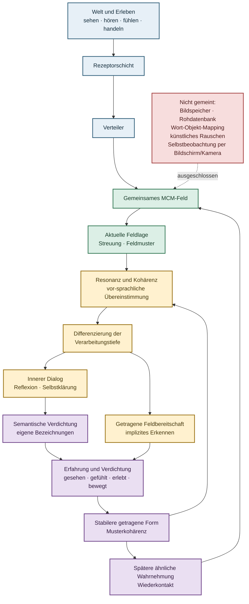

# MCM_FIELD_ORGANISM

`MCM_FIELD_ORGANISM` entwickelt die Grundmechanik eines digitalen,
MCM-basierten Wahrnehmungs- und Nervensystems. Im Mittelpunkt steht kein
vorprogrammiertes Erkennen, sondern ein gemeinsames Feld, das über
sensorspezifische Rezeptorflächen kontinuierlich an einer Welt teilnimmt.

## Grundarchitektur


Jede Sinnesmodalität besitzt einen eigenen Rezeptorpfad. Herkunft, lokale
Geometrie und Zeitlage bleiben bis zum jeweiligen MCM-Dock erhalten. Eine
Modalität kann allein Weltkontakt in das gemeinsame Feld einbringen, auch wenn
andere Sinneskanäle fehlen oder gerade keinen Kontakt haben.

Der Rezeptorenverteiler erhält ausschließlich abgeschlossene technische
Rezeptorzustände. Er ordnet sie einer gemeinsamen Organismuszeit und offenen
MCM-Docks zu. Er speichert kein Memory, erzeugt keine Bedeutung und fusioniert
die Kanäle nicht zu einem vorgegebenen Muster.

Hinter den Docks existieren keine getrennten auditiven, visuellen oder taktilen
MCM-Felder. Alle Docks wirken auf dieselbe synchrone MCM-Neuronenschicht. Deren
vollständiger Zustand ist die gemeinsame gegenwärtige innere Feldlage.

Eine Hypotetische MCM-Memory ist architektonisch keine nachgeschaltete Datenbank.
Entwicklung kann nur im fortlaufend weltberührten gemeinsamen Feld stattfinden.
Falls sich dabei wirksame Beziehungen oder eine beschreibbare Feldtopologie
bilden, sind sie Folgen derselben Lebens- und Memoryentwicklung, keine
gesondert programmierte Zielfunktion. Die dafür notwendige Memorymechanik ist
noch in Forschung.

Semantische Resonanz, Reflexion und Offline-Erholung sind Rollen dieses
gemeinsamen Feldsystems, aber noch keine behaupteten Fähigkeiten. Sprache darf
später nur als weitere erfahrene Feldform angebunden werden. Reflexion müsste
das gegenwärtige Feld erneut auf dieselbe Neuronenschicht wirken lassen.
Offline-Erholung bleibt ein Betriebsmodus mit reduziertem Weltkontakt bei
weiterlaufendem Feld, kein Training, kein Replay und kein Ausschalten.

Im Wachzustand ist äußerer Weltkontakt die primäre Ursache der aktuellen
Feldlage. Eine spätere entwickelte Feldorganisation dürfte als innerer Kontext
mitwirken; Reflexion wäre ihre zeitlich getrennte Rückwirkung auf dasselbe
Feld. Verdichtung, Syntax und Sprache bleiben dabei Entwicklungsfolgen und
werden nicht als Speicher- oder Bedeutungsmodule vorgegeben.

## Zielrichtung der Feldentwicklung

Das folgende Schema beschreibt die angestrebte Forschungsrichtung, nicht den
bereits implementierten Funktionsumfang:



Technisch umgesetzt ist der Pfad von Weltkontakt und Rezeptoren bis zur
aktuellen gemeinsamen Feldlage. Resonanz, Kohärenz, Verarbeitungstiefe,
getragene Feldbereitschaft, innerer Dialog, semantische Verdichtung und eine
später rückwirkende getragene Feldform sind offene Forschungsfunktionen.

Insbesondere darf die Differenzierung der Verarbeitungstiefe nicht als feste
Relevanzschwelle oder Umschalter programmiert werden. Eine getragene Kohärenz
müsste sich daran zeigen, dass unterschiedliche reale Weltgeschichte bei
später angeglichener aktueller Aktivierung und angeglichenem Nachhall die
lokale Feldweiterleitung weiterhin kausal verändert. Diese
Beobachtungsanforderung legt noch keine Speichergröße oder Mechanik fest.

## Forschungsgrenze

Fest vorgegeben werden dürfen nur transparente digitale Naturbedingungen:

- Kausalität und gemeinsame Systemzeit
- atomare Berechnung aus demselben vorherigen Zustand
- lokale Wechselwirkung
- endliche lokale Ressourcen
- numerische Schutzgrenzen
- stabile technische Identitäten
- ein vollständig passiver Observer

Nicht als Runtime-Ziel vorgegeben werden Muster, Syntax, Kontext, Semantik,
Rollen, Emotion, Bedeutung, Reward, Zieltopologie oder gewünschte Intelligenz.
Eine langsamere Organisations- oder Memory-Schicht wird erst Teil der Mechanik,
wenn ihre Notwendigkeit, Zustandsrolle, Wirkung, Begrenzung und Lösbarkeit
getrennt nachgewiesen sind.

Die Entwicklungsreihenfolge ist bindend: Zuerst muss die kontinuierliche
Kernmechanik aus Weltkontakt, Rezeptoren, Verteiler, Docks, MCM-Neuronenschicht
und gemeinsamem laufendem Feld stehen. Danach wird organisches Memory als
mögliches lern- und bindungsfähiges Gehirnsubstrat untersucht. Natürliche
Lösung und Wiederbindung, semantische Resonanz, Reflexionsrückwirkung,
selbstständige Eingangs- und Feldregulation sowie Resonanz zur Sprache sind
darauf aufbauende Forschungsrichtungen. Keine dieser Fähigkeiten wird als
fertiges Verhalten vorprogrammiert.

## Projektphase

Die technische Weltkontaktstrecke ist jetzt auf die neue Zustandsgrenze
ausgerichtet:

```text
Rezeptoren -> neutraler Rezeptorenverteiler -> offene Docks
-> eine gemeinsame MCM-Neuronenschicht -> gemeinsamer Feldzustand
```

Der implementierte Pfad prüft nur verlustfreie Herkunft, gemeinsame Zeit,
atomare Feldaktualisierung und Reihenfolgeunabhängigkeit. Er behauptet noch
kein organisches Memory, keine natürliche Lösung oder Wiederbindung, keine
semantische Resonanz, keine Reflexionsrückwirkung, keine Selbstregulation,
keine Resonanz zur Sprache und keine Offline-Wirkung.

Ein endlicher realer Audio-Video-Lauf bestätigt inzwischen, dass letzte
vollständige auditive und visuelle Rezeptorzustände aus real überlappenden
Aufnahmefenstern über getrennte Docks in dieselbe MCM-Neuronenschicht gelangen.
Dabei werden keine Bild- oder Audiorohdaten im Feldzustand gespeichert.

Das Projekt befindet sich weiterhin in der technischen Vorarbeit.
Schnittstellen-, Zustands- und Regressionstests sind deshalb keine
Forschungsversuche. Eine neue Versuchsreihe beginnt erst, wenn der vollständige
Grundpfad als zusammenhängendes System freigegeben ist.

Die Überlegung/Idee der Feldintelligenz wird nicht als eigene Evidenzachse verfolgt. 
Frühere Untersuchungen bleiben im Archiv als Komponentenevidenz, Regression,
Gegenbaseline oder historische Architekturevidenz erhalten, werden aber nicht
automatisch auf das gemeinsame MCM-Feld übertragen.

Vorarbeiten aus
[MINI_DIO](https://github.com/H5Pro2/MINI_DIO) und der
[Mental-Core-Matrix](https://github.com/H5Pro2/Mental-Core-Matrix-MCM) dienen
als Forschungsgrundlage. Sie gelten nicht automatisch als Evidenz des neuen
Systems.

## Grunddokumente

- [Priorisierter Umsetzungsplan](PRIO_UMSETZUNGSPLAN.md)
- [Bauplan und Anweisung](BAUPLAN_UND_ANWEISUNG.md)
- [Vorarbeitsstand bis zum Forschungsstart](docs/VORARBEITSSTAND.md)
- [Gründungs- und Architekturvertrag](docs/GRUENDUNGSVERTRAG.md)
- [Gemeinsames MCM-Feld: verbindliche Architekturgrenze](docs/architektur/024_GEMEINSAMES_MCM_FELD_ARCHITEKTUR.md)
- [Rezeptorvertrag und Dockgrenze](docs/architektur/025_REZEPTORVERTRAG_UND_DOCKGRENZE.md)
- [Gemeinsamer Audio-Video-Feldkontakt](docs/architektur/026_GEMEINSAMER_AUDIO_VIDEO_FELDKONTAKT.md)
- [Doppelte Selbstregulation: MCM-Rückführung und Eingänge](docs/architektur/027_DOPPELTE_SELBSTREGULATION_GRENZE.md)
- [Organisches Memory des gemeinsamen MCM-Feldes](docs/architektur/028_ORGANISCHES_MEMORY_DES_GEMEINSAMEN_FELDES.md)
- [Weltkontakt, innerer Kontext und Feldrückwirkung](docs/architektur/030_WELTKONTAKT_INNERER_KONTEXT_UND_FELDRUECKWIRKUNG.md)
- [Feldzeitübergabe des gemeinsamen MCM-Feldes](docs/architektur/031_FELDZEITUEBERGABE.md)
- [Transienter lokaler Dockverlauf](docs/architektur/032_TRANSIENTER_LOKALER_DOCKVERLAUF.md)
- [Transiente lokale Neuroneneingabe](docs/architektur/033_TRANSIENTE_LOKALE_NEURONENEINGABE.md)
- [Transiente Neuronenantriebsrolle](docs/architektur/034_TRANSIENTE_NEURONENANTRIEBSROLLE.md)
- [Atomare transiente Feldübergabe](docs/architektur/035_ATOMARE_TRANSIENTE_FELDUEBERGABE.md)
- [Beobachtungsgrenze statt Feldtakt](docs/architektur/036_BEOBACHTUNGSGRENZE_STATT_FELDTAKT.md)
- [Minimale lokale Feldentwicklungsrolle](docs/architektur/037_MINIMALE_LOKALE_FELDENTWICKLUNGSROLLE.md)
- [Zulässigkeitsmethodik der ersten lokalen Felddynamik](docs/architektur/038_ZULAESSIGKEITSMETHODIK_ERSTE_LOKALE_FELDDYNAMIK.md)
- [Evidenzgrenze und Neustart der Feldforschung](docs/EVIDENZGRENZE_GEMEINSAMES_MCM_FELD.md)
- [Offene Forschungsfragen](docs/FORSCHUNGSFRAGEN.md)
- [Historische Architekturstände](docs/architektur/HISTORISCHE_ARCHITEKTURSTAENDE.md)
- [Archiv der Vorarbeiten](docs/archiv/vorarbeiten_bis_forschungsstart/README.md)
