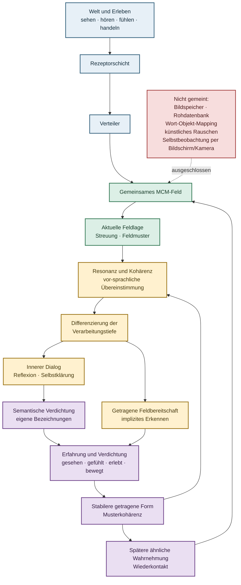

# MCM_FIELD_ORGANISM

`MCM_FIELD_ORGANISM` entwickelt die Grundmechanik eines digitalen,
MCM-basierten Wahrnehmungs- und Nervensystems. Im Mittelpunkt steht kein
vorprogrammiertes Erkennen, sondern ein gemeinsames Feld, das über
sensorspezifische Rezeptorflächen kontinuierlich an einer Welt teilnimmt.

## Aktueller Entwicklungsstand

Die [Bestandskonsolidierung vom 28.08.2026](docs/BESTANDSKONSOLIDIERUNG_NACH_PLATTFORMSTOPP.md)
trennt den historisch geprueften Feldpfad, PPB-1 und die private technische
Memory-Architektur TSPM-1 von der nicht abgenommenen Plattforminfrastruktur.
Der konkrete Supervisor-/Child-Plattformpfad ist geschlossen. S2-FC und der
alte Matrixeinstieg bleiben gesperrt; bestehender Code und Belege bleiben erhalten.

Der [begrenzte TSPM-1-Funktionspruefplan](docs/TSPM1_VERHAELTNISMAESSIGER_FUNKTIONSPRUEFPLAN.md)
wurde nach acht bestandenen fokussierten Tests einmalig ueber den separat
freigegebenen privaten Einstieg ausgefuehrt: **56 Zellen, 336 Bildungsangebote
und 144 Proben, vollstaendig aufgezeichnet, Exit-Code 0**.
Der [Funktionsvergleich](reports/tspm1_functional/functional-20260828-01/BEFUND.md)
zeigt fuer TSPM-1, die unabhaengige R0-Kontrolle und den einfacheren FIFO-Arm B4
jeweils 18 von 18 korrekt beurteilte Proben. B4 erreicht das gleiche gebundene
Funktionsprofil mit 1218 statt 2089 geschriebenen Woertern und 255 statt 269
logischen Speicherwoertern. Fuer diese Aufgabe genuegt die einfachere Loesung;
TSPM-1 bleibt eine vorhandene technische Zwei-Ebenen-Referenz.

Die Einmalfreigabe ist verbraucht, der neue Einstieg wieder gesperrt.
Speicherkerne, Fixtures, Parameter und Feldpfad wurden nicht geaendert.
Die 26 AV-Traegerwerte variieren in diesen Fixtures nur in zwei unabhaengigen
Werten. Der Vergleich belegt deshalb weder die Qualitaet reichhaltigerer
Wahrnehmungsmerkmale noch eine MCM-spezifische Feldmechanik.

Als naechste Aufgabe ist die [Erhaltung visueller Ortsstruktur](docs/VISUELLE_ORTSSTRUKTUR_AUFGABEN_UND_PRUEFPLAN.md)
gewaehlt: gleich verteilte Helligkeitswerte in unterschiedlichen Bildzellen.
Die separat freigegebene private Umsetzung und Untersuchung sind abgeschlossen:
11/11 fokussierte Tests, danach einmalig 28 Bildanalysen, acht Bildungen und
48 Proben, Exit-Code 0. Der [Ortsstrukturbefund](reports/tspm1_functional/spatial-20260828-01/BEFUND.md)
zeigt: Die 18 ortsgebundenen Werte bleiben im Rezeptor und in B4 erhalten.
Der Abruf unterscheidet den grossen Ortstausch, setzt den kleinen jedoch in
sechs Proben falsch gleich. Das begrenzt die bestehende Abrufbewertung fuer
diese Aufgabe, nicht die Erhaltung der Zellwerte. Eine Aenderung der
Abrufregel ist getrennt zu entscheiden; keine neue Speichermechanik wurde
eingefuehrt. TSPM-1 und PPB-1 bleiben erhalten, der Versuchseinstieg ist wieder gesperrt.

Der anschliessende [Kalibrierungs- und Bestaetigungsplan](docs/VISUELLE_L1_KALIBRIERUNG_UND_BESTAETIGUNGSPLAN.md)
bindet dieselbe L1-Regel mit bisheriger Schwelle 0,2 und einer vorab gebundenen
visuellen Schwelle von 44/765. Globale Intensitaetsverschiebungen um +/-8
sollen toleriert, Zweizellentausche ab Kontrast 64 unterschieden werden.
Drei neue Bildpaare dienen der Bestaetigung, ein schwaecheres Paar separat
der Grenzdiagnose. Bekannte Entwicklungsdaten werden nicht als Bestaetigung
gezaehlt. Die anschliessend freigegebene Umsetzung und einmalige Bestaetigung
sind abgeschlossen: acht bestandene Tests, 56 Bildanalysen, acht Bildungen,
48 Probeinputs und 96 Regelabrufe. Der [Kalibrierungsbefund](reports/tspm1_functional/calibration-20260828-01/BEFUND.md)
zeigt mit 44/765 alle 36 Pflichtentscheidungen korrekt; die alte Schwelle
liefert zwoelf Fehlgleichsetzungen. G1 bleibt separat: Beide Regeln setzen
sechs schwache Tausche gleich. Deren unveraenderter L1-Abstand ist identisch
mit dem einer tolerierten +/-8-Verschiebung. Fuer die definierte Mindestaufgabe
genuegt einfache Kalibrierung; eine Erweiterung auf schwache Tausche waere
gesondert zu entscheiden. Die Schwelle wurde technisch vorgegeben, nicht
erlernt. Speicher und Feldpfad blieben unveraendert, der Einstieg ist gesperrt.

Der naechste [Aufgabenplan zur visuellen Reihenfolge](docs/VISUELLE_REIHENFOLGE_AUFGABEN_UND_PRUEFPLAN.md)
prueft vier gleiche Einzelbilder in zwei Folgen mit vertauschten Mittelpositionen.
B4 besitzt Bildungsindizes, aber bislang keinen geprueften Sequenzabruf.
Geplant sind eine private read-only Folgenpruefung und eine reihenfolgeblinde
Inhaltskontrolle bei unveraenderten Speicherwerten und L1-KAL-Grenzen.
Die zwei privaten Dateien und acht fokussierten Tests wurden freigegeben;
alle Tests bestanden. Die bedingte einmalige Hauptuntersuchung erzeugte zwar
alle 152 Ereignisse fuer den vorgesehenen Umfang, stoppte aber im
Abschlussvalidator wegen eines falschen Modulverweises mit Exit-Code 1.
Der [Fehlabschluss](reports/tspm1_functional/sequence-20260829-01/BEFUND.md)
ist daher ausdruecklich nicht auswertbar und weder positiver noch negativer
Sequenzbefund. Der Validatorverweis ist statisch korrigiert, der Einstieg
gesperrt und die Einmalfreigabe verbraucht. Es gab keine Wiederholung.

Fuer eine methodisch getrennte Bestaetigung liegt ein
[neuer Korrektur- und Bestaetigungsplan](docs/VISUELLE_REIHENFOLGE_UNABHAENGIGE_BESTAETIGUNGSPLAN.md)
vor. Vier neue Bilder werden deterministisch aus gleich hellen 3-von-6-Masken
ausgewaehlt und vorab gebunden. Regeln, B4 und `44/765` bleiben unveraendert.
Vor einem neuen Einmallauf musste genau ein kleiner Abschlussvalidator-Test den
korrigierten Pfad vollstaendig bis `COMPLETE` pruefen. Diese begrenzte
Refaktorierung und [Korrekturpruefung](reports/tspm1_functional/sequence-confirmation-validator-20260829-01/BEFUND.md)
sind abgeschlossen: 1/1 Test, Exit-Code 0, vollstaendiger Mini-Abschluss und
alle fachlichen Guardzaehler null. Das bestaetigt nur die Aufzeichnungstechnik.

Die danach ausdruecklich freigegebene unabhaengige Hauptausfuehrung
`sequence-confirmation-20260829-01` ist inzwischen einmalig und vollstaendig
abgeschlossen. Der [Befund](reports/tspm1_functional/sequence-confirmation-20260829-01/BEFUND.md)
belegt 56 Bildanalysen mit N1-N4, acht tatsaechliche B4-Bildungen aus zwei
frischen Banken, zwoelf Folgeproben, 24 read-only Entscheidungen und 152
verkettete Ereignisse bei Exit-Code 0. GEORDNET lieferte sechs korrekte
Annahmen und sechs korrekte Abweisungen; REIHENFOLGEBLIND nahm erwartungsgemaess
alle zwoelf inhaltsgleichen Folgen an. Eine unabhaengige read-only Pruefung
rechnete alle 192 Paarabstaende aus den Belegen nach. Damit ist ein begrenzter
technischer Abruf kurzer visueller Reihenfolgen ueber tatsaechlich erzeugte
Bildungsindizes bestaetigt. Das ist kein selbststaendiges Sequenzlernen, keine
semantische oder episodische Memory und keine MCM-Feldwirkung. Der Einstieg
ist wieder gesperrt; es gab keine Wiederholung oder nachtraegliche Anpassung.

Als naechste getrennte Aufgabe liegt ein statischer
[Pruefplan fuer Zwischenreize und Kapazitaetsdruck](docs/FOLGENERHALTUNG_ZWISCHENREIZE_KAPAZITAETSDRUCK_PRUEFPLAN.md)
vor. Er trennt Inhaltserhaltung von Folgenordnung. B4 darf seine gespeicherten
Bildungsindizes verwenden; TSPM-1 nimmt mit getrennten Fast-/Slow-Befunden nur
am Inhaltsvergleich teil, weil sein aktueller Zustand keine vollstaendige
beliebige Viererfolge traegt. Der korrigierte Verdichtungsteil vergleicht zwei
gegen vier N1-Expositionen und stabilisiert N1-N4 jeweils durch vier
Expositionen vor dem Slow-Kapazitaetsdruck. Die sechs privaten Fixtures und die
zustandsunveraenderliche B4-/TSPM-1-Inhaltsauswertung sind implementiert und
statisch geprueft. Tests, Runner und Ausfuehrung bleiben gesperrt.

Die folgenden Architektur- und Hypothesentexte erteilen keine Ausfuehrungs-
oder Integrationsfreigabe und sind von dieser privaten Engineeringrichtung
zu unterscheiden.

## Grundarchitektur


Jede Sinnesmodalität besitzt einen eigenen Rezeptorpfad. Herkunft, lokale
Geometrie und Zeitlage bleiben bis zum jeweiligen MCM-Dock erhalten. Eine
Modalität kann allein Weltkontakt in das gemeinsame Feld einbringen, auch wenn
andere Sinneskanäle fehlen oder gerade keinen Kontakt haben.

Der Rezeptorenverteiler erhält ausschließlich abgeschlossene technische
Rezeptorzustände. Er ordnet sie einer gemeinsamen technischen Feldzeit und offenen
MCM-Docks zu. Er speichert kein Memory, erzeugt keine Bedeutung und fusioniert
die Kanäle nicht zu einem vorgegebenen Muster.

Hinter den Docks existieren keine getrennten auditiven, visuellen oder taktilen
MCM-Felder. Alle Docks wirken auf dieselbe synchrone MCM-Neuronenschicht. Deren
vollständiger Zustand ist die gemeinsame gegenwärtige innere Feldlage.

Eine hypothetische MCM-Memory ist architektonisch keine nachgeschaltete Datenbank.
Entwicklung kann nur im fortlaufend weltberührten gemeinsamen Feld stattfinden.
Falls sich dabei wirksame Beziehungen oder eine beschreibbare Feldtopologie
bilden, sind sie Folgen derselben Feldentwicklung, keine
gesondert programmierte Zielfunktion. Die dafür notwendige Memorymechanik ist
noch in Forschung.

Semantische Resonanz, Reflexion und Offline-Erholung sind Rollen dieses
gemeinsamen Feldsystems, aber noch keine behaupteten Fähigkeiten. Sprache darf
später nur als weitere erfahrene Feldform angebunden werden. Reflexion müsste
das gegenwärtige Feld erneut auf dieselbe Neuronenschicht wirken lassen.
Offline-Erholung bleibt ein Betriebsmodus mit reduziertem Weltkontakt bei
weiterlaufendem Feld, kein Training, kein Replay und kein Ausschalten.

Im Wachzustand ist äußerer Weltkontakt die primäre Ursache der aktuellen
Feldlage. Eine spätere entwickelte Feldorganisation dürfte als innerer Kontext
mitwirken; Reflexion wäre ihre zeitlich getrennte Rückwirkung auf dasselbe
Feld. Verdichtung, Syntax und Sprache bleiben dabei Entwicklungsfolgen und
werden nicht als Speicher- oder Bedeutungsmodule vorgegeben.

## Zielrichtung der Feldentwicklung

Das folgende Schema beschreibt die angestrebte Forschungsrichtung, nicht den
bereits implementierten Funktionsumfang:



Technisch umgesetzt ist der Pfad von Weltkontakt und Rezeptoren bis zur
aktuellen gemeinsamen Feldlage. Resonanz, Kohärenz, Verarbeitungstiefe,
getragene Feldbereitschaft, innerer Dialog, semantische Verdichtung und eine
später rückwirkende getragene Feldform sind offene Forschungsfunktionen.

Insbesondere darf die Differenzierung der Verarbeitungstiefe nicht als feste
Relevanzschwelle oder Umschalter programmiert werden. Eine getragene Kohärenz
müsste sich daran zeigen, dass unterschiedliche reale Weltgeschichte bei
später angeglichener aktueller Aktivierung und angeglichenem Nachhall die
lokale Feldweiterleitung weiterhin kausal verändert. Diese
Beobachtungsanforderung legt noch keine Speichergröße oder Mechanik fest.

## Forschungsgrenze

Fest vorgegeben werden dürfen nur transparente digitale Naturbedingungen:

- Kausalität und gemeinsame technische Feldzeit
- atomare Berechnung aus demselben vorherigen Zustand
- lokale Wechselwirkung
- endliche lokale Ressourcen
- numerische Schutzgrenzen
- stabile technische Identitäten
- ein vollständig passiver Observer

Nicht als Runtime-Ziel vorgegeben werden Muster, Syntax, Kontext, Semantik,
Rollen, Emotion, Bedeutung, Reward, Zieltopologie oder gewünschte Intelligenz.
Eine langsamere Organisations- oder Memory-Schicht wird erst Teil der Mechanik,
wenn ihre Notwendigkeit, Zustandsrolle, Wirkung, Begrenzung und Lösbarkeit
getrennt nachgewiesen sind.

Die Entwicklungsreihenfolge ist bindend: Zuerst muss die kontinuierliche
Kernmechanik aus Weltkontakt, Rezeptoren, Verteiler, Docks, MCM-Neuronenschicht
und gemeinsamem laufendem Feld stehen. Danach wird eine hypothetische
MCM-kompatible Memory-Architektur untersucht. Natürliche
Lösung und Wiederbindung, semantische Resonanz, Reflexionsrückwirkung,
selbstständige Eingangs- und Feldregulation sowie Resonanz zur Sprache sind
darauf aufbauende Forschungsrichtungen. Keine dieser Fähigkeiten wird als
fertiges Verhalten vorprogrammiert.

## Projektphase

Die technische Weltkontaktstrecke ist jetzt auf die neue Zustandsgrenze
ausgerichtet:

```text
Rezeptoren -> neutraler Rezeptorenverteiler -> offene Docks
-> eine gemeinsame MCM-Neuronenschicht -> gemeinsamer Feldzustand
```

Der implementierte Pfad prüft nur verlustfreie Herkunft, gemeinsame Zeit,
atomare Feldaktualisierung und Reihenfolgeunabhängigkeit. Er behauptet noch
keine MCM-Memory-Funktion, keine natürliche Lösung oder Wiederbindung, keine
semantische Resonanz, keine Reflexionsrückwirkung, keine Selbstregulation,
keine Resonanz zur Sprache und keine Offline-Wirkung.

Ein endlicher realer Audio-Video-Lauf bestätigt inzwischen, dass letzte
vollständige auditive und visuelle Rezeptorzustände aus real überlappenden
Aufnahmefenstern über getrennte Docks in dieselbe MCM-Neuronenschicht gelangen.
Dabei werden keine Bild- oder Audiorohdaten im Feldzustand gespeichert.

Das Projekt befindet sich weiterhin in der technischen Vorarbeit.
Schnittstellen-, Zustands- und Regressionstests sind deshalb keine
Forschungsversuche. Eine neue Versuchsreihe beginnt erst, wenn der vollständige
Grundpfad als zusammenhängendes System freigegeben ist.

Die Überlegung/Idee der Feldintelligenz wird nicht als eigene Evidenzachse verfolgt. 
Frühere Untersuchungen bleiben im Archiv als Komponentenevidenz, Regression,
Gegenbaseline oder historische Architekturevidenz erhalten, werden aber nicht
automatisch auf das gemeinsame MCM-Feld übertragen.

Vorarbeiten aus
[MINI_DIO](https://github.com/H5Pro2/MINI_DIO) und der
[Mental-Core-Matrix](https://github.com/H5Pro2/Mental-Core-Matrix-MCM) dienen
als Forschungsgrundlage. Sie gelten nicht automatisch als Evidenz des neuen
Systems.

## Grunddokumente

- [Priorisierter Umsetzungsplan](PRIO_UMSETZUNGSPLAN.md)
- [Bauplan und Anweisung](BAUPLAN_UND_ANWEISUNG.md)
- [Vorarbeitsstand bis zum Forschungsstart](docs/VORARBEITSSTAND.md)
- [Gründungs- und Architekturvertrag](docs/GRUENDUNGSVERTRAG.md)
- [Gemeinsames MCM-Feld: verbindliche Architekturgrenze](docs/architektur/024_GEMEINSAMES_MCM_FELD_ARCHITEKTUR.md)
- [Rezeptorvertrag und Dockgrenze](docs/architektur/025_REZEPTORVERTRAG_UND_DOCKGRENZE.md)
- [Gemeinsamer Audio-Video-Feldkontakt](docs/architektur/026_GEMEINSAMER_AUDIO_VIDEO_FELDKONTAKT.md)
- [Doppelte Selbstregulation: MCM-Rückführung und Eingänge](docs/architektur/027_DOPPELTE_SELBSTREGULATION_GRENZE.md)
- [Hypothetische MCM-Memory-Entwicklungsrichtung](docs/architektur/028_HYPOTHETISCHE_MCM_MEMORY_ENTWICKLUNGSRICHTUNG.md)
- [Weltkontakt, innerer Kontext und Feldrückwirkung](docs/architektur/030_WELTKONTAKT_INNERER_KONTEXT_UND_FELDRUECKWIRKUNG.md)
- [Feldzeitübergabe des gemeinsamen MCM-Feldes](docs/architektur/031_FELDZEITUEBERGABE.md)
- [Transienter lokaler Dockverlauf](docs/architektur/032_TRANSIENTER_LOKALER_DOCKVERLAUF.md)
- [Transiente lokale Neuroneneingabe](docs/architektur/033_TRANSIENTE_LOKALE_NEURONENEINGABE.md)
- [Transiente Neuronenantriebsrolle](docs/architektur/034_TRANSIENTE_NEURONENANTRIEBSROLLE.md)
- [Atomare transiente Feldübergabe](docs/architektur/035_ATOMARE_TRANSIENTE_FELDUEBERGABE.md)
- [Beobachtungsgrenze statt Feldtakt](docs/architektur/036_BEOBACHTUNGSGRENZE_STATT_FELDTAKT.md)
- [Minimale lokale Feldentwicklungsrolle](docs/architektur/037_MINIMALE_LOKALE_FELDENTWICKLUNGSROLLE.md)
- [Zulässigkeitsmethodik der ersten lokalen Felddynamik](docs/architektur/038_ZULAESSIGKEITSMETHODIK_ERSTE_LOKALE_FELDDYNAMIK.md)
- [Evidenzgrenze und Neustart der Feldforschung](docs/EVIDENZGRENZE_GEMEINSAMES_MCM_FELD.md)
- [Offene Forschungsfragen](docs/FORSCHUNGSFRAGEN.md)
- [Historische Architekturstände](docs/architektur/HISTORISCHE_ARCHITEKTURSTAENDE.md)
- [Archiv der Vorarbeiten](docs/archiv/vorarbeiten_bis_forschungsstart/README.md)
