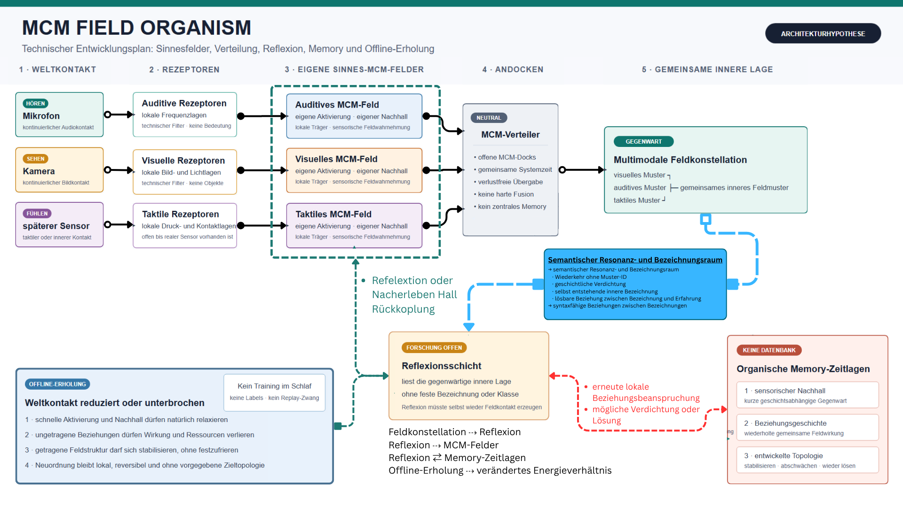

# Technischer Entwicklungsplan

> **Historischer Architekturstand:** Plan und Abbildung zeigen die verworfene
> Mehrfeld-Baseline. Der aktuelle Schaltplan steht in
> [Dokument 015](015_SCHALTPLAN_AKTUELLER_MECHANIK.md).

## 1. Zweck

Dieser Plan überführt das Konzeptboard in überprüfbare Architekturgrenzen. Er
ist eine Forschungs- und Entwicklungsordnung, keine Behauptung bereits
vorhandener Organismusfunktionen.



## 2. Geordneter Signalweg

```text
Weltkontakt
-> sensorspezifische Rezeptoren
-> eigenes sensorspezifisches MCM-Feld
-> neutraler MCM-Verteiler
-> multimodale Feldkonstellation
```

Mikrofon, Kamera und spätere Sensoren werden niemals direkt an den Verteiler
angeschlossen. Der Verteiler akzeptiert ausschließlich fertige
`MCMFieldWindow`-Zustände.

## 3. Getrennte Sinnesfelder

Jede Modalität besitzt eigene Rezeptoren, lokale Träger, Aktivierung und
Nachhall. Ein Sinnesfeld bleibt auch ohne die anderen Modalitäten eine gültige
innere Wahrnehmungslage.

```text
Hören  -> auditive Rezeptoren -> auditives MCM-Feld
Sehen  -> visuelle Rezeptoren -> visuelles MCM-Feld
Fühlen -> taktile Rezeptoren  -> taktiles MCM-Feld
```

## 4. Gemeinsame innere Lage

Der MCM-Verteiler erhält Modalität, Feldidentität, Zeitfenster, Träger,
Aktivierung und Nachhall. Er speichert keine Feldgeschichte und erzeugt keine
Fusion. Der passive Musterprüfer beschreibt nur, welche Feldlagen gleichzeitig
oder zeitlich getrennt vorhanden sind.

## 5. Reflexion, Memory und Offline-Erholung

Diese Bereiche sind vorbereitete Forschungsgrenzen:

- **Reflexion:** Eine innere Lage müsste ohne passenden aktuellen Außenkontakt
  selbst wieder lokalen Feldkontakt erzeugen.
- **Memory:** Erfahrung müsste als veränderte gegenwärtige Feldreaktion an
  lokalen Trägern oder Beziehungen erscheinen, nicht als Episodendatenbank.
- **Offline-Erholung:** Reduzierter Weltkontakt lässt schnelle Zustände
  relaxieren und schafft eine kontrollierte Prüflage für Stabilisierung,
  Abschwächung und Lösung.

Wachkontakt und Offline-Erholung verwenden konzeptionell dieselbe lokale
Feldordnung. Offline verändert nur das Verhältnis äußerer und innerer Wirkung;
es besitzt keine eigene Lernregel.

Für diese drei Bereiche ist noch keine Entwicklungsregel freigegeben.

## 6. Statusmatrix

| Bereich | Status | Evidenz |
| --- | --- | --- |
| Endlicher Audio-In und auditive Rezeptorlage | passiv vorhanden | E1 |
| Video-In und visuelle Rezeptorlage | synthetisch passiv vorhanden; Hardware offen | E1 / Hardware E0 |
| Auditives MCM-Feld | passiver B1-Kandidat; Runtime geschlossen | E1 Kandidat / E0 Mechanik |
| Visuelles MCM-Feld | geschlossen | E0 |
| MCM-Neuron | Zustands- und Feldwahrnehmungsvertrag; keine Updategleichung | E0 |
| MCM-Neuronenschicht | atomare räumliche Laufzeithülle; nur Baselines | E1 Hülle / E0 Dynamik |
| Rezeptor-Neuron-Feld-Verbindung | verlustfreie Dockkarte bis `MCMFieldWindow` | E1 |
| Gemeinsame Feldzeit | expliziter monotoner Intervallvertrag | E1 |
| MCM-Verteiler | passiv synthetisch vorhanden | E1 |
| Multimodaler Musterprüfer | passiv synthetisch vorhanden | E1 |
| Sensorischer Nachhall als echtes Sinnesfeld | Vertrag offen | E0 |
| Beziehungsgeschichte | geschlossen | E0 |
| Entwickelte Topologie | geschlossen | E0 |
| Reflexionswirkung | geschlossen | E0 |
| Offline-Erholung | Grenzvertrag | E0 |
| Gemeinsame Energie- und Ressourcenordnung | Grenzvertrag | E0 |

## 7. Leitplanken

Nicht vorbereitet werden feste Semantik, Patternklassen, globale Gewinner,
Reward, Zieltopologie, Episode- oder Vektordatenbank, Observer-Rückwirkung und
unveränderliche Verdrahtung.

## 8. Bester nächster Schritt

Nach Ankunft der Kamera wird zuerst ein streng endlicher Video-In gebaut. Er
endet wie der Hörpfad vor der MCM-Feldgrenze. Danach wird die kleinste
gemeinsame Feldfunktion benannt, die unabhängige Rezeptorlagen und feste
Baselines nicht bereits erklären.
