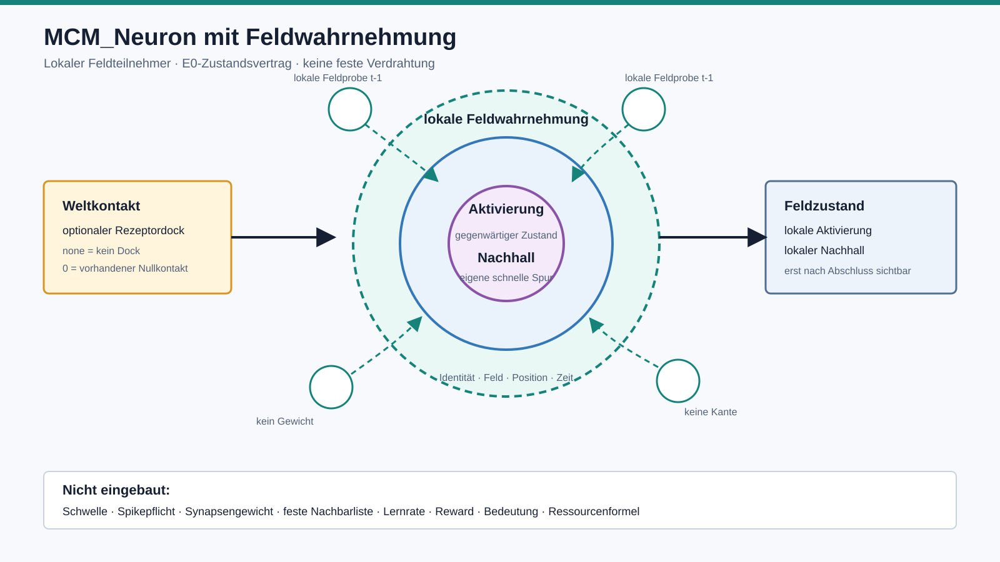

# MCM-Neuron mit Feldwahrnehmung

## 1. Definition

Ein `MCM_Neuron` ist die kleinste lokal adressierbare Einheit eines
sensorspezifischen MCM-Feldes. Es ist kein klassischer Summationsknoten mit
festen Eingangsgewichten. Es nimmt einen örtlich begrenzten Ausschnitt der
vorherigen Feldlage wahr und trägt einen eigenen schnellen Zustand.



```text
optionaler Rezeptorkontakt(t) -------------------\
                                                   > MCM_Neuron(t+1)
lokale abgeschlossene Feldlage(t-1 bis t) --------/

MCM_Neuron = technische Identität
           + feste Feldposition
           + gegenwärtige Aktivierung
           + eigener Nachhall
           + kausal getrennte lokale Feldwahrnehmung
```

Die Grafik zeigt Rollen und Kausalität, noch keine Aktivierungs- oder
Lerngleichung.

## 2. Was technisch fest sein darf

- eine stabile technische Neuronenidentität,
- Zugehörigkeit zu Feld, Modalität und Geometrie,
- eine feste lokale Position innerhalb dieser Geometrie,
- eine gemeinsame diskrete Feldzeit,
- die Trennung zwischen direktem Rezeptorkontakt und innerer Feldwirkung,
- die Regel, dass innere Feldwirkung nur aus abgeschlossenen vorherigen
  Zuständen stammen darf,
- ein endlicher normierter Wertebereich für kontrollierte Prüfungen.

Diese Festlegungen beschreiben die digitale Anatomie und Kausalität. Sie legen
keine Bedeutung und keine spätere Topologie fest.

## 3. Feldwahrnehmung

Das Neuron speichert keine Liste seiner Nachbarn. Für einen Zeitschritt erhält
es lokale Feldproben mit:

- technischer Probenidentität,
- Herkunftsfeld,
- vorherigem Feldzeitpunkt,
- relativer räumlicher Position,
- dortiger Aktivierung,
- dortigem Nachhall.

Die Proben bleiben einzeln erhalten. Sie werden im Vertrag weder summiert noch
gewichtet. Eine Feldprobe ist deshalb keine Synapse, keine Kante und keine
Beziehung.

```text
kein Rezeptordock     = receptor_contact: none
Rezeptordock bei null = receptor_contact: 0
```

Diese Unterscheidung verhindert, dass fehlender Weltkontakt mit tatsächlich
wahrgenommener Nullwirkung verwechselt wird.

## 4. Eigener schneller Zustand

Das Neuron darf als getrennte Rollen tragen:

- `activation`: seine gegenwärtige lokale Aktivierung,
- `afterimage`: seine unmittelbar fortwirkende lokale Feldgeschichte.

Der Vertrag bestimmt noch nicht, wie Wahrnehmung, Aktivierung und Nachhall
ineinander übergehen. Insbesondere wird der vorhandene B1-Leaky-Integrator
nicht automatisch zur MCM-Neuronengleichung erklärt.

## 5. Bewusst nicht enthalten

Das `MCM_Neuron` besitzt derzeit keine:

- feste Nachbar- oder Verbindungsliste,
- Eingangsgewichte,
- Schwelle oder Spikepflicht,
- Lernrate oder Rewardfunktion,
- Rolle, Klasse, Bedeutung oder Bezeichnung,
- eigene Ressourcenvariable,
- Beziehungs- oder Langzeitgeschichte,
- globale Kenntnis des Feldes,
- Rückwirkung innerhalb desselben Zeitschritts.

Ressourcenbegrenzung, Kopplung und organische Verbindungsbildung bleiben eigene
offene Mechanikfragen. Sie dürfen erst ergänzt werden, wenn eine konkrete
fehlende Feldfunktion dies verlangt.

## 6. Verhältnis zu Rezeptorträgern

Rezeptorträger und MCM-Neuronen sind nicht identisch:

```text
Rezeptorträger = technisch lokalisierter Weltkontakt
MCM_Neuron     = lokaler Teilnehmer des inneren Feldes
```

Ein Rezeptorträger kann später an ein lokales MCM-Neuron andocken. Ein
MCM-Neuron kann auch ohne direkten Rezeptordock ausschließlich innere lokale
Feldwirkung wahrnehmen. Die vorhandenen 48 auditiven und 288 visuellen
Rezeptorträger werden daher nicht automatisch in Neuronen umbenannt.

## 7. Anzahl

Es wird keine globale Neuronenzahl festgeschrieben. Eine konkrete
sensorspezifische Geometrie muss zunächst begründen, welche lokalen
Feldpositionen benötigt werden.

Aktueller Status:

```text
definierter MCM-Neuronenvertrag: 1 generischer Typ
aktive MCM-Neuronen-Runtime:     0
```

## 8. Freigabestatus

**E0-Architekturvertrag und ausführbarer Zustandsvalidator.**

Der Code prüft Identität, Geometrie, Wertebereich, Unveränderlichkeit und die
zeitliche Trennung der lokalen Feldwahrnehmung. Er berechnet keine neue
Aktivierung und erzeugt keine Verbindung.

## 9. Bester nächster Schritt

Nach realem Audio- und Videokontakt wird mit identischen Nullprüfungen
untersucht, welche Funktion ein lokales MCM-Neuron zusätzlich zur technischen
Rezeptorlage tatsächlich tragen muss. Erst daraus darf eine minimale
Updategleichung entstehen.
