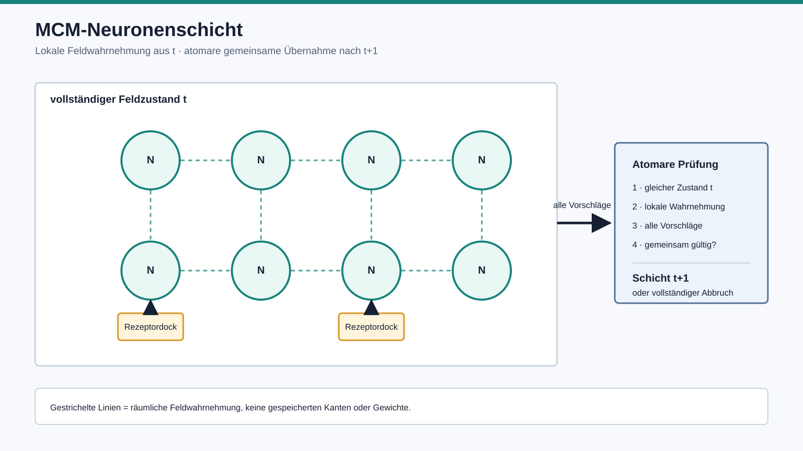

# MCM-Neuronenschicht

## 1. Zweck

Die MCM-Neuronenschicht ordnet lokale `MCM_Neuron`-Einheiten zu einem
gemeinsamen, atomar fortschreibbaren Feldsubstrat. Sie ist keine klassische
vollständig verbundene Netzwerkschicht.



```text
vollständige Schicht(t)
-> lokale Feldwahrnehmung jedes Neurons aus t
-> alle Neuronenvorschläge für t+1
-> gemeinsame Prüfung
-> vollständige Schicht(t+1)
```

Kein Neuron sieht einen bereits aktualisierten Nachbarn desselben Schritts.

## 2. Technische Anatomie

Die Schicht besitzt:

- eine stabile Schichtidentität,
- eine gemeinsame Feld-, Modalitäts- und Geometriezugehörigkeit,
- eindeutig positionierte MCM-Neuronen,
- eine für alle Positionen gleiche lokale Wahrnehmungsgeometrie,
- eine gemeinsame diskrete Feldzeit.

Die Wahrnehmungsgeometrie besteht aus relativen räumlichen Offsets. Zu jedem
Offset muss sein Gegenstück vorhanden sein:

```text
(+1, 0) verlangt (-1, 0)
(0, +1) verlangt (0, -1)
```

Diese Symmetrie verhindert eine technisch versteckte Vorzugsrichtung. An einem
Feldrand fehlen außerhalb liegende Proben natürlich; es wird weder zyklisch
verbunden noch künstlich aufgefüllt.

## 3. Keine gespeicherte Verdrahtung

Die relative Wahrnehmungsgeometrie gehört zur technischen Feldanatomie. Die
einzelnen Neuronen speichern keine Nachbarlisten, Kanten oder Gewichte.

Bei jedem Schritt erzeugt die Schicht aus der vorherigen vollständigen Lage
neue lokale Feldproben. Diese Proben sind Wahrnehmung, keine Beziehung.

## 4. MCM-Neuronen-Runtime

Ein einzelnes Neuron wird nur über einen expliziten Übergang fortgeschrieben:

```text
vorheriger eigener Zustand(t)
+ Rezeptorkontakt(t+1 oder none)
+ lokale Feldproben aus t
-> expliziter Übergang
-> Aktivierung und Nachhall(t+1)
```

Identität, Position, Feld und Modalität bleiben erhalten. Ein ungültiger
Ausgang verwirft den Vorschlag.

## 5. Atomare Schichtfortschreibung

Die Schicht berechnet zunächst jeden Neuronenvorschlag aus demselben Zustand
`t`. Erst wenn alle Vorschläge gültig sind, entsteht eine neue unveränderliche
Schicht für `t+1`.

Scheitert ein Vorschlag, bleibt die bisherige Schicht vollständig unverändert.
Technische Iterationsreihenfolge darf das Ergebnis nicht verändern.

## 6. Rezeptordocks

Ein Rezeptordock gehört zur technischen Anatomie eines Neuronenortes:

- angedockte Neuronen benötigen in jedem Schritt einen expliziten aktuellen
  Kontaktwert, einschließlich exakt null;
- nicht angedockte Neuronen erhalten `none`;
- ein fehlender Kontaktwert für ein vorhandenes Dock ist ein technischer
  Fehler, keine Nullwahrnehmung.

## 7. Baselines statt versteckter MCM-Regel

Für die technische Prüfung existieren nur zwei klar benannte Baselines:

- `hold_state_baseline`: hält Aktivierung und Nachhall unverändert und ignoriert
  alle neuen Eingänge;
- `receptor_projection_baseline`: zeigt nur den aktuellen Rezeptorkontakt und
  trägt keinen inneren Zustand.

Beide sind Gegenprüfungen, keine MCM-Neuronengleichung.

## 8. Noch nicht eingebaut

- keine Feldsummen- oder Mittelwertregel,
- keine Schwelle oder Spikepflicht,
- keine Ausbreitungsgeschwindigkeit,
- keine Synapsen, Gewichte oder Beziehungstopologie,
- keine Plastizität oder Lernrate,
- keine Ressourcengleichung,
- keine Aktivitätsnormalisierung zwischen Neuronen,
- keine globale Auswahl,
- keine Semantik oder Handlung.

## 9. Anzahl

Die Schicht akzeptiert jede endliche, eindeutig positionierte Geometrie. Eine
feste Projektzahl wird nicht programmiert. Die Anzahl folgt später der
begründeten sensorspezifischen Feldauflösung.

Die vorhandenen 48 auditiven und 288 visuellen Rezeptorträger werden weiterhin
nicht automatisch zu MCM-Neuronen.

## 10. Freigabestatus

**E1 für die technische atomare Schichthülle. E0 für die MCM-Felddynamik.**

Geprüft sind Geometrie, lokale Wahrnehmungsbildung, zeitliche Trennung,
Rezeptordocks, Unveränderlichkeit, vollständiger Abbruch und
Reihenfolgeinvarianz. Nicht geprüft oder freigegeben ist eine organische
Neuronendynamik.

## 11. Bester nächster Schritt

Nach Ankunft der Kamera wird eine kleine auditive und visuelle Feldgeometrie
mit denselben technischen Neuronenorten abgebildet. Zuerst wird gegen Hold- und
Rezeptorbaseline geprüft, welche lokale Feldfunktion darüber hinaus fehlt.
Nur dieser Funktionsmangel darf eine erste MCM-Übergangsregel begründen.
