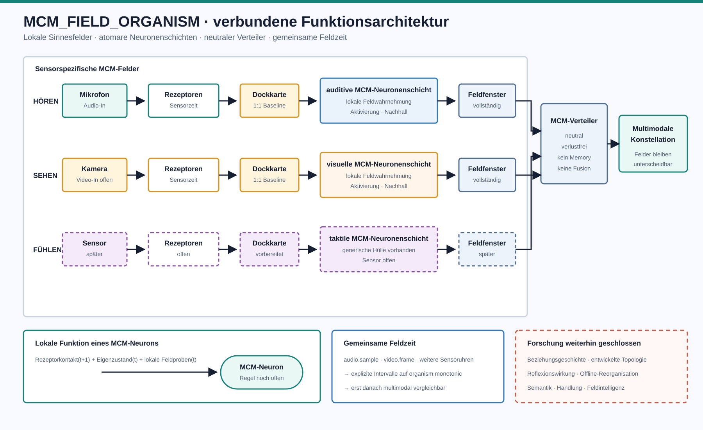

# Verbundene MCM-Feldarchitektur

> **Historischer Architekturstand:** Dieses Dokument beschreibt getrennte
> Sinnesfelder mit nachgeschaltetem Verteiler. Es ist vollständig durch
> [Dokument 024](024_GEMEINSAMES_MCM_FELD_ARCHITEKTUR.md) ersetzt.

## 1. Gesamtfunktion

Die sensorspezifischen MCM-Felder, ihre Neuronenschichten und der neutrale
Verteiler sind getrennte Rollen einer gemeinsamen Kette:



```text
Weltkontakt
-> technischer Rezeptor
-> abgeschlossene Rezeptorlage
-> explizite Rezeptor-Neuron-Dockkarte
-> sensorspezifische MCM-Neuronenschicht
-> vollständiges sensorspezifisches MCM-Fenster
-> neutraler MCM-Verteiler
-> multimodale Feldkonstellation
```

## 2. Rolle des MCM-Neurons

Das einzelne Neuron ist der kleinste lokale Ort, an dem getrennt ankommen:

- aktueller optionaler Rezeptorkontakt,
- eigener vorheriger Zustand,
- lokale Feldwahrnehmung aus dem vorherigen abgeschlossenen Schichtzustand.

Es trägt als schnellen Ausgang nur Aktivierung und Nachhall. Die konkrete
MCM-Übergangsregel bleibt offen.

## 3. Rolle des sensorspezifischen MCM-Feldes

Ein sensorspezifisches MCM-Feld ist kein zusätzliches Superneuron. Es umfasst:

```text
Rezeptor-Neuron-Docks
+ räumlich angeordnete MCM-Neuronen
+ lokale Wahrnehmungsgeometrie
+ atomare gemeinsame Feldzeit
+ vollständigen exportierbaren Feldzustand
```

Ein Feld darf interne Neuronen ohne direkten Rezeptordock besitzen. Dadurch
wird die Feldanatomie nicht dauerhaft auf eine reine Kopie der Rezeptorfläche
festgelegt.

## 4. Rezeptor-Neuron-Dockkarte

Die erste technische Baseline bildet jeden vorhandenen Rezeptorträger genau
einem expliziten Neuronendock zu. Sie besitzt:

- keine Gewichte,
- keine Schwellen,
- keine Mehrfachkopie,
- keine Zusammenfassung mehrerer Rezeptoren,
- keine Bedeutung.

Die Karte muss jeden übergebenen Rezeptorträger verlustfrei ausweisen. Fehlende
oder unbekannte Träger brechen den Feldschritt ab.

Diese 1:1-Zuordnung ist eine transparente Ausgangsanatomie, keine Behauptung,
dass spätere Feldorganisation ebenfalls 1:1 bleiben muss.

## 5. Getrennte Sensorzeit und gemeinsame Feldzeit

Audio entsteht in Sample-Zeit, Video in Frame-Zeit. Diese technischen Uhren
dürfen nicht direkt als gemeinsame innere Zeit behandelt werden.

```text
Audio: audio.sample --\
                       > explizites gemeinsames Feldintervall
Video: video.frame  --/  auf organism.monotonic
```

Jeder Feldschritt erhält deshalb zusätzlich ein extern abgegrenztes Intervall
auf einer gemeinsamen monotonen Organismus-Uhr. Der Verteiler akzeptiert nur
Feldfenster derselben gemeinsamen Uhr. Die ursprüngliche Sensorzeit bleibt an
der Rezeptorgrenze erhalten.

Die Zuordnung technischer Sensorzeit zur gemeinsamen Feldzeit ist ein
Zeitvertrag, keine inhaltliche Fusion.

## 6. Rolle des MCM-Verteilers

Der Verteiler erhält ausschließlich vollständige `MCMFieldWindow`-Zustände. Er
prüft Dock, Modalität, Feldgeometrie und gemeinsame Uhr und übergibt die
Feldzustände unverändert als Konstellation.

Er besitzt keine:

- Neuronen,
- Rezeptoren,
- Feldgleichung,
- Gewichtung oder Gewinnerwahl,
- zentrale Erinnerung,
- Semantik,
- Rückwirkung auf Sinnesfelder.

## 7. Multimodale Feldkonstellation

Die Konstellation hält gleichzeitig vorhandene Sinnesfelder unterscheidbar:

```text
auditives Feldfenster --\
visuelles Feldfenster ---> gemeinsame gegenwärtige Konstellation
taktiles Feldfenster  --/
```

Sie ist noch keine harte Fusion und kein weiteres neuronales Netz. Der passive
Musterprüfer darf ihre zeitliche und modale Struktur lesen, aber nicht
verändern.

## 8. Memory, Reflexion und Offline

- Schneller Nachhall liegt lokal im einzelnen MCM-Neuron.
- Langsame Beziehungsgeschichte und entwickelte Topologie bleiben geschlossen.
- Reflexion ist keine Runtime-Komponente.
- Offline ist nur reduzierter Weltkontakt zur selben späteren Feldmechanik,
  keine zweite Lernruntime.

Diese Bereiche sind in der Grafik gestrichelt, weil sie Forschungsorte und
keine derzeit aktive Mechanik sind.

## 9. Tatsächlich verbunden

Der generische Pfad trägt bereits:

1. abgeschlossene auditive oder visuelle Rezeptorlagen,
2. explizite verlustfreie Dockzuordnung,
3. atomare MCM-Neuronenschicht,
4. vollständigen Feldfensterexport,
5. Übergabe an den vorhandenen MCM-Verteiler,
6. gemeinsame Verteilung zweier Modalitäten trotz verschiedener Sensoruhren.

Für die Durchgängigkeitsprüfung wird ausschließlich die benannte
`receptor_projection_baseline` verwendet. Sie ist keine MCM-Felddynamik.

## 10. Noch offen

- reale Kameraquelle,
- konkrete visuelle Feldgeometrie,
- begründete Anzahl interner Neuronen,
- organische MCM-Übergangsregel,
- natürliche Verbindungsbildung,
- multimodale Feldrückwirkung,
- langsame Reorganisation, Reflexion und Handlung.

## 11. Freigabestatus

```text
verbundene technische Feldhülle: E1
Verlustfreiheit bis Verteiler:   E1
gemeinsamer Feldzeitvertrag:     E1
MCM-Felddynamik:                 E0
organische Entwicklung:          E0
```

## 12. Bester nächster Schritt

Der nächste technische Schritt ist ausschließlich die reale Kameraquelle. Sie
wird in den vorhandenen visuellen Rezeptoradapter eingesetzt und anschließend
über dieselbe bereits geprüfte Dock-, Neuronen-, Feldfenster- und
Verteilerkette geführt. Dabei bleibt zunächst die Rezeptorprojektion als
Baseline aktiv; eine MCM-Regel wird nicht aus dem Kamerabild abgeleitet.
