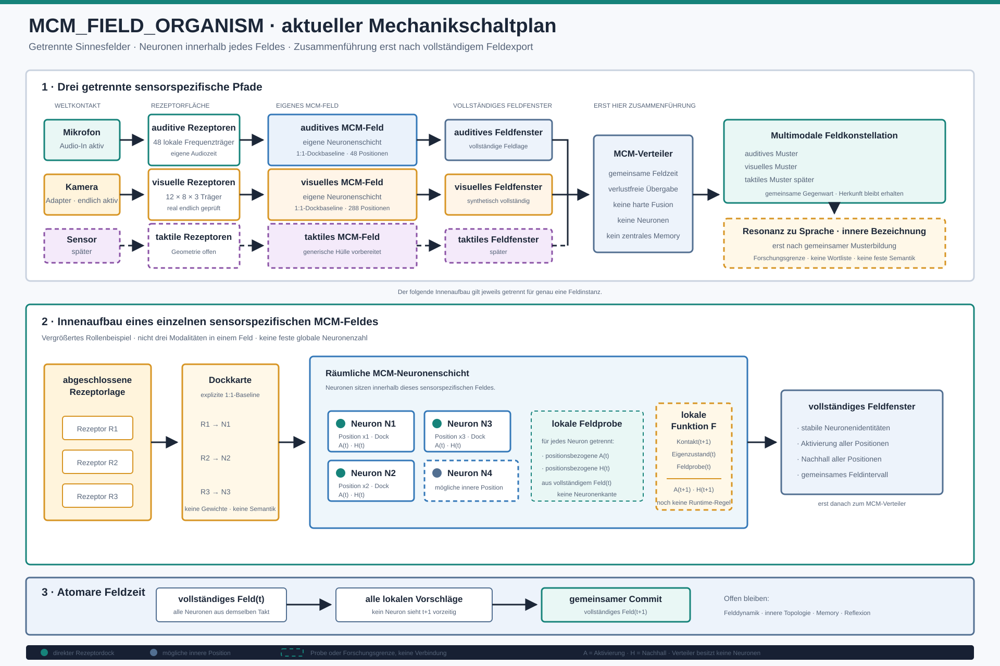

# Schaltplan der aktuellen Mechanik



## Position der Neuronen

Die MCM-Neuronen sitzen innerhalb jedes sensorspezifischen MCM-Feldes. Sie
liegen damit hinter der technischen Rezeptorfläche und vor dem vollständigen
Feldfenster:

```text
Sensor
-> Rezeptorfläche
-> explizite Dockkarte
-> räumliche MCM-Neuronenschicht
-> vollständiges Feldfenster
```

Ein Teil der Neuronen kann direkt an genau einen Rezeptorträger angedockt sein.
Weitere Neuronen dürfen als innere Feldpositionen ohne direkten Weltkontakt
existieren. Diese inneren Neuronen erhalten ausschließlich lokale Feldproben
aus dem vorherigen abgeschlossenen Takt.

Die derzeitige ausführbare Rezeptorbaseline erzeugt zunächst nur die direkt
angedockten Neuronen. Die gestrichelt gezeichneten inneren Positionen sind von
der Schichthülle technisch unterstützt, aber noch nicht als feste zusätzliche
Feldanatomie begründet oder instanziiert.

Die im Schaltplan gezeigten fünf Neuronen erklären die Rollen. Sie schreiben
keine feste Neuronenzahl für Audio, Video oder spätere Modalitäten vor.

## Lokaler Neuronenzustand

Jedes Neuron besitzt derzeit:

- stabile technische Identität,
- feste Position in seiner Feldgeometrie,
- Aktivierung `A(t)`,
- schnellen Nachhall `H(t)`,
- optionalen aktuellen Rezeptorkontakt,
- getrennte lokale Feldproben aus `t`.

Zwischen den Neuronen werden bewusst keine Verbindungspfeile gezeichnet. Die
aktuelle Mechanik besitzt weder Synapsen noch gespeicherte Kanten oder eine
begründete feste Paarung. Stattdessen erzeugt die Schichthülle für jedes Neuron
eine eigene positionsbezogene Probe aus der vollständigen abgeschlossenen
Feldlage des vorherigen Takts.

## Atomare Feldzeit

Alle Neuronen lesen denselben vollständigen Zustand `t`. Erst nachdem alle
lokalen Vorschläge gültig sind, wird das vollständige Feld `t+1` gemeinsam
übernommen. Dadurch kann die technische Iterationsreihenfolge keine
Vorzugsrichtung erzeugen.

## Systemgrenze

Der MCM-Verteiler liegt außerhalb der Neuronenschichten. Er erhält nur
vollständige Feldfenster und besitzt selbst keine Neuronen, Feldgleichung,
Semantik oder Erinnerung.

Die konkrete lokale Funktion von Rezeptorkontakt, Eigenzustand und Feldproben
zu `A(t+1)` und `H(t+1)` bleibt offen. Der Schaltplan zeigt deshalb an dieser
Stelle ausdrücklich eine Forschungsgrenze und keine bereits aktive Mechanik.
